# 投研推理报告：当前事件如何从地缘政治与宏观经济传导至产业链

> **数据声明**：报告结构固定为地缘政治、宏观经济、产业链三层。地缘政治锚点只接受真实 `GeopoliticRivalry`，宏观锚点只接受真实 `MacroEconomic`，产业链只接受真实 `IndustryChain`，受影响节点只接受真实 `ChainNode`。`IndustryChain` 不直接承载 Variable Signal；链级结果只由成员节点 Signal 与真实节点拓扑聚合。Country 只作为背景，不冒充地缘政治锚点。直接 Signal、图谱关系、推断和 Evidence Gap 分开表达。本报告不分析公司层，不构成投资建议。
>
> **结论标记**：`直接证据` 表示 Event 已在该真实锚点产生有效 Signal；`推理假设` 表示无直接 Signal，但已经过可解释的传导路径得到方向结论；`待验证` 保留在结果字段，表示仅有图谱拓扑、尚未形成升温、降温或分化结论，此时结论性质留空。

## 1. 地缘政治面

### 1.1 一句话结论

**[CONCLUSION C-GEO-01] 伊朗—美以及海湾安全对抗持续升温，霍尔木兹航运安全与贸易通道可用性下降；南海海洋权益与安全争端风险小幅升温，但商业航运安全暂时稳定。**

### 1.2 受影响锚点

| Anchor ID | 锚点 | 当前状态 | 结果 | 结论性质 | 传导逻辑（为什么到这里） | 直接证据（Event ID） | 时间窗口 | 置信度 | 图谱锚点 UUID |
|---|---|---|---|---|---|---|---|---|---|
| A-01 | 伊朗—美以及海湾安全对抗 | 地缘政治风险 UP；航运安全 DOWN；贸易通道可用性 DOWN | 升温 | 直接证据 | 美伊军事冲突、船只扣押、霍尔木兹袭击与通行量骤降直接推高海湾对抗风险，并压低航运安全与贸易通道可用性。 | EVT717de80b, EVT3cf927a6, EVTec2c2162, EVTa8b7eff4 | 即时–中期 | 高 | `a44427d4-48be-5315-8027-ac896161e234` |
| A-02 | 南海海洋权益与安全争端 | 地缘政治风险 UP；航运安全 STABLE | 升温 / 局部稳定 | 直接证据 | 黄岩岛执法巡查强化了主权对抗，直接抬升争端风险；Event 未显示主要商业航线受阻，因此航运安全保持稳定。 | EVTb4fafc60 | 短期–中期 | 中 | `c3257f1c-277c-56d2-9049-b7e611ab10ac` |

### 1.3 推导逻辑

| Step | 输入 | 传导机制 | 输出 | 类型 | 置信度 | Evidence |
|---|---|---|---|---|---|---|
| GEO-S01 | 美国政府计划使用捕获法处置扣押的伊朗石油和船只 | 该Event是美伊对抗的升级，加剧了整个地缘政治竞争格局中的风险。 | 伊朗—美以及海湾安全对抗：地缘政治风险 UP/MEDIUM | Event → Signal | 中 | EVT717de80b |
| GEO-S02 | 霍尔木兹海峡商业油轮交通降至每天约5艘，且一艘油轮遭不明弹射物袭击，英国海事贸易运营办公室发出警告。 | 事件直接反映霍尔木兹海峡的安全威胁上升，袭击警告和交通量骤降表明该区域航运面临的实际风险增加。地缘政治风险变量定义为国家间冲突对经济活动和资产价值的不确定性，袭击事件和警告直接提升该不确定性。 | 伊朗—美以及海湾安全对抗：地缘政治风险 UP/HIGH | Event → Signal | 中–高 | EVT3cf927a6 |
| GEO-S03 | 美国对伊朗Larak岛实施打击，伊朗报复袭击约旦美军基地，美伊地缘对抗急剧升级。 | 该事件是美伊长期对抗的直接军事升级，显著加剧了美伊冲突蓝图的紧张程度，地缘政治风险上升。 | 伊朗—美以及海湾安全对抗：地缘政治风险 UP/HIGH | Event → Signal | 中–高 | EVTec2c2162 |
| GEO-S04 | 美伊冲突爆发并严重扰乱霍尔木兹海峡通行。 | 美伊冲突直接升级了伊朗与美国及其海湾盟友之间的安全对抗，导致霍尔木兹海峡通行严重受阻。这种对关键航运要道的直接军事扰动显著抬高了该地缘政治对抗框架下的冲突风险与不确定性。 | 伊朗—美以及海湾安全对抗：地缘政治风险 UP/HIGH | Event → Signal | 中–高 | EVTa8b7eff4 |
| GEO-S05 | 霍尔木兹海峡附近美伊军事冲突引发对航运安全的担忧，伊朗曾被指准备布雷。 | 冲突可能威胁霍尔木兹海峡航行安全，增加航运风险，导致航运安全水平下降。 | 伊朗—美以及海湾安全对抗：航运安全 DOWN/HIGH | Event → Signal | 中 | EVTec2c2162 |
| GEO-S06 | 美伊冲突严重扰乱霍尔木兹海峡的油运通行。 | 冲突直接威胁霍尔木兹海峡的商业航运安全，导致船舶面临军事打击、袭击和保险中断风险，从而降低该关键航道的安全通行程度。 | 伊朗—美以及海湾安全对抗：航运安全 DOWN/HIGH | Event → Signal | 中–高 | EVTa8b7eff4 |
| GEO-S07 | 霍尔木兹海峡商业油轮交通降至每天约5艘，且一艘油轮遭不明弹射物袭击，英国海事贸易运营办公室发出警告。 | 事件直接指向霍尔木兹海峡这一关键航运通道的油轮通行，交通量下降和袭击威胁直接降低该贸易通道的可用性。航运安全威胁导致船东和租家减少通过该海峡的运输，贸易通道可用性下降。 | 伊朗—美以及海湾安全对抗：贸易通道可用性 DOWN/MEDIUM | Event → Signal | 中–高 | EVT3cf927a6 |
| GEO-S08 | 美伊冲突严重扰乱霍尔木兹海峡通行，导致油运贸易通道受阻。 | 霍尔木兹海峡是全球最重要的石油运输通道，冲突导致的通行受阻直接降低了该通道用于贸易的可用性，影响石油及油品运输。 | 伊朗—美以及海湾安全对抗：贸易通道可用性 DOWN/HIGH | Event → Signal | 中–高 | EVTa8b7eff4 |
| GEO-S09 | 中国海警在黄岩岛开展执法巡查，自8月以来持续加强巡查，处置非法侵权船只。 | 中国海警在黄岩岛执法巡查是国家主权主张的直接行动表现，加剧了南海海洋权益争端中的对抗态势，从而增加了南海地区的地缘政治不确定性。 | 南海海洋权益与安全争端：地缘政治风险 UP/MEDIUM | Event → Signal | 中 | EVTb4fafc60 |
| GEO-S10 | 中国海警在黄岩岛周边区域开展执法巡查，处置非法侵权船只。 | 执法巡查主要针对非法侵权船只，旨在维护海域管控，但黄岩岛不在主要国际航运通道上，对整体商业航运安全影响有限，预计航运安全保持稳定。 | 南海海洋权益与安全争端：航运安全 STABLE/LOW | Event → Signal | 中 | EVTb4fafc60 |

### 1.4 反证、缺口与检查点

- **反证**：南海锚点的航运安全为 STABLE/LOW，不能把执法巡查直接扩展为主要国际航线受阻。
- **Evidence Gap**：缺霍尔木兹连续过峡船舶量、港口装卸量、海湾出口量和冲突降级信号。
- **边界**：Country Signal 是事件影响的地理背景，不作为本节锚点。
- **反转条件**：若霍尔木兹通行恢复、袭击风险下降且冲突降级，则下调海湾对抗结论。

## 2. 宏观经济面

### 2.1 一句话结论

**[CONCLUSION C-MAC-01] 全球增长预期受到能源中断情景压制，同时美联储加息预期升温；增长降温与利率上行构成偏紧的宏观组合，但当前仅有两个真实 MacroEconomic 锚点，向中国价格、汇率和需求端的传导仍待补证。**

### 2.2 受影响锚点

| Anchor ID | 锚点 | 当前状态 | 结果 | 结论性质 | 传导逻辑（为什么到这里） | 直接证据（Event ID） | 时间窗口 | 置信度 | 图谱锚点 UUID |
|---|---|---|---|---|---|---|---|---|---|
| A-01 | 加息 | 政策利率 UP/MEDIUM | 升温 | 直接证据 | 美联储主席的加息表态直接抬高未来政策利率路径预期，使“加息”宏观锚点升温。 | EVTc91221e7 | 中期 | 中 | `d97c51b2-5a87-5712-9818-e5e98fe9da53` |
| A-02 | 增长预期修正 | 经济增长预期 DOWN/MEDIUM | 降温 | 直接证据 | 世界银行在能源供应持续中断情景下下调全球增长预测，直接压低经济增长预期。 | EVTcaf3f60b | 中期 | 中 | `7228a274-b7a9-5e25-bd71-cd57856139d0` |

### 2.3 推导逻辑

| Step | 输入 | 传导机制 | 输出 | 类型 | 置信度 | Evidence |
|---|---|---|---|---|---|---|
| MAC-S01 | 美联储主席Warsh暗示可能加息 | 美联储主席暗示加息，显著提升市场对政策利率上调的预期，在杰克逊霍尔会议这一重要政策沟通场合，将直接推高未来政策利率的预期路径，从而作用于政策利率变量。 | 加息：政策利率 UP/MEDIUM | Event → Signal | 中 | EVTc91221e7 |
| MAC-S02 | 世界银行警告，若能源供应持续中断，2026年全球经济增长可能仅为1.3% | 权威机构下调全球经济增长预测至1.3%，将直接压低市场对全球经济增长的预期，因为该预测是增长预期的重要参考锚点。 | 增长预期修正：经济增长预期 DOWN/MEDIUM | Event → Signal | 中 | EVTcaf3f60b |

### 2.4 反证、缺口与检查点

- **反证**：能源替代来源、政策对冲和实际通胀回落可能削弱增长下修与利率上行的共同冲击。
- **Evidence Gap**：缺中国进口成本、PPI、人民币汇率、工业增加值和风险偏好观测。
- **边界**：没有 MacroEconomic Signal 的事件不被写成宏观锚点结论。
- **反转条件**：若能源运输恢复、增长预测回升或加息预期撤回，宏观偏紧结论下调。

## 3. 产业链面

本层由 **43 个真实 ChainNode 的 85 条直接 Signal** 聚合出 **54 条真实 IndustryChain**。其中共享节点会命中多条链；在尚无 `industry_chain_id` 语境字段前，只确认节点变化，并把链级传播标为待验证。另有 3 个 Signal 节点缺少产业链归属，不虚构链关系。

### 3.1 CHN-01 人形机器人产业链

**一句话结论（C-CHN-01）**：人形机器人、人形机器人传感器、人形机器人减速器、人形机器人电机出现直接 Signal，当前链级聚合结果为升温，向相邻节点的传播尚待验证。

- **链状态**：节点 Signal 明确，链内传播待验证
- **链结果**：升温
- **时间窗口 / 置信度**：中期–长期 / 中
- **路径**：`人形机器人、人形机器人传感器、人形机器人减速器、人形机器人电机`（直接 Signal 节点）→ 真实同链拓扑节点

#### 链路图

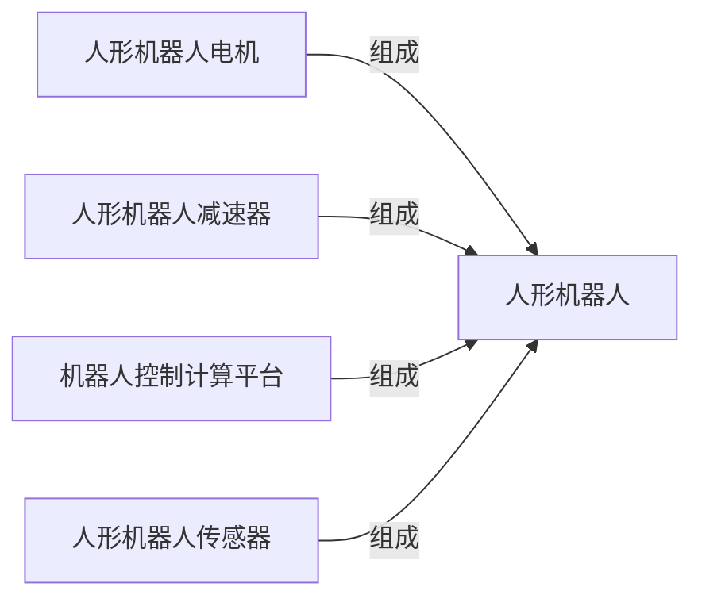

#### 受影响节点

| Node ID | 受影响节点 | 本次影响 | 结果 | 结论性质 | 传导逻辑（为什么到这里） | 直接证据（Event ID） | 时间窗口 | 置信度 |
|---|---|---|---|---|---|---|---|---|
| `fd5fde97-47f…` | 人形机器人 | 商业化进度 UP/MEDIUM；渗透率 UP/MEDIUM | 升温 | 直接证据 | 中国2026年8月在北京举办第二届人形机器人比赛，展示技术进步并引发应用讨论；DIGITIMES评论指出人形机器人行业扩产，具身智能正实体化，AI扩展下人类智能与机器活动界限模糊，反映具身智能技术正从验证进入规模应用。对“人形机器人”环节而言，这意味着商业化进度上升、渗透率上升，因此本期判断为升温。 | EVT245a1a74, EVT685aba49 | 中期–长期 | 中 |
| `a2b86f64-5d1…` | 人形机器人传感器 | 商业化进度 UP/LOW | 升温 | 直接证据 | 中国2026年8月在北京举办第二届人形机器人比赛，展示技术进步并引发应用讨论。对“人形机器人传感器”环节而言，这意味着商业化进度上升，因此本期判断为升温。 | EVT245a1a74 | 长期 | 中 |
| `78bebee6-006…` | 人形机器人减速器 | 商业化进度 UP/LOW | 升温 | 直接证据 | 中国2026年8月在北京举办第二届人形机器人比赛，展示技术进步并引发应用讨论。对“人形机器人减速器”环节而言，这意味着商业化进度上升，因此本期判断为升温。 | EVT245a1a74 | 长期 | 中 |
| `8bab5a5c-c9b…` | 人形机器人电机 | 商业化进度 UP/LOW | 升温 | 直接证据 | 中国2026年8月在北京举办第二届人形机器人比赛，展示技术进步并引发应用讨论。对“人形机器人电机”环节而言，这意味着商业化进度上升，因此本期判断为升温。 | EVT245a1a74 | 长期 | 中 |
| `9f4e1d1d-6e7…` | 机器人控制计算平台 | 真实同链拓扑相邻，尚无直接 Signal | 待验证 | — | “机器人控制计算平台”与本链中的直接受影响节点存在真实产业链关系，但在本次证据范围内，没有订单、价格、产能、技术进展或经营数据直接指向该环节，也没有足够依据确认影响已经传导至此，因此暂不判断升降方向。 | — | 后续周期 | 低 |

- **直接 Evidence**：EVT245a1a74, EVT685aba49。
- **反证与 Gap**：同链相邻节点缺少直接 Variable Signal 与经营观测。
- **停止条件**：若后续 Event 使节点 Signal 失效、方向反转，或链语境确认不属于本链，则关闭或修正本链结论。

### 3.2 CHN-02 AI数据中心液冷服务器产业链

**一句话结论（C-CHN-02）**：AI芯片、液冷服务器、液冷系统出现直接 Signal，节点方向为升温；但至少一个节点同时归属多条产业链，本链是否承接全部影响仍需链语境验证。

- **链状态**：节点 Signal 明确，链语境待解析
- **链结果**：升温
- **时间窗口 / 置信度**：长期–中期 / 低–中
- **路径**：`AI芯片、液冷服务器、液冷系统`（直接 Signal 节点）→ 真实同链拓扑节点

#### 链路图

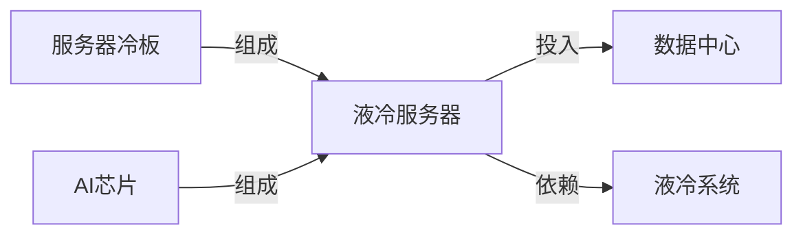

#### 受影响节点

| Node ID | 受影响节点 | 本次影响 | 结果 | 结论性质 | 传导逻辑（为什么到这里） | 直接证据（Event ID） | 时间窗口 | 置信度 |
|---|---|---|---|---|---|---|---|---|
| `7a5bf267-99c…` | AI芯片 | 商业化进度 UP/MEDIUM；技术成熟度 UP/MEDIUM | 升温 | 直接证据 | Google与Marvell扩大定制芯片合作，涉及TPU等AI芯片领域；OpenAI在Hot Chips 2026披露自研AI加速器ASIC Jalapeño的基准测试结果，该芯片为通用AI负载从零设计，非GPU改造；该节点归属 7 条链，本链语境未确定。对“AI芯片”环节而言，这意味着商业化进度上升、技术成熟度上升，因此本期判断为升温。 | EVT40bb2d15, EVT3387e8c0 | 长期–中期 | 低–中 |
| `4a582fda-196…` | 液冷服务器 | 商业化进度 UP/MEDIUM | 升温 | 直接证据 | 中国于2026年8月29日发布首个国家级液冷标准，以应对AI机架功耗逼近1MW的散热挑战，该标准为液冷服务器确立了统一的规范性技术基准。对“液冷服务器”环节而言，这意味着商业化进度上升，因此本期判断为升温。 | EVT4f8f284c | 长期 | 中 |
| `bd70ba7a-f3f…` | 液冷系统 | 商业化进度 UP/MEDIUM | 升温 | 直接证据 | 中国于2026年8月29日发布首个国家级液冷标准，以应对AI机架功耗逼近1MW的散热挑战，该标准为液冷系统确立了统一的规范性技术基准。对“液冷系统”环节而言，这意味着商业化进度上升，因此本期判断为升温。 | EVT4f8f284c | 长期 | 中 |
| `b765cc47-0a5…` | 数据中心 | 真实同链拓扑相邻，尚无直接 Signal | 待验证 | — | “数据中心”与本链中的直接受影响节点存在真实产业链关系，但在本次证据范围内，没有订单、价格、产能、技术进展或经营数据直接指向该环节，也没有足够依据确认影响已经传导至此，因此暂不判断升降方向。 | — | 后续周期 | 低 |
| `97b3353f-a55…` | 服务器冷板 | 真实同链拓扑相邻，尚无直接 Signal | 待验证 | — | “服务器冷板”与本链中的直接受影响节点存在真实产业链关系，但在本次证据范围内，没有订单、价格、产能、技术进展或经营数据直接指向该环节，也没有足够依据确认影响已经传导至此，因此暂不判断升降方向。 | — | 后续周期 | 低 |

- **直接 Evidence**：EVT40bb2d15, EVT3387e8c0, EVT4f8f284c。
- **反证与 Gap**：共享节点的具体链语境尚未解析；同链相邻节点缺少直接 Variable Signal 与经营观测。
- **停止条件**：若后续 Event 使节点 Signal 失效、方向反转，或链语境确认不属于本链，则关闭或修正本链结论。

### 3.3 CHN-03 AI算力基础设施服务产业链

**一句话结论（C-CHN-03）**：AI芯片、算力供给出现直接 Signal，节点方向为升温；但至少一个节点同时归属多条产业链，本链是否承接全部影响仍需链语境验证。

- **链状态**：节点 Signal 明确，链语境待解析
- **链结果**：升温
- **时间窗口 / 置信度**：长期–中期 / 低–中
- **路径**：`AI芯片、算力供给`（直接 Signal 节点）→ 真实同链拓扑节点

#### 链路图

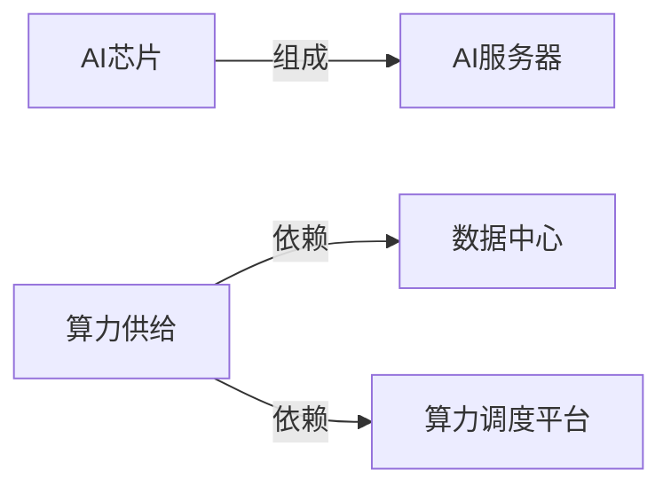

#### 受影响节点

| Node ID | 受影响节点 | 本次影响 | 结果 | 结论性质 | 传导逻辑（为什么到这里） | 直接证据（Event ID） | 时间窗口 | 置信度 |
|---|---|---|---|---|---|---|---|---|
| `7a5bf267-99c…` | AI芯片 | 商业化进度 UP/MEDIUM；技术成熟度 UP/MEDIUM | 升温 | 直接证据 | Google与Marvell扩大定制芯片合作，涉及TPU等AI芯片领域；OpenAI在Hot Chips 2026披露自研AI加速器ASIC Jalapeño的基准测试结果，该芯片为通用AI负载从零设计，非GPU改造；该节点归属 7 条链，本链语境未确定。对“AI芯片”环节而言，这意味着商业化进度上升、技术成熟度上升，因此本期判断为升温。 | EVT40bb2d15, EVT3387e8c0 | 长期–中期 | 低–中 |
| `0091def5-b9c…` | 算力供给 | 产能利用率 UP/MEDIUM；商业化进度 UP/LOW；市场供给 UP/MEDIUM；性价比 UP/MEDIUM；有效产能 UP/HIGH | 升温 | 直接证据 | InferenceXv3在推理过程中实现95%以上KVCache命中率；截至2026年7月底，全国智算总规模达245万PFLOPS(FP16)，其中145万PFLOPS纳入国家级监测调度平台；该节点归属 5 条链，本链语境未确定。对“算力供给”环节而言，这意味着产能利用率上升、商业化进度上升、市场供给上升、性价比上升、有效产能上升，因此本期判断为升温。 | EVTe565f6f7, EVT2c59c6d9 | 中期 | 低–中 |
| `528043a8-501…` | AI服务器 | 真实同链拓扑相邻，尚无直接 Signal | 待验证 | — | “AI服务器”与本链中的直接受影响节点存在真实产业链关系，但在本次证据范围内，没有订单、价格、产能、技术进展或经营数据直接指向该环节，也没有足够依据确认影响已经传导至此，因此暂不判断升降方向。 | — | 后续周期 | 低 |
| `b765cc47-0a5…` | 数据中心 | 真实同链拓扑相邻，尚无直接 Signal | 待验证 | — | “数据中心”与本链中的直接受影响节点存在真实产业链关系，但在本次证据范围内，没有订单、价格、产能、技术进展或经营数据直接指向该环节，也没有足够依据确认影响已经传导至此，因此暂不判断升降方向。 | — | 后续周期 | 低 |
| `f5659f21-a1b…` | 算力调度平台 | 真实同链拓扑相邻，尚无直接 Signal | 待验证 | — | “算力调度平台”与本链中的直接受影响节点存在真实产业链关系，但在本次证据范围内，没有订单、价格、产能、技术进展或经营数据直接指向该环节，也没有足够依据确认影响已经传导至此，因此暂不判断升降方向。 | — | 后续周期 | 低 |

- **直接 Evidence**：EVT40bb2d15, EVT3387e8c0, EVTe565f6f7, EVT2c59c6d9。
- **反证与 Gap**：共享节点的具体链语境尚未解析；同链相邻节点缺少直接 Variable Signal 与经营观测。
- **停止条件**：若后续 Event 使节点 Signal 失效、方向反转，或链语境确认不属于本链，则关闭或修正本链结论。

### 3.4 CHN-04 AI视频生成服务产业链

**一句话结论（C-CHN-04）**：AI语料、算力供给出现直接 Signal，节点方向为升温；但至少一个节点同时归属多条产业链，本链是否承接全部影响仍需链语境验证。

- **链状态**：节点 Signal 明确，链语境待解析
- **链结果**：升温
- **时间窗口 / 置信度**：中期 / 低–中
- **路径**：`AI语料、算力供给`（直接 Signal 节点）→ 真实同链拓扑节点

#### 链路图


#### 受影响节点

| Node ID | 受影响节点 | 本次影响 | 结果 | 结论性质 | 传导逻辑（为什么到这里） | 直接证据（Event ID） | 时间窗口 | 置信度 |
|---|---|---|---|---|---|---|---|---|
| `5c3f5b94-451…` | AI语料 | 商业化进度 UP/MEDIUM | 升温 | 直接证据 | AgentX于2026年8月24日发布开源数据集，价值300万美元，支持长上下文、多轮和子代理特性；该节点归属 2 条链，本链语境未确定。对“AI语料”环节而言，这意味着商业化进度上升，因此本期判断为升温。 | EVT34119384 | 中期 | 低–中 |
| `0091def5-b9c…` | 算力供给 | 产能利用率 UP/MEDIUM；商业化进度 UP/LOW；市场供给 UP/MEDIUM；性价比 UP/MEDIUM；有效产能 UP/HIGH | 升温 | 直接证据 | InferenceXv3在推理过程中实现95%以上KVCache命中率；截至2026年7月底，全国智算总规模达245万PFLOPS(FP16)，其中145万PFLOPS纳入国家级监测调度平台；该节点归属 5 条链，本链语境未确定。对“算力供给”环节而言，这意味着产能利用率上升、商业化进度上升、市场供给上升、性价比上升、有效产能上升，因此本期判断为升温。 | EVTe565f6f7, EVT2c59c6d9 | 中期 | 低–中 |
| `39bd9129-8bd…` | 视频生成基础模型 | 真实同链拓扑相邻，尚无直接 Signal | 待验证 | — | “视频生成基础模型”与本链中的直接受影响节点存在真实产业链关系，但在本次证据范围内，没有订单、价格、产能、技术进展或经营数据直接指向该环节，也没有足够依据确认影响已经传导至此，因此暂不判断升降方向。 | — | 后续周期 | 低 |

- **直接 Evidence**：EVT34119384, EVTe565f6f7, EVT2c59c6d9。
- **反证与 Gap**：共享节点的具体链语境尚未解析；同链相邻节点缺少直接 Variable Signal 与经营观测。
- **停止条件**：若后续 Event 使节点 Signal 失效、方向反转，或链语境确认不属于本链，则关闭或修正本链结论。

### 3.5 CHN-05 油气勘探开发产业链

**一句话结论（C-CHN-05）**：商品原油、油气开采出现直接 Signal，当前链级聚合结果为分化，向相邻节点的传播尚待验证。

- **链状态**：节点 Signal 明确，链内传播待验证
- **链结果**：分化
- **时间窗口 / 置信度**：中期–短期 / 中
- **路径**：`商品原油、油气开采`（直接 Signal 节点）→ 真实同链拓扑节点

#### 链路图

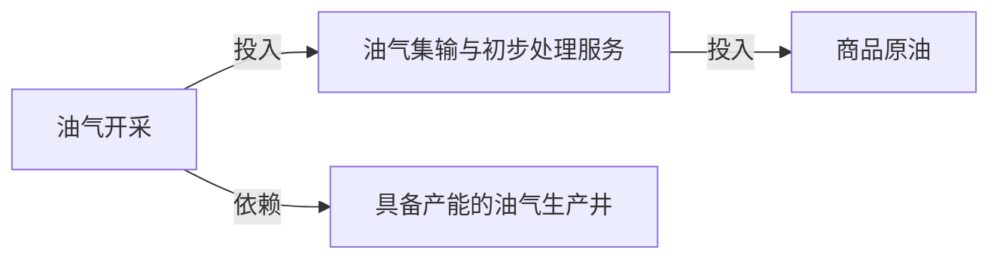

#### 受影响节点

| Node ID | 受影响节点 | 本次影响 | 结果 | 结论性质 | 传导逻辑（为什么到这里） | 直接证据（Event ID） | 时间窗口 | 置信度 |
|---|---|---|---|---|---|---|---|---|
| `abb6e457-8ec…` | 商品原油 | 市场供给 STABLE/LOW；市场供给 DOWN/LOW；市场供给 UP/MEDIUM；库存水平 DOWN/MEDIUM；投入成本 UP/MEDIUM | 分化 | 直接证据 | 亚洲炼油商转向南美生产商可能导致供应来源增加，但商品原油的市场供给整体未变；委内瑞拉2026年7月原油出口总量环比下降至116万桶/日，对美出口升至高位。对“商品原油”环节而言，这意味着市场供给保持稳定、市场供给下降、市场供给上升、库存水平下降、投入成本上升，因此本期判断为分化。 | EVTa7af475c, EVTe8d46974, EVT7ebaa074, EVT657ec86c | 中期–短期 | 中 |
| `f7e94ab3-f83…` | 油气开采 | 市场供给 DOWN/LOW | 降温 | 直接证据 | 委内瑞拉2026年7月原油出口总量环比下降至116万桶/日。对“油气开采”环节而言，这意味着市场供给下降，因此本期判断为降温。 | EVTe8d46974 | 短期 | 中 |
| `7e693591-6d6…` | 具备产能的油气生产井 | 真实同链拓扑相邻，尚无直接 Signal | 待验证 | — | “具备产能的油气生产井”与本链中的直接受影响节点存在真实产业链关系，但在本次证据范围内，没有订单、价格、产能、技术进展或经营数据直接指向该环节，也没有足够依据确认影响已经传导至此，因此暂不判断升降方向。 | — | 后续周期 | 低 |
| `d0cb4396-d6c…` | 油气集输与初步处理服务 | 真实同链拓扑相邻，尚无直接 Signal | 待验证 | — | “油气集输与初步处理服务”与本链中的直接受影响节点存在真实产业链关系，但在本次证据范围内，没有订单、价格、产能、技术进展或经营数据直接指向该环节，也没有足够依据确认影响已经传导至此，因此暂不判断升降方向。 | — | 后续周期 | 低 |

- **直接 Evidence**：EVTa7af475c, EVTe8d46974, EVT7ebaa074, EVT657ec86c。
- **反证与 Gap**：同链相邻节点缺少直接 Variable Signal 与经营观测。
- **停止条件**：若后续 Event 使节点 Signal 失效、方向反转，或链语境确认不属于本链，则关闭或修正本链结论。

### 3.6 CHN-06 生成式人工智能模型及应用服务产业链

**一句话结论（C-CHN-06）**：生成式AI基础模型、算力供给出现直接 Signal，节点方向为升温；但至少一个节点同时归属多条产业链，本链是否承接全部影响仍需链语境验证。

- **链状态**：节点 Signal 明确，链语境待解析
- **链结果**：升温
- **时间窗口 / 置信度**：中期 / 低–中
- **路径**：`生成式AI基础模型、算力供给`（直接 Signal 节点）→ 真实同链拓扑节点

#### 链路图

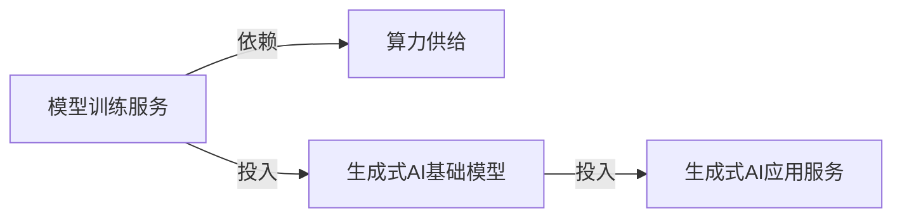

#### 受影响节点

| Node ID | 受影响节点 | 本次影响 | 结果 | 结论性质 | 传导逻辑（为什么到这里） | 直接证据（Event ID） | 时间窗口 | 置信度 |
|---|---|---|---|---|---|---|---|---|
| `a737b354-05b…` | 生成式AI基础模型 | 商业化进度 UP/MEDIUM | 升温 | 直接证据 | DeepMind发布Gemini Omni 1.1 Flash，宣称让开发者构建时拥有更多控制力。对“生成式AI基础模型”环节而言，这意味着商业化进度上升，因此本期判断为升温。 | EVTea2f0e49 | 中期 | 中 |
| `0091def5-b9c…` | 算力供给 | 产能利用率 UP/MEDIUM；商业化进度 UP/LOW；市场供给 UP/MEDIUM；性价比 UP/MEDIUM；有效产能 UP/HIGH | 升温 | 直接证据 | InferenceXv3在推理过程中实现95%以上KVCache命中率；截至2026年7月底，全国智算总规模达245万PFLOPS(FP16)，其中145万PFLOPS纳入国家级监测调度平台；该节点归属 5 条链，本链语境未确定。对“算力供给”环节而言，这意味着产能利用率上升、商业化进度上升、市场供给上升、性价比上升、有效产能上升，因此本期判断为升温。 | EVTe565f6f7, EVT2c59c6d9 | 中期 | 低–中 |
| `676b3781-e62…` | 模型训练服务 | 真实同链拓扑相邻，尚无直接 Signal | 待验证 | — | “模型训练服务”与本链中的直接受影响节点存在真实产业链关系，但在本次证据范围内，没有订单、价格、产能、技术进展或经营数据直接指向该环节，也没有足够依据确认影响已经传导至此，因此暂不判断升降方向。 | — | 后续周期 | 低 |
| `f2bddc77-184…` | 生成式AI应用服务 | 真实同链拓扑相邻，尚无直接 Signal | 待验证 | — | “生成式AI应用服务”与本链中的直接受影响节点存在真实产业链关系，但在本次证据范围内，没有订单、价格、产能、技术进展或经营数据直接指向该环节，也没有足够依据确认影响已经传导至此，因此暂不判断升降方向。 | — | 后续周期 | 低 |

- **直接 Evidence**：EVTea2f0e49, EVTe565f6f7, EVT2c59c6d9。
- **反证与 Gap**：共享节点的具体链语境尚未解析；同链相邻节点缺少直接 Variable Signal 与经营观测。
- **停止条件**：若后续 Event 使节点 Signal 失效、方向反转，或链语境确认不属于本链，则关闭或修正本链结论。

### 3.7 CHN-07 汽车线控制动执行器产业链

**一句话结论（C-CHN-07）**：传感器、新能源车整车出现直接 Signal，节点方向为升温；但至少一个节点同时归属多条产业链，本链是否承接全部影响仍需链语境验证。

- **链状态**：节点 Signal 明确，链语境待解析
- **链结果**：升温
- **时间窗口 / 置信度**：中期–长期 / 低–中
- **路径**：`传感器、新能源车整车`（直接 Signal 节点）→ 真实同链拓扑节点

#### 链路图


#### 受影响节点

| Node ID | 受影响节点 | 本次影响 | 结果 | 结论性质 | 传导逻辑（为什么到这里） | 直接证据（Event ID） | 时间窗口 | 置信度 |
|---|---|---|---|---|---|---|---|---|
| `ceca14e0-73f…` | 传感器 | 政策支持力度 UP/LOW | 升温 | 直接证据 | 2026年8月29日，北京怀柔发布2026年第一批采购机遇清单，采购额约4亿元，包含超过10项采购机遇，针对高端科学仪器与传感器产业；该节点归属 7 条链，本链语境未确定。对“传感器”环节而言，这意味着政策支持力度上升，因此本期判断为升温。 | EVT2377d12d | 中期 | 低–中 |
| `0ae9b007-d57…` | 新能源车整车 | 商业化进度 UP/MEDIUM；市场需求 UP/MEDIUM；性价比 UP/MEDIUM；技术成熟度 UP/MEDIUM | 升温 | 直接证据 | 中国国家市场监管总局宣布分阶段实施GB1589-2026标准，新车型需于2027年7月1日起符合，现有车型需于2028年1月1日起符合，并给予车企技术升级和过渡时间；吉利汽车发布混动SUV车型Monjaro EM-i，开启首款混动D级SUV全球推广，直接增加新能源车（混动SUV）的供给与可得性；该节点归属 5 条链，本链语境未确定。对“新能源车整车”环节而言，这意味着商业化进度上升、市场需求上升、性价比上升、技术成熟度上升，因此本期判断为升温。 | EVT9c85c6ff, EVTab835f8e, EVTa4d92743 | 长期–中期 | 低–中 |
| `707439f0-148…` | 线控制动执行器 | 真实同链拓扑相邻，尚无直接 Signal | 待验证 | — | “线控制动执行器”与本链中的直接受影响节点存在真实产业链关系，但在本次证据范围内，没有订单、价格、产能、技术进展或经营数据直接指向该环节，也没有足够依据确认影响已经传导至此，因此暂不判断升降方向。 | — | 后续周期 | 低 |

- **直接 Evidence**：EVT2377d12d, EVT9c85c6ff, EVTab835f8e, EVTa4d92743。
- **反证与 Gap**：共享节点的具体链语境尚未解析；同链相邻节点缺少直接 Variable Signal 与经营观测。
- **停止条件**：若后续 Event 使节点 Signal 失效、方向反转，或链语境确认不属于本链，则关闭或修正本链结论。

### 3.8 CHN-08 企业AI智能体产业链

**一句话结论（C-CHN-08）**：AI智能体、基础模型API服务出现直接 Signal，当前链级聚合结果为升温，向相邻节点的传播尚待验证。

- **链状态**：节点 Signal 明确，链内传播待验证
- **链结果**：升温
- **时间窗口 / 置信度**：中期 / 中
- **路径**：`AI智能体、基础模型API服务`（直接 Signal 节点）→ 真实同链拓扑节点

#### 链路图

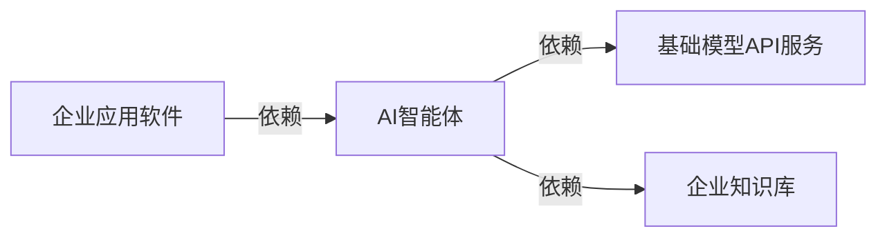

#### 受影响节点

| Node ID | 受影响节点 | 本次影响 | 结果 | 结论性质 | 传导逻辑（为什么到这里） | 直接证据（Event ID） | 时间窗口 | 置信度 |
|---|---|---|---|---|---|---|---|---|
| `be1986b4-708…` | AI智能体 | 商业化进度 UP/MEDIUM | 升温 | 直接证据 | AgentX于2026年8月24日发布开源数据集，价值300万美元，支持长上下文、多轮和子代理特性。对“AI智能体”环节而言，这意味着商业化进度上升，因此本期判断为升温。 | EVT34119384 | 中期 | 低–中 |
| `2591173a-f32…` | 基础模型API服务 | 性价比 UP/HIGH；渗透率 UP/MEDIUM；渗透率 UP/HIGH | 升温 | 直接证据 | 开源模型竞争力增强，Fireworks每日处理超40万亿token，是OpenAI API在3月底交易量的2倍；DeepMind发布Gemini Omni 1.1 Flash，宣称让开发者构建时拥有更多控制力。对“基础模型API服务”环节而言，这意味着性价比上升、渗透率上升、渗透率上升，因此本期判断为升温。 | EVTb59f55c3, EVTea2f0e49 | 中期 | 中 |
| `64c968f0-6ec…` | 企业应用软件 | 真实同链拓扑相邻，尚无直接 Signal | 待验证 | — | “企业应用软件”与本链中的直接受影响节点存在真实产业链关系，但在本次证据范围内，没有订单、价格、产能、技术进展或经营数据直接指向该环节，也没有足够依据确认影响已经传导至此，因此暂不判断升降方向。 | — | 后续周期 | 低 |
| `3ab77588-d8a…` | 企业知识库 | 真实同链拓扑相邻，尚无直接 Signal | 待验证 | — | “企业知识库”与本链中的直接受影响节点存在真实产业链关系，但在本次证据范围内，没有订单、价格、产能、技术进展或经营数据直接指向该环节，也没有足够依据确认影响已经传导至此，因此暂不判断升降方向。 | — | 后续周期 | 低 |

- **直接 Evidence**：EVT34119384, EVTb59f55c3, EVTea2f0e49。
- **反证与 Gap**：同链相邻节点缺少直接 Variable Signal 与经营观测。
- **停止条件**：若后续 Event 使节点 Signal 失效、方向反转，或链语境确认不属于本链，则关闭或修正本链结论。

### 3.9 CHN-09 智能语音技术服务产业链

**一句话结论（C-CHN-09）**：智能语音基础模型、智能语音算法SDK与云API出现直接 Signal，当前链级聚合结果为升温，向相邻节点的传播尚待验证。

- **链状态**：节点 Signal 明确，链内传播待验证
- **链结果**：升温
- **时间窗口 / 置信度**：中期 / 中
- **路径**：`智能语音基础模型、智能语音算法SDK与云API`（直接 Signal 节点）→ 真实同链拓扑节点

#### 链路图


#### 受影响节点

| Node ID | 受影响节点 | 本次影响 | 结果 | 结论性质 | 传导逻辑（为什么到这里） | 直接证据（Event ID） | 时间窗口 | 置信度 |
|---|---|---|---|---|---|---|---|---|
| `1f717a15-3db…` | 智能语音基础模型 | 商业化进度 UP/MEDIUM；技术成熟度 UP/MEDIUM；渗透率 UP/LOW | 升温 | 直接证据 | DeepMind于2026年8月26日发布Gemini 3.5 Transcribe，一款提供更智能语音转文字转录功能的产品，标志公司语音转录技术进入商业化发布阶段；DeepMind于2026年8月26日发布Gemini 3.5 Transcribe，其更智能的语音转文字功能有望提升语音转录产品的技术性能和体验。对“智能语音基础模型”环节而言，这意味着商业化进度上升、技术成熟度上升、渗透率上升，因此本期判断为升温。 | EVTcff99921 | 中期 | 中 |
| `a19570dd-af4…` | 智能语音算法SDK与云API | 商业化进度 UP/MEDIUM | 升温 | 直接证据 | DeepMind于2026年8月26日发布Gemini 3.5 Transcribe，提供更智能的语音转文字转录功能，直接提升了DeepMind在语音转录应用中的产品供给。对“智能语音算法SDK与云API”环节而言，这意味着商业化进度上升，因此本期判断为升温。 | EVTcff99921 | 中期 | 中 |
| `36285326-b10…` | 智能终端语音交互应用 | 真实同链拓扑相邻，尚无直接 Signal | 待验证 | — | “智能终端语音交互应用”与本链中的直接受影响节点存在真实产业链关系，但在本次证据范围内，没有订单、价格、产能、技术进展或经营数据直接指向该环节，也没有足够依据确认影响已经传导至此，因此暂不判断升降方向。 | — | 后续周期 | 低 |
| `ca61bc3c-6dd…` | 智能语音基础模型训练服务 | 真实同链拓扑相邻，尚无直接 Signal | 待验证 | — | “智能语音基础模型训练服务”与本链中的直接受影响节点存在真实产业链关系，但在本次证据范围内，没有订单、价格、产能、技术进展或经营数据直接指向该环节，也没有足够依据确认影响已经传导至此，因此暂不判断升降方向。 | — | 后续周期 | 低 |

- **直接 Evidence**：EVTcff99921。
- **反证与 Gap**：同链相邻节点缺少直接 Variable Signal 与经营观测。
- **停止条件**：若后续 Event 使节点 Signal 失效、方向反转，或链语境确认不属于本链，则关闭或修正本链结论。

### 3.10 CHN-10 AI智能手机产业链

**一句话结论（C-CHN-10）**：AI芯片、传感器出现直接 Signal，节点方向为升温；但至少一个节点同时归属多条产业链，本链是否承接全部影响仍需链语境验证。

- **链状态**：节点 Signal 明确，链语境待解析
- **链结果**：升温
- **时间窗口 / 置信度**：长期–中期 / 低–中
- **路径**：`AI芯片、传感器`（直接 Signal 节点）→ 真实同链拓扑节点

#### 链路图

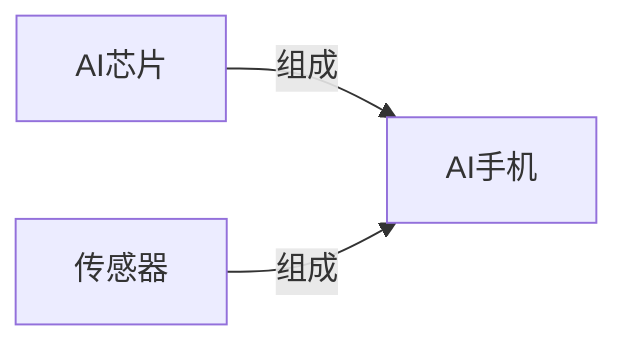

#### 受影响节点

| Node ID | 受影响节点 | 本次影响 | 结果 | 结论性质 | 传导逻辑（为什么到这里） | 直接证据（Event ID） | 时间窗口 | 置信度 |
|---|---|---|---|---|---|---|---|---|
| `7a5bf267-99c…` | AI芯片 | 商业化进度 UP/MEDIUM；技术成熟度 UP/MEDIUM | 升温 | 直接证据 | Google与Marvell扩大定制芯片合作，涉及TPU等AI芯片领域；OpenAI在Hot Chips 2026披露自研AI加速器ASIC Jalapeño的基准测试结果，该芯片为通用AI负载从零设计，非GPU改造；该节点归属 7 条链，本链语境未确定。对“AI芯片”环节而言，这意味着商业化进度上升、技术成熟度上升，因此本期判断为升温。 | EVT40bb2d15, EVT3387e8c0 | 长期–中期 | 低–中 |
| `ceca14e0-73f…` | 传感器 | 政策支持力度 UP/LOW | 升温 | 直接证据 | 2026年8月29日，北京怀柔发布2026年第一批采购机遇清单，采购额约4亿元，包含超过10项采购机遇，针对高端科学仪器与传感器产业；该节点归属 7 条链，本链语境未确定。对“传感器”环节而言，这意味着政策支持力度上升，因此本期判断为升温。 | EVT2377d12d | 中期 | 低–中 |
| `b6e5662f-8be…` | AI手机 | 真实同链拓扑相邻，尚无直接 Signal | 待验证 | — | “AI手机”与本链中的直接受影响节点存在真实产业链关系，但在本次证据范围内，没有订单、价格、产能、技术进展或经营数据直接指向该环节，也没有足够依据确认影响已经传导至此，因此暂不判断升降方向。 | — | 后续周期 | 低 |

- **直接 Evidence**：EVT40bb2d15, EVT3387e8c0, EVT2377d12d。
- **反证与 Gap**：共享节点的具体链语境尚未解析；同链相邻节点缺少直接 Variable Signal 与经营观测。
- **停止条件**：若后续 Event 使节点 Signal 失效、方向反转，或链语境确认不属于本链，则关闭或修正本链结论。

### 3.11 CHN-11 AI计算芯片产业链

**一句话结论（C-CHN-11）**：AI芯片、集成电路制造出现直接 Signal，节点方向为升温；但至少一个节点同时归属多条产业链，本链是否承接全部影响仍需链语境验证。

- **链状态**：节点 Signal 明确，链语境待解析
- **链结果**：升温
- **时间窗口 / 置信度**：长期–中期 / 低–中
- **路径**：`AI芯片、集成电路制造`（直接 Signal 节点）→ 真实同链拓扑节点

#### 链路图

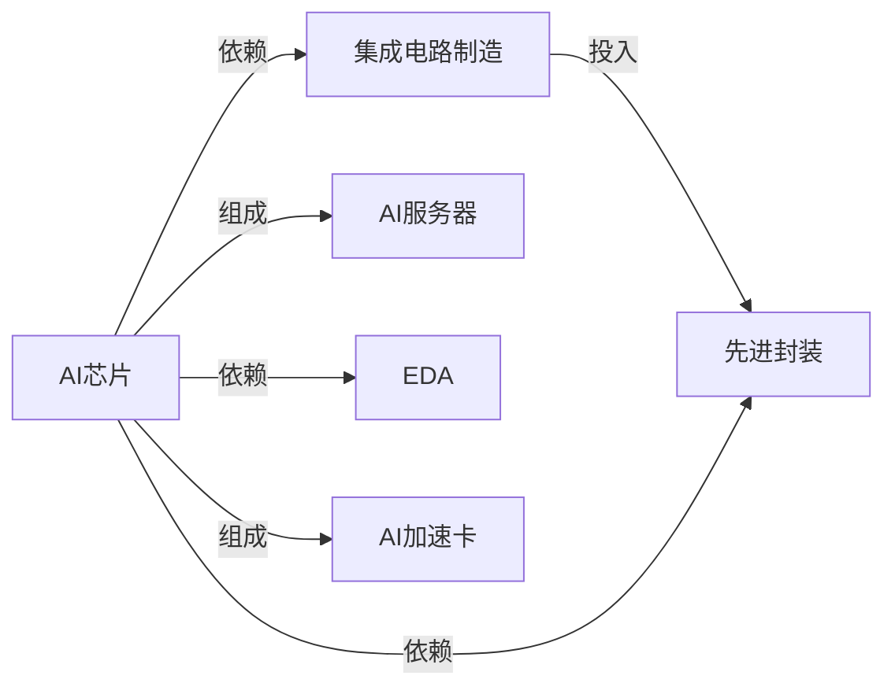

#### 受影响节点

| Node ID | 受影响节点 | 本次影响 | 结果 | 结论性质 | 传导逻辑（为什么到这里） | 直接证据（Event ID） | 时间窗口 | 置信度 |
|---|---|---|---|---|---|---|---|---|
| `7a5bf267-99c…` | AI芯片 | 商业化进度 UP/MEDIUM；技术成熟度 UP/MEDIUM | 升温 | 直接证据 | Google与Marvell扩大定制芯片合作，涉及TPU等AI芯片领域；OpenAI在Hot Chips 2026披露自研AI加速器ASIC Jalapeño的基准测试结果，该芯片为通用AI负载从零设计，非GPU改造；该节点归属 7 条链，本链语境未确定。对“AI芯片”环节而言，这意味着商业化进度上升、技术成熟度上升，因此本期判断为升温。 | EVT40bb2d15, EVT3387e8c0 | 长期–中期 | 低–中 |
| `a72fef05-023…` | 集成电路制造 | 产能利用率 UP/MEDIUM | 升温 | 直接证据 | 美国商务部推进CHIPS法案制造业激励项目，多数项目计划2028年前完成；该节点归属 4 条链，本链语境未确定。对“集成电路制造”环节而言，这意味着产能利用率上升，因此本期判断为升温。 | EVT29d33f9d | 长期 | 低–中 |
| `711f0830-000…` | AI加速卡 | 真实同链拓扑相邻，尚无直接 Signal | 待验证 | — | “AI加速卡”与本链中的直接受影响节点存在真实产业链关系，但在本次证据范围内，没有订单、价格、产能、技术进展或经营数据直接指向该环节，也没有足够依据确认影响已经传导至此，因此暂不判断升降方向。 | — | 后续周期 | 低 |
| `528043a8-501…` | AI服务器 | 真实同链拓扑相邻，尚无直接 Signal | 待验证 | — | “AI服务器”与本链中的直接受影响节点存在真实产业链关系，但在本次证据范围内，没有订单、价格、产能、技术进展或经营数据直接指向该环节，也没有足够依据确认影响已经传导至此，因此暂不判断升降方向。 | — | 后续周期 | 低 |
| `87c76d1f-5da…` | EDA | 真实同链拓扑相邻，尚无直接 Signal | 待验证 | — | “EDA”与本链中的直接受影响节点存在真实产业链关系，但在本次证据范围内，没有订单、价格、产能、技术进展或经营数据直接指向该环节，也没有足够依据确认影响已经传导至此，因此暂不判断升降方向。 | — | 后续周期 | 低 |
| `7246a287-655…` | 先进封装 | 真实同链拓扑相邻，尚无直接 Signal | 待验证 | — | “先进封装”与本链中的直接受影响节点存在真实产业链关系，但在本次证据范围内，没有订单、价格、产能、技术进展或经营数据直接指向该环节，也没有足够依据确认影响已经传导至此，因此暂不判断升降方向。 | — | 后续周期 | 低 |

- **直接 Evidence**：EVT40bb2d15, EVT3387e8c0, EVT29d33f9d。
- **反证与 Gap**：共享节点的具体链语境尚未解析；同链相邻节点缺少直接 Variable Signal 与经营观测。
- **停止条件**：若后续 Event 使节点 Signal 失效、方向反转，或链语境确认不属于本链，则关闭或修正本链结论。

### 3.12 CHN-12 电动汽车换电服务产业链

**一句话结论（C-CHN-12）**：换电运营调度平台、标准化换电电池包资产出现直接 Signal，当前链级聚合结果为升温，向相邻节点的传播尚待验证。

- **链状态**：节点 Signal 明确，链内传播待验证
- **链结果**：升温
- **时间窗口 / 置信度**：中期 / 中
- **路径**：`换电运营调度平台、标准化换电电池包资产`（直接 Signal 节点）→ 真实同链拓扑节点

#### 链路图

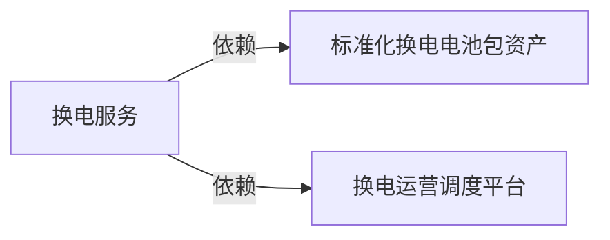

#### 受影响节点

| Node ID | 受影响节点 | 本次影响 | 结果 | 结论性质 | 传导逻辑（为什么到这里） | 直接证据（Event ID） | 时间窗口 | 置信度 |
|---|---|---|---|---|---|---|---|---|
| `1caee19f-9b9…` | 换电运营调度平台 | 商业化进度 UP/LOW | 升温 | 直接证据 | Epicland考虑采用换电模式，意味着对换电运营调度平台的需求可能提升，从而推动其商业化进度。对“换电运营调度平台”环节而言，这意味着商业化进度上升，因此本期判断为升温。 | EVT00eaab71 | 中期 | 中 |
| `c1f6ecf9-92d…` | 标准化换电电池包资产 | 市场需求 UP/LOW | 升温 | 直接证据 | Epicland考虑采用换电模式，将增加对标准化换电电池包资产的市场需求。对“标准化换电电池包资产”环节而言，这意味着市场需求上升，因此本期判断为升温。 | EVT00eaab71 | 中期 | 中 |
| `e7447dcf-1a2…` | 换电服务 | 真实同链拓扑相邻，尚无直接 Signal | 待验证 | — | “换电服务”与本链中的直接受影响节点存在真实产业链关系，但在本次证据范围内，没有订单、价格、产能、技术进展或经营数据直接指向该环节，也没有足够依据确认影响已经传导至此，因此暂不判断升降方向。 | — | 后续周期 | 低 |

- **直接 Evidence**：EVT00eaab71。
- **反证与 Gap**：同链相邻节点缺少直接 Variable Signal 与经营观测。
- **停止条件**：若后续 Event 使节点 Signal 失效、方向反转，或链语境确认不属于本链，则关闭或修正本链结论。

### 3.13 CHN-13 量子信息技术系统产业链

**一句话结论（C-CHN-13）**：超导量子计算机、量子计算控制软件出现直接 Signal，当前链级聚合结果为升温，向相邻节点的传播尚待验证。

- **链状态**：节点 Signal 明确，链内传播待验证
- **链结果**：升温
- **时间窗口 / 置信度**：长期 / 中
- **路径**：`超导量子计算机、量子计算控制软件`（直接 Signal 节点）→ 真实同链拓扑节点

#### 链路图

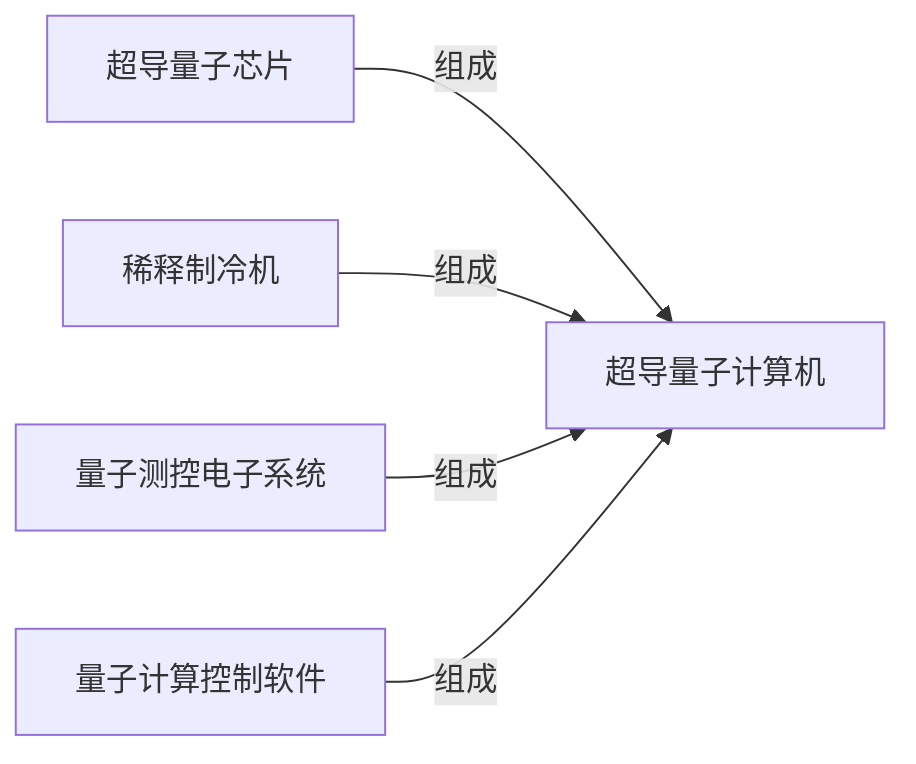

#### 受影响节点

| Node ID | 受影响节点 | 本次影响 | 结果 | 结论性质 | 传导逻辑（为什么到这里） | 直接证据（Event ID） | 时间窗口 | 置信度 |
|---|---|---|---|---|---|---|---|---|
| `323b9bc8-360…` | 超导量子计算机 | 政策支持力度 UP/HIGH | 升温 | 直接证据 | 美国商务部取消CHIPS法案下78亿美元研发拨款，并转向量子计算投资，向xLight等公司授予9亿美元、承诺20亿美元量子计算初步拨款，要求以股权换取资金。对“超导量子计算机”环节而言，这意味着政策支持力度上升，因此本期判断为升温。 | EVT6ee33536 | 长期 | 中 |
| `cb7a8247-6c9…` | 量子计算控制软件 | 技术路线竞争 UP/MEDIUM | 升温 | 直接证据 | 美国商务部取消CHIPS法案研发资金并转向量子计算投资，涉及NSTC框架调整。对“量子计算控制软件”环节而言，这意味着技术路线竞争上升，因此本期判断为升温。 | EVT6ee33536 | 长期 | 低–中 |
| `3089bafe-844…` | 稀释制冷机 | 真实同链拓扑相邻，尚无直接 Signal | 待验证 | — | “稀释制冷机”与本链中的直接受影响节点存在真实产业链关系，但在本次证据范围内，没有订单、价格、产能、技术进展或经营数据直接指向该环节，也没有足够依据确认影响已经传导至此，因此暂不判断升降方向。 | — | 后续周期 | 低 |
| `9fb21fae-e19…` | 超导量子芯片 | 真实同链拓扑相邻，尚无直接 Signal | 待验证 | — | “超导量子芯片”与本链中的直接受影响节点存在真实产业链关系，但在本次证据范围内，没有订单、价格、产能、技术进展或经营数据直接指向该环节，也没有足够依据确认影响已经传导至此，因此暂不判断升降方向。 | — | 后续周期 | 低 |
| `5de95b2e-4f0…` | 量子测控电子系统 | 真实同链拓扑相邻，尚无直接 Signal | 待验证 | — | “量子测控电子系统”与本链中的直接受影响节点存在真实产业链关系，但在本次证据范围内，没有订单、价格、产能、技术进展或经营数据直接指向该环节，也没有足够依据确认影响已经传导至此，因此暂不判断升降方向。 | — | 后续周期 | 低 |

- **直接 Evidence**：EVT6ee33536。
- **反证与 Gap**：同链相邻节点缺少直接 Variable Signal 与经营观测。
- **停止条件**：若后续 Event 使节点 Signal 失效、方向反转，或链语境确认不属于本链，则关闭或修正本链结论。

### 3.14 CHN-14 自动驾驶系统产业链

**一句话结论（C-CHN-14）**：自动驾驶系统出现直接 Signal，当前链级聚合结果为升温，向相邻节点的传播尚待验证。

- **链状态**：节点 Signal 明确，链内传播待验证
- **链结果**：升温
- **时间窗口 / 置信度**：长期–中期 / 中–高
- **路径**：`自动驾驶系统`（直接 Signal 节点）→ 真实同链拓扑节点

#### 链路图

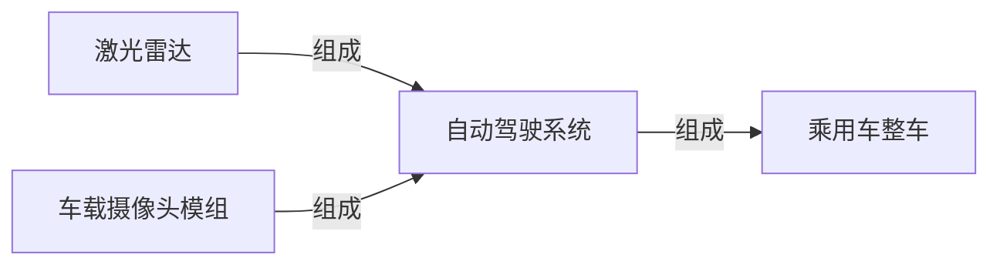

#### 受影响节点

| Node ID | 受影响节点 | 本次影响 | 结果 | 结论性质 | 传导逻辑（为什么到这里） | 直接证据（Event ID） | 时间窗口 | 置信度 |
|---|---|---|---|---|---|---|---|---|
| `d37142f5-7f5…` | 自动驾驶系统 | 商业化进度 UP/MEDIUM；市场份额 UP/MEDIUM；技术成熟度 UP/MEDIUM；订单可见度 UP/MEDIUM | 升温 | 直接证据 | Momenta披露2026年上半年研发支出11.6亿元，同比增长18.6%，占营收72.6%，研发员工1102名占员工总数79.1%；Momenta在2026年上半年新增安装量产方案约32.1万套，同比增长83.7%，累计安装超100万套；交付37个量产车型，累计105个。对“自动驾驶系统”环节而言，这意味着商业化进度上升、市场份额上升、技术成熟度上升、订单可见度上升，因此本期判断为升温。 | EVT39d201dc, EVT8e5d52ba, EVTba2fe6be | 长期–中期 | 中–高 |
| `867bc1c3-a68…` | 乘用车整车 | 真实同链拓扑相邻，尚无直接 Signal | 待验证 | — | “乘用车整车”与本链中的直接受影响节点存在真实产业链关系，但在本次证据范围内，没有订单、价格、产能、技术进展或经营数据直接指向该环节，也没有足够依据确认影响已经传导至此，因此暂不判断升降方向。 | — | 后续周期 | 低 |
| `e9af2997-9a9…` | 激光雷达 | 真实同链拓扑相邻，尚无直接 Signal | 待验证 | — | “激光雷达”与本链中的直接受影响节点存在真实产业链关系，但在本次证据范围内，没有订单、价格、产能、技术进展或经营数据直接指向该环节，也没有足够依据确认影响已经传导至此，因此暂不判断升降方向。 | — | 后续周期 | 低 |
| `8516fc1c-1d5…` | 车载摄像头模组 | 真实同链拓扑相邻，尚无直接 Signal | 待验证 | — | “车载摄像头模组”与本链中的直接受影响节点存在真实产业链关系，但在本次证据范围内，没有订单、价格、产能、技术进展或经营数据直接指向该环节，也没有足够依据确认影响已经传导至此，因此暂不判断升降方向。 | — | 后续周期 | 低 |

- **直接 Evidence**：EVT39d201dc, EVT8e5d52ba, EVTba2fe6be。
- **反证与 Gap**：同链相邻节点缺少直接 Variable Signal 与经营观测。
- **停止条件**：若后续 Event 使节点 Signal 失效、方向反转，或链语境确认不属于本链，则关闭或修正本链结论。

### 3.15 CHN-15 AI药物发现服务产业链

**一句话结论（C-CHN-15）**：算力供给出现直接 Signal，节点方向为升温；但至少一个节点同时归属多条产业链，本链是否承接全部影响仍需链语境验证。

- **链状态**：节点 Signal 明确，链语境待解析
- **链结果**：升温
- **时间窗口 / 置信度**：中期 / 低–中
- **路径**：`算力供给`（直接 Signal 节点）→ 真实同链拓扑节点

#### 链路图


#### 受影响节点

| Node ID | 受影响节点 | 本次影响 | 结果 | 结论性质 | 传导逻辑（为什么到这里） | 直接证据（Event ID） | 时间窗口 | 置信度 |
|---|---|---|---|---|---|---|---|---|
| `0091def5-b9c…` | 算力供给 | 产能利用率 UP/MEDIUM；商业化进度 UP/LOW；市场供给 UP/MEDIUM；性价比 UP/MEDIUM；有效产能 UP/HIGH | 升温 | 直接证据 | InferenceXv3在推理过程中实现95%以上KVCache命中率；截至2026年7月底，全国智算总规模达245万PFLOPS(FP16)，其中145万PFLOPS纳入国家级监测调度平台；该节点归属 5 条链，本链语境未确定。对“算力供给”环节而言，这意味着产能利用率上升、商业化进度上升、市场供给上升、性价比上升、有效产能上升，因此本期判断为升温。 | EVTe565f6f7, EVT2c59c6d9 | 中期 | 低–中 |
| `2e1d018a-511…` | AI药物发现模型平台 | 真实同链拓扑相邻，尚无直接 Signal | 待验证 | — | “AI药物发现模型平台”与本链中的直接受影响节点存在真实产业链关系，但在本次证据范围内，没有订单、价格、产能、技术进展或经营数据直接指向该环节，也没有足够依据确认影响已经传导至此，因此暂不判断升降方向。 | — | 后续周期 | 低 |

- **直接 Evidence**：EVTe565f6f7, EVT2c59c6d9。
- **反证与 Gap**：共享节点的具体链语境尚未解析；同链相邻节点缺少直接 Variable Signal 与经营观测。
- **停止条件**：若后续 Event 使节点 Signal 失效、方向反转，或链语境确认不属于本链，则关闭或修正本链结论。

### 3.16 CHN-16 MLOps平台与服务产业链

**一句话结论（C-CHN-16）**：算力供给出现直接 Signal，节点方向为升温；但至少一个节点同时归属多条产业链，本链是否承接全部影响仍需链语境验证。

- **链状态**：节点 Signal 明确，链语境待解析
- **链结果**：升温
- **时间窗口 / 置信度**：中期 / 低–中
- **路径**：`算力供给`（直接 Signal 节点）→ 真实同链拓扑节点

#### 链路图


#### 受影响节点

| Node ID | 受影响节点 | 本次影响 | 结果 | 结论性质 | 传导逻辑（为什么到这里） | 直接证据（Event ID） | 时间窗口 | 置信度 |
|---|---|---|---|---|---|---|---|---|
| `0091def5-b9c…` | 算力供给 | 产能利用率 UP/MEDIUM；商业化进度 UP/LOW；市场供给 UP/MEDIUM；性价比 UP/MEDIUM；有效产能 UP/HIGH | 升温 | 直接证据 | InferenceXv3在推理过程中实现95%以上KVCache命中率；截至2026年7月底，全国智算总规模达245万PFLOPS(FP16)，其中145万PFLOPS纳入国家级监测调度平台；该节点归属 5 条链，本链语境未确定。对“算力供给”环节而言，这意味着产能利用率上升、商业化进度上升、市场供给上升、性价比上升、有效产能上升，因此本期判断为升温。 | EVTe565f6f7, EVT2c59c6d9 | 中期 | 低–中 |
| `ddfb4870-ca0…` | MLOps平台与服务 | 真实同链拓扑相邻，尚无直接 Signal | 待验证 | — | “MLOps平台与服务”与本链中的直接受影响节点存在真实产业链关系，但在本次证据范围内，没有订单、价格、产能、技术进展或经营数据直接指向该环节，也没有足够依据确认影响已经传导至此，因此暂不判断升降方向。 | — | 后续周期 | 低 |

- **直接 Evidence**：EVTe565f6f7, EVT2c59c6d9。
- **反证与 Gap**：共享节点的具体链语境尚未解析；同链相邻节点缺少直接 Variable Signal 与经营观测。
- **停止条件**：若后续 Event 使节点 Signal 失效、方向反转，或链语境确认不属于本链，则关闭或修正本链结论。

### 3.17 CHN-17 新能源汽车产业链

**一句话结论（C-CHN-17）**：纯电动汽车整车出现直接 Signal，当前链级聚合结果为升温，向相邻节点的传播尚待验证。

- **链状态**：节点 Signal 明确，链内传播待验证
- **链结果**：升温
- **时间窗口 / 置信度**：中期–短期 / 中–高
- **路径**：`纯电动汽车整车`（直接 Signal 节点）→ 真实同链拓扑节点

#### 链路图

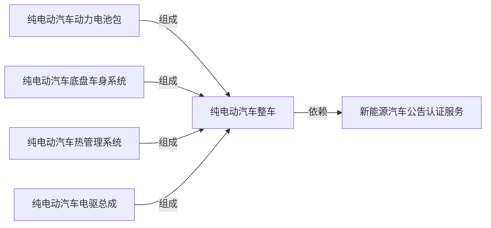

#### 受影响节点

| Node ID | 受影响节点 | 本次影响 | 结果 | 结论性质 | 传导逻辑（为什么到这里） | 直接证据（Event ID） | 时间窗口 | 置信度 |
|---|---|---|---|---|---|---|---|---|
| `0e9bc54c-f89…` | 纯电动汽车整车 | 交付周期 UP/HIGH；扩产强度 UP/HIGH；渗透率 UP/MEDIUM；订单可见度 UP/HIGH | 升温 | 直接证据 | 小鹏GX上市12小时内获24863份订单，Ultra版交付等待时间达35周，小鹏因此增加模具和产线；小鹏为应对GX订单激增，增加关键零部件模具和产线。对“纯电动汽车整车”环节而言，这意味着交付周期上升、扩产强度上升、渗透率上升、订单可见度上升，因此本期判断为升温。 | EVT2b8388a3, EVT8e5d52ba | 中期–短期 | 中–高 |
| `50922f37-966…` | 新能源汽车公告认证服务 | 真实同链拓扑相邻，尚无直接 Signal | 待验证 | — | “新能源汽车公告认证服务”与本链中的直接受影响节点存在真实产业链关系，但在本次证据范围内，没有订单、价格、产能、技术进展或经营数据直接指向该环节，也没有足够依据确认影响已经传导至此，因此暂不判断升降方向。 | — | 后续周期 | 低 |
| `8c11adf0-00a…` | 纯电动汽车动力电池包 | 真实同链拓扑相邻，尚无直接 Signal | 待验证 | — | “纯电动汽车动力电池包”与本链中的直接受影响节点存在真实产业链关系，但在本次证据范围内，没有订单、价格、产能、技术进展或经营数据直接指向该环节，也没有足够依据确认影响已经传导至此，因此暂不判断升降方向。 | — | 后续周期 | 低 |
| `0a94a6fe-97d…` | 纯电动汽车底盘车身系统 | 真实同链拓扑相邻，尚无直接 Signal | 待验证 | — | “纯电动汽车底盘车身系统”与本链中的直接受影响节点存在真实产业链关系，但在本次证据范围内，没有订单、价格、产能、技术进展或经营数据直接指向该环节，也没有足够依据确认影响已经传导至此，因此暂不判断升降方向。 | — | 后续周期 | 低 |
| `f979b6fa-f2c…` | 纯电动汽车热管理系统 | 真实同链拓扑相邻，尚无直接 Signal | 待验证 | — | “纯电动汽车热管理系统”与本链中的直接受影响节点存在真实产业链关系，但在本次证据范围内，没有订单、价格、产能、技术进展或经营数据直接指向该环节，也没有足够依据确认影响已经传导至此，因此暂不判断升降方向。 | — | 后续周期 | 低 |
| `f320a7ca-8dc…` | 纯电动汽车电驱总成 | 真实同链拓扑相邻，尚无直接 Signal | 待验证 | — | “纯电动汽车电驱总成”与本链中的直接受影响节点存在真实产业链关系，但在本次证据范围内，没有订单、价格、产能、技术进展或经营数据直接指向该环节，也没有足够依据确认影响已经传导至此，因此暂不判断升降方向。 | — | 后续周期 | 低 |

- **直接 Evidence**：EVT2b8388a3, EVT8e5d52ba。
- **反证与 Gap**：同链相邻节点缺少直接 Variable Signal 与经营观测。
- **停止条件**：若后续 Event 使节点 Signal 失效、方向反转，或链语境确认不属于本链，则关闭或修正本链结论。

### 3.18 CHN-18 普通钢材产业链

**一句话结论（C-CHN-18）**：钢铁长材出现直接 Signal，当前链级聚合结果为升温，向相邻节点的传播尚待验证。

- **链状态**：节点 Signal 明确，链内传播待验证
- **链结果**：升温
- **时间窗口 / 置信度**：短期–长期 / 中–高
- **路径**：`钢铁长材`（直接 Signal 节点）→ 真实同链拓扑节点

#### 链路图


#### 受影响节点

| Node ID | 受影响节点 | 本次影响 | 结果 | 结论性质 | 传导逻辑（为什么到这里） | 直接证据（Event ID） | 时间窗口 | 置信度 |
|---|---|---|---|---|---|---|---|---|
| `4796e0fe-b56…` | 钢铁长材 | 定价权 UP/MEDIUM；成本传导能力 UP/MEDIUM；进口依赖度 UP/MEDIUM；销售价格 UP/MEDIUM | 升温 | 直接证据 | 中国钢坯出口商将钢坯出口报价上调至465-470美元/吨FOB；欧盟调整钢铁配额及CBAM政策，增加钢铁出口至欧盟的成本，影响相关钢铁产业链节点的进口依赖度和供应格局。对“钢铁长材”环节而言，这意味着定价权上升、成本传导能力上升、进口依赖度上升、销售价格上升，因此本期判断为升温。 | EVTd6821525, EVTd2af646a | 短期–长期 | 中–高 |
| `334fe51e-677…` | 普钢长材轧制工序 | 真实同链拓扑相邻，尚无直接 Signal | 待验证 | — | “普钢长材轧制工序”与本链中的直接受影响节点存在真实产业链关系，但在本次证据范围内，没有订单、价格、产能、技术进展或经营数据直接指向该环节，也没有足够依据确认影响已经传导至此，因此暂不判断升降方向。 | — | 后续周期 | 低 |

- **直接 Evidence**：EVTd6821525, EVTd2af646a。
- **反证与 Gap**：同链相邻节点缺少直接 Variable Signal 与经营观测。
- **停止条件**：若后续 Event 使节点 Signal 失效、方向反转，或链语境确认不属于本链，则关闭或修正本链结论。

### 3.19 CHN-19 汽车一体化压铸产业链

**一句话结论（C-CHN-19）**：新能源车整车出现直接 Signal，节点方向为升温；但至少一个节点同时归属多条产业链，本链是否承接全部影响仍需链语境验证。

- **链状态**：节点 Signal 明确，链语境待解析
- **链结果**：升温
- **时间窗口 / 置信度**：长期–中期 / 低–中
- **路径**：`新能源车整车`（直接 Signal 节点）→ 真实同链拓扑节点

#### 链路图


#### 受影响节点

| Node ID | 受影响节点 | 本次影响 | 结果 | 结论性质 | 传导逻辑（为什么到这里） | 直接证据（Event ID） | 时间窗口 | 置信度 |
|---|---|---|---|---|---|---|---|---|
| `0ae9b007-d57…` | 新能源车整车 | 商业化进度 UP/MEDIUM；市场需求 UP/MEDIUM；性价比 UP/MEDIUM；技术成熟度 UP/MEDIUM | 升温 | 直接证据 | 中国国家市场监管总局宣布分阶段实施GB1589-2026标准，新车型需于2027年7月1日起符合，现有车型需于2028年1月1日起符合，并给予车企技术升级和过渡时间；吉利汽车发布混动SUV车型Monjaro EM-i，开启首款混动D级SUV全球推广，直接增加新能源车（混动SUV）的供给与可得性；该节点归属 5 条链，本链语境未确定。对“新能源车整车”环节而言，这意味着商业化进度上升、市场需求上升、性价比上升、技术成熟度上升，因此本期判断为升温。 | EVT9c85c6ff, EVTab835f8e, EVTa4d92743 | 长期–中期 | 低–中 |
| `22736f71-0f0…` | 一体化压铸车身结构件 | 真实同链拓扑相邻，尚无直接 Signal | 待验证 | — | “一体化压铸车身结构件”与本链中的直接受影响节点存在真实产业链关系，但在本次证据范围内，没有订单、价格、产能、技术进展或经营数据直接指向该环节，也没有足够依据确认影响已经传导至此，因此暂不判断升降方向。 | — | 后续周期 | 低 |

- **直接 Evidence**：EVT9c85c6ff, EVTab835f8e, EVTa4d92743。
- **反证与 Gap**：共享节点的具体链语境尚未解析；同链相邻节点缺少直接 Variable Signal 与经营观测。
- **停止条件**：若后续 Event 使节点 Signal 失效、方向反转，或链语境确认不属于本链，则关闭或修正本链结论。

### 3.20 CHN-20 汽车热管理系统产业链

**一句话结论（C-CHN-20）**：新能源车整车出现直接 Signal，节点方向为升温；但至少一个节点同时归属多条产业链，本链是否承接全部影响仍需链语境验证。

- **链状态**：节点 Signal 明确，链语境待解析
- **链结果**：升温
- **时间窗口 / 置信度**：长期–中期 / 低–中
- **路径**：`新能源车整车`（直接 Signal 节点）→ 真实同链拓扑节点

#### 链路图


#### 受影响节点

| Node ID | 受影响节点 | 本次影响 | 结果 | 结论性质 | 传导逻辑（为什么到这里） | 直接证据（Event ID） | 时间窗口 | 置信度 |
|---|---|---|---|---|---|---|---|---|
| `0ae9b007-d57…` | 新能源车整车 | 商业化进度 UP/MEDIUM；市场需求 UP/MEDIUM；性价比 UP/MEDIUM；技术成熟度 UP/MEDIUM | 升温 | 直接证据 | 中国国家市场监管总局宣布分阶段实施GB1589-2026标准，新车型需于2027年7月1日起符合，现有车型需于2028年1月1日起符合，并给予车企技术升级和过渡时间；吉利汽车发布混动SUV车型Monjaro EM-i，开启首款混动D级SUV全球推广，直接增加新能源车（混动SUV）的供给与可得性；该节点归属 5 条链，本链语境未确定。对“新能源车整车”环节而言，这意味着商业化进度上升、市场需求上升、性价比上升、技术成熟度上升，因此本期判断为升温。 | EVT9c85c6ff, EVTab835f8e, EVTa4d92743 | 长期–中期 | 低–中 |
| `c8e314e9-379…` | 汽车热管理系统 | 真实同链拓扑相邻，尚无直接 Signal | 待验证 | — | “汽车热管理系统”与本链中的直接受影响节点存在真实产业链关系，但在本次证据范围内，没有订单、价格、产能、技术进展或经营数据直接指向该环节，也没有足够依据确认影响已经传导至此，因此暂不判断升降方向。 | — | 后续周期 | 低 |

- **直接 Evidence**：EVT9c85c6ff, EVTab835f8e, EVTa4d92743。
- **反证与 Gap**：共享节点的具体链语境尚未解析；同链相邻节点缺少直接 Variable Signal 与经营观测。
- **停止条件**：若后续 Event 使节点 Signal 失效、方向反转，或链语境确认不属于本链，则关闭或修正本链结论。

### 3.21 CHN-21 油品石化贸易服务产业链

**一句话结论（C-CHN-21）**：油品运输服务出现直接 Signal，当前链级聚合结果为分化，向相邻节点的传播尚待验证。

- **链状态**：节点 Signal 明确，链内传播待验证
- **链结果**：分化
- **时间窗口 / 置信度**：中期 / 中–高
- **路径**：`油品运输服务`（直接 Signal 节点）→ 真实同链拓扑节点

#### 链路图

```mermaid
flowchart LR
  N1666411[成品油批发交付服务] -->|依赖| N3658067[油品运输服务]
```

#### 受影响节点

| Node ID | 受影响节点 | 本次影响 | 结果 | 结论性质 | 传导逻辑（为什么到这里） | 直接证据（Event ID） | 时间窗口 | 置信度 |
|---|---|---|---|---|---|---|---|---|
| `e7aa9244-2e3…` | 油品运输服务 | 交付周期 UP/HIGH；利润率 UP/HIGH；战略资源安全 DOWN/MEDIUM；销售价格 UP/HIGH | 分化 | 直接证据 | 美伊冲突扰乱霍尔木兹海峡，导致油品运输服务的交付周期延长；美伊冲突扰乱霍尔木兹海峡，油运高景气延续，TD3C-TCE超60万美元/天。对“油品运输服务”环节而言，这意味着交付周期上升、利润率上升、战略资源安全下降、销售价格上升，因此本期判断为分化。 | EVTa8b7eff4, EVT3cf927a6 | 中期 | 中–高 |
| `db3e28c5-9ec…` | 成品油批发交付服务 | 真实同链拓扑相邻，尚无直接 Signal | 待验证 | — | “成品油批发交付服务”与本链中的直接受影响节点存在真实产业链关系，但在本次证据范围内，没有订单、价格、产能、技术进展或经营数据直接指向该环节，也没有足够依据确认影响已经传导至此，因此暂不判断升降方向。 | — | 后续周期 | 低 |

- **直接 Evidence**：EVTa8b7eff4, EVT3cf927a6。
- **反证与 Gap**：同链相邻节点缺少直接 Variable Signal 与经营观测。
- **停止条件**：若后续 Event 使节点 Signal 失效、方向反转，或链语境确认不属于本链，则关闭或修正本链结论。

### 3.22 CHN-22 火力发电设备产业链

**一句话结论（C-CHN-22）**：汽轮机出现直接 Signal，当前链级聚合结果为分化，向相邻节点的传播尚待验证。

- **链状态**：节点 Signal 明确，链内传播待验证
- **链结果**：分化
- **时间窗口 / 置信度**：长期–中期 / 中–高
- **路径**：`汽轮机`（直接 Signal 节点）→ 真实同链拓扑节点

#### 链路图

```mermaid
flowchart LR
  N7682904[汽轮机] -->|组成| N3486959[火电设备]
```

#### 受影响节点

| Node ID | 受影响节点 | 本次影响 | 结果 | 结论性质 | 传导逻辑（为什么到这里） | 直接证据（Event ID） | 时间窗口 | 置信度 |
|---|---|---|---|---|---|---|---|---|
| `09286af8-91f…` | 汽轮机 | 产能释放周期 UP/MEDIUM；市场需求 UP/HIGH；库存水平 DOWN/MEDIUM；扩产强度 UP/MEDIUM | 分化 | 直接证据 | 美国燃气轮机需求创新高，促使制造商扩大产能；美国对燃气轮机的需求创历史新高，主要由数据中心电力需求驱动。对“汽轮机”环节而言，这意味着产能释放周期上升、市场需求上升、库存水平下降、扩产强度上升，因此本期判断为分化。 | EVT7cfe2fe7 | 长期–中期 | 中–高 |
| `f33d7edb-720…` | 火电设备 | 真实同链拓扑相邻，尚无直接 Signal | 待验证 | — | “火电设备”与本链中的直接受影响节点存在真实产业链关系，但在本次证据范围内，没有订单、价格、产能、技术进展或经营数据直接指向该环节，也没有足够依据确认影响已经传导至此，因此暂不判断升降方向。 | — | 后续周期 | 低 |

- **直接 Evidence**：EVT7cfe2fe7。
- **反证与 Gap**：同链相邻节点缺少直接 Variable Signal 与经营观测。
- **停止条件**：若后续 Event 使节点 Signal 失效、方向反转，或链语境确认不属于本链，则关闭或修正本链结论。

### 3.23 CHN-23 磷酸铁锂刀片电池产业链

**一句话结论（C-CHN-23）**：新能源车整车出现直接 Signal，节点方向为升温；但至少一个节点同时归属多条产业链，本链是否承接全部影响仍需链语境验证。

- **链状态**：节点 Signal 明确，链语境待解析
- **链结果**：升温
- **时间窗口 / 置信度**：长期–中期 / 低–中
- **路径**：`新能源车整车`（直接 Signal 节点）→ 真实同链拓扑节点

#### 链路图

```mermaid
flowchart LR
  N6300877[刀片电池] -->|组成| N5752338[新能源车整车]
```

#### 受影响节点

| Node ID | 受影响节点 | 本次影响 | 结果 | 结论性质 | 传导逻辑（为什么到这里） | 直接证据（Event ID） | 时间窗口 | 置信度 |
|---|---|---|---|---|---|---|---|---|
| `0ae9b007-d57…` | 新能源车整车 | 商业化进度 UP/MEDIUM；市场需求 UP/MEDIUM；性价比 UP/MEDIUM；技术成熟度 UP/MEDIUM | 升温 | 直接证据 | 中国国家市场监管总局宣布分阶段实施GB1589-2026标准，新车型需于2027年7月1日起符合，现有车型需于2028年1月1日起符合，并给予车企技术升级和过渡时间；吉利汽车发布混动SUV车型Monjaro EM-i，开启首款混动D级SUV全球推广，直接增加新能源车（混动SUV）的供给与可得性；该节点归属 5 条链，本链语境未确定。对“新能源车整车”环节而言，这意味着商业化进度上升、市场需求上升、性价比上升、技术成熟度上升，因此本期判断为升温。 | EVT9c85c6ff, EVTab835f8e, EVTa4d92743 | 长期–中期 | 低–中 |
| `7a4ace6b-529…` | 刀片电池 | 真实同链拓扑相邻，尚无直接 Signal | 待验证 | — | “刀片电池”与本链中的直接受影响节点存在真实产业链关系，但在本次证据范围内，没有订单、价格、产能、技术进展或经营数据直接指向该环节，也没有足够依据确认影响已经传导至此，因此暂不判断升降方向。 | — | 后续周期 | 低 |

- **直接 Evidence**：EVT9c85c6ff, EVTab835f8e, EVTa4d92743。
- **反证与 Gap**：共享节点的具体链语境尚未解析；同链相邻节点缺少直接 Variable Signal 与经营观测。
- **停止条件**：若后续 Event 使节点 Signal 失效、方向反转，或链语境确认不属于本链，则关闭或修正本链结论。

### 3.24 CHN-24 车规级功率模块产业链

**一句话结论（C-CHN-24）**：新能源车整车出现直接 Signal，节点方向为升温；但至少一个节点同时归属多条产业链，本链是否承接全部影响仍需链语境验证。

- **链状态**：节点 Signal 明确，链语境待解析
- **链结果**：升温
- **时间窗口 / 置信度**：长期–中期 / 低–中
- **路径**：`新能源车整车`（直接 Signal 节点）→ 真实同链拓扑节点

#### 链路图

```mermaid
flowchart LR
  N5590140[新能源汽车主驱逆变器] -->|组成| N5752338[新能源车整车]
```

#### 受影响节点

| Node ID | 受影响节点 | 本次影响 | 结果 | 结论性质 | 传导逻辑（为什么到这里） | 直接证据（Event ID） | 时间窗口 | 置信度 |
|---|---|---|---|---|---|---|---|---|
| `0ae9b007-d57…` | 新能源车整车 | 商业化进度 UP/MEDIUM；市场需求 UP/MEDIUM；性价比 UP/MEDIUM；技术成熟度 UP/MEDIUM | 升温 | 直接证据 | 中国国家市场监管总局宣布分阶段实施GB1589-2026标准，新车型需于2027年7月1日起符合，现有车型需于2028年1月1日起符合，并给予车企技术升级和过渡时间；吉利汽车发布混动SUV车型Monjaro EM-i，开启首款混动D级SUV全球推广，直接增加新能源车（混动SUV）的供给与可得性；该节点归属 5 条链，本链语境未确定。对“新能源车整车”环节而言，这意味着商业化进度上升、市场需求上升、性价比上升、技术成熟度上升，因此本期判断为升温。 | EVT9c85c6ff, EVTab835f8e, EVTa4d92743 | 长期–中期 | 低–中 |
| `41754bb5-628…` | 新能源汽车主驱逆变器 | 真实同链拓扑相邻，尚无直接 Signal | 待验证 | — | “新能源汽车主驱逆变器”与本链中的直接受影响节点存在真实产业链关系，但在本次证据范围内，没有订单、价格、产能、技术进展或经营数据直接指向该环节，也没有足够依据确认影响已经传导至此，因此暂不判断升降方向。 | — | 后续周期 | 低 |

- **直接 Evidence**：EVT9c85c6ff, EVTab835f8e, EVTa4d92743。
- **反证与 Gap**：共享节点的具体链语境尚未解析；同链相邻节点缺少直接 Variable Signal 与经营观测。
- **停止条件**：若后续 Event 使节点 Signal 失效、方向反转，或链语境确认不属于本链，则关闭或修正本链结论。

### 3.25 CHN-25 AI个人电脑产业链

**一句话结论（C-CHN-25）**：AI芯片出现直接 Signal，节点方向为升温；但至少一个节点同时归属多条产业链，本链是否承接全部影响仍需链语境验证。

- **链状态**：节点 Signal 明确，链语境待解析
- **链结果**：升温
- **时间窗口 / 置信度**：长期–中期 / 低–中
- **路径**：`AI芯片`（直接 Signal 节点）→ 真实同链拓扑节点

#### 链路图

```mermaid
flowchart LR
  N6153322[AI芯片] -->|组成| N1101772[AI PC]
```

#### 受影响节点

| Node ID | 受影响节点 | 本次影响 | 结果 | 结论性质 | 传导逻辑（为什么到这里） | 直接证据（Event ID） | 时间窗口 | 置信度 |
|---|---|---|---|---|---|---|---|---|
| `7a5bf267-99c…` | AI芯片 | 商业化进度 UP/MEDIUM；技术成熟度 UP/MEDIUM | 升温 | 直接证据 | Google与Marvell扩大定制芯片合作，涉及TPU等AI芯片领域；OpenAI在Hot Chips 2026披露自研AI加速器ASIC Jalapeño的基准测试结果，该芯片为通用AI负载从零设计，非GPU改造；该节点归属 7 条链，本链语境未确定。对“AI芯片”环节而言，这意味着商业化进度上升、技术成熟度上升，因此本期判断为升温。 | EVT40bb2d15, EVT3387e8c0 | 长期–中期 | 低–中 |
| `a05bef65-ebd…` | AI PC | 真实同链拓扑相邻，尚无直接 Signal | 待验证 | — | “AI PC”与本链中的直接受影响节点存在真实产业链关系，但在本次证据范围内，没有订单、价格、产能、技术进展或经营数据直接指向该环节，也没有足够依据确认影响已经传导至此，因此暂不判断升降方向。 | — | 后续周期 | 低 |

- **直接 Evidence**：EVT40bb2d15, EVT3387e8c0。
- **反证与 Gap**：共享节点的具体链语境尚未解析；同链相邻节点缺少直接 Variable Signal 与经营观测。
- **停止条件**：若后续 Event 使节点 Signal 失效、方向反转，或链语境确认不属于本链，则关闭或修正本链结论。

### 3.26 CHN-26 AI智能眼镜产业链

**一句话结论（C-CHN-26）**：AI芯片出现直接 Signal，节点方向为升温；但至少一个节点同时归属多条产业链，本链是否承接全部影响仍需链语境验证。

- **链状态**：节点 Signal 明确，链语境待解析
- **链结果**：升温
- **时间窗口 / 置信度**：长期–中期 / 低–中
- **路径**：`AI芯片`（直接 Signal 节点）→ 真实同链拓扑节点

#### 链路图

```mermaid
flowchart LR
  N6153322[AI芯片] -->|组成| N6456044[AI眼镜]
```

#### 受影响节点

| Node ID | 受影响节点 | 本次影响 | 结果 | 结论性质 | 传导逻辑（为什么到这里） | 直接证据（Event ID） | 时间窗口 | 置信度 |
|---|---|---|---|---|---|---|---|---|
| `7a5bf267-99c…` | AI芯片 | 商业化进度 UP/MEDIUM；技术成熟度 UP/MEDIUM | 升温 | 直接证据 | Google与Marvell扩大定制芯片合作，涉及TPU等AI芯片领域；OpenAI在Hot Chips 2026披露自研AI加速器ASIC Jalapeño的基准测试结果，该芯片为通用AI负载从零设计，非GPU改造；该节点归属 7 条链，本链语境未确定。对“AI芯片”环节而言，这意味着商业化进度上升、技术成熟度上升，因此本期判断为升温。 | EVT40bb2d15, EVT3387e8c0 | 长期–中期 | 低–中 |
| `fdcb92de-d9e…` | AI眼镜 | 真实同链拓扑相邻，尚无直接 Signal | 待验证 | — | “AI眼镜”与本链中的直接受影响节点存在真实产业链关系，但在本次证据范围内，没有订单、价格、产能、技术进展或经营数据直接指向该环节，也没有足够依据确认影响已经传导至此，因此暂不判断升降方向。 | — | 后续周期 | 低 |

- **直接 Evidence**：EVT40bb2d15, EVT3387e8c0。
- **反证与 Gap**：共享节点的具体链语境尚未解析；同链相邻节点缺少直接 Variable Signal 与经营观测。
- **停止条件**：若后续 Event 使节点 Signal 失效、方向反转，或链语境确认不属于本链，则关闭或修正本链结论。

### 3.27 CHN-27 AI算力租赁服务产业链

**一句话结论（C-CHN-27）**：AI芯片出现直接 Signal，节点方向为升温；但至少一个节点同时归属多条产业链，本链是否承接全部影响仍需链语境验证。

- **链状态**：节点 Signal 明确，链语境待解析
- **链结果**：升温
- **时间窗口 / 置信度**：长期–中期 / 低–中
- **路径**：`AI芯片`（直接 Signal 节点）→ 真实同链拓扑节点

#### 链路图

```mermaid
flowchart LR
  N6153322[AI芯片] -->|组成| N6715156[AI服务器]
```

#### 受影响节点

| Node ID | 受影响节点 | 本次影响 | 结果 | 结论性质 | 传导逻辑（为什么到这里） | 直接证据（Event ID） | 时间窗口 | 置信度 |
|---|---|---|---|---|---|---|---|---|
| `7a5bf267-99c…` | AI芯片 | 商业化进度 UP/MEDIUM；技术成熟度 UP/MEDIUM | 升温 | 直接证据 | Google与Marvell扩大定制芯片合作，涉及TPU等AI芯片领域；OpenAI在Hot Chips 2026披露自研AI加速器ASIC Jalapeño的基准测试结果，该芯片为通用AI负载从零设计，非GPU改造；该节点归属 7 条链，本链语境未确定。对“AI芯片”环节而言，这意味着商业化进度上升、技术成熟度上升，因此本期判断为升温。 | EVT40bb2d15, EVT3387e8c0 | 长期–中期 | 低–中 |
| `528043a8-501…` | AI服务器 | 真实同链拓扑相邻，尚无直接 Signal | 待验证 | — | “AI服务器”与本链中的直接受影响节点存在真实产业链关系，但在本次证据范围内，没有订单、价格、产能、技术进展或经营数据直接指向该环节，也没有足够依据确认影响已经传导至此，因此暂不判断升降方向。 | — | 后续周期 | 低 |

- **直接 Evidence**：EVT40bb2d15, EVT3387e8c0。
- **反证与 Gap**：共享节点的具体链语境尚未解析；同链相邻节点缺少直接 Variable Signal 与经营观测。
- **停止条件**：若后续 Event 使节点 Signal 失效、方向反转，或链语境确认不属于本链，则关闭或修正本链结论。

### 3.28 CHN-28 CAR-T细胞治疗产业链

**一句话结论（C-CHN-28）**：医院医疗服务出现直接 Signal，节点方向为升温；但至少一个节点同时归属多条产业链，本链是否承接全部影响仍需链语境验证。

- **链状态**：节点 Signal 明确，链语境待解析
- **链结果**：升温
- **时间窗口 / 置信度**：长期 / 低–中
- **路径**：`医院医疗服务`（直接 Signal 节点）→ 真实同链拓扑节点

#### 链路图

```mermaid
flowchart LR
  N2627659[CAR-T细胞疗法] -->|投入| N4967137[医院医疗服务]
```

#### 受影响节点

| Node ID | 受影响节点 | 本次影响 | 结果 | 结论性质 | 传导逻辑（为什么到这里） | 直接证据（Event ID） | 时间窗口 | 置信度 |
|---|---|---|---|---|---|---|---|---|
| `ff3b783c-493…` | 医院医疗服务 | 商业化进度 UP/MEDIUM；市场需求 UP/MEDIUM | 升温 | 直接证据 | 华为与瑞金医院发布瑞智病理大模型RuiPath 2.0并落地90+医院；该节点归属 6 条链，本链语境未确定。对“医院医疗服务”环节而言，这意味着商业化进度上升、市场需求上升，因此本期判断为升温。 | EVTff5eaf10 | 长期 | 低–中 |
| `24b58868-9ce…` | CAR-T细胞疗法 | 真实同链拓扑相邻，尚无直接 Signal | 待验证 | — | “CAR-T细胞疗法”与本链中的直接受影响节点存在真实产业链关系，但在本次证据范围内，没有订单、价格、产能、技术进展或经营数据直接指向该环节，也没有足够依据确认影响已经传导至此，因此暂不判断升降方向。 | — | 后续周期 | 低 |

- **直接 Evidence**：EVTff5eaf10。
- **反证与 Gap**：共享节点的具体链语境尚未解析；同链相邻节点缺少直接 Variable Signal 与经营观测。
- **停止条件**：若后续 Event 使节点 Signal 失效、方向反转，或链语境确认不属于本链，则关闭或修正本链结论。

### 3.29 CHN-29 化学药制剂产业链

**一句话结论（C-CHN-29）**：医院医疗服务出现直接 Signal，节点方向为升温；但至少一个节点同时归属多条产业链，本链是否承接全部影响仍需链语境验证。

- **链状态**：节点 Signal 明确，链语境待解析
- **链结果**：升温
- **时间窗口 / 置信度**：长期 / 低–中
- **路径**：`医院医疗服务`（直接 Signal 节点）→ 真实同链拓扑节点

#### 链路图

```mermaid
flowchart LR
  N4319566[医药流通服务] -->|投入| N4967137[医院医疗服务]
```

#### 受影响节点

| Node ID | 受影响节点 | 本次影响 | 结果 | 结论性质 | 传导逻辑（为什么到这里） | 直接证据（Event ID） | 时间窗口 | 置信度 |
|---|---|---|---|---|---|---|---|---|
| `ff3b783c-493…` | 医院医疗服务 | 商业化进度 UP/MEDIUM；市场需求 UP/MEDIUM | 升温 | 直接证据 | 华为与瑞金医院发布瑞智病理大模型RuiPath 2.0并落地90+医院；该节点归属 6 条链，本链语境未确定。对“医院医疗服务”环节而言，这意味着商业化进度上升、市场需求上升，因此本期判断为升温。 | EVTff5eaf10 | 长期 | 低–中 |
| `c1f40a04-f42…` | 医药流通服务 | 真实同链拓扑相邻，尚无直接 Signal | 待验证 | — | “医药流通服务”与本链中的直接受影响节点存在真实产业链关系，但在本次证据范围内，没有订单、价格、产能、技术进展或经营数据直接指向该环节，也没有足够依据确认影响已经传导至此，因此暂不判断升降方向。 | — | 后续周期 | 低 |

- **直接 Evidence**：EVTff5eaf10。
- **反证与 Gap**：共享节点的具体链语境尚未解析；同链相邻节点缺少直接 Variable Signal 与经营观测。
- **停止条件**：若后续 Event 使节点 Signal 失效、方向反转，或链语境确认不属于本链，则关闭或修正本链结论。

### 3.30 CHN-30 医用芬太尼药品产业链

**一句话结论（C-CHN-30）**：医院医疗服务出现直接 Signal，节点方向为升温；但至少一个节点同时归属多条产业链，本链是否承接全部影响仍需链语境验证。

- **链状态**：节点 Signal 明确，链语境待解析
- **链结果**：升温
- **时间窗口 / 置信度**：长期 / 低–中
- **路径**：`医院医疗服务`（直接 Signal 节点）→ 真实同链拓扑节点

#### 链路图

```mermaid
flowchart LR
  N4319566[医药流通服务] -->|投入| N4967137[医院医疗服务]
```

#### 受影响节点

| Node ID | 受影响节点 | 本次影响 | 结果 | 结论性质 | 传导逻辑（为什么到这里） | 直接证据（Event ID） | 时间窗口 | 置信度 |
|---|---|---|---|---|---|---|---|---|
| `ff3b783c-493…` | 医院医疗服务 | 商业化进度 UP/MEDIUM；市场需求 UP/MEDIUM | 升温 | 直接证据 | 华为与瑞金医院发布瑞智病理大模型RuiPath 2.0并落地90+医院；该节点归属 6 条链，本链语境未确定。对“医院医疗服务”环节而言，这意味着商业化进度上升、市场需求上升，因此本期判断为升温。 | EVTff5eaf10 | 长期 | 低–中 |
| `c1f40a04-f42…` | 医药流通服务 | 真实同链拓扑相邻，尚无直接 Signal | 待验证 | — | “医药流通服务”与本链中的直接受影响节点存在真实产业链关系，但在本次证据范围内，没有订单、价格、产能、技术进展或经营数据直接指向该环节，也没有足够依据确认影响已经传导至此，因此暂不判断升降方向。 | — | 后续周期 | 低 |

- **直接 Evidence**：EVTff5eaf10。
- **反证与 Gap**：共享节点的具体链语境尚未解析；同链相邻节点缺少直接 Variable Signal 与经营观测。
- **停止条件**：若后续 Event 使节点 Signal 失效、方向反转，或链语境确认不属于本链，则关闭或修正本链结论。

### 3.31 CHN-31 医疗信息化系统产业链

**一句话结论（C-CHN-31）**：医院医疗服务出现直接 Signal，节点方向为升温；但至少一个节点同时归属多条产业链，本链是否承接全部影响仍需链语境验证。

- **链状态**：节点 Signal 明确，链语境待解析
- **链结果**：升温
- **时间窗口 / 置信度**：长期 / 低–中
- **路径**：`医院医疗服务`（直接 Signal 节点）→ 真实同链拓扑节点

#### 链路图

```mermaid
flowchart LR
  N4967137[医院医疗服务] -->|依赖| N3499566[医院信息系统]
```

#### 受影响节点

| Node ID | 受影响节点 | 本次影响 | 结果 | 结论性质 | 传导逻辑（为什么到这里） | 直接证据（Event ID） | 时间窗口 | 置信度 |
|---|---|---|---|---|---|---|---|---|
| `ff3b783c-493…` | 医院医疗服务 | 商业化进度 UP/MEDIUM；市场需求 UP/MEDIUM | 升温 | 直接证据 | 华为与瑞金医院发布瑞智病理大模型RuiPath 2.0并落地90+医院；该节点归属 6 条链，本链语境未确定。对“医院医疗服务”环节而言，这意味着商业化进度上升、市场需求上升，因此本期判断为升温。 | EVTff5eaf10 | 长期 | 低–中 |
| `b90781d9-273…` | 医院信息系统 | 真实同链拓扑相邻，尚无直接 Signal | 待验证 | — | “医院信息系统”与本链中的直接受影响节点存在真实产业链关系，但在本次证据范围内，没有订单、价格、产能、技术进展或经营数据直接指向该环节，也没有足够依据确认影响已经传导至此，因此暂不判断升降方向。 | — | 后续周期 | 低 |

- **直接 Evidence**：EVTff5eaf10。
- **反证与 Gap**：共享节点的具体链语境尚未解析；同链相邻节点缺少直接 Variable Signal 与经营观测。
- **停止条件**：若后续 Event 使节点 Signal 失效、方向反转，或链语境确认不属于本链，则关闭或修正本链结论。

### 3.32 CHN-32 医疗设备产业链

**一句话结论（C-CHN-32）**：医院医疗服务出现直接 Signal，节点方向为升温；但至少一个节点同时归属多条产业链，本链是否承接全部影响仍需链语境验证。

- **链状态**：节点 Signal 明确，链语境待解析
- **链结果**：升温
- **时间窗口 / 置信度**：长期 / 低–中
- **路径**：`医院医疗服务`（直接 Signal 节点）→ 真实同链拓扑节点

#### 链路图

```mermaid
flowchart LR
  N728716[多参数患者监护仪] -->|投入| N4967137[医院医疗服务]
```

#### 受影响节点

| Node ID | 受影响节点 | 本次影响 | 结果 | 结论性质 | 传导逻辑（为什么到这里） | 直接证据（Event ID） | 时间窗口 | 置信度 |
|---|---|---|---|---|---|---|---|---|
| `ff3b783c-493…` | 医院医疗服务 | 商业化进度 UP/MEDIUM；市场需求 UP/MEDIUM | 升温 | 直接证据 | 华为与瑞金医院发布瑞智病理大模型RuiPath 2.0并落地90+医院；该节点归属 6 条链，本链语境未确定。对“医院医疗服务”环节而言，这意味着商业化进度上升、市场需求上升，因此本期判断为升温。 | EVTff5eaf10 | 长期 | 低–中 |
| `34addba7-bc7…` | 多参数患者监护仪 | 真实同链拓扑相邻，尚无直接 Signal | 待验证 | — | “多参数患者监护仪”与本链中的直接受影响节点存在真实产业链关系，但在本次证据范围内，没有订单、价格、产能、技术进展或经营数据直接指向该环节，也没有足够依据确认影响已经传导至此，因此暂不判断升降方向。 | — | 后续周期 | 低 |

- **直接 Evidence**：EVTff5eaf10。
- **反证与 Gap**：共享节点的具体链语境尚未解析；同链相邻节点缺少直接 Variable Signal 与经营观测。
- **停止条件**：若后续 Event 使节点 Signal 失效、方向反转，或链语境确认不属于本链，则关闭或修正本链结论。

### 3.33 CHN-33 医院医疗服务产业链

**一句话结论（C-CHN-33）**：医院医疗服务出现直接 Signal，节点方向为升温；但至少一个节点同时归属多条产业链，本链是否承接全部影响仍需链语境验证。

- **链状态**：节点 Signal 明确，链语境待解析
- **链结果**：升温
- **时间窗口 / 置信度**：长期 / 低–中
- **路径**：`医院医疗服务`（直接 Signal 节点）→ 真实同链拓扑节点

#### 链路图

```mermaid
flowchart LR
  N154721[医护专业服务] -->|投入| N4967137[医院医疗服务]
  N4967137[医院医疗服务] -->|依赖| N9053535[医院诊疗设施]
  N7317753[医院药械供应服务] -->|投入| N4967137[医院医疗服务]
```

#### 受影响节点

| Node ID | 受影响节点 | 本次影响 | 结果 | 结论性质 | 传导逻辑（为什么到这里） | 直接证据（Event ID） | 时间窗口 | 置信度 |
|---|---|---|---|---|---|---|---|---|
| `ff3b783c-493…` | 医院医疗服务 | 商业化进度 UP/MEDIUM；市场需求 UP/MEDIUM | 升温 | 直接证据 | 华为与瑞金医院发布瑞智病理大模型RuiPath 2.0并落地90+医院；该节点归属 6 条链，本链语境未确定。对“医院医疗服务”环节而言，这意味着商业化进度上升、市场需求上升，因此本期判断为升温。 | EVTff5eaf10 | 长期 | 低–中 |
| `b21781e2-026…` | 医护专业服务 | 真实同链拓扑相邻，尚无直接 Signal | 待验证 | — | “医护专业服务”与本链中的直接受影响节点存在真实产业链关系，但在本次证据范围内，没有订单、价格、产能、技术进展或经营数据直接指向该环节，也没有足够依据确认影响已经传导至此，因此暂不判断升降方向。 | — | 后续周期 | 低 |
| `f3c95eb5-4d5…` | 医院药械供应服务 | 真实同链拓扑相邻，尚无直接 Signal | 待验证 | — | “医院药械供应服务”与本链中的直接受影响节点存在真实产业链关系，但在本次证据范围内，没有订单、价格、产能、技术进展或经营数据直接指向该环节，也没有足够依据确认影响已经传导至此，因此暂不判断升降方向。 | — | 后续周期 | 低 |
| `88c3b45b-fd2…` | 医院诊疗设施 | 真实同链拓扑相邻，尚无直接 Signal | 待验证 | — | “医院诊疗设施”与本链中的直接受影响节点存在真实产业链关系，但在本次证据范围内，没有订单、价格、产能、技术进展或经营数据直接指向该环节，也没有足够依据确认影响已经传导至此，因此暂不判断升降方向。 | — | 后续周期 | 低 |

- **直接 Evidence**：EVTff5eaf10。
- **反证与 Gap**：共享节点的具体链语境尚未解析；同链相邻节点缺少直接 Variable Signal 与经营观测。
- **停止条件**：若后续 Event 使节点 Signal 失效、方向反转，或链语境确认不属于本链，则关闭或修正本链结论。

### 3.34 CHN-34 跨境支付服务产业链

**一句话结论（C-CHN-34）**：跨境支付服务出现直接 Signal，节点方向为分化；但至少一个节点同时归属多条产业链，本链是否承接全部影响仍需链语境验证。

- **链状态**：节点 Signal 明确，链语境待解析
- **链结果**：分化
- **时间窗口 / 置信度**：中期–长期 / 低–中
- **路径**：`跨境支付服务`（直接 Signal 节点）→ 真实同链拓扑节点

#### 链路图

```mermaid
flowchart LR
  N77244[跨境支付服务] -->|依赖| N3309837[反洗钱与制裁筛查系统]
  N7553422[支付网关服务] -->|投入| N77244[跨境支付服务]
  N1353011[外汇兑换服务] -->|投入| N77244[跨境支付服务]
```

#### 受影响节点

| Node ID | 受影响节点 | 本次影响 | 结果 | 结论性质 | 传导逻辑（为什么到这里） | 直接证据（Event ID） | 时间窗口 | 置信度 |
|---|---|---|---|---|---|---|---|---|
| `d0aab5c4-c94…` | 跨境支付服务 | 渗透率 UP/LOW；进口依赖度 DOWN/LOW | 分化 | 直接证据 | 中东客户主动询问用人民币结算以节省换汇手续费并改善账期，反映跨境支付服务采用人民币结算的意愿增强；中东客户对人民币结算的兴趣可能推动跨境支付服务减少对美元等外币的依赖，从而降低进口依赖度；该节点归属 2 条链，本链语境未确定。对“跨境支付服务”环节而言，这意味着渗透率上升、进口依赖度下降，因此本期判断为分化。 | EVT11a64547 | 中期–长期 | 低–中 |
| `4400ad21-bda…` | 反洗钱与制裁筛查系统 | 真实同链拓扑相邻，尚无直接 Signal | 待验证 | — | “反洗钱与制裁筛查系统”与本链中的直接受影响节点存在真实产业链关系，但在本次证据范围内，没有订单、价格、产能、技术进展或经营数据直接指向该环节，也没有足够依据确认影响已经传导至此，因此暂不判断升降方向。 | — | 后续周期 | 低 |
| `d6653c91-77d…` | 外汇兑换服务 | 真实同链拓扑相邻，尚无直接 Signal | 待验证 | — | “外汇兑换服务”与本链中的直接受影响节点存在真实产业链关系，但在本次证据范围内，没有订单、价格、产能、技术进展或经营数据直接指向该环节，也没有足够依据确认影响已经传导至此，因此暂不判断升降方向。 | — | 后续周期 | 低 |
| `afb26256-a96…` | 支付网关服务 | 真实同链拓扑相邻，尚无直接 Signal | 待验证 | — | “支付网关服务”与本链中的直接受影响节点存在真实产业链关系，但在本次证据范围内，没有订单、价格、产能、技术进展或经营数据直接指向该环节，也没有足够依据确认影响已经传导至此，因此暂不判断升降方向。 | — | 后续周期 | 低 |

- **直接 Evidence**：EVT11a64547。
- **反证与 Gap**：共享节点的具体链语境尚未解析；同链相邻节点缺少直接 Variable Signal 与经营观测。
- **停止条件**：若后续 Event 使节点 Signal 失效、方向反转，或链语境确认不属于本链，则关闭或修正本链结论。

### 3.35 CHN-35 跨境电商服务产业链

**一句话结论（C-CHN-35）**：跨境支付服务出现直接 Signal，节点方向为分化；但至少一个节点同时归属多条产业链，本链是否承接全部影响仍需链语境验证。

- **链状态**：节点 Signal 明确，链语境待解析
- **链结果**：分化
- **时间窗口 / 置信度**：中期–长期 / 低–中
- **路径**：`跨境支付服务`（直接 Signal 节点）→ 真实同链拓扑节点

#### 链路图

```mermaid
flowchart LR
  N77244[跨境支付服务] -->|投入| N4274491[跨境电商服务]
```

#### 受影响节点

| Node ID | 受影响节点 | 本次影响 | 结果 | 结论性质 | 传导逻辑（为什么到这里） | 直接证据（Event ID） | 时间窗口 | 置信度 |
|---|---|---|---|---|---|---|---|---|
| `d0aab5c4-c94…` | 跨境支付服务 | 渗透率 UP/LOW；进口依赖度 DOWN/LOW | 分化 | 直接证据 | 中东客户主动询问用人民币结算以节省换汇手续费并改善账期，反映跨境支付服务采用人民币结算的意愿增强；中东客户对人民币结算的兴趣可能推动跨境支付服务减少对美元等外币的依赖，从而降低进口依赖度；该节点归属 2 条链，本链语境未确定。对“跨境支付服务”环节而言，这意味着渗透率上升、进口依赖度下降，因此本期判断为分化。 | EVT11a64547 | 中期–长期 | 低–中 |
| `10e14374-5fb…` | 跨境电商服务 | 真实同链拓扑相邻，尚无直接 Signal | 待验证 | — | “跨境电商服务”与本链中的直接受影响节点存在真实产业链关系，但在本次证据范围内，没有订单、价格、产能、技术进展或经营数据直接指向该环节，也没有足够依据确认影响已经传导至此，因此暂不判断升降方向。 | — | 后续周期 | 低 |

- **直接 Evidence**：EVT11a64547。
- **反证与 Gap**：共享节点的具体链语境尚未解析；同链相邻节点缺少直接 Variable Signal 与经营观测。
- **停止条件**：若后续 Event 使节点 Signal 失效、方向反转，或链语境确认不属于本链，则关闭或修正本链结论。

### 3.36 CHN-36 钢铁长材产业链

**一句话结论（C-CHN-36）**：热轧带肋钢筋出现直接 Signal，当前链级聚合结果为升温，向相邻节点的传播尚待验证。

- **链状态**：节点 Signal 明确，链内传播待验证
- **链结果**：升温
- **时间窗口 / 置信度**：短期 / 中–高
- **路径**：`热轧带肋钢筋`（直接 Signal 节点）→ 真实同链拓扑节点

#### 链路图

```mermaid
flowchart LR
  N3493969[热轧带肋钢筋] -->|投入| N8547894[建筑钢筋精整加工服务]
  N2864745[钢筋轧制服务] -->|投入| N3493969[热轧带肋钢筋]
```

#### 受影响节点

| Node ID | 受影响节点 | 本次影响 | 结果 | 结论性质 | 传导逻辑（为什么到这里） | 直接证据（Event ID） | 时间窗口 | 置信度 |
|---|---|---|---|---|---|---|---|---|
| `98ee1190-4a8…` | 热轧带肋钢筋 | 成本传导能力 UP/HIGH；销售价格 UP/MEDIUM | 升温 | 直接证据 | 土耳其螺纹钢出口报价升至588美元/吨FOB，原因为成本上涨及人民币偏强；土耳其螺纹钢出口报价本周升至588美元/吨FOB。对“热轧带肋钢筋”环节而言，这意味着成本传导能力上升、销售价格上升，因此本期判断为升温。 | EVTca5d1d59 | 短期 | 中–高 |
| `1ec80957-268…` | 建筑钢筋精整加工服务 | 真实同链拓扑相邻，尚无直接 Signal | 待验证 | — | “建筑钢筋精整加工服务”与本链中的直接受影响节点存在真实产业链关系，但在本次证据范围内，没有订单、价格、产能、技术进展或经营数据直接指向该环节，也没有足够依据确认影响已经传导至此，因此暂不判断升降方向。 | — | 后续周期 | 低 |
| `48d5f0a8-da5…` | 钢筋轧制服务 | 真实同链拓扑相邻，尚无直接 Signal | 待验证 | — | “钢筋轧制服务”与本链中的直接受影响节点存在真实产业链关系，但在本次证据范围内，没有订单、价格、产能、技术进展或经营数据直接指向该环节，也没有足够依据确认影响已经传导至此，因此暂不判断升降方向。 | — | 后续周期 | 低 |

- **直接 Evidence**：EVTca5d1d59。
- **反证与 Gap**：同链相邻节点缺少直接 Variable Signal 与经营观测。
- **停止条件**：若后续 Event 使节点 Signal 失效、方向反转，或链语境确认不属于本链，则关闭或修正本链结论。

### 3.37 CHN-37 锂电储能系统产业链

**一句话结论（C-CHN-37）**：储能锂离子电芯出现直接 Signal，当前链级聚合结果为升温，向相邻节点的传播尚待验证。

- **链状态**：节点 Signal 明确，链内传播待验证
- **链结果**：升温
- **时间窗口 / 置信度**：短期 / 低–中
- **路径**：`储能锂离子电芯`（直接 Signal 节点）→ 真实同链拓扑节点

#### 链路图

```mermaid
flowchart LR
  N8939085[储能锂离子电芯] -->|组成| N9653805[锂电储能系统]
```

#### 受影响节点

| Node ID | 受影响节点 | 本次影响 | 结果 | 结论性质 | 传导逻辑（为什么到这里） | 直接证据（Event ID） | 时间窗口 | 置信度 |
|---|---|---|---|---|---|---|---|---|
| `b2ac85bd-02d…` | 储能锂离子电芯 | 产业利润池 UP/UNKNOWN；利润率 UP/UNKNOWN | 升温 | 直接证据 | 2026年上半年，中国上市电池储能公司进入中期报告季峰值，报告显示最广泛的利润复苏。对“储能锂离子电芯”环节而言，这意味着产业利润池上升、利润率上升，因此本期判断为升温。 | EVTc6db33ba | 短期 | 低–中 |
| `112829cd-5ae…` | 锂电储能系统 | 真实同链拓扑相邻，尚无直接 Signal | 待验证 | — | “锂电储能系统”与本链中的直接受影响节点存在真实产业链关系，但在本次证据范围内，没有订单、价格、产能、技术进展或经营数据直接指向该环节，也没有足够依据确认影响已经传导至此，因此暂不判断升降方向。 | — | 后续周期 | 低 |

- **直接 Evidence**：EVTc6db33ba。
- **反证与 Gap**：同链相邻节点缺少直接 Variable Signal 与经营观测。
- **停止条件**：若后续 Event 使节点 Signal 失效、方向反转，或链语境确认不属于本链，则关闭或修正本链结论。

### 3.38 CHN-38 集成电路晶圆制造产业链

**一句话结论（C-CHN-38）**：半导体设备出现直接 Signal，当前链级聚合结果为分化，向相邻节点的传播尚待验证。

- **链状态**：节点 Signal 明确，链内传播待验证
- **链结果**：分化
- **时间窗口 / 置信度**：长期–中期 / 中
- **路径**：`半导体设备`（直接 Signal 节点）→ 真实同链拓扑节点

#### 链路图

```mermaid
flowchart LR
  N849570[集成电路晶圆制造服务] -->|依赖| N1868286[半导体设备]
```

#### 受影响节点

| Node ID | 受影响节点 | 本次影响 | 结果 | 结论性质 | 传导逻辑（为什么到这里） | 直接证据（Event ID） | 时间窗口 | 置信度 |
|---|---|---|---|---|---|---|---|---|
| `1036bb29-048…` | 半导体设备 | 扩产强度 UP/MEDIUM；政策支持力度 DOWN/HIGH | 分化 | 直接证据 | 美国商务部推进CHIPS法案制造业激励项目，49个项目中24个项目完成关键里程碑，多数项目2028年前完成；美国商务部取消CHIPS法案下78亿美元研发拨款，其中大部分原计划给Natcast运营的NSTC，转向量子计算投资。对“半导体设备”环节而言，这意味着扩产强度上升、政策支持力度下降，因此本期判断为分化。 | EVT29d33f9d, EVT6ee33536 | 长期–中期 | 中 |
| `64450bb3-a43…` | 集成电路晶圆制造服务 | 真实同链拓扑相邻，尚无直接 Signal | 待验证 | — | “集成电路晶圆制造服务”与本链中的直接受影响节点存在真实产业链关系，但在本次证据范围内，没有订单、价格、产能、技术进展或经营数据直接指向该环节，也没有足够依据确认影响已经传导至此，因此暂不判断升降方向。 | — | 后续周期 | 低 |

- **直接 Evidence**：EVT29d33f9d, EVT6ee33536。
- **反证与 Gap**：同链相邻节点缺少直接 Variable Signal 与经营观测。
- **停止条件**：若后续 Event 使节点 Signal 失效、方向反转，或链语境确认不属于本链，则关闭或修正本链结论。

### 3.39 CHN-39 AI训练语料与数据服务产业链

**一句话结论（C-CHN-39）**：AI语料出现直接 Signal，节点方向为升温；但至少一个节点同时归属多条产业链，本链是否承接全部影响仍需链语境验证。

- **链状态**：节点 Signal 明确，链语境待解析
- **链结果**：升温
- **时间窗口 / 置信度**：中期 / 低–中
- **路径**：`AI语料`（直接 Signal 节点）→ 真实同链拓扑节点

#### 链路图

```mermaid
flowchart LR
  N5382785[数据清洗标注服务] -->|投入| N4294189[AI语料]
  N4294189[AI语料] -->|投入| N2113311[模型训练服务]
```

#### 受影响节点

| Node ID | 受影响节点 | 本次影响 | 结果 | 结论性质 | 传导逻辑（为什么到这里） | 直接证据（Event ID） | 时间窗口 | 置信度 |
|---|---|---|---|---|---|---|---|---|
| `5c3f5b94-451…` | AI语料 | 商业化进度 UP/MEDIUM | 升温 | 直接证据 | AgentX于2026年8月24日发布开源数据集，价值300万美元，支持长上下文、多轮和子代理特性；该节点归属 2 条链，本链语境未确定。对“AI语料”环节而言，这意味着商业化进度上升，因此本期判断为升温。 | EVT34119384 | 中期 | 低–中 |
| `bf4f031a-076…` | 数据清洗标注服务 | 真实同链拓扑相邻，尚无直接 Signal | 待验证 | — | “数据清洗标注服务”与本链中的直接受影响节点存在真实产业链关系，但在本次证据范围内，没有订单、价格、产能、技术进展或经营数据直接指向该环节，也没有足够依据确认影响已经传导至此，因此暂不判断升降方向。 | — | 后续周期 | 低 |
| `676b3781-e62…` | 模型训练服务 | 真实同链拓扑相邻，尚无直接 Signal | 待验证 | — | “模型训练服务”与本链中的直接受影响节点存在真实产业链关系，但在本次证据范围内，没有订单、价格、产能、技术进展或经营数据直接指向该环节，也没有足够依据确认影响已经传导至此，因此暂不判断升降方向。 | — | 后续周期 | 低 |

- **直接 Evidence**：EVT34119384。
- **反证与 Gap**：共享节点的具体链语境尚未解析；同链相邻节点缺少直接 Variable Signal 与经营观测。
- **停止条件**：若后续 Event 使节点 Signal 失效、方向反转，或链语境确认不属于本链，则关闭或修正本链结论。

### 3.40 CHN-40 健身器材产业链

**一句话结论（C-CHN-40）**：传感器出现直接 Signal，节点方向为升温；但至少一个节点同时归属多条产业链，本链是否承接全部影响仍需链语境验证。

- **链状态**：节点 Signal 明确，链语境待解析
- **链结果**：升温
- **时间窗口 / 置信度**：中期 / 低–中
- **路径**：`传感器`（直接 Signal 节点）→ 真实同链拓扑节点

#### 链路图

```mermaid
flowchart LR
  N5066834[传感器] -->|组成| N5561204[健身器材]
```

#### 受影响节点

| Node ID | 受影响节点 | 本次影响 | 结果 | 结论性质 | 传导逻辑（为什么到这里） | 直接证据（Event ID） | 时间窗口 | 置信度 |
|---|---|---|---|---|---|---|---|---|
| `ceca14e0-73f…` | 传感器 | 政策支持力度 UP/LOW | 升温 | 直接证据 | 2026年8月29日，北京怀柔发布2026年第一批采购机遇清单，采购额约4亿元，包含超过10项采购机遇，针对高端科学仪器与传感器产业；该节点归属 7 条链，本链语境未确定。对“传感器”环节而言，这意味着政策支持力度上升，因此本期判断为升温。 | EVT2377d12d | 中期 | 低–中 |
| `67ab145f-cac…` | 健身器材 | 真实同链拓扑相邻，尚无直接 Signal | 待验证 | — | “健身器材”与本链中的直接受影响节点存在真实产业链关系，但在本次证据范围内，没有订单、价格、产能、技术进展或经营数据直接指向该环节，也没有足够依据确认影响已经传导至此，因此暂不判断升降方向。 | — | 后续周期 | 低 |

- **直接 Evidence**：EVT2377d12d。
- **反证与 Gap**：共享节点的具体链语境尚未解析；同链相邻节点缺少直接 Variable Signal 与经营观测。
- **停止条件**：若后续 Event 使节点 Signal 失效、方向反转，或链语境确认不属于本链，则关闭或修正本链结论。

### 3.41 CHN-41 创新药产业链

**一句话结论（C-CHN-41）**：创新小分子药出现直接 Signal，当前链级聚合结果为升温，向相邻节点的传播尚待验证。

- **链状态**：节点 Signal 明确，链内传播待验证
- **链结果**：升温
- **时间窗口 / 置信度**：长期 / 中
- **路径**：`创新小分子药`（直接 Signal 节点）→ 真实同链拓扑节点

#### 链路图

```mermaid
flowchart LR
  N7886916[创新小分子药] -->|依赖| N1121898[药品上市许可]
  N44647[药物临床试验服务] -->|投入| N7886916[创新小分子药]
```

#### 受影响节点

| Node ID | 受影响节点 | 本次影响 | 结果 | 结论性质 | 传导逻辑（为什么到这里） | 直接证据（Event ID） | 时间窗口 | 置信度 |
|---|---|---|---|---|---|---|---|---|
| `513928b6-878…` | 创新小分子药 | 渗透率 UP/MEDIUM | 升温 | 直接证据 | FDA批准Revolution Medicines的胰腺癌治疗药物Rasonque，该药在临床试验中使患者生存期几乎翻倍。对“创新小分子药”环节而言，这意味着渗透率上升，因此本期判断为升温。 | EVTdd9ddcf5 | 长期 | 中 |
| `dea251b6-495…` | 药品上市许可 | 真实同链拓扑相邻，尚无直接 Signal | 待验证 | — | “药品上市许可”与本链中的直接受影响节点存在真实产业链关系，但在本次证据范围内，没有订单、价格、产能、技术进展或经营数据直接指向该环节，也没有足够依据确认影响已经传导至此，因此暂不判断升降方向。 | — | 后续周期 | 低 |
| `2cd2a741-873…` | 药物临床试验服务 | 真实同链拓扑相邻，尚无直接 Signal | 待验证 | — | “药物临床试验服务”与本链中的直接受影响节点存在真实产业链关系，但在本次证据范围内，没有订单、价格、产能、技术进展或经营数据直接指向该环节，也没有足够依据确认影响已经传导至此，因此暂不判断升降方向。 | — | 后续周期 | 低 |

- **直接 Evidence**：EVTdd9ddcf5。
- **反证与 Gap**：同链相邻节点缺少直接 Variable Signal 与经营观测。
- **停止条件**：若后续 Event 使节点 Signal 失效、方向反转，或链语境确认不属于本链，则关闭或修正本链结论。

### 3.42 CHN-42 半导体先进封装产业链

**一句话结论（C-CHN-42）**：集成电路制造出现直接 Signal，节点方向为升温；但至少一个节点同时归属多条产业链，本链是否承接全部影响仍需链语境验证。

- **链状态**：节点 Signal 明确，链语境待解析
- **链结果**：升温
- **时间窗口 / 置信度**：长期 / 低–中
- **路径**：`集成电路制造`（直接 Signal 节点）→ 真实同链拓扑节点

#### 链路图

```mermaid
flowchart LR
  N3695873[集成电路制造] -->|投入| N5228240[先进封装]
```

#### 受影响节点

| Node ID | 受影响节点 | 本次影响 | 结果 | 结论性质 | 传导逻辑（为什么到这里） | 直接证据（Event ID） | 时间窗口 | 置信度 |
|---|---|---|---|---|---|---|---|---|
| `a72fef05-023…` | 集成电路制造 | 产能利用率 UP/MEDIUM | 升温 | 直接证据 | 美国商务部推进CHIPS法案制造业激励项目，多数项目计划2028年前完成；该节点归属 4 条链，本链语境未确定。对“集成电路制造”环节而言，这意味着产能利用率上升，因此本期判断为升温。 | EVT29d33f9d | 长期 | 低–中 |
| `7246a287-655…` | 先进封装 | 真实同链拓扑相邻，尚无直接 Signal | 待验证 | — | “先进封装”与本链中的直接受影响节点存在真实产业链关系，但在本次证据范围内，没有订单、价格、产能、技术进展或经营数据直接指向该环节，也没有足够依据确认影响已经传导至此，因此暂不判断升降方向。 | — | 后续周期 | 低 |

- **直接 Evidence**：EVT29d33f9d。
- **反证与 Gap**：共享节点的具体链语境尚未解析；同链相邻节点缺少直接 Variable Signal 与经营观测。
- **停止条件**：若后续 Event 使节点 Signal 失效、方向反转，或链语境确认不属于本链，则关闭或修正本链结论。

### 3.43 CHN-43 基础设施云服务产业链

**一句话结论（C-CHN-43）**：数据中心网络设备出现直接 Signal，当前链级聚合结果为升温，向相邻节点的传播尚待验证。

- **链状态**：节点 Signal 明确，链内传播待验证
- **链结果**：升温
- **时间窗口 / 置信度**：长期 / 中
- **路径**：`数据中心网络设备`（直接 Signal 节点）→ 真实同链拓扑节点

#### 链路图

```mermaid
flowchart LR
  N1781076[数据中心网络设备] -->|组成| N2126479[云计算基础设施]
```

#### 受影响节点

| Node ID | 受影响节点 | 本次影响 | 结果 | 结论性质 | 传导逻辑（为什么到这里） | 直接证据（Event ID） | 时间窗口 | 置信度 |
|---|---|---|---|---|---|---|---|---|
| `356e36d2-ac8…` | 数据中心网络设备 | 市场需求 UP/MEDIUM | 升温 | 直接证据 | Google与Marvell扩大定制芯片合作，范围扩展至网络领域。对“数据中心网络设备”环节而言，这意味着市场需求上升，因此本期判断为升温。 | EVT40bb2d15 | 长期 | 中 |
| `454506dd-557…` | 云计算基础设施 | 真实同链拓扑相邻，尚无直接 Signal | 待验证 | — | “云计算基础设施”与本链中的直接受影响节点存在真实产业链关系，但在本次证据范围内，没有订单、价格、产能、技术进展或经营数据直接指向该环节，也没有足够依据确认影响已经传导至此，因此暂不判断升降方向。 | — | 后续周期 | 低 |

- **直接 Evidence**：EVT40bb2d15。
- **反证与 Gap**：同链相邻节点缺少直接 Variable Signal 与经营观测。
- **停止条件**：若后续 Event 使节点 Signal 失效、方向反转，或链语境确认不属于本链，则关闭或修正本链结论。

### 3.44 CHN-44 存储芯片产业链

**一句话结论（C-CHN-44）**：NAND Flash存储芯片出现直接 Signal，当前链级聚合结果为升温，向相邻节点的传播尚待验证。

- **链状态**：节点 Signal 明确，链内传播待验证
- **链结果**：升温
- **时间窗口 / 置信度**：长期 / 中
- **路径**：`NAND Flash存储芯片`（直接 Signal 节点）→ 真实同链拓扑节点

#### 链路图

```mermaid
flowchart LR
  N8273364[NAND Flash封装测试服务] -->|投入| N2076126[NAND Flash存储芯片]
  N2076126[NAND Flash存储芯片] -->|组成| N2772286[固态硬盘（SSD）]
```

#### 受影响节点

| Node ID | 受影响节点 | 本次影响 | 结果 | 结论性质 | 传导逻辑（为什么到这里） | 直接证据（Event ID） | 时间窗口 | 置信度 |
|---|---|---|---|---|---|---|---|---|
| `8482eec8-47f…` | NAND Flash存储芯片 | 市场需求 UP/MEDIUM | 升温 | 直接证据 | Google与Marvell扩大定制芯片合作，范围扩展至存储、网络等数据搬移领域。对“NAND Flash存储芯片”环节而言，这意味着市场需求上升，因此本期判断为升温。 | EVT40bb2d15 | 长期 | 中 |
| `8c89232c-93c…` | NAND Flash封装测试服务 | 真实同链拓扑相邻，尚无直接 Signal | 待验证 | — | “NAND Flash封装测试服务”与本链中的直接受影响节点存在真实产业链关系，但在本次证据范围内，没有订单、价格、产能、技术进展或经营数据直接指向该环节，也没有足够依据确认影响已经传导至此，因此暂不判断升降方向。 | — | 后续周期 | 低 |
| `610ec90c-443…` | 固态硬盘（SSD） | 真实同链拓扑相邻，尚无直接 Signal | 待验证 | — | “固态硬盘（SSD）”与本链中的直接受影响节点存在真实产业链关系，但在本次证据范围内，没有订单、价格、产能、技术进展或经营数据直接指向该环节，也没有足够依据确认影响已经传导至此，因此暂不判断升降方向。 | — | 后续周期 | 低 |

- **直接 Evidence**：EVT40bb2d15。
- **反证与 Gap**：同链相邻节点缺少直接 Variable Signal 与经营观测。
- **停止条件**：若后续 Event 使节点 Signal 失效、方向反转，或链语境确认不属于本链，则关闭或修正本链结论。

### 3.45 CHN-45 家用清洁电器产业链

**一句话结论（C-CHN-45）**：传感器出现直接 Signal，节点方向为升温；但至少一个节点同时归属多条产业链，本链是否承接全部影响仍需链语境验证。

- **链状态**：节点 Signal 明确，链语境待解析
- **链结果**：升温
- **时间窗口 / 置信度**：中期 / 低–中
- **路径**：`传感器`（直接 Signal 节点）→ 真实同链拓扑节点

#### 链路图

```mermaid
flowchart LR
  N5066834[传感器] -->|组成| N1559073[扫地机器人]
```

#### 受影响节点

| Node ID | 受影响节点 | 本次影响 | 结果 | 结论性质 | 传导逻辑（为什么到这里） | 直接证据（Event ID） | 时间窗口 | 置信度 |
|---|---|---|---|---|---|---|---|---|
| `ceca14e0-73f…` | 传感器 | 政策支持力度 UP/LOW | 升温 | 直接证据 | 2026年8月29日，北京怀柔发布2026年第一批采购机遇清单，采购额约4亿元，包含超过10项采购机遇，针对高端科学仪器与传感器产业；该节点归属 7 条链，本链语境未确定。对“传感器”环节而言，这意味着政策支持力度上升，因此本期判断为升温。 | EVT2377d12d | 中期 | 低–中 |
| `47ceb94e-dd8…` | 扫地机器人 | 真实同链拓扑相邻，尚无直接 Signal | 待验证 | — | “扫地机器人”与本链中的直接受影响节点存在真实产业链关系，但在本次证据范围内，没有订单、价格、产能、技术进展或经营数据直接指向该环节，也没有足够依据确认影响已经传导至此，因此暂不判断升降方向。 | — | 后续周期 | 低 |

- **直接 Evidence**：EVT2377d12d。
- **反证与 Gap**：共享节点的具体链语境尚未解析；同链相邻节点缺少直接 Variable Signal 与经营观测。
- **停止条件**：若后续 Event 使节点 Signal 失效、方向反转，或链语境确认不属于本链，则关闭或修正本链结论。

### 3.46 CHN-46 扩展现实设备及服务产业链

**一句话结论（C-CHN-46）**：传感器出现直接 Signal，节点方向为升温；但至少一个节点同时归属多条产业链，本链是否承接全部影响仍需链语境验证。

- **链状态**：节点 Signal 明确，链语境待解析
- **链结果**：升温
- **时间窗口 / 置信度**：中期 / 低–中
- **路径**：`传感器`（直接 Signal 节点）→ 真实同链拓扑节点

#### 链路图

```mermaid
flowchart LR
  N5066834[传感器] -->|组成| N3151969[XR头显整机]
```

#### 受影响节点

| Node ID | 受影响节点 | 本次影响 | 结果 | 结论性质 | 传导逻辑（为什么到这里） | 直接证据（Event ID） | 时间窗口 | 置信度 |
|---|---|---|---|---|---|---|---|---|
| `ceca14e0-73f…` | 传感器 | 政策支持力度 UP/LOW | 升温 | 直接证据 | 2026年8月29日，北京怀柔发布2026年第一批采购机遇清单，采购额约4亿元，包含超过10项采购机遇，针对高端科学仪器与传感器产业；该节点归属 7 条链，本链语境未确定。对“传感器”环节而言，这意味着政策支持力度上升，因此本期判断为升温。 | EVT2377d12d | 中期 | 低–中 |
| `a94f473b-850…` | XR头显整机 | 真实同链拓扑相邻，尚无直接 Signal | 待验证 | — | “XR头显整机”与本链中的直接受影响节点存在真实产业链关系，但在本次证据范围内，没有订单、价格、产能、技术进展或经营数据直接指向该环节，也没有足够依据确认影响已经传导至此，因此暂不判断升降方向。 | — | 后续周期 | 低 |

- **直接 Evidence**：EVT2377d12d。
- **反证与 Gap**：共享节点的具体链语境尚未解析；同链相邻节点缺少直接 Variable Signal 与经营观测。
- **停止条件**：若后续 Event 使节点 Signal 失效、方向反转，或链语境确认不属于本链，则关闭或修正本链结论。

### 3.47 CHN-47 数字集成电路设计产业链

**一句话结论（C-CHN-47）**：集成电路制造出现直接 Signal，节点方向为升温；但至少一个节点同时归属多条产业链，本链是否承接全部影响仍需链语境验证。

- **链状态**：节点 Signal 明确，链语境待解析
- **链结果**：升温
- **时间窗口 / 置信度**：长期 / 低–中
- **路径**：`集成电路制造`（直接 Signal 节点）→ 真实同链拓扑节点

#### 链路图

```mermaid
flowchart LR
  N3695873[集成电路制造] -->|投入| N7955325[集成电路封测]
  N3021357[数字芯片设计] -->|投入| N3695873[集成电路制造]
```

#### 受影响节点

| Node ID | 受影响节点 | 本次影响 | 结果 | 结论性质 | 传导逻辑（为什么到这里） | 直接证据（Event ID） | 时间窗口 | 置信度 |
|---|---|---|---|---|---|---|---|---|
| `a72fef05-023…` | 集成电路制造 | 产能利用率 UP/MEDIUM | 升温 | 直接证据 | 美国商务部推进CHIPS法案制造业激励项目，多数项目计划2028年前完成；该节点归属 4 条链，本链语境未确定。对“集成电路制造”环节而言，这意味着产能利用率上升，因此本期判断为升温。 | EVT29d33f9d | 长期 | 低–中 |
| `66fb79db-b77…` | 数字芯片设计 | 真实同链拓扑相邻，尚无直接 Signal | 待验证 | — | “数字芯片设计”与本链中的直接受影响节点存在真实产业链关系，但在本次证据范围内，没有订单、价格、产能、技术进展或经营数据直接指向该环节，也没有足够依据确认影响已经传导至此，因此暂不判断升降方向。 | — | 后续周期 | 低 |
| `848533a3-8b0…` | 集成电路封测 | 真实同链拓扑相邻，尚无直接 Signal | 待验证 | — | “集成电路封测”与本链中的直接受影响节点存在真实产业链关系，但在本次证据范围内，没有订单、价格、产能、技术进展或经营数据直接指向该环节，也没有足够依据确认影响已经传导至此，因此暂不判断升降方向。 | — | 后续周期 | 低 |

- **直接 Evidence**：EVT29d33f9d。
- **反证与 Gap**：共享节点的具体链语境尚未解析；同链相邻节点缺少直接 Variable Signal 与经营观测。
- **停止条件**：若后续 Event 使节点 Signal 失效、方向反转，或链语境确认不属于本链，则关闭或修正本链结论。

### 3.48 CHN-48 模拟集成电路设计产业链

**一句话结论（C-CHN-48）**：集成电路制造出现直接 Signal，节点方向为升温；但至少一个节点同时归属多条产业链，本链是否承接全部影响仍需链语境验证。

- **链状态**：节点 Signal 明确，链语境待解析
- **链结果**：升温
- **时间窗口 / 置信度**：长期 / 低–中
- **路径**：`集成电路制造`（直接 Signal 节点）→ 真实同链拓扑节点

#### 链路图

```mermaid
flowchart LR
  N3695873[集成电路制造] -->|投入| N7955325[集成电路封测]
  N193391[模拟芯片设计] -->|投入| N3695873[集成电路制造]
```

#### 受影响节点

| Node ID | 受影响节点 | 本次影响 | 结果 | 结论性质 | 传导逻辑（为什么到这里） | 直接证据（Event ID） | 时间窗口 | 置信度 |
|---|---|---|---|---|---|---|---|---|
| `a72fef05-023…` | 集成电路制造 | 产能利用率 UP/MEDIUM | 升温 | 直接证据 | 美国商务部推进CHIPS法案制造业激励项目，多数项目计划2028年前完成；该节点归属 4 条链，本链语境未确定。对“集成电路制造”环节而言，这意味着产能利用率上升，因此本期判断为升温。 | EVT29d33f9d | 长期 | 低–中 |
| `d97152bf-a0c…` | 模拟芯片设计 | 真实同链拓扑相邻，尚无直接 Signal | 待验证 | — | “模拟芯片设计”与本链中的直接受影响节点存在真实产业链关系，但在本次证据范围内，没有订单、价格、产能、技术进展或经营数据直接指向该环节，也没有足够依据确认影响已经传导至此，因此暂不判断升降方向。 | — | 后续周期 | 低 |
| `848533a3-8b0…` | 集成电路封测 | 真实同链拓扑相邻，尚无直接 Signal | 待验证 | — | “集成电路封测”与本链中的直接受影响节点存在真实产业链关系，但在本次证据范围内，没有订单、价格、产能、技术进展或经营数据直接指向该环节，也没有足够依据确认影响已经传导至此，因此暂不判断升降方向。 | — | 后续周期 | 低 |

- **直接 Evidence**：EVT29d33f9d。
- **反证与 Gap**：共享节点的具体链语境尚未解析；同链相邻节点缺少直接 Variable Signal 与经营观测。
- **停止条件**：若后续 Event 使节点 Signal 失效、方向反转，或链语境确认不属于本链，则关闭或修正本链结论。

### 3.49 CHN-49 汽车整车产业链

**一句话结论（C-CHN-49）**：汽车整车出现直接 Signal，当前链级聚合结果为升温，向相邻节点的传播尚待验证。

- **链状态**：节点 Signal 明确，链内传播待验证
- **链结果**：升温
- **时间窗口 / 置信度**：长期 / 中
- **路径**：`汽车整车`（直接 Signal 节点）→ 真实同链拓扑节点

#### 链路图

```mermaid
flowchart LR
  N4255349[汽车底盘总成] -->|组成| N9136582[汽车整车]
  N2520104[汽车整车制造服务] -->|投入| N9136582[汽车整车]
  N2151840[汽车动力总成] -->|组成| N9136582[汽车整车]
  N9676259[汽车车身与车架总成] -->|组成| N9136582[汽车整车]
  N3441015[汽车电子电气系统] -->|组成| N9136582[汽车整车]
```

#### 受影响节点

| Node ID | 受影响节点 | 本次影响 | 结果 | 结论性质 | 传导逻辑（为什么到这里） | 直接证据（Event ID） | 时间窗口 | 置信度 |
|---|---|---|---|---|---|---|---|---|
| `919bfeb7-82f…` | 汽车整车 | 技术成熟度 UP/MEDIUM | 升温 | 直接证据 | 中国国家市场监管总局宣布分阶段实施GB1589-2026标准，新车型需于2027年7月1日起符合，现有车型需于2028年1月1日起符合，并给予车企技术升级和过渡时间。对“汽车整车”环节而言，这意味着技术成熟度上升，因此本期判断为升温。 | EVT9c85c6ff | 长期 | 中 |
| `710b639a-62b…` | 汽车动力总成 | 真实同链拓扑相邻，尚无直接 Signal | 待验证 | — | “汽车动力总成”与本链中的直接受影响节点存在真实产业链关系，但在本次证据范围内，没有订单、价格、产能、技术进展或经营数据直接指向该环节，也没有足够依据确认影响已经传导至此，因此暂不判断升降方向。 | — | 后续周期 | 低 |
| `60d362be-915…` | 汽车底盘总成 | 真实同链拓扑相邻，尚无直接 Signal | 待验证 | — | “汽车底盘总成”与本链中的直接受影响节点存在真实产业链关系，但在本次证据范围内，没有订单、价格、产能、技术进展或经营数据直接指向该环节，也没有足够依据确认影响已经传导至此，因此暂不判断升降方向。 | — | 后续周期 | 低 |
| `6334d294-f43…` | 汽车整车制造服务 | 真实同链拓扑相邻，尚无直接 Signal | 待验证 | — | “汽车整车制造服务”与本链中的直接受影响节点存在真实产业链关系，但在本次证据范围内，没有订单、价格、产能、技术进展或经营数据直接指向该环节，也没有足够依据确认影响已经传导至此，因此暂不判断升降方向。 | — | 后续周期 | 低 |
| `c704005f-217…` | 汽车电子电气系统 | 真实同链拓扑相邻，尚无直接 Signal | 待验证 | — | “汽车电子电气系统”与本链中的直接受影响节点存在真实产业链关系，但在本次证据范围内，没有订单、价格、产能、技术进展或经营数据直接指向该环节，也没有足够依据确认影响已经传导至此，因此暂不判断升降方向。 | — | 后续周期 | 低 |
| `4183e387-258…` | 汽车车身与车架总成 | 真实同链拓扑相邻，尚无直接 Signal | 待验证 | — | “汽车车身与车架总成”与本链中的直接受影响节点存在真实产业链关系，但在本次证据范围内，没有订单、价格、产能、技术进展或经营数据直接指向该环节，也没有足够依据确认影响已经传导至此，因此暂不判断升降方向。 | — | 后续周期 | 低 |

- **直接 Evidence**：EVT9c85c6ff。
- **反证与 Gap**：同链相邻节点缺少直接 Variable Signal 与经营观测。
- **停止条件**：若后续 Event 使节点 Signal 失效、方向反转，或链语境确认不属于本链，则关闭或修正本链结论。

### 3.50 CHN-50 电动垂直起降飞行器产业链

**一句话结论（C-CHN-50）**：eVTOL推进电池系统出现直接 Signal，当前链级聚合结果为升温，向相邻节点的传播尚待验证。

- **链状态**：节点 Signal 明确，链内传播待验证
- **链结果**：升温
- **时间窗口 / 置信度**：中期 / 低–中
- **路径**：`eVTOL推进电池系统`（直接 Signal 节点）→ 真实同链拓扑节点

#### 链路图

```mermaid
flowchart LR
  N6182161[eVTOL推进电池系统] -->|组成| N3175453[eVTOL飞行器]
```

#### 受影响节点

| Node ID | 受影响节点 | 本次影响 | 结果 | 结论性质 | 传导逻辑（为什么到这里） | 直接证据（Event ID） | 时间窗口 | 置信度 |
|---|---|---|---|---|---|---|---|---|
| `4f201d7f-b7c…` | eVTOL推进电池系统 | 性价比 UP/MEDIUM | 升温 | 直接证据 | 美国能源部授权Nomad Power Solutions在佛蒙特州推进移动电池储能示范项目，公司在新所有权下开始运营。对“eVTOL推进电池系统”环节而言，这意味着性价比上升，因此本期判断为升温。 | EVTc7d71a07 | 中期 | 低–中 |
| `3ea1e01f-981…` | eVTOL飞行器 | 真实同链拓扑相邻，尚无直接 Signal | 待验证 | — | “eVTOL飞行器”与本链中的直接受影响节点存在真实产业链关系，但在本次证据范围内，没有订单、价格、产能、技术进展或经营数据直接指向该环节，也没有足够依据确认影响已经传导至此，因此暂不判断升降方向。 | — | 后续周期 | 低 |

- **直接 Evidence**：EVTc7d71a07。
- **反证与 Gap**：同链相邻节点缺少直接 Variable Signal 与经营观测。
- **停止条件**：若后续 Event 使节点 Signal 失效、方向反转，或链语境确认不属于本链，则关闭或修正本链结论。

### 3.51 CHN-51 精准医疗服务产业链

**一句话结论（C-CHN-51）**：分子伴随诊断服务出现直接 Signal，当前链级聚合结果为升温，向相邻节点的传播尚待验证。

- **链状态**：节点 Signal 明确，链内传播待验证
- **链结果**：升温
- **时间窗口 / 置信度**：长期 / 低–中
- **路径**：`分子伴随诊断服务`（直接 Signal 节点）→ 真实同链拓扑节点

#### 链路图

```mermaid
flowchart LR
  N3576479[分子伴随诊断服务] -->|投入| N7843939[精准用药决策服务]
  N5447383[基因数据分析服务] -->|投入| N3576479[分子伴随诊断服务]
```

#### 受影响节点

| Node ID | 受影响节点 | 本次影响 | 结果 | 结论性质 | 传导逻辑（为什么到这里） | 直接证据（Event ID） | 时间窗口 | 置信度 |
|---|---|---|---|---|---|---|---|---|
| `35563b1b-392…` | 分子伴随诊断服务 | 商业化进度 UP/LOW | 升温 | 直接证据 | 华为与瑞金医院发布瑞智病理大模型RuiPath 2.0并落地90+医院。对“分子伴随诊断服务”环节而言，这意味着商业化进度上升，因此本期判断为升温。 | EVTff5eaf10 | 长期 | 低–中 |
| `aa623e5b-21c…` | 基因数据分析服务 | 真实同链拓扑相邻，尚无直接 Signal | 待验证 | — | “基因数据分析服务”与本链中的直接受影响节点存在真实产业链关系，但在本次证据范围内，没有订单、价格、产能、技术进展或经营数据直接指向该环节，也没有足够依据确认影响已经传导至此，因此暂不判断升降方向。 | — | 后续周期 | 低 |
| `0946d917-6df…` | 精准用药决策服务 | 真实同链拓扑相邻，尚无直接 Signal | 待验证 | — | “精准用药决策服务”与本链中的直接受影响节点存在真实产业链关系，但在本次证据范围内，没有订单、价格、产能、技术进展或经营数据直接指向该环节，也没有足够依据确认影响已经传导至此，因此暂不判断升降方向。 | — | 后续周期 | 低 |

- **直接 Evidence**：EVTff5eaf10。
- **反证与 Gap**：同链相邻节点缺少直接 Variable Signal 与经营观测。
- **停止条件**：若后续 Event 使节点 Signal 失效、方向反转，或链语境确认不属于本链，则关闭或修正本链结论。

### 3.52 CHN-52 航空机电系统产业链

**一句话结论（C-CHN-52）**：传感器出现直接 Signal，节点方向为升温；但至少一个节点同时归属多条产业链，本链是否承接全部影响仍需链语境验证。

- **链状态**：节点 Signal 明确，链语境待解析
- **链结果**：升温
- **时间窗口 / 置信度**：中期 / 低–中
- **路径**：`传感器`（直接 Signal 节点）→ 真实同链拓扑节点

#### 链路图

```mermaid
flowchart LR
  N5066834[传感器] -->|组成| N6452509[航空机电系统]
```

#### 受影响节点

| Node ID | 受影响节点 | 本次影响 | 结果 | 结论性质 | 传导逻辑（为什么到这里） | 直接证据（Event ID） | 时间窗口 | 置信度 |
|---|---|---|---|---|---|---|---|---|
| `ceca14e0-73f…` | 传感器 | 政策支持力度 UP/LOW | 升温 | 直接证据 | 2026年8月29日，北京怀柔发布2026年第一批采购机遇清单，采购额约4亿元，包含超过10项采购机遇，针对高端科学仪器与传感器产业；该节点归属 7 条链，本链语境未确定。对“传感器”环节而言，这意味着政策支持力度上升，因此本期判断为升温。 | EVT2377d12d | 中期 | 低–中 |
| `0882b9d0-a9b…` | 航空机电系统 | 真实同链拓扑相邻，尚无直接 Signal | 待验证 | — | “航空机电系统”与本链中的直接受影响节点存在真实产业链关系，但在本次证据范围内，没有订单、价格、产能、技术进展或经营数据直接指向该环节，也没有足够依据确认影响已经传导至此，因此暂不判断升降方向。 | — | 后续周期 | 低 |

- **直接 Evidence**：EVT2377d12d。
- **反证与 Gap**：共享节点的具体链语境尚未解析；同链相邻节点缺少直接 Variable Signal 与经营观测。
- **停止条件**：若后续 Event 使节点 Signal 失效、方向反转，或链语境确认不属于本链，则关闭或修正本链结论。

### 3.53 CHN-53 航空电子系统产业链

**一句话结论（C-CHN-53）**：传感器出现直接 Signal，节点方向为升温；但至少一个节点同时归属多条产业链，本链是否承接全部影响仍需链语境验证。

- **链状态**：节点 Signal 明确，链语境待解析
- **链结果**：升温
- **时间窗口 / 置信度**：中期 / 低–中
- **路径**：`传感器`（直接 Signal 节点）→ 真实同链拓扑节点

#### 链路图

```mermaid
flowchart LR
  N5066834[传感器] -->|组成| N3125145[航空电子系统]
```

#### 受影响节点

| Node ID | 受影响节点 | 本次影响 | 结果 | 结论性质 | 传导逻辑（为什么到这里） | 直接证据（Event ID） | 时间窗口 | 置信度 |
|---|---|---|---|---|---|---|---|---|
| `ceca14e0-73f…` | 传感器 | 政策支持力度 UP/LOW | 升温 | 直接证据 | 2026年8月29日，北京怀柔发布2026年第一批采购机遇清单，采购额约4亿元，包含超过10项采购机遇，针对高端科学仪器与传感器产业；该节点归属 7 条链，本链语境未确定。对“传感器”环节而言，这意味着政策支持力度上升，因此本期判断为升温。 | EVT2377d12d | 中期 | 低–中 |
| `9091f012-72f…` | 航空电子系统 | 真实同链拓扑相邻，尚无直接 Signal | 待验证 | — | “航空电子系统”与本链中的直接受影响节点存在真实产业链关系，但在本次证据范围内，没有订单、价格、产能、技术进展或经营数据直接指向该环节，也没有足够依据确认影响已经传导至此，因此暂不判断升降方向。 | — | 后续周期 | 低 |

- **直接 Evidence**：EVT2377d12d。
- **反证与 Gap**：共享节点的具体链语境尚未解析；同链相邻节点缺少直接 Variable Signal 与经营观测。
- **停止条件**：若后续 Event 使节点 Signal 失效、方向反转，或链语境确认不属于本链，则关闭或修正本链结论。

### 3.54 CHN-54 风力发电产业链

**一句话结论（C-CHN-54）**：风力发电出现直接 Signal，当前链级聚合结果为升温，向相邻节点的传播尚待验证。

- **链状态**：节点 Signal 明确，链内传播待验证
- **链结果**：升温
- **时间窗口 / 置信度**：长期 / 中
- **路径**：`风力发电`（直接 Signal 节点）→ 真实同链拓扑节点

#### 链路图

```mermaid
flowchart LR
  N7794640[风力发电] -->|依赖| N6939569[陆上风电场基础设施]
```

#### 受影响节点

| Node ID | 受影响节点 | 本次影响 | 结果 | 结论性质 | 传导逻辑（为什么到这里） | 直接证据（Event ID） | 时间窗口 | 置信度 |
|---|---|---|---|---|---|---|---|---|
| `bd38a774-7e0…` | 风力发电 | 市场供给 UP/MEDIUM | 升温 | 直接证据 | 墨西哥政府启动能源改革，开放能源领域吸引私人投资，重点扩张可再生能源部门。对“风力发电”环节而言，这意味着市场供给上升，因此本期判断为升温。 | EVT9b66a256 | 长期 | 中 |
| `f64d4746-f7b…` | 陆上风电场基础设施 | 真实同链拓扑相邻，尚无直接 Signal | 待验证 | — | “陆上风电场基础设施”与本链中的直接受影响节点存在真实产业链关系，但在本次证据范围内，没有订单、价格、产能、技术进展或经营数据直接指向该环节，也没有足够依据确认影响已经传导至此，因此暂不判断升降方向。 | — | 后续周期 | 低 |

- **直接 Evidence**：EVT9b66a256。
- **反证与 Gap**：同链相邻节点缺少直接 Variable Signal 与经营观测。
- **停止条件**：若后续 Event 使节点 Signal 失效、方向反转，或链语境确认不属于本链，则关闭或修正本链结论。

## 附录 A. Evidence 清单

| Evidence ID | 发布时间 | 摘要 | Keywords | 类型 | 来源 | 本报告中的关系 | 证据边界 |
|---|---|---|---|---|---|---|---|
| EVT7cfe2fe7 | 2025-12-31T16:00:00.000000000+00:00 | 美国对燃气轮机需求创历史新高 | — | Event Episode | Published canonical Event from Data Service | 支持 4 条 Signal | Event 事实不等同于跨层推导结论 |
| EVT82b8e9af | 2026-01-31T16:00:00.000000000+00:00 | 特朗普政府宣布Project Vault稀土储备计划 | — | Event Episode | Published canonical Event from Data Service | 支持 6 条 Signal | Event 事实不等同于跨层推导结论 |
| EVT9b66a256 | 2026-01-31T16:00:00.000000000+00:00 | 墨西哥启动能源改革 | — | Event Episode | Published canonical Event from Data Service | 支持 3 条 Signal | Event 事实不等同于跨层推导结论 |
| EVT18706e30 | 2026-03-31T16:00:00.000000000+00:00 | Canadian Solar 2026年Q2光伏组件出货量3.1GW，同比下降60% | — | Event Episode | Published canonical Event from Data Service | 已纳入范围，未形成直接 Signal | Event 事实不等同于跨层推导结论 |
| EVTd6438cd5 | 2026-06-30T16:00:00.000000000+00:00 | 国家外汇局公布2026年7月国际收支货物和服务贸易数据 | — | Event Episode | Published canonical Event from Data Service | 已纳入范围，未形成直接 Signal | Event 事实不等同于跨层推导结论 |
| EVTf655a5f5 | 2026-06-30T16:00:00.000000000+00:00 | 美元全球支付份额升至50.99%，人民币份额约3.1% | — | Event Episode | Published canonical Event from Data Service | 已纳入范围，未形成直接 Signal | Event 事实不等同于跨层推导结论 |
| EVT77122570 | 2026-07-31T16:00:00.000000000+00:00 | 高通押注开源AI软件以打破英伟达市场锁定 | — | Event Episode | Published canonical Event from Data Service | 已纳入范围，未形成直接 Signal | Event 事实不等同于跨层推导结论 |
| EVT78ad8548 | 2026-07-31T16:00:00.000000000+00:00 | 诺华宣布将启动抗IL-6抗体III期心血管试验 | — | Event Episode | Published canonical Event from Data Service | 已纳入范围，未形成直接 Signal | Event 事实不等同于跨层推导结论 |
| EVTa7af475c | 2026-07-31T16:00:00.000000000+00:00 | 亚洲炼油商转向巴西和委内瑞拉等南美生产商 | — | Event Episode | Published canonical Event from Data Service | 支持 5 条 Signal | Event 事实不等同于跨层推导结论 |
| EVT73d56fdb | 2026-08-13T17:04:18.000000000+00:00 | DeepMind发布Gemini 3.7 Flash模型 | — | Event Episode | Published canonical Event from Data Service | 已纳入范围，未形成直接 Signal | Event 事实不等同于跨层推导结论 |
| EVTac78ed62 | 2026-08-16T16:00:00.000000000+00:00 | 吉利汽车上调全年出口目标至92万辆 | — | Event Episode | Published canonical Event from Data Service | 已纳入范围，未形成直接 Signal | Event 事实不等同于跨层推导结论 |
| EVT6674d278 | 2026-08-18T16:00:00.000000000+00:00 | Cerebras发布CS-4芯片 | — | Event Episode | Published canonical Event from Data Service | 已纳入范围，未形成直接 Signal | Event 事实不等同于跨层推导结论 |
| EVTb2a38156 | 2026-08-18T17:15:48.000000000+00:00 | 美国证券交易委员会提议加密资产新规 | — | Event Episode | Published canonical Event from Data Service | 已纳入范围，未形成直接 Signal | Event 事实不等同于跨层推导结论 |
| EVT9723e67a | 2026-08-19T16:00:00.000000000+00:00 | 美联储对银行前员工发布执法行动 | — | Event Episode | Published canonical Event from Data Service | 已纳入范围，未形成直接 Signal | Event 事实不等同于跨层推导结论 |
| EVTcba73f04 | 2026-08-19T16:00:00.000000000+00:00 | 美联储宣布终止对德意志银行的执法行动 | — | Event Episode | Published canonical Event from Data Service | 已纳入范围，未形成直接 Signal | Event 事实不等同于跨层推导结论 |
| EVTd2a020c0 | 2026-08-19T16:00:00.000000000+00:00 | 美联储对SouthPoint Bancshares发布执法行动 | — | Event Episode | Published canonical Event from Data Service | 已纳入范围，未形成直接 Signal | Event 事实不等同于跨层推导结论 |
| EVT1020503c | 2026-08-20T16:00:00.000000000+00:00 | 美国战略石油储备库存降至近44年最低 | — | Event Episode | Published canonical Event from Data Service | 已纳入范围，未形成直接 Signal | Event 事实不等同于跨层推导结论 |
| EVT2bdf78ce | 2026-08-20T16:00:00.000000000+00:00 | SemiAnalysis分析开源模型对模型层商品化的影响 | — | Event Episode | Published canonical Event from Data Service | 已纳入范围，未形成直接 Signal | Event 事实不等同于跨层推导结论 |
| EVTb59f55c3 | 2026-08-20T16:00:00.000000000+00:00 | SemiAnalysis指出开源模型竞争力增强，Fireworks每日处理超40万亿token | — | Event Episode | Published canonical Event from Data Service | 支持 2 条 Signal | Event 事实不等同于跨层推导结论 |
| EVTf53f83e6 | 2026-08-20T16:00:00.000000000+00:00 | OpenAI和Anthropic加快模型发布频率 | — | Event Episode | Published canonical Event from Data Service | 已纳入范围，未形成直接 Signal | Event 事实不等同于跨层推导结论 |
| EVT293c3834 | 2026-08-21T16:40:02.000000000+00:00 | Anthropic增加650亿美元ARR | — | Event Episode | Published canonical Event from Data Service | 已纳入范围，未形成直接 Signal | Event 事实不等同于跨层推导结论 |
| EVTebad4e46 | 2026-08-21T16:40:02.000000000+00:00 | SemiAnalysis预测开源与闭源模型能力差距周期性收窄 | — | Event Episode | Published canonical Event from Data Service | 已纳入范围，未形成直接 Signal | Event 事实不等同于跨层推导结论 |
| EVT34119384 | 2026-08-23T16:00:00.000000000+00:00 | AgentX发布开源数据集，支持多轮子代理特性 | — | Event Episode | Published canonical Event from Data Service | 支持 2 条 Signal | Event 事实不等同于跨层推导结论 |
| EVTe565f6f7 | 2026-08-23T16:00:00.000000000+00:00 | InferenceXv3实现95%以上KVCache命中率 | — | Event Episode | Published canonical Event from Data Service | 支持 4 条 Signal | Event 事实不等同于跨层推导结论 |
| EVT1edf7e3f | 2026-08-24T16:00:00.000000000+00:00 | 美联储公布2026年7月贴现率会议纪要 | — | Event Episode | Published canonical Event from Data Service | 已纳入范围，未形成直接 Signal | Event 事实不等同于跨层推导结论 |
| EVTcff99921 | 2026-08-25T16:00:00.000000000+00:00 | DeepMind发布Gemini 3.5 Transcribe | — | Event Episode | Published canonical Event from Data Service | 支持 4 条 Signal | Event 事实不等同于跨层推导结论 |
| EVTcc5bc482 | 2026-08-26T13:00:01.000000000+00:00 | Oerlikon Metco报告钇供应冲击 | — | Event Episode | Published canonical Event from Data Service | 已纳入范围，未形成直接 Signal | Event 事实不等同于跨层推导结论 |
| EVTf0779cd3 | 2026-08-26T13:00:01.000000000+00:00 | 中国对铒和钇等稀土实施出口管制 | — | Event Episode | Published canonical Event from Data Service | 支持 1 条 Signal | Event 事实不等同于跨层推导结论 |
| EVT70d1ccf6 | 2026-08-26T16:00:00.000000000+00:00 | NewPower Worldwide宣布扩大信贷额度至7.5亿美元 | — | Event Episode | Published canonical Event from Data Service | 已纳入范围，未形成直接 Signal | Event 事实不等同于跨层推导结论 |
| EVTea2f0e49 | 2026-08-26T16:00:00.000000000+00:00 | DeepMind发布Gemini Omni 1.1 Flash | — | Event Episode | Published canonical Event from Data Service | 支持 2 条 Signal | Event 事实不等同于跨层推导结论 |
| EVTec4ee3b8 | 2026-08-26T16:00:00.000000000+00:00 | OpenAI宣布扩大在巴西的业务布局 | — | Event Episode | Published canonical Event from Data Service | 已纳入范围，未形成直接 Signal | Event 事实不等同于跨层推导结论 |
| EVT191088f7 | 2026-08-26T16:12:57.000000000+00:00 | Blue Canyon Technologies发布新型航天器子系统 | — | Event Episode | Published canonical Event from Data Service | 已纳入范围，未形成直接 Signal | Event 事实不等同于跨层推导结论 |
| EVT29d33f9d | 2026-08-27T15:00:03.000000000+00:00 | 美国商务部推进CHIPS法案制造业激励项目 | — | Event Episode | Published canonical Event from Data Service | 支持 3 条 Signal | Event 事实不等同于跨层推导结论 |
| EVT6ee33536 | 2026-08-27T15:00:03.000000000+00:00 | 美国商务部调整CHIPS法案研发资金并转向量子计算投资 | — | Event Episode | Published canonical Event from Data Service | 支持 3 条 Signal | Event 事实不等同于跨层推导结论 |
| EVT0da3035f | 2026-08-27T16:00:00.000000000+00:00 | OpenAI宣布终止向Cursor提供模型合同 | — | Event Episode | Published canonical Event from Data Service | 已纳入范围，未形成直接 Signal | Event 事实不等同于跨层推导结论 |
| EVT3ae7dbe2 | 2026-08-27T16:00:00.000000000+00:00 | 美国与委内瑞拉达成石油储量控制协议 | — | Event Episode | Published canonical Event from Data Service | 支持 4 条 Signal | Event 事实不等同于跨层推导结论 |
| EVT40bb2d15 | 2026-08-27T16:00:00.000000000+00:00 | Google与Marvell扩大定制芯片合作 | — | Event Episode | Published canonical Event from Data Service | 支持 3 条 Signal | Event 事实不等同于跨层推导结论 |
| EVT6aacf8d8 | 2026-08-27T16:00:00.000000000+00:00 | BioNTech与Genentech终止个性化mRNA癌症疫苗II期临床试验 | — | Event Episode | Published canonical Event from Data Service | 支持 2 条 Signal | Event 事实不等同于跨层推导结论 |
| EVT8dd0c109 | 2026-08-27T16:00:00.000000000+00:00 | Moderna通过增发票据融资26亿美元支持癌症研发 | — | Event Episode | Published canonical Event from Data Service | 支持 1 条 Signal | Event 事实不等同于跨层推导结论 |
| EVTa91877fc | 2026-08-27T16:00:00.000000000+00:00 | FDA批准更新版新冠疫苗 | — | Event Episode | Published canonical Event from Data Service | 已纳入范围，未形成直接 Signal | Event 事实不等同于跨层推导结论 |
| EVTd3f7cc73 | 2026-08-27T16:00:00.000000000+00:00 | 加拿大休伦县拒绝Bedrock Energy压缩空气储能项目 | — | Event Episode | Published canonical Event from Data Service | 已纳入范围，未形成直接 Signal | Event 事实不等同于跨层推导结论 |
| EVTdbddc8b1 | 2026-08-27T16:00:00.000000000+00:00 | FDA批准武田与Protagonist合作的rusfertide上市 | — | Event Episode | Published canonical Event from Data Service | 已纳入范围，未形成直接 Signal | Event 事实不等同于跨层推导结论 |
| EVT3387e8c0 | 2026-08-27T22:14:16.000000000+00:00 | OpenAI在Hot Chips 2026披露自研AI加速器Jalapeño基准测试结果 | — | Event Episode | Published canonical Event from Data Service | 支持 1 条 Signal | Event 事实不等同于跨层推导结论 |
| EVTc6db33ba | 2026-08-28T05:34:25.000000000+00:00 | 中国上市电池储能公司进入2026年中期报告季峰值 | — | Event Episode | Published canonical Event from Data Service | 支持 2 条 Signal | Event 事实不等同于跨层推导结论 |
| EVT5da1ac47 | 2026-08-28T12:22:27.000000000+00:00 | 吉利和比亚迪因生产一致性问题被中国质量检查通报 | — | Event Episode | Published canonical Event from Data Service | 已纳入范围，未形成直接 Signal | Event 事实不等同于跨层推导结论 |
| EVTc7d71a07 | 2026-08-28T13:08:33.000000000+00:00 | 美国能源部授权推进Nomad Power移动电池储能示范项目 | — | Event Episode | Published canonical Event from Data Service | 支持 1 条 Signal | Event 事实不等同于跨层推导结论 |
| EVTedbbab1a | 2026-08-28T13:12:00.000000000+00:00 | FDA批准Priovant的Lisraya治疗罕见皮肤病 | — | Event Episode | Published canonical Event from Data Service | 已纳入范围，未形成直接 Signal | Event 事实不等同于跨层推导结论 |
| EVTd9a3a289 | 2026-08-28T13:35:54.000000000+00:00 | 奇瑞与捷豹路虎合资的Freelander 8将于9月3日上市 | — | Event Episode | Published canonical Event from Data Service | 已纳入范围，未形成直接 Signal | Event 事实不等同于跨层推导结论 |
| EVT00eaab71 | 2026-08-28T14:17:56.000000000+00:00 | Epicland考虑采用换电模式 | — | Event Episode | Published canonical Event from Data Service | 支持 2 条 Signal | Event 事实不等同于跨层推导结论 |
| EVTf325abcc | 2026-08-28T14:30:00.000000000+00:00 | 生物科技行业呈现反弹态势 | — | Event Episode | Published canonical Event from Data Service | 已纳入范围，未形成直接 Signal | Event 事实不等同于跨层推导结论 |
| EVTfadcbbb6 | 2026-08-28T14:58:50.000000000+00:00 | 礼来Mounjaro获FDA批准用于降低心血管风险 | — | Event Episode | Published canonical Event from Data Service | 已纳入范围，未形成直接 Signal | Event 事实不等同于跨层推导结论 |
| EVT2377d12d | 2026-08-28T16:00:00.000000000+00:00 | 北京怀柔发布高端科学仪器与传感器采购机遇清单 | — | Event Episode | Published canonical Event from Data Service | 支持 1 条 Signal | Event 事实不等同于跨层推导结论 |
| EVT4f8f284c | 2026-08-28T16:00:00.000000000+00:00 | 中国发布首个国家级液冷标准 | — | Event Episode | Published canonical Event from Data Service | 支持 2 条 Signal | Event 事实不等同于跨层推导结论 |
| EVT685aba49 | 2026-08-28T16:00:00.000000000+00:00 | DIGITIMES发表关于具身智能实体化的评论 | — | Event Episode | Published canonical Event from Data Service | 支持 1 条 Signal | Event 事实不等同于跨层推导结论 |
| EVTab835f8e | 2026-08-28T16:00:00.000000000+00:00 | 吉利汽车发布Monjaro EM-i混动SUV | — | Event Episode | Published canonical Event from Data Service | 支持 2 条 Signal | Event 事实不等同于跨层推导结论 |
| EVTc91221e7 | 2026-08-28T16:00:00.000000000+00:00 | 美联储主席Warsh在杰克逊霍尔会议上暗示可能加息 | — | Event Episode | Published canonical Event from Data Service | 支持 2 条 Signal | Event 事实不等同于跨层推导结论 |
| EVTefe295b4 | 2026-08-28T16:00:00.000000000+00:00 | Meta在社交媒体案件中达成里程碑式和解 | — | Event Episode | Published canonical Event from Data Service | 已纳入范围，未形成直接 Signal | Event 事实不等同于跨层推导结论 |
| EVTf966bbd7 | 2026-08-28T21:30:52.000000000+00:00 | 柏林州政府确认网络攻击并拒绝支付赎金 | — | Event Episode | Published canonical Event from Data Service | 已纳入范围，未形成直接 Signal | Event 事实不等同于跨层推导结论 |
| EVT245a1a74 | 2026-08-28T22:40:51.000000000+00:00 | 中国举办第二届人形机器人比赛 | — | Event Episode | Published canonical Event from Data Service | 支持 5 条 Signal | Event 事实不等同于跨层推导结论 |
| EVT11a64547 | 2026-08-29T07:05:00.000000000+00:00 | 广东灯具外贸商收到中东客户人民币结算询问 | — | Event Episode | Published canonical Event from Data Service | 支持 2 条 Signal | Event 事实不等同于跨层推导结论 |
| EVT12e6a558 | 2026-08-29T08:11:41.000000000+00:00 | 报告预测油运Q4超级旺季并给出投资建议 | — | Event Episode | Published canonical Event from Data Service | 已纳入范围，未形成直接 Signal | Event 事实不等同于跨层推导结论 |
| EVTa8b7eff4 | 2026-08-29T08:11:41.000000000+00:00 | 美伊冲突扰乱霍尔木兹海峡油运 | — | Event Episode | Published canonical Event from Data Service | 支持 6 条 Signal | Event 事实不等同于跨层推导结论 |
| EVTdd9ddcf5 | 2026-08-29T10:00:51.000000000+00:00 | FDA批准Revolution Medicines的胰腺癌治疗药物Rasonque | — | Event Episode | Published canonical Event from Data Service | 支持 2 条 Signal | Event 事实不等同于跨层推导结论 |
| EVTafff5302 | 2026-08-29T12:08:08.000000000+00:00 | 伊朗总统表示制裁影响进出口并敦促减少对美元依赖 | — | Event Episode | Published canonical Event from Data Service | 支持 3 条 Signal | Event 事实不等同于跨层推导结论 |
| EVTcaf3f60b | 2026-08-29T13:46:38.000000000+00:00 | 世界银行警告全球经济增长可能放缓至1.3% | — | Event Episode | Published canonical Event from Data Service | 支持 1 条 Signal | Event 事实不等同于跨层推导结论 |
| EVT717de80b | 2026-08-29T16:00:00.000000000+00:00 | 美国政府准备使用捕获法处置扣押的伊朗石油和船只 | — | Event Episode | Published canonical Event from Data Service | 支持 3 条 Signal | Event 事实不等同于跨层推导结论 |
| EVT9dc07eb9 | 2026-08-29T16:00:00.000000000+00:00 | 中国驻尼泊尔使馆协调搜救转运中方人员94人 | — | Event Episode | Published canonical Event from Data Service | 已纳入范围，未形成直接 Signal | Event 事实不等同于跨层推导结论 |
| EVTec2c2162 | 2026-08-29T16:00:00.000000000+00:00 | 美伊在霍尔木兹海峡附近发生军事冲突 | — | Event Episode | Published canonical Event from Data Service | 支持 6 条 Signal | Event 事实不等同于跨层推导结论 |
| EVTff5eaf10 | 2026-08-29T16:00:00.000000000+00:00 | 华为联合瑞金医院发布瑞智病理大模型RuiPath 2.0并落地90+医院 | — | Event Episode | Published canonical Event from Data Service | 支持 3 条 Signal | Event 事实不等同于跨层推导结论 |
| EVT657ec86c | 2026-08-29T23:00:00.000000000+00:00 | 全球石油和天然气进口账单膨胀3300亿美元 | — | Event Episode | Published canonical Event from Data Service | 支持 4 条 Signal | Event 事实不等同于跨层推导结论 |
| EVTa36a9be2 | 2026-08-29T23:40:17.000000000+00:00 | 新光合成纤维预计2026年下半年经营谨慎乐观 | — | Event Episode | Published canonical Event from Data Service | 已纳入范围，未形成直接 Signal | Event 事实不等同于跨层推导结论 |
| EVT2a962d89 | 2026-08-30T02:41:35.000000000+00:00 | 武契奇出席机器人工厂投产仪式并表态 | — | Event Episode | Published canonical Event from Data Service | 已纳入范围，未形成直接 Signal | Event 事实不等同于跨层推导结论 |
| EVT87d435b9 | 2026-08-30T03:11:39.000000000+00:00 | 摩根士丹利分析港股三季度反弹逻辑 | — | Event Episode | Published canonical Event from Data Service | 已纳入范围，未形成直接 Signal | Event 事实不等同于跨层推导结论 |
| EVT2f83fcaa | 2026-08-30T03:12:43.000000000+00:00 | 第一财经预计美国经济谨慎态势在2026年剩余时间延续 | — | Event Episode | Published canonical Event from Data Service | 已纳入范围，未形成直接 Signal | Event 事实不等同于跨层推导结论 |
| EVT870aa7d8 | 2026-08-30T03:12:43.000000000+00:00 | 美国计划在非农数据公布前发布多项劳动力市场前瞻指标 | — | Event Episode | Published canonical Event from Data Service | 已纳入范围，未形成直接 Signal | Event 事实不等同于跨层推导结论 |
| EVT0b3e54f6 | 2026-08-30T03:15:14.000000000+00:00 | 习近平出席上海合作组织峰会并对吉尔吉斯斯坦、埃及进行国事访问 | — | Event Episode | Published canonical Event from Data Service | 已纳入范围，未形成直接 Signal | Event 事实不等同于跨层推导结论 |
| EVT5bc71a2e | 2026-08-30T03:22:57.000000000+00:00 | 有研硅披露参股公司经营风险 | — | Event Episode | Published canonical Event from Data Service | 已纳入范围，未形成直接 Signal | Event 事实不等同于跨层推导结论 |
| EVTb4fafc60 | 2026-08-30T03:26:27.000000000+00:00 | 中国海警在黄岩岛开展执法巡查 | — | Event Episode | Published canonical Event from Data Service | 支持 3 条 Signal | Event 事实不等同于跨层推导结论 |
| EVT491f8107 | 2026-08-30T15:46:22.000000000+00:00 | SemiAnalysis报告发现云监控数据泄露 | — | Event Episode | Published canonical Event from Data Service | 已纳入范围，未形成直接 Signal | Event 事实不等同于跨层推导结论 |
| EVTb5ed96c6 | 2026-08-30T15:46:22.000000000+00:00 | 某neocloud提供商暴露RShim接口存在安全风险 | — | Event Episode | Published canonical Event from Data Service | 已纳入范围，未形成直接 Signal | Event 事实不等同于跨层推导结论 |
| EVT0bcde754 | 2026-08-30T16:00:00.000000000+00:00 | 中国首次实现地月双向高速激光通信 | — | Event Episode | Published canonical Event from Data Service | 已纳入范围，未形成直接 Signal | Event 事实不等同于跨层推导结论 |
| EVT3981b0e0 | 2026-08-30T16:00:00.000000000+00:00 | 中国发布强制性国家标准GB 1589-2026 | — | Event Episode | Published canonical Event from Data Service | 已纳入范围，未形成直接 Signal | Event 事实不等同于跨层推导结论 |
| EVT560b26c5 | 2026-08-30T16:00:00.000000000+00:00 | 国家数据局表示词元市场需求爆发式增长 | — | Event Episode | Published canonical Event from Data Service | 已纳入范围，未形成直接 Signal | Event 事实不等同于跨层推导结论 |
| EVT8f5b54d2 | 2026-08-30T16:00:00.000000000+00:00 | 东吴证券上半年净利润24.2亿元，同比增长25.32% | — | Event Episode | Published canonical Event from Data Service | 已纳入范围，未形成直接 Signal | Event 事实不等同于跨层推导结论 |
| EVTa4d92743 | 2026-08-30T16:00:00.000000000+00:00 | 中国发布GB 1589-2026提高商用车最大轴荷限制 | — | Event Episode | Published canonical Event from Data Service | 支持 1 条 Signal | Event 事实不等同于跨层推导结论 |
| EVTe3ca72f3 | 2026-08-30T16:00:00.000000000+00:00 | 高盛上调柴油利润预期逾一倍 | — | Event Episode | Published canonical Event from Data Service | 已纳入范围，未形成直接 Signal | Event 事实不等同于跨层推导结论 |
| EVT2c59c6d9 | 2026-08-31T02:11:00.000000000+00:00 | 国家数据局披露全国智算总规模数据 | — | Event Episode | Published canonical Event from Data Service | 支持 1 条 Signal | Event 事实不等同于跨层推导结论 |
| EVTfe998eef | 2026-08-31T02:11:00.000000000+00:00 | 上交所与中证指数公司宣布调整科创50等指数样本 | — | Event Episode | Published canonical Event from Data Service | 已纳入范围，未形成直接 Signal | Event 事实不等同于跨层推导结论 |
| EVT3cf927a6 | 2026-08-31T02:30:06.000000000+00:00 | 霍尔木兹海峡油轮交通量下降并遭袭击警告 | — | Event Episode | Published canonical Event from Data Service | 支持 3 条 Signal | Event 事实不等同于跨层推导结论 |
| EVT88b9eb24 | 2026-08-31T03:18:00.000000000+00:00 | 国际钢市价格走势分化 | — | Event Episode | Published canonical Event from Data Service | 已纳入范围，未形成直接 Signal | Event 事实不等同于跨层推导结论 |
| EVTca5d1d59 | 2026-08-31T03:18:00.000000000+00:00 | 土耳其螺纹钢出口报价升至588美元/吨 | — | Event Episode | Published canonical Event from Data Service | 支持 2 条 Signal | Event 事实不等同于跨层推导结论 |
| EVTd2af646a | 2026-08-31T03:18:00.000000000+00:00 | 欧盟调整钢铁配额及CBAM政策 | — | Event Episode | Published canonical Event from Data Service | 支持 1 条 Signal | Event 事实不等同于跨层推导结论 |
| EVTd6821525 | 2026-08-31T03:18:00.000000000+00:00 | 中国钢坯出口报价上调 | — | Event Episode | Published canonical Event from Data Service | 支持 3 条 Signal | Event 事实不等同于跨层推导结论 |
| EVT9c85c6ff | 2026-08-31T04:14:58.000000000+00:00 | 国家市场监管总局宣布分阶段实施GB1589-2026标准 | — | Event Episode | Published canonical Event from Data Service | 支持 3 条 Signal | Event 事实不等同于跨层推导结论 |
| EVTe8d46974 | 2026-08-31T05:35:00.000000000+00:00 | 委内瑞拉7月原油出口量环比下降 | — | Event Episode | Published canonical Event from Data Service | 支持 3 条 Signal | Event 事实不等同于跨层推导结论 |
| EVT6a7f7d15 | 2026-08-31T05:59:10.000000000+00:00 | 部分中国媒体预计Aistaland GX7顶配版售价约35万元 | — | Event Episode | Published canonical Event from Data Service | 已纳入范围，未形成直接 Signal | Event 事实不等同于跨层推导结论 |
| EVT9765bd00 | 2026-08-31T06:45:00.000000000+00:00 | 高盛上调2027年柴油炼油利润率预测 | — | Event Episode | Published canonical Event from Data Service | 已纳入范围，未形成直接 Signal | Event 事实不等同于跨层推导结论 |
| EVT09998142 | 2026-08-31T06:50:06.000000000+00:00 | 小鹏GX累计交付突破2万辆 | — | Event Episode | Published canonical Event from Data Service | 已纳入范围，未形成直接 Signal | Event 事实不等同于跨层推导结论 |
| EVT2b8388a3 | 2026-08-31T06:50:06.000000000+00:00 | 小鹏GX上市12小时获24863份订单，Ultra版占比超80% | — | Event Episode | Published canonical Event from Data Service | 支持 3 条 Signal | Event 事实不等同于跨层推导结论 |
| EVT58c907d8 | 2026-08-31T06:50:06.000000000+00:00 | 小鹏汽车发布GX车型配置和价格 | — | Event Episode | Published canonical Event from Data Service | 已纳入范围，未形成直接 Signal | Event 事实不等同于跨层推导结论 |
| EVT970d4817 | 2026-08-31T07:28:01.000000000+00:00 | 中日英持有美国国债规模数据 | — | Event Episode | Published canonical Event from Data Service | 已纳入范围，未形成直接 Signal | Event 事实不等同于跨层推导结论 |
| EVTb08506ba | 2026-08-31T07:28:01.000000000+00:00 | 美国7月干预支持日元升值 | — | Event Episode | Published canonical Event from Data Service | 已纳入范围，未形成直接 Signal | Event 事实不等同于跨层推导结论 |
| EVT7ebaa074 | 2026-08-31T08:35:35.000000000+00:00 | 阿根廷对亚洲石油出口大幅增长 | — | Event Episode | Published canonical Event from Data Service | 支持 1 条 Signal | Event 事实不等同于跨层推导结论 |
| EVT27e48b48 | 2026-08-31T09:44:52.000000000+00:00 | Momenta披露累计超130亿公里真实驾驶数据及1亿条金数据 | — | Event Episode | Published canonical Event from Data Service | 已纳入范围，未形成直接 Signal | Event 事实不等同于跨层推导结论 |
| EVT2a5d9981 | 2026-08-31T09:44:52.000000000+00:00 | Momenta计划2026年第三季度开始部署R7世界模型于量产车 | — | Event Episode | Published canonical Event from Data Service | 已纳入范围，未形成直接 Signal | Event 事实不等同于跨层推导结论 |
| EVT39d201dc | 2026-08-31T09:44:52.000000000+00:00 | Momenta披露上半年研发投入 | — | Event Episode | Published canonical Event from Data Service | 支持 2 条 Signal | Event 事实不等同于跨层推导结论 |
| EVT5cb18282 | 2026-08-31T09:44:52.000000000+00:00 | Momenta宣称在Urban NOA解决方案市场排名第一 | — | Event Episode | Published canonical Event from Data Service | 已纳入范围，未形成直接 Signal | Event 事实不等同于跨层推导结论 |
| EVT85e63516 | 2026-08-31T09:44:52.000000000+00:00 | Momenta计划自2027年起在量产车型上安装L3功能 | — | Event Episode | Published canonical Event from Data Service | 已纳入范围，未形成直接 Signal | Event 事实不等同于跨层推导结论 |
| EVT8e5d52ba | 2026-08-31T09:44:52.000000000+00:00 | Momenta披露2026年上半年量产业务进展 | — | Event Episode | Published canonical Event from Data Service | 支持 3 条 Signal | Event 事实不等同于跨层推导结论 |
| EVTba2fe6be | 2026-08-31T09:44:52.000000000+00:00 | Momenta披露截至2026年6月30日累计获得219个车型定点 | — | Event Episode | Published canonical Event from Data Service | 支持 2 条 Signal | Event 事实不等同于跨层推导结论 |
| EVTbd7f27e3 | 2026-08-31T09:44:52.000000000+00:00 | Momenta报告2026年上半年IFRS净亏损扩大至165.4亿元 | — | Event Episode | Published canonical Event from Data Service | 已纳入范围，未形成直接 Signal | Event 事实不等同于跨层推导结论 |
| EVT00b925d9 | 2026-08-31T09:47:17.000000000+00:00 | 工信部批准大模型平台系列行业标准 | — | Event Episode | Published canonical Event from Data Service | 已纳入范围，未形成直接 Signal | Event 事实不等同于跨层推导结论 |
| EVTfa3ff625 | 2026-10-31T16:00:00.000000000+00:00 | 中国预计11月决定延长或解除稀土出口限制 | — | Event Episode | Published canonical Event from Data Service | 已纳入范围，未形成直接 Signal | Event 事实不等同于跨层推导结论 |

## 附录 B. Claim Ledger（结论—Evidence 映射）

| 结论 ID | 结论 | 直接支持 | 反证 | Evidence Gap |
|---|---|---|---|---|
| C-GEO-01 | 海湾安全对抗升温、南海争端小幅升温 | 10 条 GeopoliticRivalry Signal | 南海航运安全 STABLE/LOW | 连续航运与冲突降级数据 |
| C-MAC-01 | 全球增长预期下降与加息预期升温并存 | 2 条 MacroEconomic Signal | 政策对冲与能源替代 | 中国价格、汇率、需求观测 |
| C-CHN-01 | 人形机器人产业链：升温 | EVT245a1a74, EVT685aba49 | — | 相邻节点 Signal 与经营数据 |
| C-CHN-02 | AI数据中心液冷服务器产业链：升温 | EVT40bb2d15, EVT3387e8c0, EVT4f8f284c | — | 链语境、相邻节点 Signal 与经营数据 |
| C-CHN-03 | AI算力基础设施服务产业链：升温 | EVT40bb2d15, EVT3387e8c0, EVTe565f6f7, EVT2c59c6d9 | — | 链语境、相邻节点 Signal 与经营数据 |
| C-CHN-04 | AI视频生成服务产业链：升温 | EVT34119384, EVTe565f6f7, EVT2c59c6d9 | — | 链语境、相邻节点 Signal 与经营数据 |
| C-CHN-05 | 油气勘探开发产业链：分化 | EVTa7af475c, EVTe8d46974, EVT7ebaa074, EVT657ec86c | — | 相邻节点 Signal 与经营数据 |
| C-CHN-06 | 生成式人工智能模型及应用服务产业链：升温 | EVTea2f0e49, EVTe565f6f7, EVT2c59c6d9 | — | 链语境、相邻节点 Signal 与经营数据 |
| C-CHN-07 | 汽车线控制动执行器产业链：升温 | EVT2377d12d, EVT9c85c6ff, EVTab835f8e, EVTa4d92743 | — | 链语境、相邻节点 Signal 与经营数据 |
| C-CHN-08 | 企业AI智能体产业链：升温 | EVT34119384, EVTb59f55c3, EVTea2f0e49 | — | 相邻节点 Signal 与经营数据 |
| C-CHN-09 | 智能语音技术服务产业链：升温 | EVTcff99921 | — | 相邻节点 Signal 与经营数据 |
| C-CHN-10 | AI智能手机产业链：升温 | EVT40bb2d15, EVT3387e8c0, EVT2377d12d | — | 链语境、相邻节点 Signal 与经营数据 |
| C-CHN-11 | AI计算芯片产业链：升温 | EVT40bb2d15, EVT3387e8c0, EVT29d33f9d | — | 链语境、相邻节点 Signal 与经营数据 |
| C-CHN-12 | 电动汽车换电服务产业链：升温 | EVT00eaab71 | — | 相邻节点 Signal 与经营数据 |
| C-CHN-13 | 量子信息技术系统产业链：升温 | EVT6ee33536 | — | 相邻节点 Signal 与经营数据 |
| C-CHN-14 | 自动驾驶系统产业链：升温 | EVT39d201dc, EVT8e5d52ba, EVTba2fe6be | — | 相邻节点 Signal 与经营数据 |
| C-CHN-15 | AI药物发现服务产业链：升温 | EVTe565f6f7, EVT2c59c6d9 | — | 链语境、相邻节点 Signal 与经营数据 |
| C-CHN-16 | MLOps平台与服务产业链：升温 | EVTe565f6f7, EVT2c59c6d9 | — | 链语境、相邻节点 Signal 与经营数据 |
| C-CHN-17 | 新能源汽车产业链：升温 | EVT2b8388a3, EVT8e5d52ba | — | 相邻节点 Signal 与经营数据 |
| C-CHN-18 | 普通钢材产业链：升温 | EVTd6821525, EVTd2af646a | — | 相邻节点 Signal 与经营数据 |
| C-CHN-19 | 汽车一体化压铸产业链：升温 | EVT9c85c6ff, EVTab835f8e, EVTa4d92743 | — | 链语境、相邻节点 Signal 与经营数据 |
| C-CHN-20 | 汽车热管理系统产业链：升温 | EVT9c85c6ff, EVTab835f8e, EVTa4d92743 | — | 链语境、相邻节点 Signal 与经营数据 |
| C-CHN-21 | 油品石化贸易服务产业链：分化 | EVTa8b7eff4, EVT3cf927a6 | — | 相邻节点 Signal 与经营数据 |
| C-CHN-22 | 火力发电设备产业链：分化 | EVT7cfe2fe7 | — | 相邻节点 Signal 与经营数据 |
| C-CHN-23 | 磷酸铁锂刀片电池产业链：升温 | EVT9c85c6ff, EVTab835f8e, EVTa4d92743 | — | 链语境、相邻节点 Signal 与经营数据 |
| C-CHN-24 | 车规级功率模块产业链：升温 | EVT9c85c6ff, EVTab835f8e, EVTa4d92743 | — | 链语境、相邻节点 Signal 与经营数据 |
| C-CHN-25 | AI个人电脑产业链：升温 | EVT40bb2d15, EVT3387e8c0 | — | 链语境、相邻节点 Signal 与经营数据 |
| C-CHN-26 | AI智能眼镜产业链：升温 | EVT40bb2d15, EVT3387e8c0 | — | 链语境、相邻节点 Signal 与经营数据 |
| C-CHN-27 | AI算力租赁服务产业链：升温 | EVT40bb2d15, EVT3387e8c0 | — | 链语境、相邻节点 Signal 与经营数据 |
| C-CHN-28 | CAR-T细胞治疗产业链：升温 | EVTff5eaf10 | — | 链语境、相邻节点 Signal 与经营数据 |
| C-CHN-29 | 化学药制剂产业链：升温 | EVTff5eaf10 | — | 链语境、相邻节点 Signal 与经营数据 |
| C-CHN-30 | 医用芬太尼药品产业链：升温 | EVTff5eaf10 | — | 链语境、相邻节点 Signal 与经营数据 |
| C-CHN-31 | 医疗信息化系统产业链：升温 | EVTff5eaf10 | — | 链语境、相邻节点 Signal 与经营数据 |
| C-CHN-32 | 医疗设备产业链：升温 | EVTff5eaf10 | — | 链语境、相邻节点 Signal 与经营数据 |
| C-CHN-33 | 医院医疗服务产业链：升温 | EVTff5eaf10 | — | 链语境、相邻节点 Signal 与经营数据 |
| C-CHN-34 | 跨境支付服务产业链：分化 | EVT11a64547 | — | 链语境、相邻节点 Signal 与经营数据 |
| C-CHN-35 | 跨境电商服务产业链：分化 | EVT11a64547 | — | 链语境、相邻节点 Signal 与经营数据 |
| C-CHN-36 | 钢铁长材产业链：升温 | EVTca5d1d59 | — | 相邻节点 Signal 与经营数据 |
| C-CHN-37 | 锂电储能系统产业链：升温 | EVTc6db33ba | — | 相邻节点 Signal 与经营数据 |
| C-CHN-38 | 集成电路晶圆制造产业链：分化 | EVT29d33f9d, EVT6ee33536 | — | 相邻节点 Signal 与经营数据 |
| C-CHN-39 | AI训练语料与数据服务产业链：升温 | EVT34119384 | — | 链语境、相邻节点 Signal 与经营数据 |
| C-CHN-40 | 健身器材产业链：升温 | EVT2377d12d | — | 链语境、相邻节点 Signal 与经营数据 |
| C-CHN-41 | 创新药产业链：升温 | EVTdd9ddcf5 | — | 相邻节点 Signal 与经营数据 |
| C-CHN-42 | 半导体先进封装产业链：升温 | EVT29d33f9d | — | 链语境、相邻节点 Signal 与经营数据 |
| C-CHN-43 | 基础设施云服务产业链：升温 | EVT40bb2d15 | — | 相邻节点 Signal 与经营数据 |
| C-CHN-44 | 存储芯片产业链：升温 | EVT40bb2d15 | — | 相邻节点 Signal 与经营数据 |
| C-CHN-45 | 家用清洁电器产业链：升温 | EVT2377d12d | — | 链语境、相邻节点 Signal 与经营数据 |
| C-CHN-46 | 扩展现实设备及服务产业链：升温 | EVT2377d12d | — | 链语境、相邻节点 Signal 与经营数据 |
| C-CHN-47 | 数字集成电路设计产业链：升温 | EVT29d33f9d | — | 链语境、相邻节点 Signal 与经营数据 |
| C-CHN-48 | 模拟集成电路设计产业链：升温 | EVT29d33f9d | — | 链语境、相邻节点 Signal 与经营数据 |
| C-CHN-49 | 汽车整车产业链：升温 | EVT9c85c6ff | — | 相邻节点 Signal 与经营数据 |
| C-CHN-50 | 电动垂直起降飞行器产业链：升温 | EVTc7d71a07 | — | 相邻节点 Signal 与经营数据 |
| C-CHN-51 | 精准医疗服务产业链：升温 | EVTff5eaf10 | — | 相邻节点 Signal 与经营数据 |
| C-CHN-52 | 航空机电系统产业链：升温 | EVT2377d12d | — | 链语境、相邻节点 Signal 与经营数据 |
| C-CHN-53 | 航空电子系统产业链：升温 | EVT2377d12d | — | 链语境、相邻节点 Signal 与经营数据 |
| C-CHN-54 | 风力发电产业链：升温 | EVT9b66a256 | — | 相邻节点 Signal 与经营数据 |

## 附录 C. 后续更新规则

下一次报告更新只处理新增或发生状态变化的对象：

1. 新 Event 或既有 Event 的事实状态变化；
2. 新增、失效或方向变化的 Variable Signal；
3. 新增或修正的 ChainNode–IndustryChain 归属；
4. 新增真实节点拓扑，或已有拓扑关系变化；
5. 共享节点补齐唯一 `industry_chain_id` 语境后，重新计算链级传播；
6. 反证或 Evidence Gap 被新证据补齐时，重算置信度与结论。

### 未映射节点

以下真实 ChainNode 已有 Signal，但没有 `ChainNodeBelongsToIndustryChain` 关系，因此不生成产业链结论：

| Node ID | 节点 | Signal | Evidence |
|---|---|---|---|
| `7266d641-882…` | 光伏发电 | 市场供给 UP/MEDIUM | EVT9b66a256 |
| `a28d3fb8-39e…` | 免疫治疗 | 渗透率 UP/MEDIUM | EVTdd9ddcf5 |
| `2fb764ac-1be…` | 疫苗 | 商业化进度 UP/MEDIUM；技术成熟度 DOWN/MEDIUM；技术路线竞争 UP/LOW | EVT8dd0c109, EVT6aacf8d8 |
