## 1. 地缘政治面

### 1.1 一句话结论

**[CONCLUSION C-GEO-01] 伊朗—美以及海湾安全对抗持续升温，霍尔木兹航运安全与贸易通道可用性下降；南海海洋权益与安全争端风险小幅升温，但商业航运安全暂时稳定。**

### 1.2 受影响锚点

| Anchor ID | 锚点 | 当前状态 | 结果 | 结论性质 | 传导逻辑（为什么到这里） | 关联 Evidence | 时间窗口 | 置信度 | 图谱锚点 UUID |
|---|---|---|---|---|---|---|---|---|---|
| A-01 | 伊朗—美以及海湾安全对抗 | 地缘政治风险 UP；航运安全 DOWN；贸易通道可用性 DOWN | 升温 | 直接证据 | 美伊军事冲突、船只扣押、霍尔木兹袭击与通行量骤降直接推高海湾对抗风险，并压低航运安全与贸易通道可用性。 | EVDacbac744-8f38-55fb-abd7-2b6e60f5e11d, EVDb54ff5b3-ba64-5771-b0a2-fee91b6abf27, EVD602962f7-bea3-558c-a90c-a35ac9692429, EVD6348099e-e5ce-56a1-81cc-ed222562c6e7 | 即时–中期 | 高 | `a44427d4-48be-5315-8027-ac896161e234` |
| A-02 | 南海海洋权益与安全争端 | 地缘政治风险 UP；航运安全 STABLE | 升温 / 局部稳定 | 直接证据 | 黄岩岛执法巡查强化了主权对抗，直接抬升争端风险；Event 未显示主要商业航线受阻，因此航运安全保持稳定。 | EVDfb3b1609-98d4-5af9-b7cb-a9426eb648c3 | 短期–中期 | 中 | `c3257f1c-277c-56d2-9049-b7e611ab10ac` |

### 1.3 推导逻辑

| Step | 输入 | 传导机制 | 输出 | 类型 | 置信度 | 关联 Evidence |
|---|---|---|---|---|---|---|
| GEO-S01 | 美国政府计划使用捕获法处置扣押的伊朗石油和船只 | 该Event是美伊对抗的升级，加剧了整个地缘政治竞争格局中的风险。 | 伊朗—美以及海湾安全对抗：地缘政治风险 UP/MEDIUM | Event → Signal | 中 | EVDacbac744-8f38-55fb-abd7-2b6e60f5e11d |
| GEO-S02 | 霍尔木兹海峡商业油轮交通降至每天约5艘，且一艘油轮遭不明弹射物袭击，英国海事贸易运营办公室发出警告。 | 事件直接反映霍尔木兹海峡的安全威胁上升，袭击警告和交通量骤降表明该区域航运面临的实际风险增加。地缘政治风险变量定义为国家间冲突对经济活动和资产价值的不确定性，袭击事件和警告直接提升该不确定性。 | 伊朗—美以及海湾安全对抗：地缘政治风险 UP/HIGH | Event → Signal | 中–高 | EVDb54ff5b3-ba64-5771-b0a2-fee91b6abf27 |
| GEO-S03 | 美国对伊朗Larak岛实施打击，伊朗报复袭击约旦美军基地，美伊地缘对抗急剧升级。 | 该事件是美伊长期对抗的直接军事升级，显著加剧了美伊冲突蓝图的紧张程度，地缘政治风险上升。 | 伊朗—美以及海湾安全对抗：地缘政治风险 UP/HIGH | Event → Signal | 中–高 | EVD602962f7-bea3-558c-a90c-a35ac9692429 |
| GEO-S04 | 美伊冲突爆发并严重扰乱霍尔木兹海峡通行。 | 美伊冲突直接升级了伊朗与美国及其海湾盟友之间的安全对抗，导致霍尔木兹海峡通行严重受阻。这种对关键航运要道的直接军事扰动显著抬高了该地缘政治对抗框架下的冲突风险与不确定性。 | 伊朗—美以及海湾安全对抗：地缘政治风险 UP/HIGH | Event → Signal | 中–高 | EVD6348099e-e5ce-56a1-81cc-ed222562c6e7 |
| GEO-S05 | 霍尔木兹海峡附近美伊军事冲突引发对航运安全的担忧，伊朗曾被指准备布雷。 | 冲突可能威胁霍尔木兹海峡航行安全，增加航运风险，导致航运安全水平下降。 | 伊朗—美以及海湾安全对抗：航运安全 DOWN/HIGH | Event → Signal | 中 | EVD602962f7-bea3-558c-a90c-a35ac9692429 |
| GEO-S06 | 美伊冲突严重扰乱霍尔木兹海峡的油运通行。 | 冲突直接威胁霍尔木兹海峡的商业航运安全，导致船舶面临军事打击、袭击和保险中断风险，从而降低该关键航道的安全通行程度。 | 伊朗—美以及海湾安全对抗：航运安全 DOWN/HIGH | Event → Signal | 中–高 | EVD6348099e-e5ce-56a1-81cc-ed222562c6e7 |
| GEO-S07 | 霍尔木兹海峡商业油轮交通降至每天约5艘，且一艘油轮遭不明弹射物袭击，英国海事贸易运营办公室发出警告。 | 事件直接指向霍尔木兹海峡这一关键航运通道的油轮通行，交通量下降和袭击威胁直接降低该贸易通道的可用性。航运安全威胁导致船东和租家减少通过该海峡的运输，贸易通道可用性下降。 | 伊朗—美以及海湾安全对抗：贸易通道可用性 DOWN/MEDIUM | Event → Signal | 中–高 | EVDb54ff5b3-ba64-5771-b0a2-fee91b6abf27 |
| GEO-S08 | 美伊冲突严重扰乱霍尔木兹海峡通行，导致油运贸易通道受阻。 | 霍尔木兹海峡是全球最重要的石油运输通道，冲突导致的通行受阻直接降低了该通道用于贸易的可用性，影响石油及油品运输。 | 伊朗—美以及海湾安全对抗：贸易通道可用性 DOWN/HIGH | Event → Signal | 中–高 | EVD6348099e-e5ce-56a1-81cc-ed222562c6e7 |
| GEO-S09 | 中国海警在黄岩岛开展执法巡查，自8月以来持续加强巡查，处置非法侵权船只。 | 中国海警在黄岩岛执法巡查是国家主权主张的直接行动表现，加剧了南海海洋权益争端中的对抗态势，从而增加了南海地区的地缘政治不确定性。 | 南海海洋权益与安全争端：地缘政治风险 UP/MEDIUM | Event → Signal | 中 | EVDfb3b1609-98d4-5af9-b7cb-a9426eb648c3 |
| GEO-S10 | 中国海警在黄岩岛周边区域开展执法巡查，处置非法侵权船只。 | 执法巡查主要针对非法侵权船只，旨在维护海域管控，但黄岩岛不在主要国际航运通道上，对整体商业航运安全影响有限，预计航运安全保持稳定。 | 南海海洋权益与安全争端：航运安全 STABLE/LOW | Event → Signal | 中 | EVDfb3b1609-98d4-5af9-b7cb-a9426eb648c3 |

### 1.4 向下传导

| 来源结论 | 目标 | 传导逻辑 | 目标结果 | 置信度 | 状态 |
|---|---|---|---|---|---|
| 伊朗—美以及海湾安全对抗升温；航运安全和贸易通道可用性下降 | 宏观经济 · 增长预期修正 | 海湾冲突使霍尔木兹油运中断风险上升，增强了“能源供应持续中断”这一全球增长下行情景成立的可能性，因此加强了全球增长预期下修的判断。 | 降温 | 中 | 已形成解释闭环；仍需连续油运、能源价格和增长预测验证 |
| 伊朗—美以及海湾安全对抗升温；霍尔木兹通道可用性下降 | 产业链 · 油品石化贸易服务产业链 · 油品运输服务、成品油批发交付服务 | 海湾冲突降低霍尔木兹通行能力，延长油品运输周期并推高运价；批发交付依赖运输服务，更高物流成本和更长到货时间可能继续传至批发交付环节。 | 油品运输服务分化；成品油批发交付服务降温 | 中 | 运输环节影响已经显现；向批发交付环节的影响仍需后续经营数据验证 |

南海海洋权益与安全争端当前对应的航运安全 Signal 为 `STABLE/LOW`，且没有真实产业链节点出现可归因的方向 Signal，因此本期停止向产业链传播，不把执法巡查扩展为商业航运链受损。

### 1.5 反证与边界

- **反证**：南海锚点的航运安全为 STABLE/LOW，不能把执法巡查直接扩展为主要国际航线受阻。
- **边界**：Country Signal 是事件影响的地理背景，不作为本节锚点。
- **反转条件**：若霍尔木兹通行恢复、袭击风险下降且冲突降级，则下调海湾对抗结论。

## 2. 宏观经济面

### 2.1 一句话结论

**[CONCLUSION C-MAC-01] 全球增长预期受到能源中断情景压制，同时美联储加息预期升温；增长降温与利率上行构成偏紧的宏观组合，但当前仅有两个真实 MacroEconomic 锚点，向中国价格、汇率和需求端的传导仍待补证。**

### 2.2 受影响锚点

| Anchor ID | 锚点 | 当前状态 | 结果 | 结论性质 | 传导逻辑（为什么到这里） | 关联 Evidence | 时间窗口 | 置信度 | 图谱锚点 UUID |
|---|---|---|---|---|---|---|---|---|---|
| A-01 | 加息 | 政策利率 UP/MEDIUM | 升温 | 直接证据 | 美联储主席的加息表态直接抬高未来政策利率路径预期，使“加息”宏观锚点升温。 | EVD2f1792ed-6360-5195-97b2-c01549c9a1ce | 中期 | 中 | `d97c51b2-5a87-5712-9818-e5e98fe9da53` |
| A-02 | 增长预期修正 | 经济增长预期 DOWN/MEDIUM | 降温 | 直接证据 | 世界银行在能源供应持续中断情景下下调全球增长预测，直接压低经济增长预期。 | EVDf435b8c5-f4c9-5e4b-a7b0-1992ebb2b981 | 中期 | 中 | `7228a274-b7a9-5e25-bd71-cd57856139d0` |

### 2.3 推导逻辑

| Step | 输入 | 传导机制 | 输出 | 类型 | 置信度 | 关联 Evidence |
|---|---|---|---|---|---|---|
| MAC-S01 | 美联储主席Warsh暗示可能加息 | 美联储主席暗示加息，显著提升市场对政策利率上调的预期，在杰克逊霍尔会议这一重要政策沟通场合，将直接推高未来政策利率的预期路径，从而作用于政策利率变量。 | 加息：政策利率 UP/MEDIUM | Event → Signal | 中 | EVD2f1792ed-6360-5195-97b2-c01549c9a1ce |
| MAC-S02 | 世界银行警告，若能源供应持续中断，2026年全球经济增长可能仅为1.3% | 权威机构下调全球经济增长预测至1.3%，将直接压低市场对全球经济增长的预期，因为该预测是增长预期的重要参考锚点。 | 增长预期修正：经济增长预期 DOWN/MEDIUM | Event → Signal | 中 | EVDf435b8c5-f4c9-5e4b-a7b0-1992ebb2b981 |

### 2.4 向下传导

| 来源结论 | 目标 | 传导逻辑 | 目标结果 | 置信度 | 状态 |
|---|---|---|---|---|---|
| 全球增长预期下修 | 产业链层面 · 具体锚点待识别 | 全球增长预期下降通常会压低外需和周期品需求，并进一步影响相关产业节点的订单、价格和产能利用率。 | 待验证 | 低 | 尚未锁定图谱中的具体产业链和节点，本期不形成下层方向结论 |
| 加息预期升温 | 产业链层面 · 具体锚点待识别 | 政策利率上行通常会提高融资成本和折现率，进而压制资本密集型产业的扩产和投资。 | 待验证 | 低 | 尚未锁定图谱中的具体产业链和节点，本期不形成下层方向结论 |

### 2.5 反证与边界

- **反证**：能源替代来源、政策对冲和实际通胀回落可能削弱增长下修与利率上行的共同冲击。
- **边界**：没有 MacroEconomic Signal 的事件不被写成宏观锚点结论。
- **反转条件**：若能源运输恢复、增长预测回升或加息预期撤回，宏观偏紧结论下调。

## 3. 产业链面

本层覆盖 **54 条真实产业链**。其中，43 个真实产业链节点获得 85 条直接 Signal，另有 29 个节点结论来自链内传导推理；没有形成方向性结论的相邻节点保留为待验证。共享节点的具体产业链语境未确定时，不自动向多条产业链扩散。

### 3.1 CHN-01 人形机器人产业链

**一句话结论（C-CHN-01）**：人形机器人、人形机器人传感器、人形机器人减速器、人形机器人电机出现直接 Signal，当前链级聚合结果为升温，已形成可解释的动态传导假设，其余相邻节点仍待验证；本链新增 1 条动态传导假设。

- **链状态**：直接节点 Signal 明确；新增 1 条动态传导假设，其余相邻节点继续待验证
- **链结果**：升温
- **时间窗口**：中期–长期
- **置信度**：中
- **路径**：`人形机器人、人形机器人传感器、人形机器人减速器、人形机器人电机`（直接 Signal 节点）→ 真实同链拓扑节点
- **已接受的动态传导假设**：人形机器人 → 机器人控制计算平台

#### 链路图

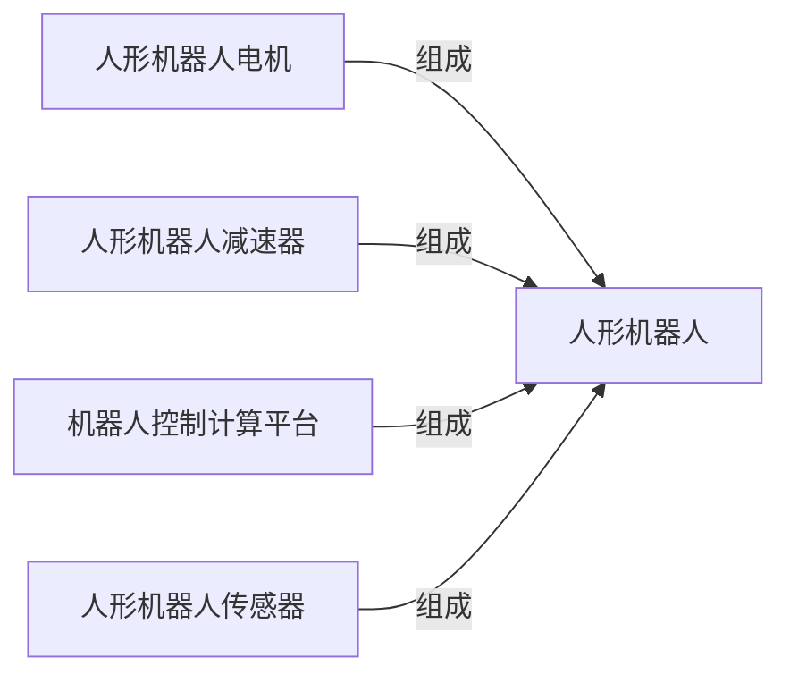

#### 受影响节点

| Node ID | 受影响节点 | 本次影响 | 结果 | 结论性质 | 传导逻辑（为什么到这里） | 关联 Evidence | 时间窗口 | 置信度 |
|---|---|---|---|---|---|---|---|---|
| `fd5fde97-47f…` | 人形机器人 | 商业化进度 UP/MEDIUM；渗透率 UP/MEDIUM | 升温 | 直接证据 | 中国2026年8月在北京举办第二届人形机器人比赛，展示技术进步并引发应用讨论；DIGITIMES评论指出人形机器人行业扩产，具身智能正实体化，AI扩展下人类智能与机器活动界限模糊，反映具身智能技术正从验证进入规模应用。对“人形机器人”环节而言，这意味着商业化进度上升、渗透率上升，因此本期判断为升温。 | EVDa82b3ad1-8404-52cd-aedd-f18fa5eecc6e, EVD7d294da5-805b-5ff4-86d1-550636844a7a | 中期–长期 | 中 |
| `a2b86f64-5d1…` | 人形机器人传感器 | 商业化进度 UP/LOW | 升温 | 直接证据 | 中国2026年8月在北京举办第二届人形机器人比赛，展示技术进步并引发应用讨论。对“人形机器人传感器”环节而言，这意味着商业化进度上升，因此本期判断为升温。 | EVDa82b3ad1-8404-52cd-aedd-f18fa5eecc6e | 长期 | 中 |
| `78bebee6-006…` | 人形机器人减速器 | 商业化进度 UP/LOW | 升温 | 直接证据 | 中国2026年8月在北京举办第二届人形机器人比赛，展示技术进步并引发应用讨论。对“人形机器人减速器”环节而言，这意味着商业化进度上升，因此本期判断为升温。 | EVDa82b3ad1-8404-52cd-aedd-f18fa5eecc6e | 长期 | 中 |
| `8bab5a5c-c9b…` | 人形机器人电机 | 商业化进度 UP/LOW | 升温 | 直接证据 | 中国2026年8月在北京举办第二届人形机器人比赛，展示技术进步并引发应用讨论。对“人形机器人电机”环节而言，这意味着商业化进度上升，因此本期判断为升温。 | EVDa82b3ad1-8404-52cd-aedd-f18fa5eecc6e | 长期 | 中 |
| `9f4e1d1d-6e7…` | 机器人控制计算平台 | 市场需求 UP/LOW | 升温 | 推理假设 | 人形机器人的商业化和渗透率上升，会增加整机对运动控制、感知融合和实时决策计算的需求。控制计算平台是整机的明确组成环节，因此推测其市场需求将随整机放量而上升。 | — | 中期–长期 | 低 |

- **停止条件**：若后续 Event 使节点 Signal 失效、方向反转，或链语境确认不属于本链，则关闭或修正本链结论。

### 3.2 CHN-02 AI数据中心液冷服务器产业链

**一句话结论（C-CHN-02）**：AI芯片、液冷服务器、液冷系统出现直接 Signal，节点方向为升温；但至少一个节点同时归属多条产业链，本链是否承接全部影响仍需链语境验证；本链新增 1 条动态传导假设。

- **链状态**：直接节点 Signal 明确；新增 1 条动态传导假设，其余相邻节点继续待验证
- **链结果**：升温
- **时间窗口**：长期–中期
- **置信度**：低–中
- **路径**：`AI芯片、液冷服务器、液冷系统`（直接 Signal 节点）→ 真实同链拓扑节点
- **已接受的动态传导假设**：液冷服务器 → 服务器冷板

#### 链路图

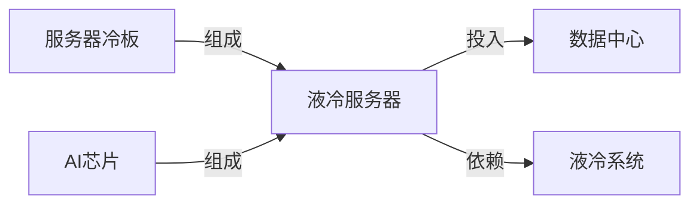

#### 受影响节点

| Node ID | 受影响节点 | 本次影响 | 结果 | 结论性质 | 传导逻辑（为什么到这里） | 关联 Evidence | 时间窗口 | 置信度 |
|---|---|---|---|---|---|---|---|---|
| `7a5bf267-99c…` | AI芯片 | 商业化进度 UP/MEDIUM；技术成熟度 UP/MEDIUM | 升温 | 直接证据 | Google与Marvell扩大定制芯片合作，涉及TPU等AI芯片领域；OpenAI在Hot Chips 2026披露自研AI加速器ASIC Jalapeño的基准测试结果，该芯片为通用AI负载从零设计，非GPU改造；该节点归属 7 条链，本链语境未确定。对“AI芯片”环节而言，这意味着商业化进度上升、技术成熟度上升，因此本期判断为升温。 | EVDf7b24238-6d58-55e5-9c11-ffdd383bf528, EVD3053dc5b-038a-5302-b846-4f53fbc8b706 | 长期–中期 | 低–中 |
| `4a582fda-196…` | 液冷服务器 | 商业化进度 UP/MEDIUM | 升温 | 直接证据 | 中国于2026年8月29日发布首个国家级液冷标准，以应对AI机架功耗逼近1MW的散热挑战，该标准为液冷服务器确立了统一的规范性技术基准。对“液冷服务器”环节而言，这意味着商业化进度上升，因此本期判断为升温。 | EVD8640d346-abe9-5275-9141-b2309083afe2 | 长期 | 中 |
| `bd70ba7a-f3f…` | 液冷系统 | 商业化进度 UP/MEDIUM | 升温 | 直接证据 | 中国于2026年8月29日发布首个国家级液冷标准，以应对AI机架功耗逼近1MW的散热挑战，该标准为液冷系统确立了统一的规范性技术基准。对“液冷系统”环节而言，这意味着商业化进度上升，因此本期判断为升温。 | EVD8640d346-abe9-5275-9141-b2309083afe2 | 长期 | 中 |
| `b765cc47-0a5…` | 数据中心 | 真实同链拓扑相邻，尚无直接 Signal | 待验证 | — | “数据中心”与本链中的直接受影响节点存在真实产业链关系，但在本次证据范围内，没有订单、价格、产能、技术进展或经营数据直接指向该环节，也没有足够依据确认影响已经传导至此，因此暂不判断升降方向。 | — | 后续周期 | 低 |
| `97b3353f-a55…` | 服务器冷板 | 市场需求 UP/LOW | 升温 | 推理假设 | 液冷服务器商业化进度上升，意味着冷板等核心散热部件的配套量会随整机交付增加。服务器冷板是液冷服务器的真实组成环节，因此推测其市场需求上升。 | — | 长期 | 低 |

- **停止条件**：若后续 Event 使节点 Signal 失效、方向反转，或链语境确认不属于本链，则关闭或修正本链结论。

### 3.3 CHN-03 AI算力基础设施服务产业链

**一句话结论（C-CHN-03）**：AI芯片、算力供给出现直接 Signal，节点方向为升温；但至少一个节点同时归属多条产业链，本链是否承接全部影响仍需链语境验证。

- **链状态**：节点 Signal 明确，链语境待解析
- **链结果**：升温
- **时间窗口**：长期–中期
- **置信度**：低–中
- **路径**：`AI芯片、算力供给`（直接 Signal 节点）→ 真实同链拓扑节点

#### 链路图

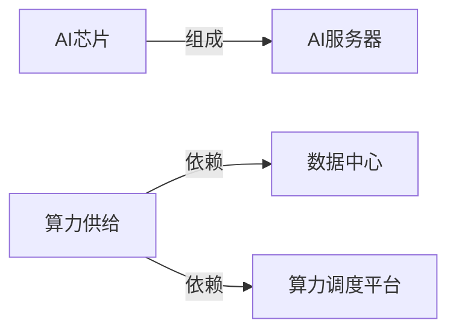

#### 受影响节点

| Node ID | 受影响节点 | 本次影响 | 结果 | 结论性质 | 传导逻辑（为什么到这里） | 关联 Evidence | 时间窗口 | 置信度 |
|---|---|---|---|---|---|---|---|---|
| `7a5bf267-99c…` | AI芯片 | 商业化进度 UP/MEDIUM；技术成熟度 UP/MEDIUM | 升温 | 直接证据 | Google与Marvell扩大定制芯片合作，涉及TPU等AI芯片领域；OpenAI在Hot Chips 2026披露自研AI加速器ASIC Jalapeño的基准测试结果，该芯片为通用AI负载从零设计，非GPU改造；该节点归属 7 条链，本链语境未确定。对“AI芯片”环节而言，这意味着商业化进度上升、技术成熟度上升，因此本期判断为升温。 | EVDf7b24238-6d58-55e5-9c11-ffdd383bf528, EVD3053dc5b-038a-5302-b846-4f53fbc8b706 | 长期–中期 | 低–中 |
| `0091def5-b9c…` | 算力供给 | 产能利用率 UP/MEDIUM；商业化进度 UP/LOW；市场供给 UP/MEDIUM；性价比 UP/MEDIUM；有效产能 UP/HIGH | 升温 | 直接证据 | InferenceXv3在推理过程中实现95%以上KVCache命中率；截至2026年7月底，全国智算总规模达245万PFLOPS(FP16)，其中145万PFLOPS纳入国家级监测调度平台；该节点归属 5 条链，本链语境未确定。对“算力供给”环节而言，这意味着产能利用率上升、商业化进度上升、市场供给上升、性价比上升、有效产能上升，因此本期判断为升温。 | EVD5d9f5120-5efc-58d3-a3be-b7ab0643d6c3, EVD62e8bdb6-3817-5520-b3e0-86d347f6de10 | 中期 | 低–中 |
| `528043a8-501…` | AI服务器 | 真实同链拓扑相邻，尚无直接 Signal | 待验证 | — | “AI服务器”与本链中的直接受影响节点存在真实产业链关系，但在本次证据范围内，没有订单、价格、产能、技术进展或经营数据直接指向该环节，也没有足够依据确认影响已经传导至此，因此暂不判断升降方向。 | — | 后续周期 | 低 |
| `b765cc47-0a5…` | 数据中心 | 真实同链拓扑相邻，尚无直接 Signal | 待验证 | — | “数据中心”与本链中的直接受影响节点存在真实产业链关系，但在本次证据范围内，没有订单、价格、产能、技术进展或经营数据直接指向该环节，也没有足够依据确认影响已经传导至此，因此暂不判断升降方向。 | — | 后续周期 | 低 |
| `f5659f21-a1b…` | 算力调度平台 | 真实同链拓扑相邻，尚无直接 Signal | 待验证 | — | “算力调度平台”与本链中的直接受影响节点存在真实产业链关系，但在本次证据范围内，没有订单、价格、产能、技术进展或经营数据直接指向该环节，也没有足够依据确认影响已经传导至此，因此暂不判断升降方向。 | — | 后续周期 | 低 |

- **停止条件**：若后续 Event 使节点 Signal 失效、方向反转，或链语境确认不属于本链，则关闭或修正本链结论。

### 3.4 CHN-04 AI视频生成服务产业链

**一句话结论（C-CHN-04）**：AI语料、算力供给出现直接 Signal，节点方向为升温；但至少一个节点同时归属多条产业链，本链是否承接全部影响仍需链语境验证。

- **链状态**：节点 Signal 明确，链语境待解析
- **链结果**：升温
- **时间窗口**：中期
- **置信度**：低–中
- **路径**：`AI语料、算力供给`（直接 Signal 节点）→ 真实同链拓扑节点

#### 链路图


#### 受影响节点

| Node ID | 受影响节点 | 本次影响 | 结果 | 结论性质 | 传导逻辑（为什么到这里） | 关联 Evidence | 时间窗口 | 置信度 |
|---|---|---|---|---|---|---|---|---|
| `5c3f5b94-451…` | AI语料 | 商业化进度 UP/MEDIUM | 升温 | 直接证据 | AgentX于2026年8月24日发布开源数据集，价值300万美元，支持长上下文、多轮和子代理特性；该节点归属 2 条链，本链语境未确定。对“AI语料”环节而言，这意味着商业化进度上升，因此本期判断为升温。 | EVDd72ab073-566e-555a-be72-ad15a24e7799 | 中期 | 低–中 |
| `0091def5-b9c…` | 算力供给 | 产能利用率 UP/MEDIUM；商业化进度 UP/LOW；市场供给 UP/MEDIUM；性价比 UP/MEDIUM；有效产能 UP/HIGH | 升温 | 直接证据 | InferenceXv3在推理过程中实现95%以上KVCache命中率；截至2026年7月底，全国智算总规模达245万PFLOPS(FP16)，其中145万PFLOPS纳入国家级监测调度平台；该节点归属 5 条链，本链语境未确定。对“算力供给”环节而言，这意味着产能利用率上升、商业化进度上升、市场供给上升、性价比上升、有效产能上升，因此本期判断为升温。 | EVD5d9f5120-5efc-58d3-a3be-b7ab0643d6c3, EVD62e8bdb6-3817-5520-b3e0-86d347f6de10 | 中期 | 低–中 |
| `39bd9129-8bd…` | 视频生成基础模型 | 真实同链拓扑相邻，尚无直接 Signal | 待验证 | — | “视频生成基础模型”与本链中的直接受影响节点存在真实产业链关系，但在本次证据范围内，没有订单、价格、产能、技术进展或经营数据直接指向该环节，也没有足够依据确认影响已经传导至此，因此暂不判断升降方向。 | — | 后续周期 | 低 |

- **停止条件**：若后续 Event 使节点 Signal 失效、方向反转，或链语境确认不属于本链，则关闭或修正本链结论。

### 3.5 CHN-05 油气勘探开发产业链

**一句话结论（C-CHN-05）**：商品原油、油气开采出现直接 Signal，当前链级聚合结果为分化，已形成可解释的动态传导假设，其余相邻节点仍待验证；本链新增 1 条动态传导假设。

- **链状态**：直接节点 Signal 明确；新增 1 条动态传导假设，其余相邻节点继续待验证
- **链结果**：分化
- **时间窗口**：中期–短期
- **置信度**：中
- **路径**：`商品原油、油气开采`（直接 Signal 节点）→ 真实同链拓扑节点
- **已接受的动态传导假设**：油气开采 → 油气集输与初步处理服务

#### 链路图

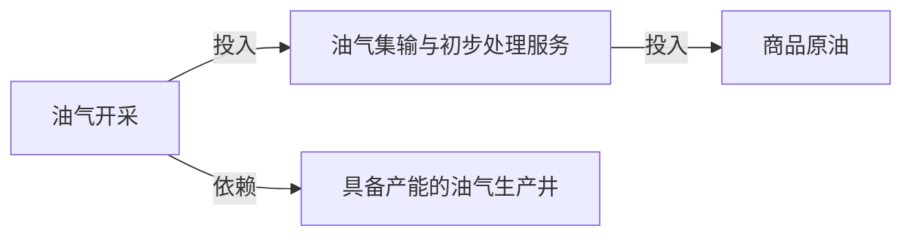

#### 受影响节点

| Node ID | 受影响节点 | 本次影响 | 结果 | 结论性质 | 传导逻辑（为什么到这里） | 关联 Evidence | 时间窗口 | 置信度 |
|---|---|---|---|---|---|---|---|---|
| `abb6e457-8ec…` | 商品原油 | 市场供给 STABLE/LOW；市场供给 DOWN/LOW；市场供给 UP/MEDIUM；库存水平 DOWN/MEDIUM；投入成本 UP/MEDIUM | 分化 | 直接证据 | 亚洲炼油商转向南美生产商可能导致供应来源增加，但商品原油的市场供给整体未变；委内瑞拉2026年7月原油出口总量环比下降至116万桶/日，对美出口升至高位。对“商品原油”环节而言，这意味着市场供给保持稳定、市场供给下降、市场供给上升、库存水平下降、投入成本上升，因此本期判断为分化。 | EVDdc1eb429-51f7-593c-8762-07c91a7d88a6, EVD6d597fa4-4d69-5716-962b-6ba85faa2216, EVD6a31433b-3cf9-502e-8cec-4880d4d7a75f, EVDb0e98cdf-2602-5132-bb12-42c2ad4e1c0c | 中期–短期 | 中 |
| `f7e94ab3-f83…` | 油气开采 | 市场供给 DOWN/LOW | 降温 | 直接证据 | 委内瑞拉2026年7月原油出口总量环比下降至116万桶/日。对“油气开采”环节而言，这意味着市场供给下降，因此本期判断为降温。 | EVD6d597fa4-4d69-5716-962b-6ba85faa2216 | 短期 | 中 |
| `7e693591-6d6…` | 具备产能的油气生产井 | 真实同链拓扑相邻，尚无直接 Signal | 待验证 | — | “具备产能的油气生产井”与本链中的直接受影响节点存在真实产业链关系，但在本次证据范围内，没有订单、价格、产能、技术进展或经营数据直接指向该环节，也没有足够依据确认影响已经传导至此，因此暂不判断升降方向。 | — | 后续周期 | 低 |
| `d0cb4396-d6c…` | 油气集输与初步处理服务 | 产能利用率 DOWN/LOW | 降温 | 推理假设 | 油气开采供给下降会减少进入集输和初处理环节的原料量。该服务是开采产出后的明确下游环节，因此推测其产能利用率可能下降。 | — | 短期–中期 | 低 |

- **停止条件**：若后续 Event 使节点 Signal 失效、方向反转，或链语境确认不属于本链，则关闭或修正本链结论。

### 3.6 CHN-06 生成式人工智能模型及应用服务产业链

**一句话结论（C-CHN-06）**：生成式AI基础模型、算力供给出现直接 Signal，节点方向为升温；但至少一个节点同时归属多条产业链，本链是否承接全部影响仍需链语境验证；本链新增 2 条动态传导假设。

- **链状态**：直接节点 Signal 明确；新增 2 条动态传导假设，其余相邻节点继续待验证
- **链结果**：升温
- **时间窗口**：中期
- **置信度**：低–中
- **路径**：`生成式AI基础模型、算力供给`（直接 Signal 节点）→ 真实同链拓扑节点
- **已接受的动态传导假设**：生成式AI基础模型 → 模型训练服务；生成式AI基础模型 → 生成式AI应用服务

#### 链路图

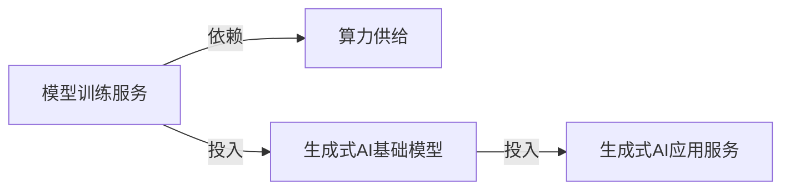

#### 受影响节点

| Node ID | 受影响节点 | 本次影响 | 结果 | 结论性质 | 传导逻辑（为什么到这里） | 关联 Evidence | 时间窗口 | 置信度 |
|---|---|---|---|---|---|---|---|---|
| `a737b354-05b…` | 生成式AI基础模型 | 商业化进度 UP/MEDIUM | 升温 | 直接证据 | DeepMind发布Gemini Omni 1.1 Flash，宣称让开发者构建时拥有更多控制力。对“生成式AI基础模型”环节而言，这意味着商业化进度上升，因此本期判断为升温。 | EVDe7822f7d-e555-5612-8f21-1c7288c1596c | 中期 | 中 |
| `0091def5-b9c…` | 算力供给 | 产能利用率 UP/MEDIUM；商业化进度 UP/LOW；市场供给 UP/MEDIUM；性价比 UP/MEDIUM；有效产能 UP/HIGH | 升温 | 直接证据 | InferenceXv3在推理过程中实现95%以上KVCache命中率；截至2026年7月底，全国智算总规模达245万PFLOPS(FP16)，其中145万PFLOPS纳入国家级监测调度平台；该节点归属 5 条链，本链语境未确定。对“算力供给”环节而言，这意味着产能利用率上升、商业化进度上升、市场供给上升、性价比上升、有效产能上升，因此本期判断为升温。 | EVD5d9f5120-5efc-58d3-a3be-b7ab0643d6c3, EVD62e8bdb6-3817-5520-b3e0-86d347f6de10 | 中期 | 低–中 |
| `676b3781-e62…` | 模型训练服务 | 市场需求 UP/LOW | 升温 | 推理假设 | 生成式AI基础模型商业化加快，会带来持续训练、微调和迭代需求。模型训练服务是基础模型的明确投入环节，因此推测其市场需求上升。 | — | 中期 | 低 |
| `f2bddc77-184…` | 生成式AI应用服务 | 商业化进度 UP/LOW | 升温 | 推理假设 | 基础模型商业化加快会提高可用模型供给，并降低下游应用的开发与部署门槛。基础模型是生成式AI应用服务的明确投入，因此推测应用服务的商业化进度上升。 | — | 中期 | 低 |

- **停止条件**：若后续 Event 使节点 Signal 失效、方向反转，或链语境确认不属于本链，则关闭或修正本链结论。

### 3.7 CHN-07 汽车线控制动执行器产业链

**一句话结论（C-CHN-07）**：传感器、新能源车整车出现直接 Signal，节点方向为升温；但至少一个节点同时归属多条产业链，本链是否承接全部影响仍需链语境验证。

- **链状态**：节点 Signal 明确，链语境待解析
- **链结果**：升温
- **时间窗口**：中期–长期
- **置信度**：低–中
- **路径**：`传感器、新能源车整车`（直接 Signal 节点）→ 真实同链拓扑节点

#### 链路图


#### 受影响节点

| Node ID | 受影响节点 | 本次影响 | 结果 | 结论性质 | 传导逻辑（为什么到这里） | 关联 Evidence | 时间窗口 | 置信度 |
|---|---|---|---|---|---|---|---|---|
| `ceca14e0-73f…` | 传感器 | 政策支持力度 UP/LOW | 升温 | 直接证据 | 2026年8月29日，北京怀柔发布2026年第一批采购机遇清单，采购额约4亿元，包含超过10项采购机遇，针对高端科学仪器与传感器产业；该节点归属 7 条链，本链语境未确定。对“传感器”环节而言，这意味着政策支持力度上升，因此本期判断为升温。 | EVD85b7b02e-557f-5a85-b202-11536f656855 | 中期 | 低–中 |
| `0ae9b007-d57…` | 新能源车整车 | 商业化进度 UP/MEDIUM；市场需求 UP/MEDIUM；性价比 UP/MEDIUM；技术成熟度 UP/MEDIUM | 升温 | 直接证据 | 中国国家市场监管总局宣布分阶段实施GB1589-2026标准，新车型需于2027年7月1日起符合，现有车型需于2028年1月1日起符合，并给予车企技术升级和过渡时间；吉利汽车发布混动SUV车型Monjaro EM-i，开启首款混动D级SUV全球推广，直接增加新能源车（混动SUV）的供给与可得性；该节点归属 5 条链，本链语境未确定。对“新能源车整车”环节而言，这意味着商业化进度上升、市场需求上升、性价比上升、技术成熟度上升，因此本期判断为升温。 | EVDd37fc63d-aa18-597c-9eee-1b492337b9ae, EVDee8efabd-c096-5d52-be80-5348d09059ef, EVD2f12eefd-3b25-59f2-831e-07b83f3c1ff6 | 长期–中期 | 低–中 |
| `707439f0-148…` | 线控制动执行器 | 真实同链拓扑相邻，尚无直接 Signal | 待验证 | — | “线控制动执行器”与本链中的直接受影响节点存在真实产业链关系，但在本次证据范围内，没有订单、价格、产能、技术进展或经营数据直接指向该环节，也没有足够依据确认影响已经传导至此，因此暂不判断升降方向。 | — | 后续周期 | 低 |

- **停止条件**：若后续 Event 使节点 Signal 失效、方向反转，或链语境确认不属于本链，则关闭或修正本链结论。

### 3.8 CHN-08 企业AI智能体产业链

**一句话结论（C-CHN-08）**：AI智能体、基础模型API服务出现直接 Signal，当前链级聚合结果为升温，已形成可解释的动态传导假设，其余相邻节点仍待验证；本链新增 2 条动态传导假设。

- **链状态**：直接节点 Signal 明确；新增 2 条动态传导假设，其余相邻节点继续待验证
- **链结果**：升温
- **时间窗口**：中期
- **置信度**：中
- **路径**：`AI智能体、基础模型API服务`（直接 Signal 节点）→ 真实同链拓扑节点
- **已接受的动态传导假设**：AI智能体 → 企业应用软件；AI智能体 → 企业知识库

#### 链路图

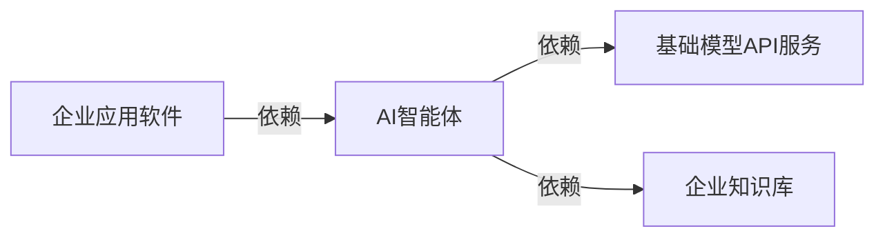

#### 受影响节点

| Node ID | 受影响节点 | 本次影响 | 结果 | 结论性质 | 传导逻辑（为什么到这里） | 关联 Evidence | 时间窗口 | 置信度 |
|---|---|---|---|---|---|---|---|---|
| `be1986b4-708…` | AI智能体 | 商业化进度 UP/MEDIUM | 升温 | 直接证据 | AgentX于2026年8月24日发布开源数据集，价值300万美元，支持长上下文、多轮和子代理特性。对“AI智能体”环节而言，这意味着商业化进度上升，因此本期判断为升温。 | EVDd72ab073-566e-555a-be72-ad15a24e7799 | 中期 | 低–中 |
| `2591173a-f32…` | 基础模型API服务 | 性价比 UP/HIGH；渗透率 UP/MEDIUM；渗透率 UP/HIGH | 升温 | 直接证据 | 开源模型竞争力增强，Fireworks每日处理超40万亿token，是OpenAI API在3月底交易量的2倍；DeepMind发布Gemini Omni 1.1 Flash，宣称让开发者构建时拥有更多控制力。对“基础模型API服务”环节而言，这意味着性价比上升、渗透率上升、渗透率上升，因此本期判断为升温。 | EVD23d94e3e-27a2-5d1f-9a8d-00025987f516, EVDe7822f7d-e555-5612-8f21-1c7288c1596c | 中期 | 中 |
| `64c968f0-6ec…` | 企业应用软件 | 商业化进度 UP/LOW | 升温 | 推理假设 | AI智能体商业化进度上升，会使企业应用软件更快集成自动执行、知识检索和流程协同能力。企业应用软件明确依赖AI智能体，因此推测其商业化进度上升。 | — | 中期 | 低 |
| `3ab77588-d8a…` | 企业知识库 | 市场需求 UP/LOW | 升温 | 推理假设 | AI智能体进入商业应用后，需要可检索、可更新且权限可控的企业知识。AI智能体明确依赖企业知识库，因此推测企业知识库的市场需求上升。 | — | 中期 | 低 |

- **停止条件**：若后续 Event 使节点 Signal 失效、方向反转，或链语境确认不属于本链，则关闭或修正本链结论。

### 3.9 CHN-09 智能语音技术服务产业链

**一句话结论（C-CHN-09）**：智能语音基础模型、智能语音算法SDK与云API出现直接 Signal，当前链级聚合结果为升温，已形成可解释的动态传导假设，其余相邻节点仍待验证；本链新增 2 条动态传导假设。

- **链状态**：直接节点 Signal 明确；新增 2 条动态传导假设，其余相邻节点继续待验证
- **链结果**：升温
- **时间窗口**：中期
- **置信度**：中
- **路径**：`智能语音基础模型、智能语音算法SDK与云API`（直接 Signal 节点）→ 真实同链拓扑节点
- **已接受的动态传导假设**：智能语音算法SDK与云API → 智能终端语音交互应用；智能语音基础模型 → 智能语音基础模型训练服务

#### 链路图


#### 受影响节点

| Node ID | 受影响节点 | 本次影响 | 结果 | 结论性质 | 传导逻辑（为什么到这里） | 关联 Evidence | 时间窗口 | 置信度 |
|---|---|---|---|---|---|---|---|---|
| `1f717a15-3db…` | 智能语音基础模型 | 商业化进度 UP/MEDIUM；技术成熟度 UP/MEDIUM；渗透率 UP/LOW | 升温 | 直接证据 | DeepMind于2026年8月26日发布Gemini 3.5 Transcribe，一款提供更智能语音转文字转录功能的产品，标志公司语音转录技术进入商业化发布阶段；DeepMind于2026年8月26日发布Gemini 3.5 Transcribe，其更智能的语音转文字功能有望提升语音转录产品的技术性能和体验。对“智能语音基础模型”环节而言，这意味着商业化进度上升、技术成熟度上升、渗透率上升，因此本期判断为升温。 | EVDa1df4b15-ad34-5e29-9c64-0f753433a80e | 中期 | 中 |
| `a19570dd-af4…` | 智能语音算法SDK与云API | 商业化进度 UP/MEDIUM | 升温 | 直接证据 | DeepMind于2026年8月26日发布Gemini 3.5 Transcribe，提供更智能的语音转文字转录功能，直接提升了DeepMind在语音转录应用中的产品供给。对“智能语音算法SDK与云API”环节而言，这意味着商业化进度上升，因此本期判断为升温。 | EVDa1df4b15-ad34-5e29-9c64-0f753433a80e | 中期 | 中 |
| `36285326-b10…` | 智能终端语音交互应用 | 商业化进度 UP/LOW | 升温 | 推理假设 | 智能语音SDK与云API商业化加快，会降低终端应用集成语音能力的成本和时间。该能力是智能终端语音交互应用的明确投入，因此推测应用端商业化进度上升。 | — | 中期 | 低 |
| `ca61bc3c-6dd…` | 智能语音基础模型训练服务 | 市场需求 UP/LOW | 升温 | 推理假设 | 智能语音基础模型的技术成熟度和商业化进度上升，通常需要持续训练、评测和场景微调。训练服务是基础模型的明确投入环节，因此推测其市场需求上升。 | — | 中期 | 低 |

- **停止条件**：若后续 Event 使节点 Signal 失效、方向反转，或链语境确认不属于本链，则关闭或修正本链结论。

### 3.10 CHN-10 AI智能手机产业链

**一句话结论（C-CHN-10）**：AI芯片、传感器出现直接 Signal，节点方向为升温；但至少一个节点同时归属多条产业链，本链是否承接全部影响仍需链语境验证。

- **链状态**：节点 Signal 明确，链语境待解析
- **链结果**：升温
- **时间窗口**：长期–中期
- **置信度**：低–中
- **路径**：`AI芯片、传感器`（直接 Signal 节点）→ 真实同链拓扑节点

#### 链路图

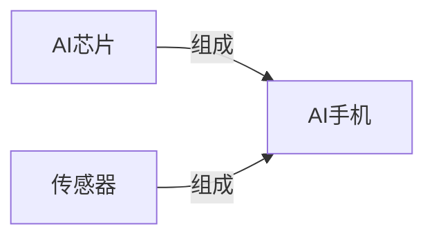

#### 受影响节点

| Node ID | 受影响节点 | 本次影响 | 结果 | 结论性质 | 传导逻辑（为什么到这里） | 关联 Evidence | 时间窗口 | 置信度 |
|---|---|---|---|---|---|---|---|---|
| `7a5bf267-99c…` | AI芯片 | 商业化进度 UP/MEDIUM；技术成熟度 UP/MEDIUM | 升温 | 直接证据 | Google与Marvell扩大定制芯片合作，涉及TPU等AI芯片领域；OpenAI在Hot Chips 2026披露自研AI加速器ASIC Jalapeño的基准测试结果，该芯片为通用AI负载从零设计，非GPU改造；该节点归属 7 条链，本链语境未确定。对“AI芯片”环节而言，这意味着商业化进度上升、技术成熟度上升，因此本期判断为升温。 | EVDf7b24238-6d58-55e5-9c11-ffdd383bf528, EVD3053dc5b-038a-5302-b846-4f53fbc8b706 | 长期–中期 | 低–中 |
| `ceca14e0-73f…` | 传感器 | 政策支持力度 UP/LOW | 升温 | 直接证据 | 2026年8月29日，北京怀柔发布2026年第一批采购机遇清单，采购额约4亿元，包含超过10项采购机遇，针对高端科学仪器与传感器产业；该节点归属 7 条链，本链语境未确定。对“传感器”环节而言，这意味着政策支持力度上升，因此本期判断为升温。 | EVD85b7b02e-557f-5a85-b202-11536f656855 | 中期 | 低–中 |
| `b6e5662f-8be…` | AI手机 | 真实同链拓扑相邻，尚无直接 Signal | 待验证 | — | “AI手机”与本链中的直接受影响节点存在真实产业链关系，但在本次证据范围内，没有订单、价格、产能、技术进展或经营数据直接指向该环节，也没有足够依据确认影响已经传导至此，因此暂不判断升降方向。 | — | 后续周期 | 低 |

- **停止条件**：若后续 Event 使节点 Signal 失效、方向反转，或链语境确认不属于本链，则关闭或修正本链结论。

### 3.11 CHN-11 AI计算芯片产业链

**一句话结论（C-CHN-11）**：AI芯片、集成电路制造出现直接 Signal，节点方向为升温；但至少一个节点同时归属多条产业链，本链是否承接全部影响仍需链语境验证。

- **链状态**：节点 Signal 明确，链语境待解析
- **链结果**：升温
- **时间窗口**：长期–中期
- **置信度**：低–中
- **路径**：`AI芯片、集成电路制造`（直接 Signal 节点）→ 真实同链拓扑节点

#### 链路图

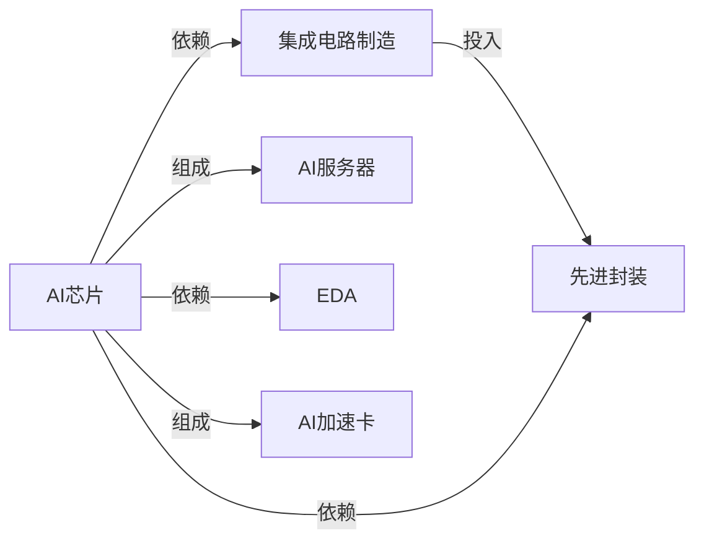

#### 受影响节点

| Node ID | 受影响节点 | 本次影响 | 结果 | 结论性质 | 传导逻辑（为什么到这里） | 关联 Evidence | 时间窗口 | 置信度 |
|---|---|---|---|---|---|---|---|---|
| `7a5bf267-99c…` | AI芯片 | 商业化进度 UP/MEDIUM；技术成熟度 UP/MEDIUM | 升温 | 直接证据 | Google与Marvell扩大定制芯片合作，涉及TPU等AI芯片领域；OpenAI在Hot Chips 2026披露自研AI加速器ASIC Jalapeño的基准测试结果，该芯片为通用AI负载从零设计，非GPU改造；该节点归属 7 条链，本链语境未确定。对“AI芯片”环节而言，这意味着商业化进度上升、技术成熟度上升，因此本期判断为升温。 | EVDf7b24238-6d58-55e5-9c11-ffdd383bf528, EVD3053dc5b-038a-5302-b846-4f53fbc8b706 | 长期–中期 | 低–中 |
| `a72fef05-023…` | 集成电路制造 | 产能利用率 UP/MEDIUM | 升温 | 直接证据 | 美国商务部推进CHIPS法案制造业激励项目，多数项目计划2028年前完成；该节点归属 4 条链，本链语境未确定。对“集成电路制造”环节而言，这意味着产能利用率上升，因此本期判断为升温。 | EVD7aaa918a-a805-5f4d-b064-c9ec051a2878 | 长期 | 低–中 |
| `711f0830-000…` | AI加速卡 | 真实同链拓扑相邻，尚无直接 Signal | 待验证 | — | “AI加速卡”与本链中的直接受影响节点存在真实产业链关系，但在本次证据范围内，没有订单、价格、产能、技术进展或经营数据直接指向该环节，也没有足够依据确认影响已经传导至此，因此暂不判断升降方向。 | — | 后续周期 | 低 |
| `528043a8-501…` | AI服务器 | 真实同链拓扑相邻，尚无直接 Signal | 待验证 | — | “AI服务器”与本链中的直接受影响节点存在真实产业链关系，但在本次证据范围内，没有订单、价格、产能、技术进展或经营数据直接指向该环节，也没有足够依据确认影响已经传导至此，因此暂不判断升降方向。 | — | 后续周期 | 低 |
| `87c76d1f-5da…` | EDA | 真实同链拓扑相邻，尚无直接 Signal | 待验证 | — | “EDA”与本链中的直接受影响节点存在真实产业链关系，但在本次证据范围内，没有订单、价格、产能、技术进展或经营数据直接指向该环节，也没有足够依据确认影响已经传导至此，因此暂不判断升降方向。 | — | 后续周期 | 低 |
| `7246a287-655…` | 先进封装 | 真实同链拓扑相邻，尚无直接 Signal | 待验证 | — | “先进封装”与本链中的直接受影响节点存在真实产业链关系，但在本次证据范围内，没有订单、价格、产能、技术进展或经营数据直接指向该环节，也没有足够依据确认影响已经传导至此，因此暂不判断升降方向。 | — | 后续周期 | 低 |

- **停止条件**：若后续 Event 使节点 Signal 失效、方向反转，或链语境确认不属于本链，则关闭或修正本链结论。

### 3.12 CHN-12 电动汽车换电服务产业链

**一句话结论（C-CHN-12）**：换电运营调度平台、标准化换电电池包资产出现直接 Signal，当前链级聚合结果为升温，已形成可解释的动态传导假设，其余相邻节点仍待验证；本链新增 1 条动态传导假设。

- **链状态**：直接节点 Signal 明确；新增 1 条动态传导假设，其余相邻节点继续待验证
- **链结果**：升温
- **时间窗口**：中期
- **置信度**：中
- **路径**：`换电运营调度平台、标准化换电电池包资产`（直接 Signal 节点）→ 真实同链拓扑节点
- **已接受的动态传导假设**：标准化换电电池包资产 + 换电运营调度平台 → 换电服务

#### 链路图

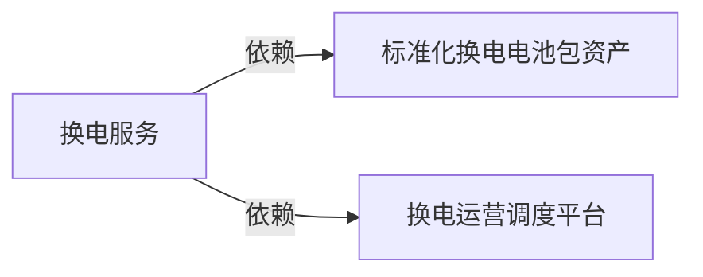

#### 受影响节点

| Node ID | 受影响节点 | 本次影响 | 结果 | 结论性质 | 传导逻辑（为什么到这里） | 关联 Evidence | 时间窗口 | 置信度 |
|---|---|---|---|---|---|---|---|---|
| `1caee19f-9b9…` | 换电运营调度平台 | 商业化进度 UP/LOW | 升温 | 直接证据 | Epicland考虑采用换电模式，意味着对换电运营调度平台的需求可能提升，从而推动其商业化进度。对“换电运营调度平台”环节而言，这意味着商业化进度上升，因此本期判断为升温。 | EVDa88cd74d-c7b9-55fb-89a5-6fce456dc408 | 中期 | 中 |
| `c1f6ecf9-92d…` | 标准化换电电池包资产 | 市场需求 UP/LOW | 升温 | 直接证据 | Epicland考虑采用换电模式，将增加对标准化换电电池包资产的市场需求。对“标准化换电电池包资产”环节而言，这意味着市场需求上升，因此本期判断为升温。 | EVDa88cd74d-c7b9-55fb-89a5-6fce456dc408 | 中期 | 中 |
| `e7447dcf-1a2…` | 换电服务 | 商业化进度 UP/LOW | 升温 | 推理假设 | 标准化换电电池包需求上升，同时换电运营调度平台商业化提速，表明资产与运营系统都在准备扩张。换电服务同时依赖这两个环节，因此推测其商业化进度上升。 | — | 中期 | 低 |

- **停止条件**：若后续 Event 使节点 Signal 失效、方向反转，或链语境确认不属于本链，则关闭或修正本链结论。

### 3.13 CHN-13 量子信息技术系统产业链

**一句话结论（C-CHN-13）**：超导量子计算机、量子计算控制软件出现直接 Signal，当前链级聚合结果为升温，已形成可解释的动态传导假设，其余相邻节点仍待验证；本链新增 3 条动态传导假设。

- **链状态**：直接节点 Signal 明确；新增 3 条动态传导假设，其余相邻节点继续待验证
- **链结果**：升温
- **时间窗口**：长期
- **置信度**：中
- **路径**：`超导量子计算机、量子计算控制软件`（直接 Signal 节点）→ 真实同链拓扑节点
- **已接受的动态传导假设**：超导量子计算机 → 超导量子芯片；超导量子计算机 → 稀释制冷机；超导量子计算机 → 量子测控电子系统

#### 链路图

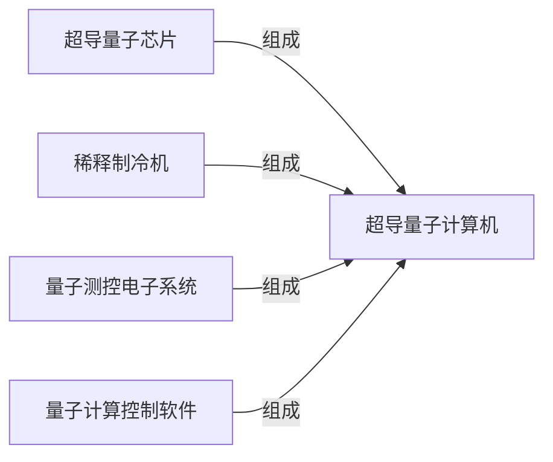

#### 受影响节点

| Node ID | 受影响节点 | 本次影响 | 结果 | 结论性质 | 传导逻辑（为什么到这里） | 关联 Evidence | 时间窗口 | 置信度 |
|---|---|---|---|---|---|---|---|---|
| `323b9bc8-360…` | 超导量子计算机 | 政策支持力度 UP/HIGH | 升温 | 直接证据 | 美国商务部取消CHIPS法案下78亿美元研发拨款，并转向量子计算投资，向xLight等公司授予9亿美元、承诺20亿美元量子计算初步拨款，要求以股权换取资金。对“超导量子计算机”环节而言，这意味着政策支持力度上升，因此本期判断为升温。 | EVD5d18dc53-be0f-579e-85be-12b1254b4159 | 长期 | 中 |
| `cb7a8247-6c9…` | 量子计算控制软件 | 技术路线竞争 UP/MEDIUM | 升温 | 直接证据 | 美国商务部取消CHIPS法案研发资金并转向量子计算投资，涉及NSTC框架调整。对“量子计算控制软件”环节而言，这意味着技术路线竞争上升，因此本期判断为升温。 | EVD5d18dc53-be0f-579e-85be-12b1254b4159 | 长期 | 低–中 |
| `3089bafe-844…` | 稀释制冷机 | 市场需求 UP/LOW | 升温 | 推理假设 | 超导量子计算机获得更强政策支持后，整机项目投入可能带动关键配套设备。稀释制冷机是超导量子计算机的明确组成环节，因此推测其采购需求上升。 | — | 长期 | 低 |
| `9fb21fae-e19…` | 超导量子芯片 | 市场需求 UP/LOW | 升温 | 推理假设 | 超导量子计算机获得更强政策支持后，研发和项目投入通常会向核心部件传导。超导量子芯片是整机的明确组成环节，因此推测其研发与采购需求上升。 | — | 长期 | 低 |
| `5de95b2e-4f0…` | 量子测控电子系统 | 市场需求 UP/LOW | 升温 | 推理假设 | 超导量子计算机获得更强政策支持后，整机研发和部署将增加对测控环节的需求。量子测控电子系统是整机的明确组成环节，因此推测其市场需求上升。 | — | 长期 | 低 |

- **停止条件**：若后续 Event 使节点 Signal 失效、方向反转，或链语境确认不属于本链，则关闭或修正本链结论。

### 3.14 CHN-14 自动驾驶系统产业链

**一句话结论（C-CHN-14）**：自动驾驶系统出现直接 Signal，当前链级聚合结果为升温，已形成可解释的动态传导假设，其余相邻节点仍待验证；本链新增 2 条动态传导假设。

- **链状态**：直接节点 Signal 明确；新增 2 条动态传导假设，其余相邻节点继续待验证
- **链结果**：升温
- **时间窗口**：长期–中期
- **置信度**：中–高
- **路径**：`自动驾驶系统`（直接 Signal 节点）→ 真实同链拓扑节点
- **已接受的动态传导假设**：自动驾驶系统 → 激光雷达；自动驾驶系统 → 车载摄像头模组

#### 链路图

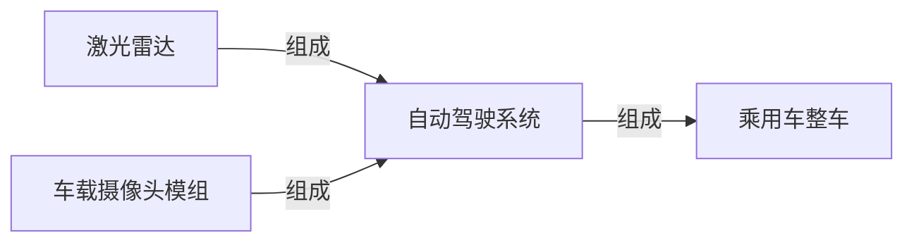

#### 受影响节点

| Node ID | 受影响节点 | 本次影响 | 结果 | 结论性质 | 传导逻辑（为什么到这里） | 关联 Evidence | 时间窗口 | 置信度 |
|---|---|---|---|---|---|---|---|---|
| `d37142f5-7f5…` | 自动驾驶系统 | 商业化进度 UP/MEDIUM；市场份额 UP/MEDIUM；技术成熟度 UP/MEDIUM；订单可见度 UP/MEDIUM | 升温 | 直接证据 | Momenta披露2026年上半年研发支出11.6亿元，同比增长18.6%，占营收72.6%，研发员工1102名占员工总数79.1%；Momenta在2026年上半年新增安装量产方案约32.1万套，同比增长83.7%，累计安装超100万套；交付37个量产车型，累计105个。对“自动驾驶系统”环节而言，这意味着商业化进度上升、市场份额上升、技术成熟度上升、订单可见度上升，因此本期判断为升温。 | EVDadaff346-d9b5-5926-b2f4-8c26e7946440, EVD8c1aca8d-1517-5531-bebc-70b466dcafb1, EVD22d2e4c3-634b-5d9b-8678-aa31b672ecfa | 长期–中期 | 中–高 |
| `867bc1c3-a68…` | 乘用车整车 | 真实同链拓扑相邻，尚无直接 Signal | 待验证 | — | “乘用车整车”与本链中的直接受影响节点存在真实产业链关系，但在本次证据范围内，没有订单、价格、产能、技术进展或经营数据直接指向该环节，也没有足够依据确认影响已经传导至此，因此暂不判断升降方向。 | — | 后续周期 | 低 |
| `e9af2997-9a9…` | 激光雷达 | 市场需求 UP/LOW | 升温 | 推理假设 | 自动驾驶系统的商业化、订单可见度和技术成熟度同时上升，会增加对环境感知部件的配套需求。激光雷达是系统的真实组成环节，因此推测其市场需求上升。 | — | 中期–长期 | 中 |
| `8516fc1c-1d5…` | 车载摄像头模组 | 市场需求 UP/LOW | 升温 | 推理假设 | 自动驾驶系统的商业化、订单可见度和技术成熟度同时上升，会增加多视角环境感知需求。车载摄像头模组是系统的真实组成环节，因此推测其市场需求上升。 | — | 中期–长期 | 中 |

- **停止条件**：若后续 Event 使节点 Signal 失效、方向反转，或链语境确认不属于本链，则关闭或修正本链结论。

### 3.15 CHN-15 AI药物发现服务产业链

**一句话结论（C-CHN-15）**：算力供给出现直接 Signal，节点方向为升温；但至少一个节点同时归属多条产业链，本链是否承接全部影响仍需链语境验证。

- **链状态**：节点 Signal 明确，链语境待解析
- **链结果**：升温
- **时间窗口**：中期
- **置信度**：低–中
- **路径**：`算力供给`（直接 Signal 节点）→ 真实同链拓扑节点

#### 链路图


#### 受影响节点

| Node ID | 受影响节点 | 本次影响 | 结果 | 结论性质 | 传导逻辑（为什么到这里） | 关联 Evidence | 时间窗口 | 置信度 |
|---|---|---|---|---|---|---|---|---|
| `0091def5-b9c…` | 算力供给 | 产能利用率 UP/MEDIUM；商业化进度 UP/LOW；市场供给 UP/MEDIUM；性价比 UP/MEDIUM；有效产能 UP/HIGH | 升温 | 直接证据 | InferenceXv3在推理过程中实现95%以上KVCache命中率；截至2026年7月底，全国智算总规模达245万PFLOPS(FP16)，其中145万PFLOPS纳入国家级监测调度平台；该节点归属 5 条链，本链语境未确定。对“算力供给”环节而言，这意味着产能利用率上升、商业化进度上升、市场供给上升、性价比上升、有效产能上升，因此本期判断为升温。 | EVD5d9f5120-5efc-58d3-a3be-b7ab0643d6c3, EVD62e8bdb6-3817-5520-b3e0-86d347f6de10 | 中期 | 低–中 |
| `2e1d018a-511…` | AI药物发现模型平台 | 真实同链拓扑相邻，尚无直接 Signal | 待验证 | — | “AI药物发现模型平台”与本链中的直接受影响节点存在真实产业链关系，但在本次证据范围内，没有订单、价格、产能、技术进展或经营数据直接指向该环节，也没有足够依据确认影响已经传导至此，因此暂不判断升降方向。 | — | 后续周期 | 低 |

- **停止条件**：若后续 Event 使节点 Signal 失效、方向反转，或链语境确认不属于本链，则关闭或修正本链结论。

### 3.16 CHN-16 MLOps平台与服务产业链

**一句话结论（C-CHN-16）**：算力供给出现直接 Signal，节点方向为升温；但至少一个节点同时归属多条产业链，本链是否承接全部影响仍需链语境验证。

- **链状态**：节点 Signal 明确，链语境待解析
- **链结果**：升温
- **时间窗口**：中期
- **置信度**：低–中
- **路径**：`算力供给`（直接 Signal 节点）→ 真实同链拓扑节点

#### 链路图


#### 受影响节点

| Node ID | 受影响节点 | 本次影响 | 结果 | 结论性质 | 传导逻辑（为什么到这里） | 关联 Evidence | 时间窗口 | 置信度 |
|---|---|---|---|---|---|---|---|---|
| `0091def5-b9c…` | 算力供给 | 产能利用率 UP/MEDIUM；商业化进度 UP/LOW；市场供给 UP/MEDIUM；性价比 UP/MEDIUM；有效产能 UP/HIGH | 升温 | 直接证据 | InferenceXv3在推理过程中实现95%以上KVCache命中率；截至2026年7月底，全国智算总规模达245万PFLOPS(FP16)，其中145万PFLOPS纳入国家级监测调度平台；该节点归属 5 条链，本链语境未确定。对“算力供给”环节而言，这意味着产能利用率上升、商业化进度上升、市场供给上升、性价比上升、有效产能上升，因此本期判断为升温。 | EVD5d9f5120-5efc-58d3-a3be-b7ab0643d6c3, EVD62e8bdb6-3817-5520-b3e0-86d347f6de10 | 中期 | 低–中 |
| `ddfb4870-ca0…` | MLOps平台与服务 | 真实同链拓扑相邻，尚无直接 Signal | 待验证 | — | “MLOps平台与服务”与本链中的直接受影响节点存在真实产业链关系，但在本次证据范围内，没有订单、价格、产能、技术进展或经营数据直接指向该环节，也没有足够依据确认影响已经传导至此，因此暂不判断升降方向。 | — | 后续周期 | 低 |

- **停止条件**：若后续 Event 使节点 Signal 失效、方向反转，或链语境确认不属于本链，则关闭或修正本链结论。

### 3.17 CHN-17 新能源汽车产业链

**一句话结论（C-CHN-17）**：纯电动汽车整车出现直接 Signal，当前链级聚合结果为升温，已形成可解释的动态传导假设，其余相邻节点仍待验证；本链新增 5 条动态传导假设。

- **链状态**：直接节点 Signal 明确；新增 5 条动态传导假设，其余相邻节点继续待验证
- **链结果**：升温
- **时间窗口**：中期–短期
- **置信度**：中–高
- **路径**：`纯电动汽车整车`（直接 Signal 节点）→ 真实同链拓扑节点
- **已接受的动态传导假设**：纯电动汽车整车 → 纯电动汽车动力电池包；纯电动汽车整车 → 纯电动汽车底盘车身系统；纯电动汽车整车 → 纯电动汽车热管理系统；纯电动汽车整车 → 新能源汽车公告认证服务；纯电动汽车整车 → 纯电动汽车电驱总成

#### 链路图

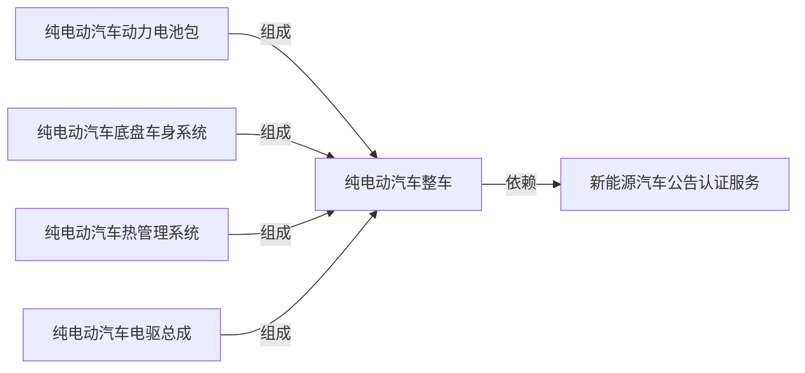

#### 受影响节点

| Node ID | 受影响节点 | 本次影响 | 结果 | 结论性质 | 传导逻辑（为什么到这里） | 关联 Evidence | 时间窗口 | 置信度 |
|---|---|---|---|---|---|---|---|---|
| `0e9bc54c-f89…` | 纯电动汽车整车 | 交付周期 UP/HIGH；扩产强度 UP/HIGH；渗透率 UP/MEDIUM；订单可见度 UP/HIGH | 升温 | 直接证据 | 小鹏GX上市12小时内获24863份订单，Ultra版交付等待时间达35周，小鹏因此增加模具和产线；小鹏为应对GX订单激增，增加关键零部件模具和产线。对“纯电动汽车整车”环节而言，这意味着交付周期上升、扩产强度上升、渗透率上升、订单可见度上升，因此本期判断为升温。 | EVDdab47e47-c046-5e7e-8745-fc8d61c6f83a, EVD8c1aca8d-1517-5531-bebc-70b466dcafb1 | 中期–短期 | 中–高 |
| `50922f37-966…` | 新能源汽车公告认证服务 | 市场需求 UP/LOW | 升温 | 推理假设 | 纯电动汽车整车的订单和扩产走强，通常伴随新车型、配置和生产变更的准入需求。整车明确依赖公告认证服务，因此推测该服务需求上升，但需后续车型申报数验证。 | — | 中期 | 低 |
| `8c11adf0-00a…` | 纯电动汽车动力电池包 | 市场需求 UP/LOW | 升温 | 推理假设 | 纯电动汽车整车的订单可见度、扩产强度和渗透率上升，会按整车产量拉动动力电池包配套。动力电池包是整车的明确组成环节，因此推测其市场需求上升。 | — | 中期 | 中 |
| `0a94a6fe-97d…` | 纯电动汽车底盘车身系统 | 市场需求 UP/LOW | 升温 | 推理假设 | 纯电动汽车整车的订单可见度和扩产强度上升，会按整车产量增加底盘车身系统的配套量。该系统是整车的明确组成环节，因此推测其市场需求上升。 | — | 中期 | 中 |
| `f979b6fa-f2c…` | 纯电动汽车热管理系统 | 市场需求 UP/LOW | 升温 | 推理假设 | 纯电动汽车整车订单和扩产走强，会增加电池、电驱和座舱热管理的配套量。热管理系统是整车的明确组成环节，因此推测其市场需求上升。 | — | 中期 | 中 |
| `f320a7ca-8dc…` | 纯电动汽车电驱总成 | 市场需求 UP/LOW | 升温 | 推理假设 | 纯电动汽车整车订单和扩产走强，会按整车产量增加电驱总成的配套量。电驱总成是整车的明确组成环节，因此推测其市场需求上升。 | — | 中期 | 中 |

- **停止条件**：若后续 Event 使节点 Signal 失效、方向反转，或链语境确认不属于本链，则关闭或修正本链结论。

### 3.18 CHN-18 普通钢材产业链

**一句话结论（C-CHN-18）**：钢铁长材出现直接 Signal，当前链级聚合结果为升温，已形成可解释的动态传导假设，其余相邻节点仍待验证；本链新增 1 条动态传导假设。

- **链状态**：直接节点 Signal 明确；新增 1 条动态传导假设，其余相邻节点继续待验证
- **链结果**：升温
- **时间窗口**：短期–长期
- **置信度**：中–高
- **路径**：`钢铁长材`（直接 Signal 节点）→ 真实同链拓扑节点
- **已接受的动态传导假设**：钢铁长材 → 普钢长材轧制工序

#### 链路图


#### 受影响节点

| Node ID | 受影响节点 | 本次影响 | 结果 | 结论性质 | 传导逻辑（为什么到这里） | 关联 Evidence | 时间窗口 | 置信度 |
|---|---|---|---|---|---|---|---|---|
| `4796e0fe-b56…` | 钢铁长材 | 定价权 UP/MEDIUM；成本传导能力 UP/MEDIUM；进口依赖度 UP/MEDIUM；销售价格 UP/MEDIUM | 升温 | 直接证据 | 中国钢坯出口商将钢坯出口报价上调至465-470美元/吨FOB；欧盟调整钢铁配额及CBAM政策，增加钢铁出口至欧盟的成本，影响相关钢铁产业链节点的进口依赖度和供应格局。对“钢铁长材”环节而言，这意味着定价权上升、成本传导能力上升、进口依赖度上升、销售价格上升，因此本期判断为升温。 | EVDf025f25d-be8c-5096-bb30-a90d88015091, EVDc8281b74-3f22-577b-a3e9-f0a52b99d024 | 短期–长期 | 中–高 |
| `334fe51e-677…` | 普钢长材轧制工序 | 产能利用率 UP/LOW | 升温 | 推理假设 | 钢铁长材的销售价格、定价权和成本传导能力上升，可能支撑国内长材生产和轧制活动。长材轧制工序是钢铁长材的明确投入环节，因此推测其产能利用率上升。 | — | 短期–中期 | 低 |

- **停止条件**：若后续 Event 使节点 Signal 失效、方向反转，或链语境确认不属于本链，则关闭或修正本链结论。

### 3.19 CHN-19 汽车一体化压铸产业链

**一句话结论（C-CHN-19）**：新能源车整车出现直接 Signal，节点方向为升温；但至少一个节点同时归属多条产业链，本链是否承接全部影响仍需链语境验证。

- **链状态**：节点 Signal 明确，链语境待解析
- **链结果**：升温
- **时间窗口**：长期–中期
- **置信度**：低–中
- **路径**：`新能源车整车`（直接 Signal 节点）→ 真实同链拓扑节点

#### 链路图


#### 受影响节点

| Node ID | 受影响节点 | 本次影响 | 结果 | 结论性质 | 传导逻辑（为什么到这里） | 关联 Evidence | 时间窗口 | 置信度 |
|---|---|---|---|---|---|---|---|---|
| `0ae9b007-d57…` | 新能源车整车 | 商业化进度 UP/MEDIUM；市场需求 UP/MEDIUM；性价比 UP/MEDIUM；技术成熟度 UP/MEDIUM | 升温 | 直接证据 | 中国国家市场监管总局宣布分阶段实施GB1589-2026标准，新车型需于2027年7月1日起符合，现有车型需于2028年1月1日起符合，并给予车企技术升级和过渡时间；吉利汽车发布混动SUV车型Monjaro EM-i，开启首款混动D级SUV全球推广，直接增加新能源车（混动SUV）的供给与可得性；该节点归属 5 条链，本链语境未确定。对“新能源车整车”环节而言，这意味着商业化进度上升、市场需求上升、性价比上升、技术成熟度上升，因此本期判断为升温。 | EVDd37fc63d-aa18-597c-9eee-1b492337b9ae, EVDee8efabd-c096-5d52-be80-5348d09059ef, EVD2f12eefd-3b25-59f2-831e-07b83f3c1ff6 | 长期–中期 | 低–中 |
| `22736f71-0f0…` | 一体化压铸车身结构件 | 真实同链拓扑相邻，尚无直接 Signal | 待验证 | — | “一体化压铸车身结构件”与本链中的直接受影响节点存在真实产业链关系，但在本次证据范围内，没有订单、价格、产能、技术进展或经营数据直接指向该环节，也没有足够依据确认影响已经传导至此，因此暂不判断升降方向。 | — | 后续周期 | 低 |

- **停止条件**：若后续 Event 使节点 Signal 失效、方向反转，或链语境确认不属于本链，则关闭或修正本链结论。

### 3.20 CHN-20 汽车热管理系统产业链

**一句话结论（C-CHN-20）**：新能源车整车出现直接 Signal，节点方向为升温；但至少一个节点同时归属多条产业链，本链是否承接全部影响仍需链语境验证。

- **链状态**：节点 Signal 明确，链语境待解析
- **链结果**：升温
- **时间窗口**：长期–中期
- **置信度**：低–中
- **路径**：`新能源车整车`（直接 Signal 节点）→ 真实同链拓扑节点

#### 链路图


#### 受影响节点

| Node ID | 受影响节点 | 本次影响 | 结果 | 结论性质 | 传导逻辑（为什么到这里） | 关联 Evidence | 时间窗口 | 置信度 |
|---|---|---|---|---|---|---|---|---|
| `0ae9b007-d57…` | 新能源车整车 | 商业化进度 UP/MEDIUM；市场需求 UP/MEDIUM；性价比 UP/MEDIUM；技术成熟度 UP/MEDIUM | 升温 | 直接证据 | 中国国家市场监管总局宣布分阶段实施GB1589-2026标准，新车型需于2027年7月1日起符合，现有车型需于2028年1月1日起符合，并给予车企技术升级和过渡时间；吉利汽车发布混动SUV车型Monjaro EM-i，开启首款混动D级SUV全球推广，直接增加新能源车（混动SUV）的供给与可得性；该节点归属 5 条链，本链语境未确定。对“新能源车整车”环节而言，这意味着商业化进度上升、市场需求上升、性价比上升、技术成熟度上升，因此本期判断为升温。 | EVDd37fc63d-aa18-597c-9eee-1b492337b9ae, EVDee8efabd-c096-5d52-be80-5348d09059ef, EVD2f12eefd-3b25-59f2-831e-07b83f3c1ff6 | 长期–中期 | 低–中 |
| `c8e314e9-379…` | 汽车热管理系统 | 真实同链拓扑相邻，尚无直接 Signal | 待验证 | — | “汽车热管理系统”与本链中的直接受影响节点存在真实产业链关系，但在本次证据范围内，没有订单、价格、产能、技术进展或经营数据直接指向该环节，也没有足够依据确认影响已经传导至此，因此暂不判断升降方向。 | — | 后续周期 | 低 |

- **停止条件**：若后续 Event 使节点 Signal 失效、方向反转，或链语境确认不属于本链，则关闭或修正本链结论。

### 3.21 CHN-21 油品石化贸易服务产业链

**一句话结论（C-CHN-21）**：油品运输服务出现直接 Signal，当前链级聚合结果为分化，已形成可解释的动态传导假设，其余相邻节点仍待验证；本链新增 1 条动态传导假设。

- **链状态**：直接节点 Signal 明确；新增 1 条动态传导假设，其余相邻节点继续待验证
- **链结果**：分化
- **时间窗口**：中期
- **置信度**：中–高
- **路径**：`油品运输服务`（直接 Signal 节点）→ 真实同链拓扑节点
- **已接受的动态传导假设**：油品运输服务 → 成品油批发交付服务

#### 链路图

```mermaid
flowchart LR
  N1666411[成品油批发交付服务] -->|依赖| N3658067[油品运输服务]
```

#### 受影响节点

| Node ID | 受影响节点 | 本次影响 | 结果 | 结论性质 | 传导逻辑（为什么到这里） | 关联 Evidence | 时间窗口 | 置信度 |
|---|---|---|---|---|---|---|---|---|
| `e7aa9244-2e3…` | 油品运输服务 | 交付周期 UP/HIGH；利润率 UP/HIGH；战略资源安全 DOWN/MEDIUM；销售价格 UP/HIGH | 分化 | 直接证据 | 美伊冲突扰乱霍尔木兹海峡，导致油品运输服务的交付周期延长；美伊冲突扰乱霍尔木兹海峡，油运高景气延续，TD3C-TCE超60万美元/天。对“油品运输服务”环节而言，这意味着交付周期上升、利润率上升、战略资源安全下降、销售价格上升，因此本期判断为分化。 | EVD6348099e-e5ce-56a1-81cc-ed222562c6e7, EVDb54ff5b3-ba64-5771-b0a2-fee91b6abf27 | 中期 | 中–高 |
| `db3e28c5-9ec…` | 成品油批发交付服务 | 投入成本 UP/LOW；交付周期 UP/LOW | 降温 | 推理假设 | 油品运输的交付周期和销售价格上升，会把更高的物流成本和更长的到货时间传导给批发交付环节。成品油批发服务明确依赖运输服务，因此推测其投入成本和交付周期上升，经营景气受压。 | — | 短期–中期 | 低 |

- **停止条件**：若后续 Event 使节点 Signal 失效、方向反转，或链语境确认不属于本链，则关闭或修正本链结论。

### 3.22 CHN-22 火力发电设备产业链

**一句话结论（C-CHN-22）**：汽轮机出现直接 Signal，当前链级聚合结果为分化，已形成可解释的动态传导假设，其余相邻节点仍待验证；本链新增 1 条动态传导假设。

- **链状态**：直接节点 Signal 明确；新增 1 条动态传导假设，其余相邻节点继续待验证
- **链结果**：分化
- **时间窗口**：长期–中期
- **置信度**：中–高
- **路径**：`汽轮机`（直接 Signal 节点）→ 真实同链拓扑节点
- **已接受的动态传导假设**：汽轮机 → 火电设备

#### 链路图

```mermaid
flowchart LR
  N7682904[汽轮机] -->|组成| N3486959[火电设备]
```

#### 受影响节点

| Node ID | 受影响节点 | 本次影响 | 结果 | 结论性质 | 传导逻辑（为什么到这里） | 关联 Evidence | 时间窗口 | 置信度 |
|---|---|---|---|---|---|---|---|---|
| `09286af8-91f…` | 汽轮机 | 产能释放周期 UP/MEDIUM；市场需求 UP/HIGH；库存水平 DOWN/MEDIUM；扩产强度 UP/MEDIUM | 分化 | 直接证据 | 美国燃气轮机需求创新高，促使制造商扩大产能；美国对燃气轮机的需求创历史新高，主要由数据中心电力需求驱动。对“汽轮机”环节而言，这意味着产能释放周期上升、市场需求上升、库存水平下降、扩产强度上升，因此本期判断为分化。 | EVDeb2d05f3-1730-5271-ae8b-c5b6ca653712 | 长期–中期 | 中–高 |
| `f33d7edb-720…` | 火电设备 | 市场需求 UP/LOW；扩产强度 UP/LOW | 升温 | 推理假设 | 汽轮机的市场需求和扩产强度上升，表明火电和燃机设备的核心动力环节正在扩张。汽轮机是火电设备的明确组成环节，因此推测整体设备需求和扩产强度上升。 | — | 中期–长期 | 低 |

- **停止条件**：若后续 Event 使节点 Signal 失效、方向反转，或链语境确认不属于本链，则关闭或修正本链结论。

### 3.23 CHN-23 磷酸铁锂刀片电池产业链

**一句话结论（C-CHN-23）**：新能源车整车出现直接 Signal，节点方向为升温；但至少一个节点同时归属多条产业链，本链是否承接全部影响仍需链语境验证。

- **链状态**：节点 Signal 明确，链语境待解析
- **链结果**：升温
- **时间窗口**：长期–中期
- **置信度**：低–中
- **路径**：`新能源车整车`（直接 Signal 节点）→ 真实同链拓扑节点

#### 链路图

```mermaid
flowchart LR
  N6300877[刀片电池] -->|组成| N5752338[新能源车整车]
```

#### 受影响节点

| Node ID | 受影响节点 | 本次影响 | 结果 | 结论性质 | 传导逻辑（为什么到这里） | 关联 Evidence | 时间窗口 | 置信度 |
|---|---|---|---|---|---|---|---|---|
| `0ae9b007-d57…` | 新能源车整车 | 商业化进度 UP/MEDIUM；市场需求 UP/MEDIUM；性价比 UP/MEDIUM；技术成熟度 UP/MEDIUM | 升温 | 直接证据 | 中国国家市场监管总局宣布分阶段实施GB1589-2026标准，新车型需于2027年7月1日起符合，现有车型需于2028年1月1日起符合，并给予车企技术升级和过渡时间；吉利汽车发布混动SUV车型Monjaro EM-i，开启首款混动D级SUV全球推广，直接增加新能源车（混动SUV）的供给与可得性；该节点归属 5 条链，本链语境未确定。对“新能源车整车”环节而言，这意味着商业化进度上升、市场需求上升、性价比上升、技术成熟度上升，因此本期判断为升温。 | EVDd37fc63d-aa18-597c-9eee-1b492337b9ae, EVDee8efabd-c096-5d52-be80-5348d09059ef, EVD2f12eefd-3b25-59f2-831e-07b83f3c1ff6 | 长期–中期 | 低–中 |
| `7a4ace6b-529…` | 刀片电池 | 真实同链拓扑相邻，尚无直接 Signal | 待验证 | — | “刀片电池”与本链中的直接受影响节点存在真实产业链关系，但在本次证据范围内，没有订单、价格、产能、技术进展或经营数据直接指向该环节，也没有足够依据确认影响已经传导至此，因此暂不判断升降方向。 | — | 后续周期 | 低 |

- **停止条件**：若后续 Event 使节点 Signal 失效、方向反转，或链语境确认不属于本链，则关闭或修正本链结论。

### 3.24 CHN-24 车规级功率模块产业链

**一句话结论（C-CHN-24）**：新能源车整车出现直接 Signal，节点方向为升温；但至少一个节点同时归属多条产业链，本链是否承接全部影响仍需链语境验证。

- **链状态**：节点 Signal 明确，链语境待解析
- **链结果**：升温
- **时间窗口**：长期–中期
- **置信度**：低–中
- **路径**：`新能源车整车`（直接 Signal 节点）→ 真实同链拓扑节点

#### 链路图

```mermaid
flowchart LR
  N5590140[新能源汽车主驱逆变器] -->|组成| N5752338[新能源车整车]
```

#### 受影响节点

| Node ID | 受影响节点 | 本次影响 | 结果 | 结论性质 | 传导逻辑（为什么到这里） | 关联 Evidence | 时间窗口 | 置信度 |
|---|---|---|---|---|---|---|---|---|
| `0ae9b007-d57…` | 新能源车整车 | 商业化进度 UP/MEDIUM；市场需求 UP/MEDIUM；性价比 UP/MEDIUM；技术成熟度 UP/MEDIUM | 升温 | 直接证据 | 中国国家市场监管总局宣布分阶段实施GB1589-2026标准，新车型需于2027年7月1日起符合，现有车型需于2028年1月1日起符合，并给予车企技术升级和过渡时间；吉利汽车发布混动SUV车型Monjaro EM-i，开启首款混动D级SUV全球推广，直接增加新能源车（混动SUV）的供给与可得性；该节点归属 5 条链，本链语境未确定。对“新能源车整车”环节而言，这意味着商业化进度上升、市场需求上升、性价比上升、技术成熟度上升，因此本期判断为升温。 | EVDd37fc63d-aa18-597c-9eee-1b492337b9ae, EVDee8efabd-c096-5d52-be80-5348d09059ef, EVD2f12eefd-3b25-59f2-831e-07b83f3c1ff6 | 长期–中期 | 低–中 |
| `41754bb5-628…` | 新能源汽车主驱逆变器 | 真实同链拓扑相邻，尚无直接 Signal | 待验证 | — | “新能源汽车主驱逆变器”与本链中的直接受影响节点存在真实产业链关系，但在本次证据范围内，没有订单、价格、产能、技术进展或经营数据直接指向该环节，也没有足够依据确认影响已经传导至此，因此暂不判断升降方向。 | — | 后续周期 | 低 |

- **停止条件**：若后续 Event 使节点 Signal 失效、方向反转，或链语境确认不属于本链，则关闭或修正本链结论。

### 3.25 CHN-25 AI个人电脑产业链

**一句话结论（C-CHN-25）**：AI芯片出现直接 Signal，节点方向为升温；但至少一个节点同时归属多条产业链，本链是否承接全部影响仍需链语境验证。

- **链状态**：节点 Signal 明确，链语境待解析
- **链结果**：升温
- **时间窗口**：长期–中期
- **置信度**：低–中
- **路径**：`AI芯片`（直接 Signal 节点）→ 真实同链拓扑节点

#### 链路图

```mermaid
flowchart LR
  N6153322[AI芯片] -->|组成| N1101772[AI PC]
```

#### 受影响节点

| Node ID | 受影响节点 | 本次影响 | 结果 | 结论性质 | 传导逻辑（为什么到这里） | 关联 Evidence | 时间窗口 | 置信度 |
|---|---|---|---|---|---|---|---|---|
| `7a5bf267-99c…` | AI芯片 | 商业化进度 UP/MEDIUM；技术成熟度 UP/MEDIUM | 升温 | 直接证据 | Google与Marvell扩大定制芯片合作，涉及TPU等AI芯片领域；OpenAI在Hot Chips 2026披露自研AI加速器ASIC Jalapeño的基准测试结果，该芯片为通用AI负载从零设计，非GPU改造；该节点归属 7 条链，本链语境未确定。对“AI芯片”环节而言，这意味着商业化进度上升、技术成熟度上升，因此本期判断为升温。 | EVDf7b24238-6d58-55e5-9c11-ffdd383bf528, EVD3053dc5b-038a-5302-b846-4f53fbc8b706 | 长期–中期 | 低–中 |
| `a05bef65-ebd…` | AI PC | 真实同链拓扑相邻，尚无直接 Signal | 待验证 | — | “AI PC”与本链中的直接受影响节点存在真实产业链关系，但在本次证据范围内，没有订单、价格、产能、技术进展或经营数据直接指向该环节，也没有足够依据确认影响已经传导至此，因此暂不判断升降方向。 | — | 后续周期 | 低 |

- **停止条件**：若后续 Event 使节点 Signal 失效、方向反转，或链语境确认不属于本链，则关闭或修正本链结论。

### 3.26 CHN-26 AI智能眼镜产业链

**一句话结论（C-CHN-26）**：AI芯片出现直接 Signal，节点方向为升温；但至少一个节点同时归属多条产业链，本链是否承接全部影响仍需链语境验证。

- **链状态**：节点 Signal 明确，链语境待解析
- **链结果**：升温
- **时间窗口**：长期–中期
- **置信度**：低–中
- **路径**：`AI芯片`（直接 Signal 节点）→ 真实同链拓扑节点

#### 链路图

```mermaid
flowchart LR
  N6153322[AI芯片] -->|组成| N6456044[AI眼镜]
```

#### 受影响节点

| Node ID | 受影响节点 | 本次影响 | 结果 | 结论性质 | 传导逻辑（为什么到这里） | 关联 Evidence | 时间窗口 | 置信度 |
|---|---|---|---|---|---|---|---|---|
| `7a5bf267-99c…` | AI芯片 | 商业化进度 UP/MEDIUM；技术成熟度 UP/MEDIUM | 升温 | 直接证据 | Google与Marvell扩大定制芯片合作，涉及TPU等AI芯片领域；OpenAI在Hot Chips 2026披露自研AI加速器ASIC Jalapeño的基准测试结果，该芯片为通用AI负载从零设计，非GPU改造；该节点归属 7 条链，本链语境未确定。对“AI芯片”环节而言，这意味着商业化进度上升、技术成熟度上升，因此本期判断为升温。 | EVDf7b24238-6d58-55e5-9c11-ffdd383bf528, EVD3053dc5b-038a-5302-b846-4f53fbc8b706 | 长期–中期 | 低–中 |
| `fdcb92de-d9e…` | AI眼镜 | 真实同链拓扑相邻，尚无直接 Signal | 待验证 | — | “AI眼镜”与本链中的直接受影响节点存在真实产业链关系，但在本次证据范围内，没有订单、价格、产能、技术进展或经营数据直接指向该环节，也没有足够依据确认影响已经传导至此，因此暂不判断升降方向。 | — | 后续周期 | 低 |

- **停止条件**：若后续 Event 使节点 Signal 失效、方向反转，或链语境确认不属于本链，则关闭或修正本链结论。

### 3.27 CHN-27 AI算力租赁服务产业链

**一句话结论（C-CHN-27）**：AI芯片出现直接 Signal，节点方向为升温；但至少一个节点同时归属多条产业链，本链是否承接全部影响仍需链语境验证。

- **链状态**：节点 Signal 明确，链语境待解析
- **链结果**：升温
- **时间窗口**：长期–中期
- **置信度**：低–中
- **路径**：`AI芯片`（直接 Signal 节点）→ 真实同链拓扑节点

#### 链路图

```mermaid
flowchart LR
  N6153322[AI芯片] -->|组成| N6715156[AI服务器]
```

#### 受影响节点

| Node ID | 受影响节点 | 本次影响 | 结果 | 结论性质 | 传导逻辑（为什么到这里） | 关联 Evidence | 时间窗口 | 置信度 |
|---|---|---|---|---|---|---|---|---|
| `7a5bf267-99c…` | AI芯片 | 商业化进度 UP/MEDIUM；技术成熟度 UP/MEDIUM | 升温 | 直接证据 | Google与Marvell扩大定制芯片合作，涉及TPU等AI芯片领域；OpenAI在Hot Chips 2026披露自研AI加速器ASIC Jalapeño的基准测试结果，该芯片为通用AI负载从零设计，非GPU改造；该节点归属 7 条链，本链语境未确定。对“AI芯片”环节而言，这意味着商业化进度上升、技术成熟度上升，因此本期判断为升温。 | EVDf7b24238-6d58-55e5-9c11-ffdd383bf528, EVD3053dc5b-038a-5302-b846-4f53fbc8b706 | 长期–中期 | 低–中 |
| `528043a8-501…` | AI服务器 | 真实同链拓扑相邻，尚无直接 Signal | 待验证 | — | “AI服务器”与本链中的直接受影响节点存在真实产业链关系，但在本次证据范围内，没有订单、价格、产能、技术进展或经营数据直接指向该环节，也没有足够依据确认影响已经传导至此，因此暂不判断升降方向。 | — | 后续周期 | 低 |

- **停止条件**：若后续 Event 使节点 Signal 失效、方向反转，或链语境确认不属于本链，则关闭或修正本链结论。

### 3.28 CHN-28 CAR-T细胞治疗产业链

**一句话结论（C-CHN-28）**：医院医疗服务出现直接 Signal，节点方向为升温；但至少一个节点同时归属多条产业链，本链是否承接全部影响仍需链语境验证。

- **链状态**：节点 Signal 明确，链语境待解析
- **链结果**：升温
- **时间窗口**：长期
- **置信度**：低–中
- **路径**：`医院医疗服务`（直接 Signal 节点）→ 真实同链拓扑节点

#### 链路图

```mermaid
flowchart LR
  N2627659[CAR-T细胞疗法] -->|投入| N4967137[医院医疗服务]
```

#### 受影响节点

| Node ID | 受影响节点 | 本次影响 | 结果 | 结论性质 | 传导逻辑（为什么到这里） | 关联 Evidence | 时间窗口 | 置信度 |
|---|---|---|---|---|---|---|---|---|
| `ff3b783c-493…` | 医院医疗服务 | 商业化进度 UP/MEDIUM；市场需求 UP/MEDIUM | 升温 | 直接证据 | 华为与瑞金医院发布瑞智病理大模型RuiPath 2.0并落地90+医院；该节点归属 6 条链，本链语境未确定。对“医院医疗服务”环节而言，这意味着商业化进度上升、市场需求上升，因此本期判断为升温。 | EVDd505004c-d803-5f07-b326-681e7a02a6f6 | 长期 | 低–中 |
| `24b58868-9ce…` | CAR-T细胞疗法 | 真实同链拓扑相邻，尚无直接 Signal | 待验证 | — | “CAR-T细胞疗法”与本链中的直接受影响节点存在真实产业链关系，但在本次证据范围内，没有订单、价格、产能、技术进展或经营数据直接指向该环节，也没有足够依据确认影响已经传导至此，因此暂不判断升降方向。 | — | 后续周期 | 低 |

- **停止条件**：若后续 Event 使节点 Signal 失效、方向反转，或链语境确认不属于本链，则关闭或修正本链结论。

### 3.29 CHN-29 化学药制剂产业链

**一句话结论（C-CHN-29）**：医院医疗服务出现直接 Signal，节点方向为升温；但至少一个节点同时归属多条产业链，本链是否承接全部影响仍需链语境验证。

- **链状态**：节点 Signal 明确，链语境待解析
- **链结果**：升温
- **时间窗口**：长期
- **置信度**：低–中
- **路径**：`医院医疗服务`（直接 Signal 节点）→ 真实同链拓扑节点

#### 链路图

```mermaid
flowchart LR
  N4319566[医药流通服务] -->|投入| N4967137[医院医疗服务]
```

#### 受影响节点

| Node ID | 受影响节点 | 本次影响 | 结果 | 结论性质 | 传导逻辑（为什么到这里） | 关联 Evidence | 时间窗口 | 置信度 |
|---|---|---|---|---|---|---|---|---|
| `ff3b783c-493…` | 医院医疗服务 | 商业化进度 UP/MEDIUM；市场需求 UP/MEDIUM | 升温 | 直接证据 | 华为与瑞金医院发布瑞智病理大模型RuiPath 2.0并落地90+医院；该节点归属 6 条链，本链语境未确定。对“医院医疗服务”环节而言，这意味着商业化进度上升、市场需求上升，因此本期判断为升温。 | EVDd505004c-d803-5f07-b326-681e7a02a6f6 | 长期 | 低–中 |
| `c1f40a04-f42…` | 医药流通服务 | 真实同链拓扑相邻，尚无直接 Signal | 待验证 | — | “医药流通服务”与本链中的直接受影响节点存在真实产业链关系，但在本次证据范围内，没有订单、价格、产能、技术进展或经营数据直接指向该环节，也没有足够依据确认影响已经传导至此，因此暂不判断升降方向。 | — | 后续周期 | 低 |

- **停止条件**：若后续 Event 使节点 Signal 失效、方向反转，或链语境确认不属于本链，则关闭或修正本链结论。

### 3.30 CHN-30 医用芬太尼药品产业链

**一句话结论（C-CHN-30）**：医院医疗服务出现直接 Signal，节点方向为升温；但至少一个节点同时归属多条产业链，本链是否承接全部影响仍需链语境验证。

- **链状态**：节点 Signal 明确，链语境待解析
- **链结果**：升温
- **时间窗口**：长期
- **置信度**：低–中
- **路径**：`医院医疗服务`（直接 Signal 节点）→ 真实同链拓扑节点

#### 链路图

```mermaid
flowchart LR
  N4319566[医药流通服务] -->|投入| N4967137[医院医疗服务]
```

#### 受影响节点

| Node ID | 受影响节点 | 本次影响 | 结果 | 结论性质 | 传导逻辑（为什么到这里） | 关联 Evidence | 时间窗口 | 置信度 |
|---|---|---|---|---|---|---|---|---|
| `ff3b783c-493…` | 医院医疗服务 | 商业化进度 UP/MEDIUM；市场需求 UP/MEDIUM | 升温 | 直接证据 | 华为与瑞金医院发布瑞智病理大模型RuiPath 2.0并落地90+医院；该节点归属 6 条链，本链语境未确定。对“医院医疗服务”环节而言，这意味着商业化进度上升、市场需求上升，因此本期判断为升温。 | EVDd505004c-d803-5f07-b326-681e7a02a6f6 | 长期 | 低–中 |
| `c1f40a04-f42…` | 医药流通服务 | 真实同链拓扑相邻，尚无直接 Signal | 待验证 | — | “医药流通服务”与本链中的直接受影响节点存在真实产业链关系，但在本次证据范围内，没有订单、价格、产能、技术进展或经营数据直接指向该环节，也没有足够依据确认影响已经传导至此，因此暂不判断升降方向。 | — | 后续周期 | 低 |

- **停止条件**：若后续 Event 使节点 Signal 失效、方向反转，或链语境确认不属于本链，则关闭或修正本链结论。

### 3.31 CHN-31 医疗信息化系统产业链

**一句话结论（C-CHN-31）**：医院医疗服务出现直接 Signal，节点方向为升温；但至少一个节点同时归属多条产业链，本链是否承接全部影响仍需链语境验证。

- **链状态**：节点 Signal 明确，链语境待解析
- **链结果**：升温
- **时间窗口**：长期
- **置信度**：低–中
- **路径**：`医院医疗服务`（直接 Signal 节点）→ 真实同链拓扑节点

#### 链路图

```mermaid
flowchart LR
  N4967137[医院医疗服务] -->|依赖| N3499566[医院信息系统]
```

#### 受影响节点

| Node ID | 受影响节点 | 本次影响 | 结果 | 结论性质 | 传导逻辑（为什么到这里） | 关联 Evidence | 时间窗口 | 置信度 |
|---|---|---|---|---|---|---|---|---|
| `ff3b783c-493…` | 医院医疗服务 | 商业化进度 UP/MEDIUM；市场需求 UP/MEDIUM | 升温 | 直接证据 | 华为与瑞金医院发布瑞智病理大模型RuiPath 2.0并落地90+医院；该节点归属 6 条链，本链语境未确定。对“医院医疗服务”环节而言，这意味着商业化进度上升、市场需求上升，因此本期判断为升温。 | EVDd505004c-d803-5f07-b326-681e7a02a6f6 | 长期 | 低–中 |
| `b90781d9-273…` | 医院信息系统 | 真实同链拓扑相邻，尚无直接 Signal | 待验证 | — | “医院信息系统”与本链中的直接受影响节点存在真实产业链关系，但在本次证据范围内，没有订单、价格、产能、技术进展或经营数据直接指向该环节，也没有足够依据确认影响已经传导至此，因此暂不判断升降方向。 | — | 后续周期 | 低 |

- **停止条件**：若后续 Event 使节点 Signal 失效、方向反转，或链语境确认不属于本链，则关闭或修正本链结论。

### 3.32 CHN-32 医疗设备产业链

**一句话结论（C-CHN-32）**：医院医疗服务出现直接 Signal，节点方向为升温；但至少一个节点同时归属多条产业链，本链是否承接全部影响仍需链语境验证。

- **链状态**：节点 Signal 明确，链语境待解析
- **链结果**：升温
- **时间窗口**：长期
- **置信度**：低–中
- **路径**：`医院医疗服务`（直接 Signal 节点）→ 真实同链拓扑节点

#### 链路图

```mermaid
flowchart LR
  N728716[多参数患者监护仪] -->|投入| N4967137[医院医疗服务]
```

#### 受影响节点

| Node ID | 受影响节点 | 本次影响 | 结果 | 结论性质 | 传导逻辑（为什么到这里） | 关联 Evidence | 时间窗口 | 置信度 |
|---|---|---|---|---|---|---|---|---|
| `ff3b783c-493…` | 医院医疗服务 | 商业化进度 UP/MEDIUM；市场需求 UP/MEDIUM | 升温 | 直接证据 | 华为与瑞金医院发布瑞智病理大模型RuiPath 2.0并落地90+医院；该节点归属 6 条链，本链语境未确定。对“医院医疗服务”环节而言，这意味着商业化进度上升、市场需求上升，因此本期判断为升温。 | EVDd505004c-d803-5f07-b326-681e7a02a6f6 | 长期 | 低–中 |
| `34addba7-bc7…` | 多参数患者监护仪 | 真实同链拓扑相邻，尚无直接 Signal | 待验证 | — | “多参数患者监护仪”与本链中的直接受影响节点存在真实产业链关系，但在本次证据范围内，没有订单、价格、产能、技术进展或经营数据直接指向该环节，也没有足够依据确认影响已经传导至此，因此暂不判断升降方向。 | — | 后续周期 | 低 |

- **停止条件**：若后续 Event 使节点 Signal 失效、方向反转，或链语境确认不属于本链，则关闭或修正本链结论。

### 3.33 CHN-33 医院医疗服务产业链

**一句话结论（C-CHN-33）**：医院医疗服务出现直接 Signal，节点方向为升温；但至少一个节点同时归属多条产业链，本链是否承接全部影响仍需链语境验证。

- **链状态**：节点 Signal 明确，链语境待解析
- **链结果**：升温
- **时间窗口**：长期
- **置信度**：低–中
- **路径**：`医院医疗服务`（直接 Signal 节点）→ 真实同链拓扑节点

#### 链路图

```mermaid
flowchart LR
  N154721[医护专业服务] -->|投入| N4967137[医院医疗服务]
  N4967137[医院医疗服务] -->|依赖| N9053535[医院诊疗设施]
  N7317753[医院药械供应服务] -->|投入| N4967137[医院医疗服务]
```

#### 受影响节点

| Node ID | 受影响节点 | 本次影响 | 结果 | 结论性质 | 传导逻辑（为什么到这里） | 关联 Evidence | 时间窗口 | 置信度 |
|---|---|---|---|---|---|---|---|---|
| `ff3b783c-493…` | 医院医疗服务 | 商业化进度 UP/MEDIUM；市场需求 UP/MEDIUM | 升温 | 直接证据 | 华为与瑞金医院发布瑞智病理大模型RuiPath 2.0并落地90+医院；该节点归属 6 条链，本链语境未确定。对“医院医疗服务”环节而言，这意味着商业化进度上升、市场需求上升，因此本期判断为升温。 | EVDd505004c-d803-5f07-b326-681e7a02a6f6 | 长期 | 低–中 |
| `b21781e2-026…` | 医护专业服务 | 真实同链拓扑相邻，尚无直接 Signal | 待验证 | — | “医护专业服务”与本链中的直接受影响节点存在真实产业链关系，但在本次证据范围内，没有订单、价格、产能、技术进展或经营数据直接指向该环节，也没有足够依据确认影响已经传导至此，因此暂不判断升降方向。 | — | 后续周期 | 低 |
| `f3c95eb5-4d5…` | 医院药械供应服务 | 真实同链拓扑相邻，尚无直接 Signal | 待验证 | — | “医院药械供应服务”与本链中的直接受影响节点存在真实产业链关系，但在本次证据范围内，没有订单、价格、产能、技术进展或经营数据直接指向该环节，也没有足够依据确认影响已经传导至此，因此暂不判断升降方向。 | — | 后续周期 | 低 |
| `88c3b45b-fd2…` | 医院诊疗设施 | 真实同链拓扑相邻，尚无直接 Signal | 待验证 | — | “医院诊疗设施”与本链中的直接受影响节点存在真实产业链关系，但在本次证据范围内，没有订单、价格、产能、技术进展或经营数据直接指向该环节，也没有足够依据确认影响已经传导至此，因此暂不判断升降方向。 | — | 后续周期 | 低 |

- **停止条件**：若后续 Event 使节点 Signal 失效、方向反转，或链语境确认不属于本链，则关闭或修正本链结论。

### 3.34 CHN-34 跨境支付服务产业链

**一句话结论（C-CHN-34）**：跨境支付服务出现直接 Signal，节点方向为分化；但至少一个节点同时归属多条产业链，本链是否承接全部影响仍需链语境验证。

- **链状态**：节点 Signal 明确，链语境待解析
- **链结果**：分化
- **时间窗口**：中期–长期
- **置信度**：低–中
- **路径**：`跨境支付服务`（直接 Signal 节点）→ 真实同链拓扑节点

#### 链路图

```mermaid
flowchart LR
  N77244[跨境支付服务] -->|依赖| N3309837[反洗钱与制裁筛查系统]
  N7553422[支付网关服务] -->|投入| N77244[跨境支付服务]
  N1353011[外汇兑换服务] -->|投入| N77244[跨境支付服务]
```

#### 受影响节点

| Node ID | 受影响节点 | 本次影响 | 结果 | 结论性质 | 传导逻辑（为什么到这里） | 关联 Evidence | 时间窗口 | 置信度 |
|---|---|---|---|---|---|---|---|---|
| `d0aab5c4-c94…` | 跨境支付服务 | 渗透率 UP/LOW；进口依赖度 DOWN/LOW | 分化 | 直接证据 | 中东客户主动询问用人民币结算以节省换汇手续费并改善账期，反映跨境支付服务采用人民币结算的意愿增强；中东客户对人民币结算的兴趣可能推动跨境支付服务减少对美元等外币的依赖，从而降低进口依赖度；该节点归属 2 条链，本链语境未确定。对“跨境支付服务”环节而言，这意味着渗透率上升、进口依赖度下降，因此本期判断为分化。 | EVD36a57720-4f16-53d7-b15e-10768782bce7 | 中期–长期 | 低–中 |
| `4400ad21-bda…` | 反洗钱与制裁筛查系统 | 真实同链拓扑相邻，尚无直接 Signal | 待验证 | — | “反洗钱与制裁筛查系统”与本链中的直接受影响节点存在真实产业链关系，但在本次证据范围内，没有订单、价格、产能、技术进展或经营数据直接指向该环节，也没有足够依据确认影响已经传导至此，因此暂不判断升降方向。 | — | 后续周期 | 低 |
| `d6653c91-77d…` | 外汇兑换服务 | 真实同链拓扑相邻，尚无直接 Signal | 待验证 | — | “外汇兑换服务”与本链中的直接受影响节点存在真实产业链关系，但在本次证据范围内，没有订单、价格、产能、技术进展或经营数据直接指向该环节，也没有足够依据确认影响已经传导至此，因此暂不判断升降方向。 | — | 后续周期 | 低 |
| `afb26256-a96…` | 支付网关服务 | 真实同链拓扑相邻，尚无直接 Signal | 待验证 | — | “支付网关服务”与本链中的直接受影响节点存在真实产业链关系，但在本次证据范围内，没有订单、价格、产能、技术进展或经营数据直接指向该环节，也没有足够依据确认影响已经传导至此，因此暂不判断升降方向。 | — | 后续周期 | 低 |

- **停止条件**：若后续 Event 使节点 Signal 失效、方向反转，或链语境确认不属于本链，则关闭或修正本链结论。

### 3.35 CHN-35 跨境电商服务产业链

**一句话结论（C-CHN-35）**：跨境支付服务出现直接 Signal，节点方向为分化；但至少一个节点同时归属多条产业链，本链是否承接全部影响仍需链语境验证。

- **链状态**：节点 Signal 明确，链语境待解析
- **链结果**：分化
- **时间窗口**：中期–长期
- **置信度**：低–中
- **路径**：`跨境支付服务`（直接 Signal 节点）→ 真实同链拓扑节点

#### 链路图

```mermaid
flowchart LR
  N77244[跨境支付服务] -->|投入| N4274491[跨境电商服务]
```

#### 受影响节点

| Node ID | 受影响节点 | 本次影响 | 结果 | 结论性质 | 传导逻辑（为什么到这里） | 关联 Evidence | 时间窗口 | 置信度 |
|---|---|---|---|---|---|---|---|---|
| `d0aab5c4-c94…` | 跨境支付服务 | 渗透率 UP/LOW；进口依赖度 DOWN/LOW | 分化 | 直接证据 | 中东客户主动询问用人民币结算以节省换汇手续费并改善账期，反映跨境支付服务采用人民币结算的意愿增强；中东客户对人民币结算的兴趣可能推动跨境支付服务减少对美元等外币的依赖，从而降低进口依赖度；该节点归属 2 条链，本链语境未确定。对“跨境支付服务”环节而言，这意味着渗透率上升、进口依赖度下降，因此本期判断为分化。 | EVD36a57720-4f16-53d7-b15e-10768782bce7 | 中期–长期 | 低–中 |
| `10e14374-5fb…` | 跨境电商服务 | 真实同链拓扑相邻，尚无直接 Signal | 待验证 | — | “跨境电商服务”与本链中的直接受影响节点存在真实产业链关系，但在本次证据范围内，没有订单、价格、产能、技术进展或经营数据直接指向该环节，也没有足够依据确认影响已经传导至此，因此暂不判断升降方向。 | — | 后续周期 | 低 |

- **停止条件**：若后续 Event 使节点 Signal 失效、方向反转，或链语境确认不属于本链，则关闭或修正本链结论。

### 3.36 CHN-36 钢铁长材产业链

**一句话结论（C-CHN-36）**：热轧带肋钢筋出现直接 Signal，当前链级聚合结果为升温，已形成可解释的动态传导假设，其余相邻节点仍待验证；本链新增 1 条动态传导假设。

- **链状态**：直接节点 Signal 明确；新增 1 条动态传导假设，其余相邻节点继续待验证
- **链结果**：升温
- **时间窗口**：短期
- **置信度**：中–高
- **路径**：`热轧带肋钢筋`（直接 Signal 节点）→ 真实同链拓扑节点
- **已接受的动态传导假设**：热轧带肋钢筋 → 建筑钢筋精整加工服务

#### 链路图

```mermaid
flowchart LR
  N3493969[热轧带肋钢筋] -->|投入| N8547894[建筑钢筋精整加工服务]
  N2864745[钢筋轧制服务] -->|投入| N3493969[热轧带肋钢筋]
```

#### 受影响节点

| Node ID | 受影响节点 | 本次影响 | 结果 | 结论性质 | 传导逻辑（为什么到这里） | 关联 Evidence | 时间窗口 | 置信度 |
|---|---|---|---|---|---|---|---|---|
| `98ee1190-4a8…` | 热轧带肋钢筋 | 成本传导能力 UP/HIGH；销售价格 UP/MEDIUM | 升温 | 直接证据 | 土耳其螺纹钢出口报价升至588美元/吨FOB，原因为成本上涨及人民币偏强；土耳其螺纹钢出口报价本周升至588美元/吨FOB。对“热轧带肋钢筋”环节而言，这意味着成本传导能力上升、销售价格上升，因此本期判断为升温。 | EVD73cbf041-6ad4-57eb-ae37-677a48d07e57 | 短期 | 中–高 |
| `1ec80957-268…` | 建筑钢筋精整加工服务 | 投入成本 UP/LOW | 降温 | 推理假设 | 热轧带肋钢筋的销售价格和成本传导能力上升，会提高精整加工环节的原料成本。热轧带肋钢筋是建筑钢筋精整加工的明确投入，因此推测该服务的投入成本上升，利润空间可能受压。 | — | 短期 | 低 |
| `48d5f0a8-da5…` | 钢筋轧制服务 | 真实同链拓扑相邻，尚无直接 Signal | 待验证 | — | “钢筋轧制服务”与本链中的直接受影响节点存在真实产业链关系，但在本次证据范围内，没有订单、价格、产能、技术进展或经营数据直接指向该环节，也没有足够依据确认影响已经传导至此，因此暂不判断升降方向。 | — | 后续周期 | 低 |

- **停止条件**：若后续 Event 使节点 Signal 失效、方向反转，或链语境确认不属于本链，则关闭或修正本链结论。

### 3.37 CHN-37 锂电储能系统产业链

**一句话结论（C-CHN-37）**：储能锂离子电芯出现直接 Signal，当前链级聚合结果为升温，向相邻节点的传播尚待验证。

- **链状态**：节点 Signal 明确，链内传播待验证
- **链结果**：升温
- **时间窗口**：短期
- **置信度**：低–中
- **路径**：`储能锂离子电芯`（直接 Signal 节点）→ 真实同链拓扑节点

#### 链路图

```mermaid
flowchart LR
  N8939085[储能锂离子电芯] -->|组成| N9653805[锂电储能系统]
```

#### 受影响节点

| Node ID | 受影响节点 | 本次影响 | 结果 | 结论性质 | 传导逻辑（为什么到这里） | 关联 Evidence | 时间窗口 | 置信度 |
|---|---|---|---|---|---|---|---|---|
| `b2ac85bd-02d…` | 储能锂离子电芯 | 产业利润池 UP/UNKNOWN；利润率 UP/UNKNOWN | 升温 | 直接证据 | 2026年上半年，中国上市电池储能公司进入中期报告季峰值，报告显示最广泛的利润复苏。对“储能锂离子电芯”环节而言，这意味着产业利润池上升、利润率上升，因此本期判断为升温。 | EVD2b3014cb-aae4-573f-8c5e-b7c364a2d2ae | 短期 | 低–中 |
| `112829cd-5ae…` | 锂电储能系统 | 真实同链拓扑相邻，尚无直接 Signal | 待验证 | — | “锂电储能系统”与本链中的直接受影响节点存在真实产业链关系，但在本次证据范围内，没有订单、价格、产能、技术进展或经营数据直接指向该环节，也没有足够依据确认影响已经传导至此，因此暂不判断升降方向。 | — | 后续周期 | 低 |

- **停止条件**：若后续 Event 使节点 Signal 失效、方向反转，或链语境确认不属于本链，则关闭或修正本链结论。

### 3.38 CHN-38 集成电路晶圆制造产业链

**一句话结论（C-CHN-38）**：半导体设备出现直接 Signal，当前链级聚合结果为分化，向相邻节点的传播尚待验证。

- **链状态**：节点 Signal 明确，链内传播待验证
- **链结果**：分化
- **时间窗口**：长期–中期
- **置信度**：中
- **路径**：`半导体设备`（直接 Signal 节点）→ 真实同链拓扑节点

#### 链路图

```mermaid
flowchart LR
  N849570[集成电路晶圆制造服务] -->|依赖| N1868286[半导体设备]
```

#### 受影响节点

| Node ID | 受影响节点 | 本次影响 | 结果 | 结论性质 | 传导逻辑（为什么到这里） | 关联 Evidence | 时间窗口 | 置信度 |
|---|---|---|---|---|---|---|---|---|
| `1036bb29-048…` | 半导体设备 | 扩产强度 UP/MEDIUM；政策支持力度 DOWN/HIGH | 分化 | 直接证据 | 美国商务部推进CHIPS法案制造业激励项目，49个项目中24个项目完成关键里程碑，多数项目2028年前完成；美国商务部取消CHIPS法案下78亿美元研发拨款，其中大部分原计划给Natcast运营的NSTC，转向量子计算投资。对“半导体设备”环节而言，这意味着扩产强度上升、政策支持力度下降，因此本期判断为分化。 | EVD7aaa918a-a805-5f4d-b064-c9ec051a2878, EVD5d18dc53-be0f-579e-85be-12b1254b4159 | 长期–中期 | 中 |
| `64450bb3-a43…` | 集成电路晶圆制造服务 | 真实同链拓扑相邻，尚无直接 Signal | 待验证 | — | “集成电路晶圆制造服务”与本链中的直接受影响节点存在真实产业链关系，但在本次证据范围内，没有订单、价格、产能、技术进展或经营数据直接指向该环节，也没有足够依据确认影响已经传导至此，因此暂不判断升降方向。 | — | 后续周期 | 低 |

- **停止条件**：若后续 Event 使节点 Signal 失效、方向反转，或链语境确认不属于本链，则关闭或修正本链结论。

### 3.39 CHN-39 AI训练语料与数据服务产业链

**一句话结论（C-CHN-39）**：AI语料出现直接 Signal，节点方向为升温；但至少一个节点同时归属多条产业链，本链是否承接全部影响仍需链语境验证。

- **链状态**：节点 Signal 明确，链语境待解析
- **链结果**：升温
- **时间窗口**：中期
- **置信度**：低–中
- **路径**：`AI语料`（直接 Signal 节点）→ 真实同链拓扑节点

#### 链路图

```mermaid
flowchart LR
  N5382785[数据清洗标注服务] -->|投入| N4294189[AI语料]
  N4294189[AI语料] -->|投入| N2113311[模型训练服务]
```

#### 受影响节点

| Node ID | 受影响节点 | 本次影响 | 结果 | 结论性质 | 传导逻辑（为什么到这里） | 关联 Evidence | 时间窗口 | 置信度 |
|---|---|---|---|---|---|---|---|---|
| `5c3f5b94-451…` | AI语料 | 商业化进度 UP/MEDIUM | 升温 | 直接证据 | AgentX于2026年8月24日发布开源数据集，价值300万美元，支持长上下文、多轮和子代理特性；该节点归属 2 条链，本链语境未确定。对“AI语料”环节而言，这意味着商业化进度上升，因此本期判断为升温。 | EVDd72ab073-566e-555a-be72-ad15a24e7799 | 中期 | 低–中 |
| `bf4f031a-076…` | 数据清洗标注服务 | 真实同链拓扑相邻，尚无直接 Signal | 待验证 | — | “数据清洗标注服务”与本链中的直接受影响节点存在真实产业链关系，但在本次证据范围内，没有订单、价格、产能、技术进展或经营数据直接指向该环节，也没有足够依据确认影响已经传导至此，因此暂不判断升降方向。 | — | 后续周期 | 低 |
| `676b3781-e62…` | 模型训练服务 | 真实同链拓扑相邻，尚无直接 Signal | 待验证 | — | “模型训练服务”与本链中的直接受影响节点存在真实产业链关系，但在本次证据范围内，没有订单、价格、产能、技术进展或经营数据直接指向该环节，也没有足够依据确认影响已经传导至此，因此暂不判断升降方向。 | — | 后续周期 | 低 |

- **停止条件**：若后续 Event 使节点 Signal 失效、方向反转，或链语境确认不属于本链，则关闭或修正本链结论。

### 3.40 CHN-40 健身器材产业链

**一句话结论（C-CHN-40）**：传感器出现直接 Signal，节点方向为升温；但至少一个节点同时归属多条产业链，本链是否承接全部影响仍需链语境验证。

- **链状态**：节点 Signal 明确，链语境待解析
- **链结果**：升温
- **时间窗口**：中期
- **置信度**：低–中
- **路径**：`传感器`（直接 Signal 节点）→ 真实同链拓扑节点

#### 链路图

```mermaid
flowchart LR
  N5066834[传感器] -->|组成| N5561204[健身器材]
```

#### 受影响节点

| Node ID | 受影响节点 | 本次影响 | 结果 | 结论性质 | 传导逻辑（为什么到这里） | 关联 Evidence | 时间窗口 | 置信度 |
|---|---|---|---|---|---|---|---|---|
| `ceca14e0-73f…` | 传感器 | 政策支持力度 UP/LOW | 升温 | 直接证据 | 2026年8月29日，北京怀柔发布2026年第一批采购机遇清单，采购额约4亿元，包含超过10项采购机遇，针对高端科学仪器与传感器产业；该节点归属 7 条链，本链语境未确定。对“传感器”环节而言，这意味着政策支持力度上升，因此本期判断为升温。 | EVD85b7b02e-557f-5a85-b202-11536f656855 | 中期 | 低–中 |
| `67ab145f-cac…` | 健身器材 | 真实同链拓扑相邻，尚无直接 Signal | 待验证 | — | “健身器材”与本链中的直接受影响节点存在真实产业链关系，但在本次证据范围内，没有订单、价格、产能、技术进展或经营数据直接指向该环节，也没有足够依据确认影响已经传导至此，因此暂不判断升降方向。 | — | 后续周期 | 低 |

- **停止条件**：若后续 Event 使节点 Signal 失效、方向反转，或链语境确认不属于本链，则关闭或修正本链结论。

### 3.41 CHN-41 创新药产业链

**一句话结论（C-CHN-41）**：创新小分子药出现直接 Signal，当前链级聚合结果为升温，向相邻节点的传播尚待验证。

- **链状态**：节点 Signal 明确，链内传播待验证
- **链结果**：升温
- **时间窗口**：长期
- **置信度**：中
- **路径**：`创新小分子药`（直接 Signal 节点）→ 真实同链拓扑节点

#### 链路图

```mermaid
flowchart LR
  N7886916[创新小分子药] -->|依赖| N1121898[药品上市许可]
  N44647[药物临床试验服务] -->|投入| N7886916[创新小分子药]
```

#### 受影响节点

| Node ID | 受影响节点 | 本次影响 | 结果 | 结论性质 | 传导逻辑（为什么到这里） | 关联 Evidence | 时间窗口 | 置信度 |
|---|---|---|---|---|---|---|---|---|
| `513928b6-878…` | 创新小分子药 | 渗透率 UP/MEDIUM | 升温 | 直接证据 | FDA批准Revolution Medicines的胰腺癌治疗药物Rasonque，该药在临床试验中使患者生存期几乎翻倍。对“创新小分子药”环节而言，这意味着渗透率上升，因此本期判断为升温。 | EVDb590206a-1260-5826-be24-cae6b95fa4a9 | 长期 | 中 |
| `dea251b6-495…` | 药品上市许可 | 真实同链拓扑相邻，尚无直接 Signal | 待验证 | — | “药品上市许可”与本链中的直接受影响节点存在真实产业链关系，但在本次证据范围内，没有订单、价格、产能、技术进展或经营数据直接指向该环节，也没有足够依据确认影响已经传导至此，因此暂不判断升降方向。 | — | 后续周期 | 低 |
| `2cd2a741-873…` | 药物临床试验服务 | 真实同链拓扑相邻，尚无直接 Signal | 待验证 | — | “药物临床试验服务”与本链中的直接受影响节点存在真实产业链关系，但在本次证据范围内，没有订单、价格、产能、技术进展或经营数据直接指向该环节，也没有足够依据确认影响已经传导至此，因此暂不判断升降方向。 | — | 后续周期 | 低 |

- **停止条件**：若后续 Event 使节点 Signal 失效、方向反转，或链语境确认不属于本链，则关闭或修正本链结论。

### 3.42 CHN-42 半导体先进封装产业链

**一句话结论（C-CHN-42）**：集成电路制造出现直接 Signal，节点方向为升温；但至少一个节点同时归属多条产业链，本链是否承接全部影响仍需链语境验证。

- **链状态**：节点 Signal 明确，链语境待解析
- **链结果**：升温
- **时间窗口**：长期
- **置信度**：低–中
- **路径**：`集成电路制造`（直接 Signal 节点）→ 真实同链拓扑节点

#### 链路图

```mermaid
flowchart LR
  N3695873[集成电路制造] -->|投入| N5228240[先进封装]
```

#### 受影响节点

| Node ID | 受影响节点 | 本次影响 | 结果 | 结论性质 | 传导逻辑（为什么到这里） | 关联 Evidence | 时间窗口 | 置信度 |
|---|---|---|---|---|---|---|---|---|
| `a72fef05-023…` | 集成电路制造 | 产能利用率 UP/MEDIUM | 升温 | 直接证据 | 美国商务部推进CHIPS法案制造业激励项目，多数项目计划2028年前完成；该节点归属 4 条链，本链语境未确定。对“集成电路制造”环节而言，这意味着产能利用率上升，因此本期判断为升温。 | EVD7aaa918a-a805-5f4d-b064-c9ec051a2878 | 长期 | 低–中 |
| `7246a287-655…` | 先进封装 | 真实同链拓扑相邻，尚无直接 Signal | 待验证 | — | “先进封装”与本链中的直接受影响节点存在真实产业链关系，但在本次证据范围内，没有订单、价格、产能、技术进展或经营数据直接指向该环节，也没有足够依据确认影响已经传导至此，因此暂不判断升降方向。 | — | 后续周期 | 低 |

- **停止条件**：若后续 Event 使节点 Signal 失效、方向反转，或链语境确认不属于本链，则关闭或修正本链结论。

### 3.43 CHN-43 基础设施云服务产业链

**一句话结论（C-CHN-43）**：数据中心网络设备出现直接 Signal，当前链级聚合结果为升温，已形成可解释的动态传导假设，其余相邻节点仍待验证；本链新增 1 条动态传导假设。

- **链状态**：直接节点 Signal 明确；新增 1 条动态传导假设，其余相邻节点继续待验证
- **链结果**：升温
- **时间窗口**：长期
- **置信度**：中
- **路径**：`数据中心网络设备`（直接 Signal 节点）→ 真实同链拓扑节点
- **已接受的动态传导假设**：数据中心网络设备 → 云计算基础设施

#### 链路图

```mermaid
flowchart LR
  N1781076[数据中心网络设备] -->|组成| N2126479[云计算基础设施]
```

#### 受影响节点

| Node ID | 受影响节点 | 本次影响 | 结果 | 结论性质 | 传导逻辑（为什么到这里） | 关联 Evidence | 时间窗口 | 置信度 |
|---|---|---|---|---|---|---|---|---|
| `356e36d2-ac8…` | 数据中心网络设备 | 市场需求 UP/MEDIUM | 升温 | 直接证据 | Google与Marvell扩大定制芯片合作，范围扩展至网络领域。对“数据中心网络设备”环节而言，这意味着市场需求上升，因此本期判断为升温。 | EVDf7b24238-6d58-55e5-9c11-ffdd383bf528 | 长期 | 中 |
| `454506dd-557…` | 云计算基础设施 | 资本开支 UP/LOW；扩产强度 UP/LOW | 升温 | 推理假设 | 数据中心网络设备需求上升，通常对应云基础设施的新建、扩容或升级投入。网络设备是云计算基础设施的真实组成环节，因此推测云基础设施的资本开支和扩产强度上升。 | — | 长期 | 低 |

- **停止条件**：若后续 Event 使节点 Signal 失效、方向反转，或链语境确认不属于本链，则关闭或修正本链结论。

### 3.44 CHN-44 存储芯片产业链

**一句话结论（C-CHN-44）**：NAND Flash存储芯片出现直接 Signal，当前链级聚合结果为升温，已形成可解释的动态传导假设，其余相邻节点仍待验证；本链新增 1 条动态传导假设。

- **链状态**：直接节点 Signal 明确；新增 1 条动态传导假设，其余相邻节点继续待验证
- **链结果**：升温
- **时间窗口**：长期
- **置信度**：中
- **路径**：`NAND Flash存储芯片`（直接 Signal 节点）→ 真实同链拓扑节点
- **已接受的动态传导假设**：NAND Flash存储芯片 → NAND Flash封装测试服务

#### 链路图

```mermaid
flowchart LR
  N8273364[NAND Flash封装测试服务] -->|投入| N2076126[NAND Flash存储芯片]
  N2076126[NAND Flash存储芯片] -->|组成| N2772286[固态硬盘（SSD）]
```

#### 受影响节点

| Node ID | 受影响节点 | 本次影响 | 结果 | 结论性质 | 传导逻辑（为什么到这里） | 关联 Evidence | 时间窗口 | 置信度 |
|---|---|---|---|---|---|---|---|---|
| `8482eec8-47f…` | NAND Flash存储芯片 | 市场需求 UP/MEDIUM | 升温 | 直接证据 | Google与Marvell扩大定制芯片合作，范围扩展至存储、网络等数据搬移领域。对“NAND Flash存储芯片”环节而言，这意味着市场需求上升，因此本期判断为升温。 | EVDf7b24238-6d58-55e5-9c11-ffdd383bf528 | 长期 | 中 |
| `8c89232c-93c…` | NAND Flash封装测试服务 | 市场需求 UP/LOW | 升温 | 推理假设 | NAND Flash存储芯片需求上升，会增加芯片出货前的封装与测试工作量。封装测试服务是NAND Flash芯片的明确投入环节，因此推测其市场需求上升。 | — | 长期 | 低 |
| `610ec90c-443…` | 固态硬盘（SSD） | 真实同链拓扑相邻，尚无直接 Signal | 待验证 | — | “固态硬盘（SSD）”与本链中的直接受影响节点存在真实产业链关系，但在本次证据范围内，没有订单、价格、产能、技术进展或经营数据直接指向该环节，也没有足够依据确认影响已经传导至此，因此暂不判断升降方向。 | — | 后续周期 | 低 |

- **停止条件**：若后续 Event 使节点 Signal 失效、方向反转，或链语境确认不属于本链，则关闭或修正本链结论。

### 3.45 CHN-45 家用清洁电器产业链

**一句话结论（C-CHN-45）**：传感器出现直接 Signal，节点方向为升温；但至少一个节点同时归属多条产业链，本链是否承接全部影响仍需链语境验证。

- **链状态**：节点 Signal 明确，链语境待解析
- **链结果**：升温
- **时间窗口**：中期
- **置信度**：低–中
- **路径**：`传感器`（直接 Signal 节点）→ 真实同链拓扑节点

#### 链路图

```mermaid
flowchart LR
  N5066834[传感器] -->|组成| N1559073[扫地机器人]
```

#### 受影响节点

| Node ID | 受影响节点 | 本次影响 | 结果 | 结论性质 | 传导逻辑（为什么到这里） | 关联 Evidence | 时间窗口 | 置信度 |
|---|---|---|---|---|---|---|---|---|
| `ceca14e0-73f…` | 传感器 | 政策支持力度 UP/LOW | 升温 | 直接证据 | 2026年8月29日，北京怀柔发布2026年第一批采购机遇清单，采购额约4亿元，包含超过10项采购机遇，针对高端科学仪器与传感器产业；该节点归属 7 条链，本链语境未确定。对“传感器”环节而言，这意味着政策支持力度上升，因此本期判断为升温。 | EVD85b7b02e-557f-5a85-b202-11536f656855 | 中期 | 低–中 |
| `47ceb94e-dd8…` | 扫地机器人 | 真实同链拓扑相邻，尚无直接 Signal | 待验证 | — | “扫地机器人”与本链中的直接受影响节点存在真实产业链关系，但在本次证据范围内，没有订单、价格、产能、技术进展或经营数据直接指向该环节，也没有足够依据确认影响已经传导至此，因此暂不判断升降方向。 | — | 后续周期 | 低 |

- **停止条件**：若后续 Event 使节点 Signal 失效、方向反转，或链语境确认不属于本链，则关闭或修正本链结论。

### 3.46 CHN-46 扩展现实设备及服务产业链

**一句话结论（C-CHN-46）**：传感器出现直接 Signal，节点方向为升温；但至少一个节点同时归属多条产业链，本链是否承接全部影响仍需链语境验证。

- **链状态**：节点 Signal 明确，链语境待解析
- **链结果**：升温
- **时间窗口**：中期
- **置信度**：低–中
- **路径**：`传感器`（直接 Signal 节点）→ 真实同链拓扑节点

#### 链路图

```mermaid
flowchart LR
  N5066834[传感器] -->|组成| N3151969[XR头显整机]
```

#### 受影响节点

| Node ID | 受影响节点 | 本次影响 | 结果 | 结论性质 | 传导逻辑（为什么到这里） | 关联 Evidence | 时间窗口 | 置信度 |
|---|---|---|---|---|---|---|---|---|
| `ceca14e0-73f…` | 传感器 | 政策支持力度 UP/LOW | 升温 | 直接证据 | 2026年8月29日，北京怀柔发布2026年第一批采购机遇清单，采购额约4亿元，包含超过10项采购机遇，针对高端科学仪器与传感器产业；该节点归属 7 条链，本链语境未确定。对“传感器”环节而言，这意味着政策支持力度上升，因此本期判断为升温。 | EVD85b7b02e-557f-5a85-b202-11536f656855 | 中期 | 低–中 |
| `a94f473b-850…` | XR头显整机 | 真实同链拓扑相邻，尚无直接 Signal | 待验证 | — | “XR头显整机”与本链中的直接受影响节点存在真实产业链关系，但在本次证据范围内，没有订单、价格、产能、技术进展或经营数据直接指向该环节，也没有足够依据确认影响已经传导至此，因此暂不判断升降方向。 | — | 后续周期 | 低 |

- **停止条件**：若后续 Event 使节点 Signal 失效、方向反转，或链语境确认不属于本链，则关闭或修正本链结论。

### 3.47 CHN-47 数字集成电路设计产业链

**一句话结论（C-CHN-47）**：集成电路制造出现直接 Signal，节点方向为升温；但至少一个节点同时归属多条产业链，本链是否承接全部影响仍需链语境验证。

- **链状态**：节点 Signal 明确，链语境待解析
- **链结果**：升温
- **时间窗口**：长期
- **置信度**：低–中
- **路径**：`集成电路制造`（直接 Signal 节点）→ 真实同链拓扑节点

#### 链路图

```mermaid
flowchart LR
  N3695873[集成电路制造] -->|投入| N7955325[集成电路封测]
  N3021357[数字芯片设计] -->|投入| N3695873[集成电路制造]
```

#### 受影响节点

| Node ID | 受影响节点 | 本次影响 | 结果 | 结论性质 | 传导逻辑（为什么到这里） | 关联 Evidence | 时间窗口 | 置信度 |
|---|---|---|---|---|---|---|---|---|
| `a72fef05-023…` | 集成电路制造 | 产能利用率 UP/MEDIUM | 升温 | 直接证据 | 美国商务部推进CHIPS法案制造业激励项目，多数项目计划2028年前完成；该节点归属 4 条链，本链语境未确定。对“集成电路制造”环节而言，这意味着产能利用率上升，因此本期判断为升温。 | EVD7aaa918a-a805-5f4d-b064-c9ec051a2878 | 长期 | 低–中 |
| `66fb79db-b77…` | 数字芯片设计 | 真实同链拓扑相邻，尚无直接 Signal | 待验证 | — | “数字芯片设计”与本链中的直接受影响节点存在真实产业链关系，但在本次证据范围内，没有订单、价格、产能、技术进展或经营数据直接指向该环节，也没有足够依据确认影响已经传导至此，因此暂不判断升降方向。 | — | 后续周期 | 低 |
| `848533a3-8b0…` | 集成电路封测 | 真实同链拓扑相邻，尚无直接 Signal | 待验证 | — | “集成电路封测”与本链中的直接受影响节点存在真实产业链关系，但在本次证据范围内，没有订单、价格、产能、技术进展或经营数据直接指向该环节，也没有足够依据确认影响已经传导至此，因此暂不判断升降方向。 | — | 后续周期 | 低 |

- **停止条件**：若后续 Event 使节点 Signal 失效、方向反转，或链语境确认不属于本链，则关闭或修正本链结论。

### 3.48 CHN-48 模拟集成电路设计产业链

**一句话结论（C-CHN-48）**：集成电路制造出现直接 Signal，节点方向为升温；但至少一个节点同时归属多条产业链，本链是否承接全部影响仍需链语境验证。

- **链状态**：节点 Signal 明确，链语境待解析
- **链结果**：升温
- **时间窗口**：长期
- **置信度**：低–中
- **路径**：`集成电路制造`（直接 Signal 节点）→ 真实同链拓扑节点

#### 链路图

```mermaid
flowchart LR
  N3695873[集成电路制造] -->|投入| N7955325[集成电路封测]
  N193391[模拟芯片设计] -->|投入| N3695873[集成电路制造]
```

#### 受影响节点

| Node ID | 受影响节点 | 本次影响 | 结果 | 结论性质 | 传导逻辑（为什么到这里） | 关联 Evidence | 时间窗口 | 置信度 |
|---|---|---|---|---|---|---|---|---|
| `a72fef05-023…` | 集成电路制造 | 产能利用率 UP/MEDIUM | 升温 | 直接证据 | 美国商务部推进CHIPS法案制造业激励项目，多数项目计划2028年前完成；该节点归属 4 条链，本链语境未确定。对“集成电路制造”环节而言，这意味着产能利用率上升，因此本期判断为升温。 | EVD7aaa918a-a805-5f4d-b064-c9ec051a2878 | 长期 | 低–中 |
| `d97152bf-a0c…` | 模拟芯片设计 | 真实同链拓扑相邻，尚无直接 Signal | 待验证 | — | “模拟芯片设计”与本链中的直接受影响节点存在真实产业链关系，但在本次证据范围内，没有订单、价格、产能、技术进展或经营数据直接指向该环节，也没有足够依据确认影响已经传导至此，因此暂不判断升降方向。 | — | 后续周期 | 低 |
| `848533a3-8b0…` | 集成电路封测 | 真实同链拓扑相邻，尚无直接 Signal | 待验证 | — | “集成电路封测”与本链中的直接受影响节点存在真实产业链关系，但在本次证据范围内，没有订单、价格、产能、技术进展或经营数据直接指向该环节，也没有足够依据确认影响已经传导至此，因此暂不判断升降方向。 | — | 后续周期 | 低 |

- **停止条件**：若后续 Event 使节点 Signal 失效、方向反转，或链语境确认不属于本链，则关闭或修正本链结论。

### 3.49 CHN-49 汽车整车产业链

**一句话结论（C-CHN-49）**：汽车整车出现直接 Signal，当前链级聚合结果为升温，向相邻节点的传播尚待验证。

- **链状态**：节点 Signal 明确，链内传播待验证
- **链结果**：升温
- **时间窗口**：长期
- **置信度**：中
- **路径**：`汽车整车`（直接 Signal 节点）→ 真实同链拓扑节点

#### 链路图

```mermaid
flowchart LR
  N4255349[汽车底盘总成] -->|组成| N9136582[汽车整车]
  N2520104[汽车整车制造服务] -->|投入| N9136582[汽车整车]
  N2151840[汽车动力总成] -->|组成| N9136582[汽车整车]
  N9676259[汽车车身与车架总成] -->|组成| N9136582[汽车整车]
  N3441015[汽车电子电气系统] -->|组成| N9136582[汽车整车]
```

#### 受影响节点

| Node ID | 受影响节点 | 本次影响 | 结果 | 结论性质 | 传导逻辑（为什么到这里） | 关联 Evidence | 时间窗口 | 置信度 |
|---|---|---|---|---|---|---|---|---|
| `919bfeb7-82f…` | 汽车整车 | 技术成熟度 UP/MEDIUM | 升温 | 直接证据 | 中国国家市场监管总局宣布分阶段实施GB1589-2026标准，新车型需于2027年7月1日起符合，现有车型需于2028年1月1日起符合，并给予车企技术升级和过渡时间。对“汽车整车”环节而言，这意味着技术成熟度上升，因此本期判断为升温。 | EVDd37fc63d-aa18-597c-9eee-1b492337b9ae | 长期 | 中 |
| `710b639a-62b…` | 汽车动力总成 | 真实同链拓扑相邻，尚无直接 Signal | 待验证 | — | “汽车动力总成”与本链中的直接受影响节点存在真实产业链关系，但在本次证据范围内，没有订单、价格、产能、技术进展或经营数据直接指向该环节，也没有足够依据确认影响已经传导至此，因此暂不判断升降方向。 | — | 后续周期 | 低 |
| `60d362be-915…` | 汽车底盘总成 | 真实同链拓扑相邻，尚无直接 Signal | 待验证 | — | “汽车底盘总成”与本链中的直接受影响节点存在真实产业链关系，但在本次证据范围内，没有订单、价格、产能、技术进展或经营数据直接指向该环节，也没有足够依据确认影响已经传导至此，因此暂不判断升降方向。 | — | 后续周期 | 低 |
| `6334d294-f43…` | 汽车整车制造服务 | 真实同链拓扑相邻，尚无直接 Signal | 待验证 | — | “汽车整车制造服务”与本链中的直接受影响节点存在真实产业链关系，但在本次证据范围内，没有订单、价格、产能、技术进展或经营数据直接指向该环节，也没有足够依据确认影响已经传导至此，因此暂不判断升降方向。 | — | 后续周期 | 低 |
| `c704005f-217…` | 汽车电子电气系统 | 真实同链拓扑相邻，尚无直接 Signal | 待验证 | — | “汽车电子电气系统”与本链中的直接受影响节点存在真实产业链关系，但在本次证据范围内，没有订单、价格、产能、技术进展或经营数据直接指向该环节，也没有足够依据确认影响已经传导至此，因此暂不判断升降方向。 | — | 后续周期 | 低 |
| `4183e387-258…` | 汽车车身与车架总成 | 真实同链拓扑相邻，尚无直接 Signal | 待验证 | — | “汽车车身与车架总成”与本链中的直接受影响节点存在真实产业链关系，但在本次证据范围内，没有订单、价格、产能、技术进展或经营数据直接指向该环节，也没有足够依据确认影响已经传导至此，因此暂不判断升降方向。 | — | 后续周期 | 低 |

- **停止条件**：若后续 Event 使节点 Signal 失效、方向反转，或链语境确认不属于本链，则关闭或修正本链结论。

### 3.50 CHN-50 电动垂直起降飞行器产业链

**一句话结论（C-CHN-50）**：eVTOL推进电池系统出现直接 Signal，当前链级聚合结果为升温，已形成可解释的动态传导假设，其余相邻节点仍待验证；本链新增 1 条动态传导假设。

- **链状态**：直接节点 Signal 明确；新增 1 条动态传导假设，其余相邻节点继续待验证
- **链结果**：升温
- **时间窗口**：中期
- **置信度**：低–中
- **路径**：`eVTOL推进电池系统`（直接 Signal 节点）→ 真实同链拓扑节点
- **已接受的动态传导假设**：eVTOL推进电池系统 → eVTOL飞行器

#### 链路图

```mermaid
flowchart LR
  N6182161[eVTOL推进电池系统] -->|组成| N3175453[eVTOL飞行器]
```

#### 受影响节点

| Node ID | 受影响节点 | 本次影响 | 结果 | 结论性质 | 传导逻辑（为什么到这里） | 关联 Evidence | 时间窗口 | 置信度 |
|---|---|---|---|---|---|---|---|---|
| `4f201d7f-b7c…` | eVTOL推进电池系统 | 性价比 UP/MEDIUM | 升温 | 直接证据 | 美国能源部授权Nomad Power Solutions在佛蒙特州推进移动电池储能示范项目，公司在新所有权下开始运营。对“eVTOL推进电池系统”环节而言，这意味着性价比上升，因此本期判断为升温。 | EVD641c0181-e0b5-5625-9b0f-dbfa921e1fd1 | 中期 | 低–中 |
| `3ea1e01f-981…` | eVTOL飞行器 | 技术成熟度 UP/LOW；商业化进度 UP/LOW | 升温 | 推理假设 | eVTOL推进电池系统的性价比上升，有助于缓解飞行器在重量、续航和整机成本上的约束。推进电池是飞行器的明确组成环节，因此推测整机技术成熟度和商业化进度上升。 | — | 中期–长期 | 低 |

- **停止条件**：若后续 Event 使节点 Signal 失效、方向反转，或链语境确认不属于本链，则关闭或修正本链结论。

### 3.51 CHN-51 精准医疗服务产业链

**一句话结论（C-CHN-51）**：分子伴随诊断服务出现直接 Signal，当前链级聚合结果为升温，已形成可解释的动态传导假设，其余相邻节点仍待验证；本链新增 2 条动态传导假设。

- **链状态**：直接节点 Signal 明确；新增 2 条动态传导假设，其余相邻节点继续待验证
- **链结果**：升温
- **时间窗口**：长期
- **置信度**：低–中
- **路径**：`分子伴随诊断服务`（直接 Signal 节点）→ 真实同链拓扑节点
- **已接受的动态传导假设**：分子伴随诊断服务 → 精准用药决策服务；分子伴随诊断服务 → 基因数据分析服务

#### 链路图

```mermaid
flowchart LR
  N3576479[分子伴随诊断服务] -->|投入| N7843939[精准用药决策服务]
  N5447383[基因数据分析服务] -->|投入| N3576479[分子伴随诊断服务]
```

#### 受影响节点

| Node ID | 受影响节点 | 本次影响 | 结果 | 结论性质 | 传导逻辑（为什么到这里） | 关联 Evidence | 时间窗口 | 置信度 |
|---|---|---|---|---|---|---|---|---|
| `35563b1b-392…` | 分子伴随诊断服务 | 商业化进度 UP/LOW | 升温 | 直接证据 | 华为与瑞金医院发布瑞智病理大模型RuiPath 2.0并落地90+医院。对“分子伴随诊断服务”环节而言，这意味着商业化进度上升，因此本期判断为升温。 | EVDd505004c-d803-5f07-b326-681e7a02a6f6 | 长期 | 低–中 |
| `aa623e5b-21c…` | 基因数据分析服务 | 市场需求 UP/LOW | 升温 | 推理假设 | 分子伴随诊断服务商业化加快，会增加对基因数据处理、变异解读和报告生成的需求。基因数据分析是伴随诊断的明确投入环节，因此推测其市场需求上升。 | — | 长期 | 低 |
| `0946d917-6df…` | 精准用药决策服务 | 商业化进度 UP/LOW | 升温 | 推理假设 | 分子伴随诊断服务商业化加快，会提高可用的患者分层和用药匹配信息供给。伴随诊断是精准用药决策的明确投入，因此推测决策服务的商业化进度上升。 | — | 长期 | 低 |

- **停止条件**：若后续 Event 使节点 Signal 失效、方向反转，或链语境确认不属于本链，则关闭或修正本链结论。

### 3.52 CHN-52 航空机电系统产业链

**一句话结论（C-CHN-52）**：传感器出现直接 Signal，节点方向为升温；但至少一个节点同时归属多条产业链，本链是否承接全部影响仍需链语境验证。

- **链状态**：节点 Signal 明确，链语境待解析
- **链结果**：升温
- **时间窗口**：中期
- **置信度**：低–中
- **路径**：`传感器`（直接 Signal 节点）→ 真实同链拓扑节点

#### 链路图

```mermaid
flowchart LR
  N5066834[传感器] -->|组成| N6452509[航空机电系统]
```

#### 受影响节点

| Node ID | 受影响节点 | 本次影响 | 结果 | 结论性质 | 传导逻辑（为什么到这里） | 关联 Evidence | 时间窗口 | 置信度 |
|---|---|---|---|---|---|---|---|---|
| `ceca14e0-73f…` | 传感器 | 政策支持力度 UP/LOW | 升温 | 直接证据 | 2026年8月29日，北京怀柔发布2026年第一批采购机遇清单，采购额约4亿元，包含超过10项采购机遇，针对高端科学仪器与传感器产业；该节点归属 7 条链，本链语境未确定。对“传感器”环节而言，这意味着政策支持力度上升，因此本期判断为升温。 | EVD85b7b02e-557f-5a85-b202-11536f656855 | 中期 | 低–中 |
| `0882b9d0-a9b…` | 航空机电系统 | 真实同链拓扑相邻，尚无直接 Signal | 待验证 | — | “航空机电系统”与本链中的直接受影响节点存在真实产业链关系，但在本次证据范围内，没有订单、价格、产能、技术进展或经营数据直接指向该环节，也没有足够依据确认影响已经传导至此，因此暂不判断升降方向。 | — | 后续周期 | 低 |

- **停止条件**：若后续 Event 使节点 Signal 失效、方向反转，或链语境确认不属于本链，则关闭或修正本链结论。

### 3.53 CHN-53 航空电子系统产业链

**一句话结论（C-CHN-53）**：传感器出现直接 Signal，节点方向为升温；但至少一个节点同时归属多条产业链，本链是否承接全部影响仍需链语境验证。

- **链状态**：节点 Signal 明确，链语境待解析
- **链结果**：升温
- **时间窗口**：中期
- **置信度**：低–中
- **路径**：`传感器`（直接 Signal 节点）→ 真实同链拓扑节点

#### 链路图

```mermaid
flowchart LR
  N5066834[传感器] -->|组成| N3125145[航空电子系统]
```

#### 受影响节点

| Node ID | 受影响节点 | 本次影响 | 结果 | 结论性质 | 传导逻辑（为什么到这里） | 关联 Evidence | 时间窗口 | 置信度 |
|---|---|---|---|---|---|---|---|---|
| `ceca14e0-73f…` | 传感器 | 政策支持力度 UP/LOW | 升温 | 直接证据 | 2026年8月29日，北京怀柔发布2026年第一批采购机遇清单，采购额约4亿元，包含超过10项采购机遇，针对高端科学仪器与传感器产业；该节点归属 7 条链，本链语境未确定。对“传感器”环节而言，这意味着政策支持力度上升，因此本期判断为升温。 | EVD85b7b02e-557f-5a85-b202-11536f656855 | 中期 | 低–中 |
| `9091f012-72f…` | 航空电子系统 | 真实同链拓扑相邻，尚无直接 Signal | 待验证 | — | “航空电子系统”与本链中的直接受影响节点存在真实产业链关系，但在本次证据范围内，没有订单、价格、产能、技术进展或经营数据直接指向该环节，也没有足够依据确认影响已经传导至此，因此暂不判断升降方向。 | — | 后续周期 | 低 |

- **停止条件**：若后续 Event 使节点 Signal 失效、方向反转，或链语境确认不属于本链，则关闭或修正本链结论。

### 3.54 CHN-54 风力发电产业链

**一句话结论（C-CHN-54）**：风力发电出现直接 Signal，当前链级聚合结果为升温，向相邻节点的传播尚待验证。

- **链状态**：节点 Signal 明确，链内传播待验证
- **链结果**：升温
- **时间窗口**：长期
- **置信度**：中
- **路径**：`风力发电`（直接 Signal 节点）→ 真实同链拓扑节点

#### 链路图

```mermaid
flowchart LR
  N7794640[风力发电] -->|依赖| N6939569[陆上风电场基础设施]
```

#### 受影响节点

| Node ID | 受影响节点 | 本次影响 | 结果 | 结论性质 | 传导逻辑（为什么到这里） | 关联 Evidence | 时间窗口 | 置信度 |
|---|---|---|---|---|---|---|---|---|
| `bd38a774-7e0…` | 风力发电 | 市场供给 UP/MEDIUM | 升温 | 直接证据 | 墨西哥政府启动能源改革，开放能源领域吸引私人投资，重点扩张可再生能源部门。对“风力发电”环节而言，这意味着市场供给上升，因此本期判断为升温。 | EVDb4d2db8d-078b-5053-983d-b53780d997d8 | 长期 | 中 |
| `f64d4746-f7b…` | 陆上风电场基础设施 | 真实同链拓扑相邻，尚无直接 Signal | 待验证 | — | “陆上风电场基础设施”与本链中的直接受影响节点存在真实产业链关系，但在本次证据范围内，没有订单、价格、产能、技术进展或经营数据直接指向该环节，也没有足够依据确认影响已经传导至此，因此暂不判断升降方向。 | — | 后续周期 | 低 |

- **停止条件**：若后续 Event 使节点 Signal 失效、方向反转，或链语境确认不属于本链，则关闭或修正本链结论。
