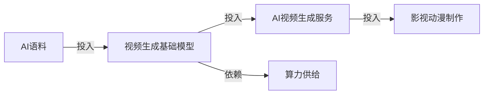
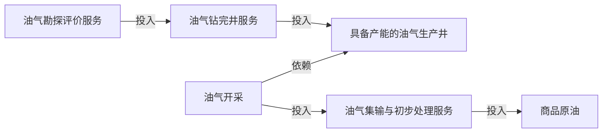

# 三层推理报告 · 草案

报告时间：2026-09-06 22:22:52（北京时间）

分析窗口：2026-09-04 22:22:52—2026-09-06 22:22:52

## 一、地缘政治

### 总结

#### G1｜霍尔木兹海峡能源通道安全

故事线真实 ID：`GPR2d8e7df9-c548-5f24-a1b1-9dcbfb383283`。

##### 结论总结

**一句话结论：若霍尔木兹海峡运输持续受阻，国内炼化企业经营表现可能分化，依赖中东原油的炼厂承压，采购来源多元的企业抗风险能力相对更强。**

**传导逻辑：** 霍尔木兹原油通道可用性下降【直接 Signal】 → 依赖该通道的原料供应面临压力【条件推导】 → 中国炼化实际影响取决于进口敞口、库存与替代采购【推理假设】。

| 受影响锚点 | 结果 | 周期 | 置信度 | 结论性质 | 预测范围与成立条件 |
| --- | --- | --- | --- | --- | --- |
| 炼厂原油进料 | 降温 | 短 | 低 | 推理假设 | 依赖受扰通道的炼厂原料供应可能收紧，前提是替代采购和库存不足以弥补缺口 |
| 炼油化工 | 分化 | 短 | 低 | 推理假设 | 依赖中东原油的炼厂可能面临开工与盈利压力，采购来源多元的炼厂相对更具韧性 |

**相关 Evidence**

| evidence id | evidence summary |
| --- | --- |
| EVD177d982d-d354-566f-ba9c-c35294fd2ea5 | 美国和以色列打击伊朗后，霍尔木兹海峡原油日流量由接近2000万桶降至约600万至800万桶。 |
| EVD1cb73c16-039d-587c-acb3-a09a4c1ed1fa | 美国和以色列打击伊朗后，经霍尔木兹海峡的原油日流量由接近2000万桶降至估计600万至800万桶。 |

### 详情

#### G1｜霍尔木兹海峡能源通道安全

##### 产业链详情｜炼油及石油化工产业链

真实产业链 ID：`ICHfcd316fe-9235-5e3e-862b-90f39a6fe5ba`。

**相关 Evidence**

| evidence id | evidence summary |
| --- | --- |
| EVD177d982d-d354-566f-ba9c-c35294fd2ea5 | 美国和以色列打击伊朗后，霍尔木兹海峡原油日流量由接近2000万桶降至约600万至800万桶。 |
| EVD1cb73c16-039d-587c-acb3-a09a4c1ed1fa | 美国和以色列打击伊朗后，经霍尔木兹海峡的原油日流量由接近2000万桶降至估计600万至800万桶。 |

- **一句话结论：** 若中东原油供应受阻且替代采购不足，国内相关炼厂可能面临开工率下降和盈利压力。
- **支撑逻辑：** 霍尔木兹海峡原油运输量大幅下降，依赖这条通道的炼厂面临供应压力；如果其他来源和库存无法补足，开工率与盈利可能受到拖累。
- **实际反证：** 目前掌握的信息中，尚无海峡运输恢复、足以缓解上述供应压力的消息。
- **节点结构：** 炼厂原油进料 → 炼油化工，图中存在真实 `ChainNodeInputTo` 边。边只证明投入关系，不证明本次成本或利润已经变化。

###### 链状态与传导路径

链状态：推理假设。链结果：分化。时间窗口：短期。置信度：低。

传导路径：霍尔木兹通道受扰 → 炼厂原油进料稳定性 → 炼油化工经营影响。预测以通道持续受扰、替代采购及库存缓冲有限为成立条件。

###### 链路图

###### 受影响节点与传导推理

| Node ID | 受影响节点 | 传导信号 | 本次影响 | 结果 | 结论性质 | 传导逻辑（为什么到这里） | 关联 Evidence | 时间窗口 | 置信度 | 成立条件 | 后续验证 |
| --- | --- | --- | --- | --- | --- | --- | --- | --- | --- | --- | --- |
| CND190c144e-c966-5967-9b5b-57a271c013da | 炼厂原油进料 | — | 供应稳定性可能承压 | 降温 | 推理假设 | 若依赖受扰通道且替代来源不足，进料稳定性可能下降。 | EVD177d982d-d354-566f-ba9c-c35294fd2ea5、EVD1cb73c16-039d-587c-acb3-a09a4c1ed1fa | 短 | 低 | 相关炼厂依赖受扰通道，且替代采购与库存无法补足供应。 | 国内原油到港量、进口来源结构、库存可用天数。 |
| CND2e474204-e21c-5381-9cdf-61d062345240 | 炼油化工 | — | 原料来源不同可能带来经营差异 | 分化 | 推理假设 | 原油进料是本节点真实投入；若进口受扰，依赖中东原油且替代能力较弱的炼厂可能承压，采购来源多元的炼厂相对更具韧性。 | EVD177d982d-d354-566f-ba9c-c35294fd2ea5、EVD1cb73c16-039d-587c-acb3-a09a4c1ed1fa（上游依据） | 短 | 低 | 运输持续受扰，且不同炼厂的原料来源与替代采购能力存在差异。 | 炼厂开工率、原油采购成本、加工利润及不同来源炼厂的经营表现。 |

## 二、宏观经济

### 总结

本期暂无可发布的宏观经济故事线结论。

### 详情

本期暂无宏观经济故事线详情。

## 三、产业链

### 总结

#### C1｜AIGC

真实 Concept ID：`CON80f3e26f-7e5d-5458-b74d-27b15fb0c3fc`。

##### 结论总结

**一句话结论：AI 短剧行业价格竞争可能进一步加剧，标准化制作业务利润承压，具备成本优势和定制能力的企业有望保持较强竞争力。**

**传导逻辑：** AI 短剧产能扩张【直接 Signal】 + 标准制作报价下行【直接 Signal】 → 标准制作业务单位收入承压【推导】 → 是否转化为利润下降仍取决于成本与订单量【推理假设】。

| 受影响锚点 | 结果 | 周期 | 置信度 | 结论性质 | 范围 |
| --- | --- | --- | --- | --- | --- |
| 影视动漫制作 | 降温 | 中 | 中 | 直接证据 | 标准化 AI 短剧制作报价下行；利润率进一步下降属于推理假设 |

**相关 Evidence**

| evidence id | evidence summary |
| --- | --- |
| EVD00d82162-b4b5-5b51-90bb-0d6808e719d6 | 今年以来，技术门槛下降、从业者涌入和产能扩张推动AI短剧每分钟制作报价从5000元降至几百元，定制业务仍报1万至2万元。 |

#### C2｜天然气产业

真实 Concept ID：`CON787cd75f-c5b8-5efe-b0f8-352f44388797`。

##### 结论总结

**一句话结论：若山西非常规天然气增产规划落地，相关勘探开发投资有望增加，钻井及配套服务企业或将迎来订单增长。**

**传导逻辑：** 山西非常规天然气增产规划【PLAN】 → 油气开采扩产强度上升【直接 Signal】 → 生产井与开发服务需求可能增加【条件推导】 → 取决于项目投资、审批和建设落地。

| 受影响锚点 | 结果 | 周期 | 置信度 | 结论性质 | 范围 |
| --- | --- | --- | --- | --- | --- |
| 油气开采 | 升温 | 长 | 中 | 直接证据 | 山西非常规天然气扩产规划；实际增产和订单增长属于推理假设 |

**相关 Evidence**

| evidence id | evidence summary |
| --- | --- |
| EVD1a74d115-d55c-544c-8e9b-984cfb12e910 | 面向“十五五”，山西计划推进两大非常规天然气勘探开发基地及煤与煤层气共采，目标实现年产量300亿立方米、年产值1000亿元。 |

### 详情

#### C1｜AIGC

##### 详情组 1｜AI 视频生成服务产业链

真实 ID：`ICHa4450cdc-e178-534a-99bd-2455a689b71b`。

**相关 Evidence**

| evidence id | evidence summary |
| --- | --- |
| EVD00d82162-b4b5-5b51-90bb-0d6808e719d6 | 今年以来，技术门槛下降、从业者涌入和产能扩张推动AI短剧每分钟制作报价从5000元降至几百元，定制业务仍报1万至2万元。 |

- **一句话结论：** 若制作产能扩张快于订单增长，标准化 AI 短剧报价可能继续下行，成本降幅有限的企业将面临利润率收缩压力。
- **支撑逻辑：** AI 短剧制作产能快速增加，标准业务报价已从每分钟数千元降至几百元，价格竞争明显加剧；如果制作成本没有同步下降，企业利润率可能进一步收窄。
- **反证或限制性证据：** 定制短剧报价仍达每分钟 1万—2万元，说明不同业务的定价能力存在差异，具备定制能力的企业未必承受同样的降价压力。

###### 链状态与传导路径

链状态：标准制作报价压力有直接证据支持。链结果：标准制作环节降温。时间窗口：中期。置信度：中。

传导路径：制作产能扩张、标准业务报价下行 → 价格竞争加剧 → 成本降幅有限的企业利润率可能收缩。

###### 链路图

###### 受影响节点与传导推理

| Node ID | 受影响节点 | 传导信号 | 本次影响 | 结果 | 结论性质 | 传导逻辑（为什么到这里） | 关联 Evidence | 时间窗口 | 置信度 | 成立条件 | 后续验证 |
| --- | --- | --- | --- | --- | --- | --- | --- | --- | --- | --- | --- |
| CND7e522813-b6e7-5674-ac93-a71bd85a0d4b | 影视动漫制作 | 销售价格 ↓（标准 AI 短剧制作报价）；扩产强度 ↑（AI 短剧制作产能） | 标准 AI 短剧报价下降、产能扩张 | 降温 | 直接证据 | 报价下行反映标准制作业务价格压力；利润变化仍取决于实际成交、成本与订单。 | EVD00d82162-b4b5-5b51-90bb-0d6808e719d6 | 中 | 中 | 标准业务报价能够反映成交趋势，且制作成本未以更快速度下降。 | 标准业务实际成交单价、单位制作成本、毛利率、订单增长。 |

##### 详情组 2｜生成式人工智能模型及应用服务产业链

真实 ID：`ICH36f79386-ec8a-50c0-8214-a59a74d094f1`。数据库确有该链映射到 AIGC 的关系。

**相关 Evidence（背景）**

| evidence id | evidence summary |
| --- | --- |
| EVD00d82162-b4b5-5b51-90bb-0d6808e719d6 | 今年以来，技术门槛下降、从业者涌入和产能扩张推动AI短剧每分钟制作报价从5000元降至几百元，定制业务仍报1万至2万元。 |

- **一句话结论：** 若制作成本下降带动 AI 短剧付费需求增长，视频生成工具及服务企业有望受益于业务量扩张。
- **支撑逻辑：** 制作成本降低后，更多客户可能愿意购买短剧制作服务；如果新增订单带动视频生成工具的付费使用，相关服务企业的收入有望增长。
- **反证：** 目前掌握的信息中，尚无与这一判断直接相反的情况。
- **成立条件：** 制作量增长能够转化为付费服务需求，且业务量增幅能够抵消服务单价下降。

#### C2｜天然气产业

##### 详情组｜油气勘探开发产业链

真实 ID：`ICH2ad7b854-d47e-5b13-b848-5b37d937cad2`。

**相关 Evidence**

| evidence id | evidence summary |
| --- | --- |
| EVD1a74d115-d55c-544c-8e9b-984cfb12e910 | 面向“十五五”，山西计划推进两大非常规天然气勘探开发基地及煤与煤层气共采，目标实现年产量300亿立方米、年产值1000亿元。 |

- **一句话结论：** 随着山西非常规天然气开发投资落地，新增生产井建设有望带动钻完井及配套工程需求，相关服务企业或将受益。
- **支撑逻辑：** 山西已提出非常规天然气增产目标，并计划推进两大勘探开发基地建设；若投资按计划落地，新增生产井建设有望带动钻井和配套工程订单。
- **实际反证：** 目前掌握的信息中，尚无增产规划收缩或相关项目取消的消息。

###### 链状态与传导路径

链状态：扩产规划有直接证据支持，项目与订单增长属于推理假设。链结果：扩产预期升温。时间窗口：长期。置信度：中。

传导路径：油气开采扩产预期 → 生产井建设需求 → 钻完井服务需求；生产井及钻完井需求增长以开发投资落地为前提。

###### 链路图

###### 受影响节点与传导推理

| Node ID | 受影响节点 | 传导信号 | 本次影响 | 结果 | 结论性质 | 传导逻辑（为什么到这里） | 关联 Evidence | 时间窗口 | 置信度 | 成立条件 | 后续验证 |
| --- | --- | --- | --- | --- | --- | --- | --- | --- | --- | --- | --- |
| CNDd4012131-d248-5fd4-b26b-33072964a03e | 油气开采 | 扩产强度 ↑（山西非常规天然气增产规划） | 山西非常规天然气扩产强度上升 | 升温 | 直接证据 | 增产规划提升长期建设预期，不代表当前产量或盈利增加。 | EVD1a74d115-d55c-544c-8e9b-984cfb12e910 | 长 | 中 | 山西非常规天然气增产规划落实，相关投资与开发项目按计划推进。 | 年度开发投资、项目审批与建设进度、新增生产井、钻完井合同及实际产量。 |

