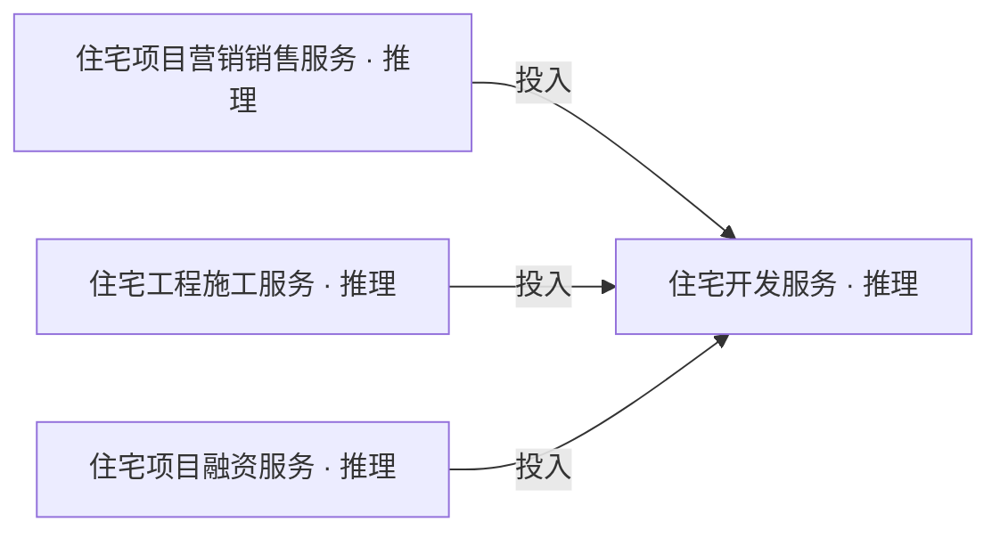
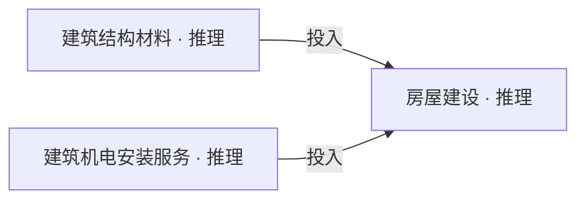
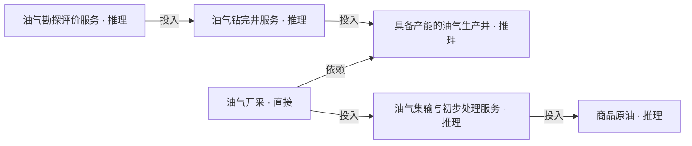
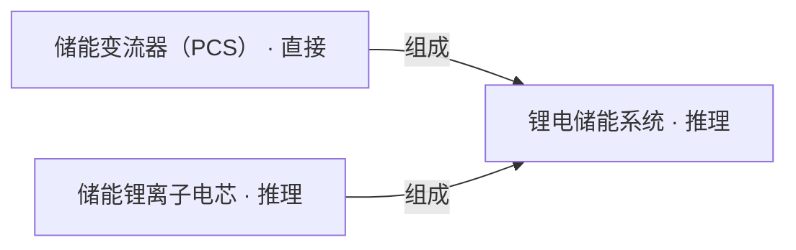
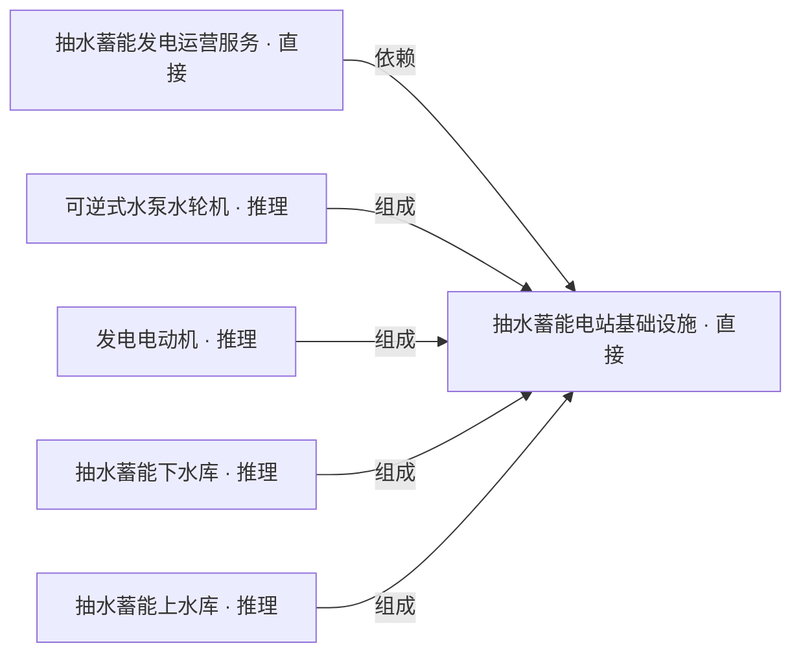
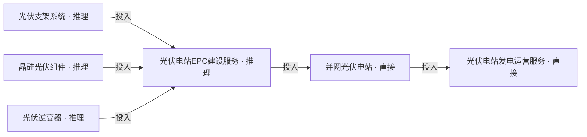

# 三层投研报告 v8

固定输入重审 · 详情变量信号 · 直接与推理判断

沿用 v7 的 168 个 Event、77 条 Signal 和冻结实体图；未刷新来源、未发布。来源记载不等于已独立核实。

直接：本实体有本层输入范围内可采用的变量信号。推理：通过事件或其他锚点形成有条件判断。标记描述依据位置，不代表确定性。

## 地缘政治

### 总结

#### 霍尔木兹海峡能源通道安全

高影响 · 直接

通道受扰若持续，国内进口能源成本可能承压，炼化企业将因采购结构分化，相关航运业务也可能面临成本与交付波动。

通道受扰 → 替代供应不足时进口成本可能上升 → 炼化经营分化
船舶改道与等待 → 运输成本可能增加 → 航运交付与收益分化

影响度依据：通道流量大幅下降且替代港口受限，若扰动持续，可同时影响进口能源成本、炼化进料和航运交付，属于关键通道层面的高影响；不等于所有国内企业已受损。

| 受影响锚点 | 判断来源 | 方向 | 结论 |
| --- | --- | --- | --- |
| 中国输入性能源价格压力 | 推理 | 升温 | 若通道及液化天然气出口受扰持续，中国进口能源成本上行压力可能增加，替代路线只能提供部分缓冲。 |
| 炼油及石油化工产业链 | 推理 | 分化 | 依赖受扰航线、库存与替代采购不足的炼厂可能承受进料和开工压力，采购结构多元的炼厂相对更具韧性。 |
| 海上航运服务产业链 | 推理 | 分化 | 受扰航线可能面临更高运营成本和交付波动，替代路线的承运需求可能增加，但运价上涨未必改善利润。 |

#### 美伊军事冲突

中影响 · 直接

海上交火若持续影响商业运输，相关航运业务的成本和交付压力可能上升，风险转嫁与航线调整能力将拉开经营差异。

海上交火持续 → 商业航运风险与成本可能上升 → 航线调整和费用转嫁能力决定经营差异

影响度依据：油轮遭袭为商业航运扰动提供线索，但本故事线尚不能量化广泛停航或新增运费冲击，按受扰航线的成本与交付变化评为中影响；不重复借用另一故事线的通道流量下降量级。

| 受影响锚点 | 判断来源 | 方向 | 结论 |
| --- | --- | --- | --- |
| 海上航运服务产业链 | 推理 | 分化 | 若海上交火继续影响商业运输，相关航运业务的成本与交付压力可能加大，能够调整航线和转嫁费用的业务相对更有韧性。 |

#### 中美关键矿产供应链博弈

高影响 · 直接

钇等指定品种的交付不确定性可能使稀土分离冶炼业务分化，价格议价空间不能直接抵消出口销量风险。

指定稀土出口受限 → 交付与排产可能受扰 → 销量、价格及利润分化

影响度依据：指定钇品种输美量明显下降且许可约束延续，若对应订单缺少库存或其他市场缓冲，交付与分离排产可能发生实质变化，评为限定品种和目的地的高影响；不外推到全部稀土。

| 受影响锚点 | 判断来源 | 方向 | 结论 |
| --- | --- | --- | --- |
| 稀土资源与分离冶炼产业链 | 推理 | 分化 | 钇等具体品种的出口交付不确定性可能延续，部分产品议价能力与可交付销量方向不同，分离冶炼企业不一定普遍受益。 |

#### 美国对伊经济制裁

待评估 · 推理

涉及受制裁网络的银行支付结算业务可能面临摩擦和合规成本，影响应限定在实际相关交易。

涉伊银行网络受制裁 → 相关交易审查与支付受限 → 涉及该网络的结算业务可能承压

影响度依据：冻结来源陈述称特定银行网络被制裁，但缺少相关结算规模、银行敞口和替代通道资料，无法判断对报告所指银行业务的后果大小，影响度待评估；不能因范围特定就判低影响。

| 受影响锚点 | 判断来源 | 方向 | 结论 |
| --- | --- | --- | --- |
| 商业银行服务产业链 | 推理 | 分化 | 实际涉及被制裁网络的跨境银行业务可能面临结算摩擦和合规成本增加，未涉及该网络的银行不能据此推断承压。 |

### 详情

### 霍尔木兹海峡能源通道安全

##### 变量信号

| 变量 | 方向 | 信号 |
| --- | --- | --- |
| 贸易通道可用性 | 上升 | 美国海军派遣潜水员、船只和机器人秘密开展夜间行动，清除霍尔木兹海峡关键航道内的爆炸物。 |
| 贸易通道可用性 | 下降 | 战争扰动后，经霍尔木兹海峡运输的原油流量由接近2000万桶/日降至约600万至800万桶/日，表明该海峡原油贸易通道的实际可用性显著下降。 |
| 航运安全 | 上升 | 美国海军清除霍尔木兹海峡关键航道内的爆炸物，以保障航道安全。 |
| 航运安全 | 下降 | 2026年8月31日，一艘超级油轮在霍尔木兹海峡南部撞上两枚水雷后起火并失去航行能力，直接表明该海峡商业船舶免受水雷袭击和航行中断的安全程度下降。 |

贸易通道可用性｜限定：清障是安全改善行动，不能单独确认通道流量或可用性已恢复。｜Signal 4b2e1fb9-d87b-5496-983d-04ffd1b05ae9｜Event EVT981966a9-b881-42f9-8df9-48121ea43ae7

贸易通道可用性｜限定：在原事件主体、地域、产品、时间和模态内保留；不是人工验证，也不自动产生链结论。｜Signal a2ca1306-1c13-5e96-87c2-b810951ea0b9｜Event EVT69198d56-b0f3-428d-9805-881fb6016d48

航运安全｜限定：限清障活动对安全条件的潜在改善，不认定整体安全已恢复。｜Signal 53edd802-58fe-58b3-a5b9-9121b46f20da｜Event EVT981966a9-b881-42f9-8df9-48121ea43ae7

航运安全｜限定：遇险记录源自伊朗革命卫队说法，保留归因与待核实状态。｜Signal b716b768-45a5-53ab-bf24-7f277758fda0｜Event EVT7611b53b-38e5-40df-a5f7-8df580d837c0

#### 中国输入性能源价格压力

**推理 · 升温**

若通道及液化天然气出口受扰持续，中国进口能源成本上行压力可能增加，替代路线只能提供部分缓冲。

通道及液化天然气出口受扰 → 若中国采购有对应敞口且库存与替代供应不足 → 补充采购和运输费用可能增加 → 到岸能源成本上行压力增加

适用范围：受扰持续；中国相关采购不能由长协、库存及替代来源充分覆盖；汇率未完全抵消。

周期：短期（数日—3个月）

成立条件：受扰持续；中国相关采购不能由长协、库存及替代来源充分覆盖；汇率未完全抵消。

后续验证：中国分来源到港量、油气到岸价、保险与运费、汇率和库存。

##### 反证与边界

尚无中国具体采购敞口、合同价与汇率抵消数据；地缘层宏观预测不是宏观层的独立输入。

未识别到直接反向事实，不表示结论已被证实。

| 缓冲因素 | 性质 |
| --- | --- |
| 绕行和清障提供部分缓冲，不能消除全部进口敞口。 | 推理 |

待验证：中国采购来源敞口、长协与库存、合同价格和汇率抵消情况。

适用边界：这是地缘层对宏观对象的预测，不作为宏观层独立推理输入。

Evidence：

| Evidence ID | 证据摘要 |
| --- | --- |
| EVD177d982d-d354-566f-ba9c-c35294fd2ea5 | 美国和以色列打击伊朗后，霍尔木兹海峡原油日流量由接近2000万桶降至约600万至800万桶。 |
| EVD1cb73c16-039d-587c-acb3-a09a4c1ed1fa | 美国和以色列打击伊朗后，经霍尔木兹海峡的原油日流量由接近2000万桶降至估计600万至800万桶。 |
| EVD23254a7d-4301-568a-88e0-d4f1b9cde225 | 阿联酋已将原油流向改至霍尔木兹海峡外的富查伊拉港，但同样面临出口能力限制。 |
| EVD2997ae1b-a29c-5e0b-a53a-df961e8d67a2 | 沙特逆转东西向管道流向，将原油向西输往延布港，以绕开霍尔木兹海峡，但延布港处理能力有限。 |
| EVD39391805-2d32-5f66-a0e2-95a71d1693f5 | 美国和以色列打击伊朗后，霍尔木兹海峡原油日流量由接近2000万桶降至约600万至800万桶。 |
| EVD4d2e5ccd-f978-5436-a7ce-ef0b9a839fbe | 拉斯拉凡枢纽受损后，卡塔尔遭遇不可抗力并难以维持液化天然气出口。 |
| EVDa5fc21a0-b087-5a6b-8d84-67548a8464a8 | 美国海军派遣潜水员、船只和机器人秘密开展夜间行动，清除霍尔木兹海峡关键航道内的爆炸物。 |

### 炼油及石油化工产业链

#### 链级判断

**推理 · 分化**

依赖受扰航线、库存与替代采购不足的炼厂可能承受进料和开工压力，采购结构多元的炼厂相对更具韧性。

霍尔木兹通道流量下降 → 有对应进口敞口的炼厂进料不确定性增加 → 库存与替代采购不足时开工承压 → 炼化利润随采购结构及产品顺价能力分化。

适用范围：仅有受扰原油来源敞口的炼厂及其炼化活动；不引入产业链类俄罗斯采购事件。

周期：短期（数日—3个月）

成立条件：对应炼厂具有受扰来源敞口；进料短缺未被库存或替代采购填补。

后续验证：进口来源、库存天数、开工率、原油成本及加工利润。

#### 链级推理总结

推导逻辑：霍尔木兹通道流量下降 → 有对应进口敞口的炼厂进料不确定性增加 → 库存与替代采购不足时开工承压 → 炼化利润随采购结构及产品顺价能力分化。

支持：原油通道流量下降及绕行港口能力有限的记录支持进料受扰风险；进料到炼化的已有结构使传导具有节点落点。

##### 反证与边界

绕行港口和清障可能减轻中断，缺少企业敞口与加工价差；本地缘分析不引入俄罗斯采购的产业链类事件。

未识别到直接反向事实，不表示结论已被证实。

| 缓冲因素 | 性质 |
| --- | --- |
| 绕行港口与清障提供部分通行缓冲，但港口能力仍有限。 | 来源记载 |

待验证：企业受扰来源敞口、库存、开工与加工价差。

适用边界：仅有受扰原油来源敞口的炼厂及其炼化活动；不引入产业链类俄罗斯采购事件。

Evidence：

| Evidence ID | 证据摘要 |
| --- | --- |
| EVD177d982d-d354-566f-ba9c-c35294fd2ea5 | 美国和以色列打击伊朗后，霍尔木兹海峡原油日流量由接近2000万桶降至约600万至800万桶。 |
| EVD1cb73c16-039d-587c-acb3-a09a4c1ed1fa | 美国和以色列打击伊朗后，经霍尔木兹海峡的原油日流量由接近2000万桶降至估计600万至800万桶。 |
| EVD23254a7d-4301-568a-88e0-d4f1b9cde225 | 阿联酋已将原油流向改至霍尔木兹海峡外的富查伊拉港，但同样面临出口能力限制。 |
| EVD2997ae1b-a29c-5e0b-a53a-df961e8d67a2 | 沙特逆转东西向管道流向，将原油向西输往延布港，以绕开霍尔木兹海峡，但延布港处理能力有限。 |
| EVD39391805-2d32-5f66-a0e2-95a71d1693f5 | 美国和以色列打击伊朗后，霍尔木兹海峡原油日流量由接近2000万桶降至约600万至800万桶。 |
| EVDa5fc21a0-b087-5a6b-8d84-67548a8464a8 | 美国海军派遣潜水员、船只和机器人秘密开展夜间行动，清除霍尔木兹海峡关键航道内的爆炸物。 |

#### 本期判断链路图

仅保留有判断的节点。连线是原有结构关系，不代表影响已经实现；被移除节点两端没有重新连线。


#### 节点推理结果

#### 炼厂原油进料

**推理 · 分化**

受扰来源占比较高且无充分替代时，原油进料到货稳定性可能下降；多元采购和库存充足的炼厂影响较小。

通道流量下降 → 对应来源到货受扰 → 库存和替代采购不足时原油进料稳定性下降

适用范围：仅有受扰原油来源敞口的炼厂及其炼化活动；不引入产业链类俄罗斯采购事件。

周期：短期（数日—3个月）

成立条件：对应炼厂具有受扰来源敞口；进料短缺未被库存或替代采购填补。

后续验证：进口来源、库存天数、开工率、原油成本及加工利润。

##### 反证与边界

绕行港口和清障可能减轻中断，缺少企业敞口与加工价差；本地缘分析不引入俄罗斯采购的产业链类事件。

未识别到直接反向事实，不表示结论已被证实。

| 缓冲因素 | 性质 |
| --- | --- |
| 绕行港口与清障提供部分通行缓冲，但港口能力仍有限。 | 来源记载 |

待验证：企业受扰来源敞口、库存、开工与加工价差。

适用边界：仅有受扰原油来源敞口的炼厂及其炼化活动；不引入产业链类俄罗斯采购事件。

Evidence：

| Evidence ID | 证据摘要 |
| --- | --- |
| EVD177d982d-d354-566f-ba9c-c35294fd2ea5 | 美国和以色列打击伊朗后，霍尔木兹海峡原油日流量由接近2000万桶降至约600万至800万桶。 |
| EVD1cb73c16-039d-587c-acb3-a09a4c1ed1fa | 美国和以色列打击伊朗后，经霍尔木兹海峡的原油日流量由接近2000万桶降至估计600万至800万桶。 |
| EVD23254a7d-4301-568a-88e0-d4f1b9cde225 | 阿联酋已将原油流向改至霍尔木兹海峡外的富查伊拉港，但同样面临出口能力限制。 |
| EVD2997ae1b-a29c-5e0b-a53a-df961e8d67a2 | 沙特逆转东西向管道流向，将原油向西输往延布港，以绕开霍尔木兹海峡，但延布港处理能力有限。 |
| EVD39391805-2d32-5f66-a0e2-95a71d1693f5 | 美国和以色列打击伊朗后，霍尔木兹海峡原油日流量由接近2000万桶降至约600万至800万桶。 |
| EVDa5fc21a0-b087-5a6b-8d84-67548a8464a8 | 美国海军派遣潜水员、船只和机器人秘密开展夜间行动，清除霍尔木兹海峡关键航道内的爆炸物。 |

#### 炼油化工

**推理 · 分化**

进料短缺若持续可能压低开工；产品顺价能否覆盖成本及减产损失未明，炼化利润可能分化。

原油进料受扰 → 开工或原料成本承压 → 产品顺价与减产损失共同决定炼化利润

适用范围：仅有受扰原油来源敞口的炼厂及其炼化活动；不引入产业链类俄罗斯采购事件。

周期：短期（数日—3个月）

成立条件：对应炼厂具有受扰来源敞口；进料短缺未被库存或替代采购填补。

后续验证：进口来源、库存天数、开工率、原油成本及加工利润。

##### 反证与边界

绕行港口和清障可能减轻中断，缺少企业敞口与加工价差；本地缘分析不引入俄罗斯采购的产业链类事件。

未识别到直接反向事实，不表示结论已被证实。

| 缓冲因素 | 性质 |
| --- | --- |
| 绕行港口与清障提供部分通行缓冲，但港口能力仍有限。 | 来源记载 |

待验证：企业受扰来源敞口、库存、开工与加工价差。

适用边界：仅有受扰原油来源敞口的炼厂及其炼化活动；不引入产业链类俄罗斯采购事件。

Evidence：

| Evidence ID | 证据摘要 |
| --- | --- |
| EVD177d982d-d354-566f-ba9c-c35294fd2ea5 | 美国和以色列打击伊朗后，霍尔木兹海峡原油日流量由接近2000万桶降至约600万至800万桶。 |
| EVD1cb73c16-039d-587c-acb3-a09a4c1ed1fa | 美国和以色列打击伊朗后，经霍尔木兹海峡的原油日流量由接近2000万桶降至估计600万至800万桶。 |
| EVD23254a7d-4301-568a-88e0-d4f1b9cde225 | 阿联酋已将原油流向改至霍尔木兹海峡外的富查伊拉港，但同样面临出口能力限制。 |
| EVD2997ae1b-a29c-5e0b-a53a-df961e8d67a2 | 沙特逆转东西向管道流向，将原油向西输往延布港，以绕开霍尔木兹海峡，但延布港处理能力有限。 |
| EVD39391805-2d32-5f66-a0e2-95a71d1693f5 | 美国和以色列打击伊朗后，霍尔木兹海峡原油日流量由接近2000万桶降至约600万至800万桶。 |
| EVDa5fc21a0-b087-5a6b-8d84-67548a8464a8 | 美国海军派遣潜水员、船只和机器人秘密开展夜间行动，清除霍尔木兹海峡关键航道内的爆炸物。 |

#### 直馏石脑油

**推理 · 分化**

若受扰原油来源影响实际炼厂进料，相关直馏石脑油的成本与供给稳定性可能分化。

原油进料受扰 → 炼厂原料成本及加工安排变化 → 直馏石脑油成本与可供量分化

适用范围：若受扰原油来源影响实际炼厂进料，相关直馏石脑油的成本与供给稳定性可能分化。

周期：短期（数日—3个月）

成立条件：对应炼厂具有受扰来源敞口；进料短缺未被库存或替代采购填补。

后续验证：核对对应项目、产品或地区的订单、交付与实现结果。

##### 反证与边界

需核对该节点对应产品、项目采购及实际业务敞口；结构相连不代表结果已实现。

未识别到直接反向事实，不表示结论已被证实。

待验证：需核对该节点对应产品、项目采购及实际业务敞口；结构相连不代表结果已实现。

适用边界：结论仅覆盖正文所述主体、产品、地区和时间，不外推全行业利润。

Evidence：

| Evidence ID | 证据摘要 |
| --- | --- |
| EVD177d982d-d354-566f-ba9c-c35294fd2ea5 | 美国和以色列打击伊朗后，霍尔木兹海峡原油日流量由接近2000万桶降至约600万至800万桶。 |
| EVD1cb73c16-039d-587c-acb3-a09a4c1ed1fa | 美国和以色列打击伊朗后，经霍尔木兹海峡的原油日流量由接近2000万桶降至估计600万至800万桶。 |
| EVD23254a7d-4301-568a-88e0-d4f1b9cde225 | 阿联酋已将原油流向改至霍尔木兹海峡外的富查伊拉港，但同样面临出口能力限制。 |
| EVD2997ae1b-a29c-5e0b-a53a-df961e8d67a2 | 沙特逆转东西向管道流向，将原油向西输往延布港，以绕开霍尔木兹海峡，但延布港处理能力有限。 |
| EVD39391805-2d32-5f66-a0e2-95a71d1693f5 | 美国和以色列打击伊朗后，霍尔木兹海峡原油日流量由接近2000万桶降至约600万至800万桶。 |
| EVDa5fc21a0-b087-5a6b-8d84-67548a8464a8 | 美国海军派遣潜水员、船只和机器人秘密开展夜间行动，清除霍尔木兹海峡关键航道内的爆炸物。 |

### 海上航运服务产业链

#### 链级判断

**推理 · 分化**

受扰航线可能面临更高运营成本和交付波动，替代路线的承运需求可能增加，但运价上涨未必改善利润。

商船遇险与通行约束 → 改道、等待及保险负担可能增加 → 航运交付波动与成本上升 → 运价转嫁和路线差异决定净收益。

适用范围：仅实际受通道扰动的商业航线，不外推全航运利润。

周期：短期（数日—3个月）

成立条件：停航或改道持续且实际影响商业船舶；费用由承运方承担的比例不能被运价完全覆盖。

后续验证：实际航次、改道距离、港口等待、保险费用、航线净收益。

#### 链级推理总结

推导逻辑：商船遇险与通行约束 → 改道、等待及保险负担可能增加 → 航运交付波动与成本上升 → 运价转嫁和路线差异决定净收益。

支持：商船遇险、通道约束的记录支持航线运营风险，影响应落在实际经营相关航线的航运服务。

##### 反证与边界

清障有助改善安全条件；未有航次、保险、运价和成本实测，不能确认全航运行业利润方向。

未识别到直接反向事实，不表示结论已被证实。

| 缓冲因素 | 性质 |
| --- | --- |
| 清障行动可能改善安全条件，不代表商业通航已经恢复。 | 推理 |

待验证：实际航次、保险费用、运价与净成本。

适用边界：仅实际受通道扰动的商业航线，不外推全航运利润。

Evidence：

| Evidence ID | 证据摘要 |
| --- | --- |
| EVD09244b06-6aef-5ec2-a3d0-1df865a17780 | 伊朗革命卫队称，一艘超级油轮周一在霍尔木兹海峡南部撞上两枚水雷后起火并失去航行能力。 |
| EVD177d982d-d354-566f-ba9c-c35294fd2ea5 | 美国和以色列打击伊朗后，霍尔木兹海峡原油日流量由接近2000万桶降至约600万至800万桶。 |
| EVD1cb73c16-039d-587c-acb3-a09a4c1ed1fa | 美国和以色列打击伊朗后，经霍尔木兹海峡的原油日流量由接近2000万桶降至估计600万至800万桶。 |
| EVD23254a7d-4301-568a-88e0-d4f1b9cde225 | 阿联酋已将原油流向改至霍尔木兹海峡外的富查伊拉港，但同样面临出口能力限制。 |
| EVD2997ae1b-a29c-5e0b-a53a-df961e8d67a2 | 沙特逆转东西向管道流向，将原油向西输往延布港，以绕开霍尔木兹海峡，但延布港处理能力有限。 |
| EVD39391805-2d32-5f66-a0e2-95a71d1693f5 | 美国和以色列打击伊朗后，霍尔木兹海峡原油日流量由接近2000万桶降至约600万至800万桶。 |
| EVDa5fc21a0-b087-5a6b-8d84-67548a8464a8 | 美国海军派遣潜水员、船只和机器人秘密开展夜间行动，清除霍尔木兹海峡关键航道内的爆炸物。 |

#### 本期判断链路图

仅保留有判断的节点。连线是原有结构关系，不代表影响已经实现；被移除节点两端没有重新连线。


#### 节点推理结果

#### 航运服务

**推理 · 分化**

受扰航线交付与成本可能承压；改道能力和费用转嫁不同使航运净收益分化。

遇险与通行约束 → 改道、等待及保险费用变化 → 航运交付与净收益分化

适用范围：仅实际受通道扰动的商业航线，不外推全航运利润。

周期：短期（数日—3个月）

成立条件：停航或改道持续且实际影响商业船舶；费用由承运方承担的比例不能被运价完全覆盖。

后续验证：实际航次、改道距离、港口等待、保险费用、航线净收益。

##### 反证与边界

清障有助改善安全条件；未有航次、保险、运价和成本实测，不能确认全航运行业利润方向。

未识别到直接反向事实，不表示结论已被证实。

| 缓冲因素 | 性质 |
| --- | --- |
| 清障行动可能改善安全条件，不代表商业通航已经恢复。 | 推理 |

待验证：实际航次、保险费用、运价与净成本。

适用边界：仅实际受通道扰动的商业航线，不外推全航运利润。

Evidence：

| Evidence ID | 证据摘要 |
| --- | --- |
| EVD09244b06-6aef-5ec2-a3d0-1df865a17780 | 伊朗革命卫队称，一艘超级油轮周一在霍尔木兹海峡南部撞上两枚水雷后起火并失去航行能力。 |
| EVD177d982d-d354-566f-ba9c-c35294fd2ea5 | 美国和以色列打击伊朗后，霍尔木兹海峡原油日流量由接近2000万桶降至约600万至800万桶。 |
| EVD1cb73c16-039d-587c-acb3-a09a4c1ed1fa | 美国和以色列打击伊朗后，经霍尔木兹海峡的原油日流量由接近2000万桶降至估计600万至800万桶。 |
| EVD23254a7d-4301-568a-88e0-d4f1b9cde225 | 阿联酋已将原油流向改至霍尔木兹海峡外的富查伊拉港，但同样面临出口能力限制。 |
| EVD2997ae1b-a29c-5e0b-a53a-df961e8d67a2 | 沙特逆转东西向管道流向，将原油向西输往延布港，以绕开霍尔木兹海峡，但延布港处理能力有限。 |
| EVD39391805-2d32-5f66-a0e2-95a71d1693f5 | 美国和以色列打击伊朗后，霍尔木兹海峡原油日流量由接近2000万桶降至约600万至800万桶。 |
| EVDa5fc21a0-b087-5a6b-8d84-67548a8464a8 | 美国海军派遣潜水员、船只和机器人秘密开展夜间行动，清除霍尔木兹海峡关键航道内的爆炸物。 |

#### 跨境物流

**推理 · 分化**

受扰海运航线相关跨境物流的时效与履约成本可能承压。

航道约束 → 海运绕行或等待 → 使用相关海运段的跨境物流交付周期拉长

适用范围：受扰海运航线相关跨境物流的时效与履约成本可能承压。

周期：短期（数日—3个月）

成立条件：停航或改道持续且实际影响商业船舶；费用由承运方承担的比例不能被运价完全覆盖。

后续验证：核对对应项目、产品或地区的订单、交付与实现结果。

##### 反证与边界

需核对该节点对应产品、项目采购及实际业务敞口；结构相连不代表结果已实现。

未识别到直接反向事实，不表示结论已被证实。

待验证：需核对该节点对应产品、项目采购及实际业务敞口；结构相连不代表结果已实现。

适用边界：结论仅覆盖正文所述主体、产品、地区和时间，不外推全行业利润。

Evidence：

| Evidence ID | 证据摘要 |
| --- | --- |
| EVD09244b06-6aef-5ec2-a3d0-1df865a17780 | 伊朗革命卫队称，一艘超级油轮周一在霍尔木兹海峡南部撞上两枚水雷后起火并失去航行能力。 |
| EVD177d982d-d354-566f-ba9c-c35294fd2ea5 | 美国和以色列打击伊朗后，霍尔木兹海峡原油日流量由接近2000万桶降至约600万至800万桶。 |
| EVD1cb73c16-039d-587c-acb3-a09a4c1ed1fa | 美国和以色列打击伊朗后，经霍尔木兹海峡的原油日流量由接近2000万桶降至估计600万至800万桶。 |
| EVD23254a7d-4301-568a-88e0-d4f1b9cde225 | 阿联酋已将原油流向改至霍尔木兹海峡外的富查伊拉港，但同样面临出口能力限制。 |
| EVD2997ae1b-a29c-5e0b-a53a-df961e8d67a2 | 沙特逆转东西向管道流向，将原油向西输往延布港，以绕开霍尔木兹海峡，但延布港处理能力有限。 |
| EVD39391805-2d32-5f66-a0e2-95a71d1693f5 | 美国和以色列打击伊朗后，霍尔木兹海峡原油日流量由接近2000万桶降至约600万至800万桶。 |
| EVDa5fc21a0-b087-5a6b-8d84-67548a8464a8 | 美国海军派遣潜水员、船只和机器人秘密开展夜间行动，清除霍尔木兹海峡关键航道内的爆炸物。 |

### 美伊军事冲突

##### 变量信号

| 变量 | 方向 | 信号 |
| --- | --- | --- |
| 地缘政治风险 | 上升 | 伊朗伊斯兰革命卫队向两艘美国海军军舰发射弹道导弹，军舰成功避开多次攻击且无美国人员受伤，于2026年9月5日发生。 |
| 地缘政治风险 | 上升 | 伊朗伊斯兰革命卫队海军于9月6日打击了一艘企图驶入霍尔木兹海峡伊朗保护区域的美军海上无人艇 |
| 地缘政治风险 | 上升 | 伊朗革命卫队空军于9月6日发射多枚弹道导弹，打击一艘参与海上封锁的美军航空母舰和一艘驱逐舰，两舰受损后撤离 |
| 地缘政治风险 | 上升 | 伊朗军方发表声明，称可能对美国实施更大规模打击，表明美伊军事对抗的升级风险。 |
| 地缘政治风险 | 上升 | 美国与伊朗相互实施军事打击，导致紧张局势升级。 |
| 地缘政治风险 | 上升 | 2026年9月5日，美国军队打击三艘伊朗原油运输船并使其中两艘永久瘫痪，构成美国与伊朗之间直接军事打击的升级，使美伊军事冲突相关的地缘政治风险上升。 |
| 航运安全 | 下降 | 2026年9月5日，美国军队打击三艘伊朗原油运输船，其中两艘被永久瘫痪，直接降低了美伊军事冲突涉及海域内相关商业能源运输船舶免受军事袭击和航行中断的安全程度。 |

地缘政治风险｜限定：在原事件主体、地域、产品、时间和模态内保留；不是人工验证，也不自动产生链结论。｜Signal d91f3461-223f-5441-827a-ee900e3f60b4｜Event EVT0b4e57a3-1942-4669-bfa5-1658e8a4a45f

地缘政治风险｜限定：在原事件主体、地域、产品、时间和模态内保留；不是人工验证，也不自动产生链结论。｜Signal b6d1a0bd-dbfb-505f-b6bc-246b06612a81｜Event EVT1dfaa212-d532-41a3-8da7-621884cfd73b

地缘政治风险｜限定：保留伊朗方面声称的交火与风险；不将军舰受损当独立核实事实。｜Signal f5b8c3d7-0098-5c13-8532-56430062a60e｜Event EVT7ef8e13b-16d4-4bdc-bea7-2f2f6f1fb13b

地缘政治风险｜限定：仅为威胁表态，不视为更大打击已发生。｜Signal e50787a0-c95a-569c-ab54-c9d7cb47dd08｜Event EVTefa87a69-e3da-4a37-9398-e99362b78b1b

地缘政治风险｜限定：在原事件主体、地域、产品、时间和模态内保留；不是人工验证，也不自动产生链结论。｜Signal 4a48bcc8-1527-5ae8-88f1-4223984bcddc｜Event EVT4a82ab9a-91cd-4453-88d0-081f6c9b85aa

地缘政治风险｜限定：在原事件主体、地域、产品、时间和模态内保留；不是人工验证，也不自动产生链结论。｜Signal 840c61ab-aa29-5f77-b723-06511fb14627｜Event EVT0ab23b77-b213-4c4e-8270-555c5bc44e5c

航运安全｜限定：在原事件主体、地域、产品、时间和模态内保留；不是人工验证，也不自动产生链结论。｜Signal a676cca3-30d5-5fd1-9074-0ef8dcbcefec｜Event EVT0ab23b77-b213-4c4e-8270-555c5bc44e5c

### 海上航运服务产业链

#### 链级判断

**推理 · 分化**

若海上交火继续影响商业运输，相关航运业务的成本与交付压力可能加大，能够调整航线和转嫁费用的业务相对更有韧性。

商业油轮受击与海上交火风险 → 承运意愿、保险要求和航线选择变化 → 相关航运服务可交付性与成本承压 → 可调整航线的业务相对更有韧性。

适用范围：仅海上交火实际影响的商业运输；不以争议军事战损计量运输损失。

周期：短期（数日—数周）

成立条件：交火持续并影响经营航线；不能只凭军方表态推导实际停航。

后续验证：油轮航迹、保险与承运限制、军方原始声明、实际停航。

#### 链级推理总结

推导逻辑：商业油轮受击与海上交火风险 → 承运意愿、保险要求和航线选择变化 → 相关航运服务可交付性与成本承压 → 可调整航线的业务相对更有韧性。

支持：商业油轮受击及交火记录为运输风险提供依据；军事战损争议不作为新增运输损失计量。

##### 反证与边界

军舰战损存在相异说法，且未厘清同一事件身份；缺少运输费率数据。不把重复报道与G1当独立增量证据。

未识别到直接反向事实，不表示结论已被证实。

待验证：同一交火事件身份、商船实际停航及运输费率。

适用边界：仅海上交火实际影响的商业运输；不以争议军事战损计量运输损失。

Evidence：

| Evidence ID | 证据摘要 |
| --- | --- |
| EVD0b8c93da-16c0-54b3-99d1-b4b4fc07030a | 美国军队周六打击三艘伊朗原油运输船，其中两艘分别在哈尔克岛近海和贾斯克附近被永久瘫痪，另一艘在阿曼湾遭袭。 |
| EVD2dc3e4a8-b5b0-5f7f-924b-c025a8379c1d | 美国与伊朗在无人艇遇袭事件前数小时相互实施了军事打击。 |
| EVD352289ab-c93b-5ea3-aca5-8cac7393f5aa | 伊朗军方称可能对美国实施更大规模打击。 |
| EVD3e4c3e22-2cf7-5c98-8cec-0e3de1313c1f | 伊朗革命卫队称其空军9月6日发射多枚弹道导弹，打击一艘参与对伊海上封锁的美军航母和一艘驱逐舰，两舰受损后撤离冲突地区。 |
| EVD4328ffb0-5a92-57ff-b01b-5beaa8ffbcac | 伊朗伊斯兰革命卫队海军打击一艘企图驶入霍尔木兹海峡伊朗“保护区域”的美军海上无人艇。 |
| EVD5b0c8815-97f2-513c-a493-82945964cadb | 伊朗伊斯兰革命卫队称，其空军9月6日发射多枚弹道导弹，打击参与对伊朗海上封锁的一艘美军航母和一艘驱逐舰。 |
| EVDb646d98a-9ee0-5b6a-85c3-a0076fa111aa | 伊朗伊斯兰革命卫队公告称，两艘遭受损失的美军军舰被迫撤离冲突地区。 |
| EVDec03f9a3-a91d-5bd7-b798-f22ea9bc9f9a | 美国中央司令部称，伊朗伊斯兰革命卫队向两艘美国海军军舰发射弹道导弹，军舰成功避开多次攻击且无美国人员受伤。 |
| EVDecc39cbb-ca54-5ad4-b257-11b364fdaf65 | 美国与伊朗相互袭击油轮，美伊冲突对航运和能源供应的风险上升。 |

#### 本期判断链路图

仅保留有判断的节点。连线是原有结构关系，不代表影响已经实现；被移除节点两端没有重新连线。


#### 节点推理结果

#### 航运服务

**推理 · 分化**

交火若持续影响商船，相关航运服务可交付性可能下降；实际停航与净收益影响仍须验证。

商船受击与交火风险 → 承运、保险和航线调整 → 相关航运服务交付与成本承压

适用范围：仅海上交火实际影响的商业运输；不以争议军事战损计量运输损失。

周期：短期（数日—数周）

成立条件：交火持续并影响经营航线；不能只凭军方表态推导实际停航。

后续验证：油轮航迹、保险与承运限制、军方原始声明、实际停航。

##### 反证与边界

军舰战损存在相异说法，且未厘清同一事件身份；缺少运输费率数据。不把重复报道与G1当独立增量证据。

未识别到直接反向事实，不表示结论已被证实。

待验证：同一交火事件身份、商船实际停航及运输费率。

适用边界：仅海上交火实际影响的商业运输；不以争议军事战损计量运输损失。

Evidence：

| Evidence ID | 证据摘要 |
| --- | --- |
| EVD0b8c93da-16c0-54b3-99d1-b4b4fc07030a | 美国军队周六打击三艘伊朗原油运输船，其中两艘分别在哈尔克岛近海和贾斯克附近被永久瘫痪，另一艘在阿曼湾遭袭。 |
| EVD2dc3e4a8-b5b0-5f7f-924b-c025a8379c1d | 美国与伊朗在无人艇遇袭事件前数小时相互实施了军事打击。 |
| EVD352289ab-c93b-5ea3-aca5-8cac7393f5aa | 伊朗军方称可能对美国实施更大规模打击。 |
| EVD3e4c3e22-2cf7-5c98-8cec-0e3de1313c1f | 伊朗革命卫队称其空军9月6日发射多枚弹道导弹，打击一艘参与对伊海上封锁的美军航母和一艘驱逐舰，两舰受损后撤离冲突地区。 |
| EVD4328ffb0-5a92-57ff-b01b-5beaa8ffbcac | 伊朗伊斯兰革命卫队海军打击一艘企图驶入霍尔木兹海峡伊朗“保护区域”的美军海上无人艇。 |
| EVD5b0c8815-97f2-513c-a493-82945964cadb | 伊朗伊斯兰革命卫队称，其空军9月6日发射多枚弹道导弹，打击参与对伊朗海上封锁的一艘美军航母和一艘驱逐舰。 |
| EVDb646d98a-9ee0-5b6a-85c3-a0076fa111aa | 伊朗伊斯兰革命卫队公告称，两艘遭受损失的美军军舰被迫撤离冲突地区。 |
| EVDec03f9a3-a91d-5bd7-b798-f22ea9bc9f9a | 美国中央司令部称，伊朗伊斯兰革命卫队向两艘美国海军军舰发射弹道导弹，军舰成功避开多次攻击且无美国人员受伤。 |
| EVDecc39cbb-ca54-5ad4-b257-11b364fdaf65 | 美国与伊朗相互袭击油轮，美伊冲突对航运和能源供应的风险上升。 |

#### 跨境物流

**推理 · 分化**

交火若导致相关商业航次调整，依赖这些航次的跨境物流履约稳定性可能下降。

商业船舶受击风险 → 承运安排变化 → 相关跨境物流履约波动

适用范围：交火若导致相关商业航次调整，依赖这些航次的跨境物流履约稳定性可能下降。

周期：短期（数日—数周）

成立条件：交火持续并影响经营航线；不能只凭军方表态推导实际停航。

后续验证：核对对应项目、产品或地区的订单、交付与实现结果。

##### 反证与边界

需核对该节点对应产品、项目采购及实际业务敞口；结构相连不代表结果已实现。

未识别到直接反向事实，不表示结论已被证实。

待验证：需核对该节点对应产品、项目采购及实际业务敞口；结构相连不代表结果已实现。

适用边界：结论仅覆盖正文所述主体、产品、地区和时间，不外推全行业利润。

Evidence：

| Evidence ID | 证据摘要 |
| --- | --- |
| EVD0b8c93da-16c0-54b3-99d1-b4b4fc07030a | 美国军队周六打击三艘伊朗原油运输船，其中两艘分别在哈尔克岛近海和贾斯克附近被永久瘫痪，另一艘在阿曼湾遭袭。 |
| EVD2dc3e4a8-b5b0-5f7f-924b-c025a8379c1d | 美国与伊朗在无人艇遇袭事件前数小时相互实施了军事打击。 |
| EVD352289ab-c93b-5ea3-aca5-8cac7393f5aa | 伊朗军方称可能对美国实施更大规模打击。 |
| EVD3e4c3e22-2cf7-5c98-8cec-0e3de1313c1f | 伊朗革命卫队称其空军9月6日发射多枚弹道导弹，打击一艘参与对伊海上封锁的美军航母和一艘驱逐舰，两舰受损后撤离冲突地区。 |
| EVD4328ffb0-5a92-57ff-b01b-5beaa8ffbcac | 伊朗伊斯兰革命卫队海军打击一艘企图驶入霍尔木兹海峡伊朗“保护区域”的美军海上无人艇。 |
| EVD5b0c8815-97f2-513c-a493-82945964cadb | 伊朗伊斯兰革命卫队称，其空军9月6日发射多枚弹道导弹，打击参与对伊朗海上封锁的一艘美军航母和一艘驱逐舰。 |
| EVDb646d98a-9ee0-5b6a-85c3-a0076fa111aa | 伊朗伊斯兰革命卫队公告称，两艘遭受损失的美军军舰被迫撤离冲突地区。 |
| EVDec03f9a3-a91d-5bd7-b798-f22ea9bc9f9a | 美国中央司令部称，伊朗伊斯兰革命卫队向两艘美国海军军舰发射弹道导弹，军舰成功避开多次攻击且无美国人员受伤。 |
| EVDecc39cbb-ca54-5ad4-b257-11b364fdaf65 | 美国与伊朗相互袭击油轮，美伊冲突对航运和能源供应的风险上升。 |

### 中美关键矿产供应链博弈

##### 变量信号

| 变量 | 方向 | 信号 |
| --- | --- | --- |
| 制裁暴露度 | 上升 | 2026年3月和4月中国分别批准60吨和10吨氧化钇输美，但2026年对美钇发货量较2025年下降约75%，显示中国对美钇及氧化钇的出口限制力度未实质放松。 |
| 出口管制暴露度 | 未明确 | 中国预计在2026年11月决定延长或取消部分或全部受控稀土的暂停措施，现行出口限制可能于11月10日全面生效；决定内容尚不确定。 |

制裁暴露度｜限定：限钇的出口许可与发货约束，避免将其泛称所有制裁；发货下降不唯一证明政策因果。｜Signal 50271d54-3f84-51d8-9e13-fd85f70fdef1｜Event EVTfd149f96-9803-4753-a9ea-c4e9a4fa5c4d

出口管制暴露度｜限定：UNKNOWN保留为政策不确定，未转为上升或下降源信号。｜Signal aa18ebda-2211-55cf-aa3b-d4c8b898521d｜Event EVT54a101c7-5534-4033-887a-5cc137171316

### 稀土资源与分离冶炼产业链

#### 链级判断

**推理 · 分化**

钇等具体品种的出口交付不确定性可能延续，部分产品议价能力与可交付销量方向不同，分离冶炼企业不一定普遍受益。

指定稀土出口许可及发货受限 → 氧化物订单交付不确定 → 分品种排产调整 → 价格议价空间与可交付销量可能分化，不能推定全链利润上升。

适用范围：仅指定元素、出口目的地及许可适用企业，不外推全部稀土。

周期：中期（至2026年11月）

成立条件：相关企业有对应元素与目的地业务；许可约束持续且库存或其他市场消化不充分。

后续验证：分元素许可、发货、氧化物报价、库存及区域收入。

#### 链级推理总结

推导逻辑：指定稀土出口许可及发货受限 → 氧化物订单交付不确定 → 分品种排产调整 → 价格议价空间与可交付销量可能分化，不能推定全链利润上升。

支持：钇未列入暂停范围及对美发货减少的记录支持特定品种交付约束，不能推广到全部稀土。

##### 反证与边界

钇与暂停管制的元素范围不同，有限批次已获批准；没有企业库存、价格与利润数据。

未识别到直接反向事实，不表示结论已被证实。

| 缓冲因素 | 性质 |
| --- | --- |
| 有限氧化钇批次获批说明并非完全断供，不能抵消全部交付约束。 | 来源记载 |

待验证：分元素企业库存、价格、许可兑现和利润。

适用边界：仅指定元素、出口目的地及许可适用企业，不外推全部稀土。

Evidence：

| Evidence ID | 证据摘要 |
| --- | --- |
| EVD0ff81103-875b-57c1-85a7-ced2d450263c | 特朗普政府于2026年2月宣布规模120亿美元的Project Vault公私合作储备计划，其中包括美国进出口银行提供的100亿美元融资。 |
| EVD567d653c-eceb-562e-b856-bc9401ee603a | 中国于2025年11月将铒等部分稀土的出口限制暂停一年，但钇未被纳入暂停范围。 |
| EVD8cf1d628-bb69-5d5d-ae0c-66bad94a0fd0 | 中国预计将在2026年11月决定延长或取消部分或全部受控稀土的暂停措施，现行出口限制可能于11月10日全面生效。 |
| EVDbb70c579-896a-5469-9202-495f8bd58b91 | 中国在2026年3月和4月分别批准60吨和10吨氧化钇输美，但当年对美钇发货量较2025年下降约75%。 |

#### 本期判断链路图

仅保留有判断的节点。连线是原有结构关系，不代表影响已经实现；被移除节点两端没有重新连线。


#### 节点推理结果

#### 稀土分离氧化物

**推理 · 分化**

指定品种的氧化物可交付销量可能受限，议价能力变化不足以保证收入或利润改善。

出口许可及发货约束 → 指定氧化物可交付销量受限 → 销量与议价能力变化不必同向

适用范围：仅指定元素、出口目的地及许可适用企业，不外推全部稀土。

周期：中期（至2026年11月）

成立条件：相关企业有对应元素与目的地业务；许可约束持续且库存或其他市场消化不充分。

后续验证：分元素许可、发货、氧化物报价、库存及区域收入。

##### 反证与边界

钇与暂停管制的元素范围不同，有限批次已获批准；没有企业库存、价格与利润数据。

未识别到直接反向事实，不表示结论已被证实。

| 缓冲因素 | 性质 |
| --- | --- |
| 有限氧化钇批次获批说明并非完全断供，不能抵消全部交付约束。 | 来源记载 |

待验证：分元素企业库存、价格、许可兑现和利润。

适用边界：仅指定元素、出口目的地及许可适用企业，不外推全部稀土。

Evidence：

| Evidence ID | 证据摘要 |
| --- | --- |
| EVD0ff81103-875b-57c1-85a7-ced2d450263c | 特朗普政府于2026年2月宣布规模120亿美元的Project Vault公私合作储备计划，其中包括美国进出口银行提供的100亿美元融资。 |
| EVD567d653c-eceb-562e-b856-bc9401ee603a | 中国于2025年11月将铒等部分稀土的出口限制暂停一年，但钇未被纳入暂停范围。 |
| EVD8cf1d628-bb69-5d5d-ae0c-66bad94a0fd0 | 中国预计将在2026年11月决定延长或取消部分或全部受控稀土的暂停措施，现行出口限制可能于11月10日全面生效。 |
| EVDbb70c579-896a-5469-9202-495f8bd58b91 | 中国在2026年3月和4月分别批准60吨和10吨氧化钇输美，但当年对美钇发货量较2025年下降约75%。 |

#### 稀土溶剂萃取分离服务

**推理 · 分化**

指定品种订单延后或转向其他市场可能改变分离排产，尚不能确认利用率普遍提高。

指定品种订单交付受限 → 分离排产随目的地订单调整 → 利用率与服务收入方向待验证

适用范围：仅指定元素、出口目的地及许可适用企业，不外推全部稀土。

周期：中期（至2026年11月）

成立条件：相关企业有对应元素与目的地业务；许可约束持续且库存或其他市场消化不充分。

后续验证：分元素许可、发货、氧化物报价、库存及区域收入。

##### 反证与边界

钇与暂停管制的元素范围不同，有限批次已获批准；没有企业库存、价格与利润数据。

未识别到直接反向事实，不表示结论已被证实。

| 缓冲因素 | 性质 |
| --- | --- |
| 有限氧化钇批次获批说明并非完全断供，不能抵消全部交付约束。 | 来源记载 |

待验证：分元素企业库存、价格、许可兑现和利润。

适用边界：仅指定元素、出口目的地及许可适用企业，不外推全部稀土。

Evidence：

| Evidence ID | 证据摘要 |
| --- | --- |
| EVD0ff81103-875b-57c1-85a7-ced2d450263c | 特朗普政府于2026年2月宣布规模120亿美元的Project Vault公私合作储备计划，其中包括美国进出口银行提供的100亿美元融资。 |
| EVD567d653c-eceb-562e-b856-bc9401ee603a | 中国于2025年11月将铒等部分稀土的出口限制暂停一年，但钇未被纳入暂停范围。 |
| EVD8cf1d628-bb69-5d5d-ae0c-66bad94a0fd0 | 中国预计将在2026年11月决定延长或取消部分或全部受控稀土的暂停措施，现行出口限制可能于11月10日全面生效。 |
| EVDbb70c579-896a-5469-9202-495f8bd58b91 | 中国在2026年3月和4月分别批准60吨和10吨氧化钇输美，但当年对美钇发货量较2025年下降约75%。 |

### 美国对伊经济制裁

### 商业银行服务产业链

#### 链级判断

**推理 · 分化**

实际涉及被制裁网络的跨境银行业务可能面临结算摩擦和合规成本增加，未涉及该网络的银行不能据此推断承压。

特定银行及子公司被制裁 → 涉及该网络的交易审查与支付路径可能受限 → 结算周期和合规成本上升 → 仅相应跨境支付业务可能承压。

适用范围：仅实际涉及受制裁网络且受相应司法辖区约束的支付业务。

周期：短中期（数周—6个月）

成立条件：业务实际涉及受制裁主体或网络，限制适用于该交易和司法辖区。

后续验证：正式制裁名单、适用范围、结算周期、交易量和银行敞口。

#### 链级推理总结

推导逻辑：特定银行及子公司被制裁 → 涉及该网络的交易审查与支付路径可能受限 → 结算周期和合规成本上升 → 仅相应跨境支付业务可能承压。

支持：制裁涉及特定银行及子公司的记录支持支付网络受限假设，尚未证明本报告节点的实际业务敞口。

##### 反证与边界

没有具体银行业务敞口与结算金额，替代合法结算渠道可能缓冲；不扩大为全部土耳其或中国银行业务。

未识别到直接反向事实，不表示结论已被证实。

| 缓冲因素 | 性质 |
| --- | --- |
| 若存在适用的合法替代结算渠道，支付摩擦可能缓解。 | 条件假设 |

待验证：银行业务敞口、结算规模和替代渠道可用性。

适用边界：仅实际涉及受制裁网络且受相应司法辖区约束的支付业务。

Evidence：

| Evidence ID | 证据摘要 |
| --- | --- |
| EVDe1923077-6943-57a2-87a4-703c95af7de1 | 美国财政部周五制裁一家土耳其投资银行及其两家子公司，指控其协助伊朗相关网络转移并兑换石油收入。 |

#### 本期判断链路图

仅保留有判断的节点。连线是原有结构关系，不代表影响已经实现；被移除节点两端没有重新连线。


#### 节点推理结果

#### 商业银行支付结算服务

**推理 · 分化**

实际涉及受制裁网络的支付业务可能出现结算延迟和合规成本增加；无该敞口的业务不能据此认定承压。

特定银行网络受制裁 → 对应交易审查与支付路径受限 → 相关结算周期及合规成本可能增加

适用范围：仅实际涉及受制裁网络且受相应司法辖区约束的支付业务。

周期：短中期（数周—6个月）

成立条件：业务实际涉及受制裁主体或网络，限制适用于该交易和司法辖区。

后续验证：正式制裁名单、适用范围、结算周期、交易量和银行敞口。

##### 反证与边界

没有具体银行业务敞口与结算金额，替代合法结算渠道可能缓冲；不扩大为全部土耳其或中国银行业务。

未识别到直接反向事实，不表示结论已被证实。

| 缓冲因素 | 性质 |
| --- | --- |
| 若存在适用的合法替代结算渠道，支付摩擦可能缓解。 | 条件假设 |

待验证：银行业务敞口、结算规模和替代渠道可用性。

适用边界：仅实际涉及受制裁网络且受相应司法辖区约束的支付业务。

Evidence：

| Evidence ID | 证据摘要 |
| --- | --- |
| EVDe1923077-6943-57a2-87a4-703c95af7de1 | 美国财政部周五制裁一家土耳其投资银行及其两家子公司，指控其协助伊朗相关网络转移并兑换石油收入。 |

## 宏观经济

### 总结

#### 美联储政策利率路径

中影响 · 直接

宽松路径尚不确定，美元利率敏感的银行业务可能因资产与存款重定价不同而分化，不能预设融资成本普遍下降。

利率路径未定 → 存贷款重定价不同 → 美元利率敏感业务的利差可能分化

影响度依据：利率重定价可改变美元敏感银行业务的息差，但当前证据是利率维持和路径分歧，尚非已发生的大幅政策变动，评为中影响；实际幅度取决于期限错配与对冲。

| 受影响锚点 | 判断来源 | 方向 | 结论 |
| --- | --- | --- | --- |
| 商业银行服务产业链 | 推理 | 分化 | 美元利率敏感的银行业务可能继续面临资产收益率与负债成本重定价差异，降息诉求尚不足以支持融资成本普遍下降。 |

#### 中国输入性能源价格压力

高影响 · 推理

若国际油气成本压力传入国内采购，炼化与城市燃气业务将更依赖套保、气源结构和终端顺价能力。

国际油气涨价压力 → 若传入采购成本且顺价不足 → 炼化与城燃利润可能承压

影响度依据：原证据报告了持续数月的国际能源进口成本压力，若进入国内采购结算且顺价或套保不足，可显著压缩炼化与城燃价差，评为有进口敞口业务的高影响；全球账单不能折算为中国损失。

| 受影响锚点 | 判断来源 | 方向 | 结论 |
| --- | --- | --- | --- |
| 炼油及石油化工产业链 | 推理 | 分化 | 若国际原油涨价传入采购成本，产品提价不足或套保较弱的炼厂利润可能承压，能够顺价的业务相对更稳。 |
| 城市燃气供应服务产业链 | 推理 | 分化 | 进口补充气源占比较高、终端顺价较慢的城市燃气业务可能面临购销价差压力，国内长协气占比较高的业务影响可能较小。 |

#### 中国住房购买政策调整

中影响 · 直接

海口住宅销售和湖南旧房更新施工可能分别获得需求支持，但成交、业主资金与项目执行决定机会能否兑现。

海口购房资格放宽 → 若新增需求转为成交 → 住宅销售与回款有望改善
湖南旧房更新政策 → 若业主资金与合同落实 → 相关施工需求有望增加

影响度依据：政策改善海口适用购房人群资格与湖南旧房更新条件，可影响当地销售和施工，但作用范围有地域及项目限制，仍需支付能力和资金落实，评为中影响；不推导全国楼市反转。

| 受影响锚点 | 判断来源 | 方向 | 结论 |
| --- | --- | --- | --- |
| 住宅房地产开发服务产业链 | 推理 | 升温 | 海口资格放宽若转化为新增有支付能力的购房需求，当地住宅销售和开发企业回款有望改善。 |
| 房屋建筑施工产业链 | 推理 | 升温 | 湖南旧房更新政策若落实业主合意与资金，适用项目的施工需求有望增加，但需求释放可能慢于政策发布。 |

#### 中国财政基建支出落地

中影响 · 推理

河南城市更新融资若转化为施工支付，相关房屋建设需求可能改善；现有放款记录还不能直接证明工程收入增加。

河南项目放款 → 若用于建设并按进度支付 → 施工需求与回款有望改善

影响度依据：河南城市更新已有放款记录，为地区施工需求提供资金基础，评为中影响；授信与不同借款口径不能相加为投资，缺少工程用途和支付拆分，不能升级为全国建设高影响。

| 受影响锚点 | 判断来源 | 方向 | 结论 |
| --- | --- | --- | --- |
| 房屋建筑施工产业链 | 推理 | 升温 | 河南已获融资的城市更新项目若进入施工支付，相关房屋建设工作量有望增加，实际回款仍需跟踪。 |

### 详情

### 美联储政策利率路径

##### 变量信号

| 变量 | 方向 | 信号 |
| --- | --- | --- |
| 政策利率 | 不变 | 美联储7月会议决定维持政策利率不变，但有三名委员（Beth Hammack、Neel Kashkari、Lorie Logan）表示异议并主张加息25个基点。 |

政策利率｜限定：仅历史7月决定，不代表9月当前利率已重新确认。｜Signal 4e973b22-987c-5fd6-9e73-c6941d7e2525｜Event EVTcc37b7a5-9a9b-4134-b325-913147e4c868

### 商业银行服务产业链

#### 链级判断

**推理 · 分化**

美元利率敏感的银行业务可能继续面临资产收益率与负债成本重定价差异，降息诉求尚不足以支持融资成本普遍下降。

历史利率维持与后续政策分歧 → 不能预设快速宽松 → 美元敏感存贷款按不同期限重定价 → 资金成本与资产收益率变化不同步，信贷利差可能分化。

适用范围：仅美元利率敏感的银行资产负债业务；不把政策表态当正式决议。

周期：短期（下一次议息至3个月）

成立条件：仅限美元利率敏感业务；实际政策与资产负债重定价安排符合假设。

后续验证：正式议息、美元存贷款重定价、资金成本、净息差和信用成本。

#### 链级推理总结

推导逻辑：历史利率维持与后续政策分歧 → 不能预设快速宽松 → 美元敏感存贷款按不同期限重定价 → 资金成本与资产收益率变化不同步，信贷利差可能分化。

支持：历史维持利率决议、官员意见分歧及后续表态支持政策路径仍不确定，不能认定宽松已落地。

##### 反证与边界

未取得银行资产负债和最新政策决议，经济走弱或正式降息会改变路径；不能从官员表态推出已降息。

未识别到直接反向事实，不表示结论已被证实。

| 缓冲因素 | 性质 |
| --- | --- |
| 若后续正式降息，资金成本路径可能改变，仍取决于重定价安排。 | 条件假设 |

待验证：最新正式政策决议、银行资产负债结构和重定价安排。

适用边界：仅美元利率敏感的银行资产负债业务；不把政策表态当正式决议。

Evidence：

| Evidence ID | 证据摘要 |
| --- | --- |
| EVD32c66d12-55f7-5d13-8e27-384af7017964 | 美联储7月会议维持利率不变，Beth Hammack、Neel Kashkari和Lorie Logan三人持异议并支持加息25个基点。 |
| EVD4634deec-556b-5364-83e3-7ea042d0599b | 特朗普政府多名高级官员在过去一周公开要求美联储避免加息，部分官员进一步主张降息。 |
| EVD5e3dc40d-564f-5f4e-ab50-6ea1a51e3210 | 美国8月非农数据大超预期，美联储加息预期随之升温。 |
| EVD60c0fd46-ffe5-553b-8952-b63b5220cdb0 | 美国8月非农就业数据大幅超出预期，市场对美联储加息的预期升温。 |

#### 本期判断链路图

仅保留有判断的节点。连线是原有结构关系，不代表影响已经实现；被移除节点两端没有重新连线。


#### 节点推理结果

#### 客户存款

**推理 · 分化**

美元敏感存款的付息成本可能随期限与重定价安排分化，当前不能预设负债成本普遍下降。

不能预设快速降息 → 美元敏感存款按期限重定价 → 付息成本可能分化

适用范围：仅美元利率敏感的银行资产负债业务；不把政策表态当正式决议。

周期：短期（下一次议息至3个月）

成立条件：仅限美元利率敏感业务；实际政策与资产负债重定价安排符合假设。

后续验证：正式议息、美元存贷款重定价、资金成本、净息差和信用成本。

##### 反证与边界

未取得银行资产负债和最新政策决议，经济走弱或正式降息会改变路径；不能从官员表态推出已降息。

未识别到直接反向事实，不表示结论已被证实。

| 缓冲因素 | 性质 |
| --- | --- |
| 若后续正式降息，资金成本路径可能改变，仍取决于重定价安排。 | 条件假设 |

待验证：最新正式政策决议、银行资产负债结构和重定价安排。

适用边界：仅美元利率敏感的银行资产负债业务；不把政策表态当正式决议。

Evidence：

| Evidence ID | 证据摘要 |
| --- | --- |
| EVD32c66d12-55f7-5d13-8e27-384af7017964 | 美联储7月会议维持利率不变，Beth Hammack、Neel Kashkari和Lorie Logan三人持异议并支持加息25个基点。 |
| EVD4634deec-556b-5364-83e3-7ea042d0599b | 特朗普政府多名高级官员在过去一周公开要求美联储避免加息，部分官员进一步主张降息。 |
| EVD5e3dc40d-564f-5f4e-ab50-6ea1a51e3210 | 美国8月非农数据大超预期，美联储加息预期随之升温。 |
| EVD60c0fd46-ffe5-553b-8952-b63b5220cdb0 | 美国8月非农就业数据大幅超出预期，市场对美联储加息的预期升温。 |

#### 商业银行信贷服务

**推理 · 分化**

贷款收益率与负债成本重定价不同步，信贷净利差可能分化；方向须结合资产负债期限和信用成本。

存贷款期限和重定价安排不同 → 资产收益与资金成本变化不同步 → 信贷净利差分化

适用范围：仅美元利率敏感的银行资产负债业务；不把政策表态当正式决议。

周期：短期（下一次议息至3个月）

成立条件：仅限美元利率敏感业务；实际政策与资产负债重定价安排符合假设。

后续验证：正式议息、美元存贷款重定价、资金成本、净息差和信用成本。

##### 反证与边界

未取得银行资产负债和最新政策决议，经济走弱或正式降息会改变路径；不能从官员表态推出已降息。

未识别到直接反向事实，不表示结论已被证实。

| 缓冲因素 | 性质 |
| --- | --- |
| 若后续正式降息，资金成本路径可能改变，仍取决于重定价安排。 | 条件假设 |

待验证：最新正式政策决议、银行资产负债结构和重定价安排。

适用边界：仅美元利率敏感的银行资产负债业务；不把政策表态当正式决议。

Evidence：

| Evidence ID | 证据摘要 |
| --- | --- |
| EVD32c66d12-55f7-5d13-8e27-384af7017964 | 美联储7月会议维持利率不变，Beth Hammack、Neel Kashkari和Lorie Logan三人持异议并支持加息25个基点。 |
| EVD4634deec-556b-5364-83e3-7ea042d0599b | 特朗普政府多名高级官员在过去一周公开要求美联储避免加息，部分官员进一步主张降息。 |
| EVD5e3dc40d-564f-5f4e-ab50-6ea1a51e3210 | 美国8月非农数据大超预期，美联储加息预期随之升温。 |
| EVD60c0fd46-ffe5-553b-8952-b63b5220cdb0 | 美国8月非农就业数据大幅超出预期，市场对美联储加息的预期升温。 |

### 中国输入性能源价格压力

### 炼油及石油化工产业链

#### 链级判断

**推理 · 分化**

若国际原油涨价传入采购成本，产品提价不足或套保较弱的炼厂利润可能承压，能够顺价的业务相对更稳。

油价上涨及能源账单增加线索 → 若进入炼厂原油结算则采购成本上升 → 库存计价、套保及产品顺价改变成本传递 → 炼化毛利可能分化。

适用范围：仅价格压力进入采购结算的炼化业务，不用全球账单直接计量中国成本。

周期：短中期（数周—6个月）

成立条件：进口价格上涨进入结算；产品价格上涨与套保收益未完全抵消原料成本。

后续验证：到岸原油单价、产品价格、库存计价、套保和加工利润。

#### 链级推理总结

推导逻辑：油价上涨及能源账单增加线索 → 若进入炼厂原油结算则采购成本上升 → 库存计价、套保及产品顺价改变成本传递 → 炼化毛利可能分化。

支持：本层油价及全球能源支出记录提供采购价格风险线索，尚非具体炼厂的成本或利润数据。

##### 反证与边界

全球相对预期支出不是中国企业成本数据；账单重复记录不提高置信度，且没有加工价差。

未识别到直接反向事实，不表示结论已被证实。

| 缓冲因素 | 性质 |
| --- | --- |
| 库存计价、套保与产品顺价若充分覆盖成本，毛利压力可能减轻。 | 条件假设 |

待验证：具体企业原油结算、库存计价、套保和产品加工价差。

适用边界：仅价格压力进入采购结算的炼化业务，不用全球账单直接计量中国成本。

Evidence：

| Evidence ID | 证据摘要 |
| --- | --- |
| EVD125ee432-912f-5289-a5e1-b05d5b72ef3e | 美国与伊朗一个多月来首次交火后，国际油价上涨。 |
| EVD2254b436-ca93-592b-ab3d-49b6b76d393d | CREA称，美国、以色列与伊朗之间的战争推高油气价格，使3月至8月全球能源进口账单较原预期增加3300亿美元。 |
| EVD2b86bc11-fd22-5b15-a088-573c03d9d587 | CREA称，3月至8月全球能源进口支出较原预期增加3300亿美元，油气涨价与美以和伊朗之间的战争有关。 |

#### 本期判断链路图

仅保留有判断的节点。连线是原有结构关系，不代表影响已经实现；被移除节点两端没有重新连线。


#### 节点推理结果

#### 炼厂原油进料

**推理 · 分化**

国际油价若进入采购结算，进料成本可能增加；库存计价和套保覆盖决定实际幅度。

国际油价上涨 → 若进入采购合同结算 → 原油进料实际成本随库存及套保覆盖变化

适用范围：仅价格压力进入采购结算的炼化业务，不用全球账单直接计量中国成本。

周期：短中期（数周—6个月）

成立条件：进口价格上涨进入结算；产品价格上涨与套保收益未完全抵消原料成本。

后续验证：到岸原油单价、产品价格、库存计价、套保和加工利润。

##### 反证与边界

全球相对预期支出不是中国企业成本数据；账单重复记录不提高置信度，且没有加工价差。

未识别到直接反向事实，不表示结论已被证实。

| 缓冲因素 | 性质 |
| --- | --- |
| 库存计价、套保与产品顺价若充分覆盖成本，毛利压力可能减轻。 | 条件假设 |

待验证：具体企业原油结算、库存计价、套保和产品加工价差。

适用边界：仅价格压力进入采购结算的炼化业务，不用全球账单直接计量中国成本。

Evidence：

| Evidence ID | 证据摘要 |
| --- | --- |
| EVD125ee432-912f-5289-a5e1-b05d5b72ef3e | 美国与伊朗一个多月来首次交火后，国际油价上涨。 |
| EVD2254b436-ca93-592b-ab3d-49b6b76d393d | CREA称，美国、以色列与伊朗之间的战争推高油气价格，使3月至8月全球能源进口账单较原预期增加3300亿美元。 |
| EVD2b86bc11-fd22-5b15-a088-573c03d9d587 | CREA称，3月至8月全球能源进口支出较原预期增加3300亿美元，油气涨价与美以和伊朗之间的战争有关。 |

#### 炼油化工

**推理 · 分化**

原料涨价未被产品顺价及套保完全覆盖时，加工毛利可能承压；不同炼厂表现可能分化。

进料成本增加 → 产品顺价与套保抵消程度不同 → 炼化加工毛利可能分化

适用范围：仅价格压力进入采购结算的炼化业务，不用全球账单直接计量中国成本。

周期：短中期（数周—6个月）

成立条件：进口价格上涨进入结算；产品价格上涨与套保收益未完全抵消原料成本。

后续验证：到岸原油单价、产品价格、库存计价、套保和加工利润。

##### 反证与边界

全球相对预期支出不是中国企业成本数据；账单重复记录不提高置信度，且没有加工价差。

未识别到直接反向事实，不表示结论已被证实。

| 缓冲因素 | 性质 |
| --- | --- |
| 库存计价、套保与产品顺价若充分覆盖成本，毛利压力可能减轻。 | 条件假设 |

待验证：具体企业原油结算、库存计价、套保和产品加工价差。

适用边界：仅价格压力进入采购结算的炼化业务，不用全球账单直接计量中国成本。

Evidence：

| Evidence ID | 证据摘要 |
| --- | --- |
| EVD125ee432-912f-5289-a5e1-b05d5b72ef3e | 美国与伊朗一个多月来首次交火后，国际油价上涨。 |
| EVD2254b436-ca93-592b-ab3d-49b6b76d393d | CREA称，美国、以色列与伊朗之间的战争推高油气价格，使3月至8月全球能源进口账单较原预期增加3300亿美元。 |
| EVD2b86bc11-fd22-5b15-a088-573c03d9d587 | CREA称，3月至8月全球能源进口支出较原预期增加3300亿美元，油气涨价与美以和伊朗之间的战争有关。 |

#### 直馏石脑油

**推理 · 分化**

进口原油成本若传入国内加工，直馏石脑油成本可能上升；报价与利润取决于转嫁。

进口能源价格压力 → 炼厂进料成本 → 直馏石脑油成本传递

适用范围：进口原油成本若传入国内加工，直馏石脑油成本可能上升；报价与利润取决于转嫁。

周期：短中期（数周—6个月）

成立条件：进口价格上涨进入结算；产品价格上涨与套保收益未完全抵消原料成本。

后续验证：核对对应项目、产品或地区的订单、交付与实现结果。

##### 反证与边界

需核对该节点对应产品、项目采购及实际业务敞口；结构相连不代表结果已实现。

未识别到直接反向事实，不表示结论已被证实。

待验证：需核对该节点对应产品、项目采购及实际业务敞口；结构相连不代表结果已实现。

适用边界：结论仅覆盖正文所述主体、产品、地区和时间，不外推全行业利润。

Evidence：

| Evidence ID | 证据摘要 |
| --- | --- |
| EVD125ee432-912f-5289-a5e1-b05d5b72ef3e | 美国与伊朗一个多月来首次交火后，国际油价上涨。 |
| EVD2254b436-ca93-592b-ab3d-49b6b76d393d | CREA称，美国、以色列与伊朗之间的战争推高油气价格，使3月至8月全球能源进口账单较原预期增加3300亿美元。 |
| EVD2b86bc11-fd22-5b15-a088-573c03d9d587 | CREA称，3月至8月全球能源进口支出较原预期增加3300亿美元，油气涨价与美以和伊朗之间的战争有关。 |

#### 乙烯蒸汽裂解服务

**推理 · 分化**

以受涨价石脑油为原料的裂解业务可能承受加工价差压力，其他原料路线不作同向判断。

原油及石脑油成本传递 → 石脑油路线裂解原料成本提高 → 裂解价差取决于产品调价

适用范围：以受涨价石脑油为原料的裂解业务可能承受加工价差压力，其他原料路线不作同向判断。

周期：短中期（数周—6个月）

成立条件：进口价格上涨进入结算；产品价格上涨与套保收益未完全抵消原料成本。

后续验证：核对对应项目、产品或地区的订单、交付与实现结果。

##### 反证与边界

需核对该节点对应产品、项目采购及实际业务敞口；结构相连不代表结果已实现。

未识别到直接反向事实，不表示结论已被证实。

待验证：需核对该节点对应产品、项目采购及实际业务敞口；结构相连不代表结果已实现。

适用边界：结论仅覆盖正文所述主体、产品、地区和时间，不外推全行业利润。

Evidence：

| Evidence ID | 证据摘要 |
| --- | --- |
| EVD125ee432-912f-5289-a5e1-b05d5b72ef3e | 美国与伊朗一个多月来首次交火后，国际油价上涨。 |
| EVD2254b436-ca93-592b-ab3d-49b6b76d393d | CREA称，美国、以色列与伊朗之间的战争推高油气价格，使3月至8月全球能源进口账单较原预期增加3300亿美元。 |
| EVD2b86bc11-fd22-5b15-a088-573c03d9d587 | CREA称，3月至8月全球能源进口支出较原预期增加3300亿美元，油气涨价与美以和伊朗之间的战争有关。 |

### 城市燃气供应服务产业链

#### 链级判断

**推理 · 分化**

进口补充气源占比较高、终端顺价较慢的城市燃气业务可能面临购销价差压力，国内长协气占比较高的业务影响可能较小。

全球油气账单增加提示成本风险 → 若气价变化进入城燃进口采购合同 → 采购成本上升而终端顺价滞后 → 有相关敞口的城燃购销价差可能承压。

适用范围：仅有相关进口气敞口且合同受到价格影响的城燃业务，不引入地缘类出口事件。

周期：短中期（数周—6个月）

成立条件：存在相关进口气敞口；价格变化确实进入结算且终端顺价滞后。

后续验证：进口合同、气源结构、采购价、终端价及价差。

#### 链级推理总结

推导逻辑：全球油气账单增加提示成本风险 → 若气价变化进入城燃进口采购合同 → 采购成本上升而终端顺价滞后 → 有相关敞口的城燃购销价差可能承压。

支持：宏观油气进口账单估算支持关注成本风险，但缺少中国气价拆分，传导仍需采购合同验证。

##### 反证与边界

全球油气合计估算未拆分中国气价；缺少城燃采购和顺价数据。本层没有引用卡塔尔出口受扰的地缘事件。

未识别到直接反向事实，不表示结论已被证实。

| 缓冲因素 | 性质 |
| --- | --- |
| 国内长协占比较高或终端顺价较快的业务可能较稳健。 | 条件假设 |

待验证：中国气价拆分、城燃采购合同及终端顺价情况。

适用边界：仅有相关进口气敞口且合同受到价格影响的城燃业务，不引入地缘类出口事件。

Evidence：

| Evidence ID | 证据摘要 |
| --- | --- |
| EVD2254b436-ca93-592b-ab3d-49b6b76d393d | CREA称，美国、以色列与伊朗之间的战争推高油气价格，使3月至8月全球能源进口账单较原预期增加3300亿美元。 |
| EVD2b86bc11-fd22-5b15-a088-573c03d9d587 | CREA称，3月至8月全球能源进口支出较原预期增加3300亿美元，油气涨价与美以和伊朗之间的战争有关。 |

#### 本期判断链路图

仅保留有判断的节点。连线是原有结构关系，不代表影响已经实现；被移除节点两端没有重新连线。


#### 节点推理结果

#### 管道天然气气源采购服务

**推理 · 分化**

进口气价格若传入合同，相关气源采购成本可能上升；国内长协和采购组合可减轻影响。

能源价格压力 → 若气价变化进入进口采购合同 → 相关气源采购成本可能增加

适用范围：仅有相关进口气敞口且合同受到价格影响的城燃业务，不引入地缘类出口事件。

周期：短中期（数周—6个月）

成立条件：存在相关进口气敞口；价格变化确实进入结算且终端顺价滞后。

后续验证：进口合同、气源结构、采购价、终端价及价差。

##### 反证与边界

全球油气合计估算未拆分中国气价；缺少城燃采购和顺价数据。本层没有引用卡塔尔出口受扰的地缘事件。

未识别到直接反向事实，不表示结论已被证实。

| 缓冲因素 | 性质 |
| --- | --- |
| 国内长协占比较高或终端顺价较快的业务可能较稳健。 | 条件假设 |

待验证：中国气价拆分、城燃采购合同及终端顺价情况。

适用边界：仅有相关进口气敞口且合同受到价格影响的城燃业务，不引入地缘类出口事件。

Evidence：

| Evidence ID | 证据摘要 |
| --- | --- |
| EVD2254b436-ca93-592b-ab3d-49b6b76d393d | CREA称，美国、以色列与伊朗之间的战争推高油气价格，使3月至8月全球能源进口账单较原预期增加3300亿美元。 |
| EVD2b86bc11-fd22-5b15-a088-573c03d9d587 | CREA称，3月至8月全球能源进口支出较原预期增加3300亿美元，油气涨价与美以和伊朗之间的战争有关。 |

#### 城市燃气供应服务

**推理 · 分化**

采购涨价与终端顺价不同步时购销价差可能收窄，进口敞口较低或顺价较快的业务相对稳健。

采购成本增加 → 若终端顺价滞后 → 城燃供应购销价差可能收窄

适用范围：仅有相关进口气敞口且合同受到价格影响的城燃业务，不引入地缘类出口事件。

周期：短中期（数周—6个月）

成立条件：存在相关进口气敞口；价格变化确实进入结算且终端顺价滞后。

后续验证：进口合同、气源结构、采购价、终端价及价差。

##### 反证与边界

全球油气合计估算未拆分中国气价；缺少城燃采购和顺价数据。本层没有引用卡塔尔出口受扰的地缘事件。

未识别到直接反向事实，不表示结论已被证实。

| 缓冲因素 | 性质 |
| --- | --- |
| 国内长协占比较高或终端顺价较快的业务可能较稳健。 | 条件假设 |

待验证：中国气价拆分、城燃采购合同及终端顺价情况。

适用边界：仅有相关进口气敞口且合同受到价格影响的城燃业务，不引入地缘类出口事件。

Evidence：

| Evidence ID | 证据摘要 |
| --- | --- |
| EVD2254b436-ca93-592b-ab3d-49b6b76d393d | CREA称，美国、以色列与伊朗之间的战争推高油气价格，使3月至8月全球能源进口账单较原预期增加3300亿美元。 |
| EVD2b86bc11-fd22-5b15-a088-573c03d9d587 | CREA称，3月至8月全球能源进口支出较原预期增加3300亿美元，油气涨价与美以和伊朗之间的战争有关。 |

### 中国住房购买政策调整

##### 变量信号

| 变量 | 方向 | 信号 |
| --- | --- | --- |
| 政策支持力度 | 上升 | 海口市住建局9月5日印发楼市新政，规定落户人员自落户之日起即可享受与海南居民同等的购房待遇。 |

政策支持力度｜限定：在原事件主体、地域、产品、时间和模态内保留；不是人工验证，也不自动产生链结论。｜Signal c41f44be-7c34-5236-a659-3b5390d0acb1｜Event EVT5e1e1681-d057-466f-a1b0-217593f76f6e

### 住宅房地产开发服务产业链

#### 链级判断

**推理 · 升温**

海口资格放宽若转化为新增有支付能力的购房需求，当地住宅销售和开发企业回款有望改善。

海口购房资格放宽 → 潜在买家范围扩大 → 有支付能力的需求转化为成交 → 住宅销售及开发回款可能改善。

适用范围：仅海口资格政策适用买家与住宅项目，不外推全国住房需求。

周期：中期（1—6个月）

成立条件：仅限海口适用人群与项目；买家有首付、信贷与购房意愿。

后续验证：当地成交、库存去化、实际回款和购房者信贷条件。

#### 链级推理总结

推导逻辑：海口购房资格放宽 → 潜在买家范围扩大 → 有支付能力的需求转化为成交 → 住宅销售及开发回款可能改善。

支持：海口资格放宽政策支持潜在买家范围扩大，新增成交与回款属于条件推导。

##### 反证与边界

尚无成交、去化和回款数据；资格放宽不能代表全国楼市反转或立即新开工。

未识别到直接反向事实，不表示结论已被证实。

待验证：当地成交、去化、回款和买家信贷条件。

适用边界：仅海口资格政策适用买家与住宅项目，不外推全国住房需求。

Evidence：

| Evidence ID | 证据摘要 |
| --- | --- |
| EVD31f9e937-9f5b-58d1-a03b-87cfeeb11be6 | 海口市住建局9月5日印发楼市新政，落户人员自落户之日起即可享受海南居民同等购房待遇。 |

#### 本期判断链路图

仅保留有判断的节点。连线是原有结构关系，不代表影响已经实现；被移除节点两端没有重新连线。



#### 节点推理结果

#### 住宅项目营销销售服务

**推理 · 升温**

资格放宽若带来有支付能力的新增买家，适用住宅营销销售成交机会有望增加。

购房资格放宽 → 有支付能力的潜在买家增加 → 适用住宅营销销售成交机会增加

适用范围：仅海口资格政策适用买家与住宅项目，不外推全国住房需求。

周期：中期（1—6个月）

成立条件：仅限海口适用人群与项目；买家有首付、信贷与购房意愿。

后续验证：当地成交、库存去化、实际回款和购房者信贷条件。

##### 反证与边界

尚无成交、去化和回款数据；资格放宽不能代表全国楼市反转或立即新开工。

未识别到直接反向事实，不表示结论已被证实。

待验证：当地成交、去化、回款和买家信贷条件。

适用边界：仅海口资格政策适用买家与住宅项目，不外推全国住房需求。

Evidence：

| Evidence ID | 证据摘要 |
| --- | --- |
| EVD31f9e937-9f5b-58d1-a03b-87cfeeb11be6 | 海口市住建局9月5日印发楼市新政，落户人员自落户之日起即可享受海南居民同等购房待遇。 |

#### 住宅开发服务

**推理 · 升温**

新增成交若转化为真实回款，适用住宅开发项目现金回笼有望改善，不直接推定新增开工。

新增成交兑现 → 房款实际回收 → 适用住宅开发现金回笼可能改善

适用范围：仅海口资格政策适用买家与住宅项目，不外推全国住房需求。

周期：中期（1—6个月）

成立条件：仅限海口适用人群与项目；买家有首付、信贷与购房意愿。

后续验证：当地成交、库存去化、实际回款和购房者信贷条件。

##### 反证与边界

尚无成交、去化和回款数据；资格放宽不能代表全国楼市反转或立即新开工。

未识别到直接反向事实，不表示结论已被证实。

待验证：当地成交、去化、回款和买家信贷条件。

适用边界：仅海口资格政策适用买家与住宅项目，不外推全国住房需求。

Evidence：

| Evidence ID | 证据摘要 |
| --- | --- |
| EVD31f9e937-9f5b-58d1-a03b-87cfeeb11be6 | 海口市住建局9月5日印发楼市新政，落户人员自落户之日起即可享受海南居民同等购房待遇。 |

#### 住宅工程施工服务

**推理 · 分化**

海口销售政策若转为开发商回款并带动施工支付，相关住宅工程施工需求可能改善。

购买资格放宽 → 成交与回款可能改善 → 实际施工支付和工程推进

适用范围：海口销售政策若转为开发商回款并带动施工支付，相关住宅工程施工需求可能改善。

周期：中期（1—6个月）

成立条件：仅限海口适用人群与项目；买家有首付、信贷与购房意愿。

后续验证：核对对应项目、产品或地区的订单、交付与实现结果。

##### 反证与边界

需核对该节点对应产品、项目采购及实际业务敞口；结构相连不代表结果已实现。

未识别到直接反向事实，不表示结论已被证实。

待验证：需核对该节点对应产品、项目采购及实际业务敞口；结构相连不代表结果已实现。

适用边界：结论仅覆盖正文所述主体、产品、地区和时间，不外推全行业利润。

Evidence：

| Evidence ID | 证据摘要 |
| --- | --- |
| EVD31f9e937-9f5b-58d1-a03b-87cfeeb11be6 | 海口市住建局9月5日印发楼市新政，落户人员自落户之日起即可享受海南居民同等购房待遇。 |

#### 住宅项目融资服务

**推理 · 分化**

销售回款改善可能降低部分项目融资压力，但政策本身并未确认授信增加或融资利率下降。

购房政策调整 → 成交回款改善的可能性 → 项目资金缺口及融资安排变化

适用范围：销售回款改善可能降低部分项目融资压力，但政策本身并未确认授信增加或融资利率下降。

周期：中期（1—6个月）

成立条件：仅限海口适用人群与项目；买家有首付、信贷与购房意愿。

后续验证：核对对应项目、产品或地区的订单、交付与实现结果。

##### 反证与边界

需核对该节点对应产品、项目采购及实际业务敞口；结构相连不代表结果已实现。

未识别到直接反向事实，不表示结论已被证实。

待验证：需核对该节点对应产品、项目采购及实际业务敞口；结构相连不代表结果已实现。

适用边界：结论仅覆盖正文所述主体、产品、地区和时间，不外推全行业利润。

Evidence：

| Evidence ID | 证据摘要 |
| --- | --- |
| EVD31f9e937-9f5b-58d1-a03b-87cfeeb11be6 | 海口市住建局9月5日印发楼市新政，落户人员自落户之日起即可享受海南居民同等购房待遇。 |

### 房屋建筑施工产业链

#### 链级判断

**推理 · 升温**

湖南旧房更新政策若落实业主合意与资金，适用项目的施工需求有望增加，但需求释放可能慢于政策发布。

湖南旧房更新组织与融资安排 → 协调障碍可能降低 → 业主出资、审批和合同落实 → 适用项目的房屋施工需求有望增加。

适用范围：仅湖南旧房更新中具备出资、审批及合同条件的房屋施工。

周期：中期（1—6个月）

成立条件：仅限需要相应施工的更新项目；业主出资、审批与施工合同落实。

后续验证：项目签约、业主资金、审批、开工量和工程回款。

#### 链级推理总结

推导逻辑：湖南旧房更新组织与融资安排 → 协调障碍可能降低 → 业主出资、审批和合同落实 → 适用项目的房屋施工需求有望增加。

支持：湖南旧房更新政策明确组织模式与资金安排，为适用施工需求提供政策依据。

##### 反证与边界

以产权人出资为主，可能受居民支付能力限制；政策不是已开工证明，也不能覆盖整条链所有材料设备。

未识别到直接反向事实，不表示结论已被证实。

待验证：业主出资、审批、施工签约和实际开工。

适用边界：仅湖南旧房更新中具备出资、审批及合同条件的房屋施工。

Evidence：

| Evidence ID | 证据摘要 |
| --- | --- |
| EVD35e19465-a40a-5bf9-a3f4-da2b20d835fc | 湖南省三部门联合印发并施行老旧住房自主更新支持政策，设置三种更新模式，以产权人出资为主并辅以财政奖补、社会资本和专项贷款，政策有效期5年。 |

#### 本期判断链路图

仅保留有判断的节点。连线是原有结构关系，不代表影响已经实现；被移除节点两端没有重新连线。



#### 节点推理结果

#### 房屋建设

**推理 · 升温**

业主资金、审批和施工合同落实后，适用旧房更新项目的房屋建设工作量有望增加。

更新政策协调安排 → 出资、审批与合同落实 → 适用房屋建设工作量可能增加

适用范围：仅湖南旧房更新中具备出资、审批及合同条件的房屋施工。

周期：中期（1—6个月）

成立条件：仅限需要相应施工的更新项目；业主出资、审批与施工合同落实。

后续验证：项目签约、业主资金、审批、开工量和工程回款。

##### 反证与边界

以产权人出资为主，可能受居民支付能力限制；政策不是已开工证明，也不能覆盖整条链所有材料设备。

未识别到直接反向事实，不表示结论已被证实。

待验证：业主出资、审批、施工签约和实际开工。

适用边界：仅湖南旧房更新中具备出资、审批及合同条件的房屋施工。

Evidence：

| Evidence ID | 证据摘要 |
| --- | --- |
| EVD35e19465-a40a-5bf9-a3f4-da2b20d835fc | 湖南省三部门联合印发并施行老旧住房自主更新支持政策，设置三种更新模式，以产权人出资为主并辅以财政奖补、社会资本和专项贷款，政策有效期5年。 |

#### 建筑结构材料

**推理 · 分化**

湖南旧房更新项目实际开工且包含结构改造时，相关建筑结构材料需求可能增加。

旧房更新安排 → 结构改造施工落实 → 对应结构材料采购

适用范围：湖南旧房更新项目实际开工且包含结构改造时，相关建筑结构材料需求可能增加。

周期：中期（1—6个月）

成立条件：仅限需要相应施工的更新项目；业主出资、审批与施工合同落实。

后续验证：核对对应项目、产品或地区的订单、交付与实现结果。

##### 反证与边界

需核对该节点对应产品、项目采购及实际业务敞口；结构相连不代表结果已实现。

未识别到直接反向事实，不表示结论已被证实。

待验证：需核对该节点对应产品、项目采购及实际业务敞口；结构相连不代表结果已实现。

适用边界：结论仅覆盖正文所述主体、产品、地区和时间，不外推全行业利润。

Evidence：

| Evidence ID | 证据摘要 |
| --- | --- |
| EVD35e19465-a40a-5bf9-a3f4-da2b20d835fc | 湖南省三部门联合印发并施行老旧住房自主更新支持政策，设置三种更新模式，以产权人出资为主并辅以财政奖补、社会资本和专项贷款，政策有效期5年。 |

#### 建筑机电安装服务

**推理 · 分化**

旧房更新若包含给排水、电气等机电改造，相关安装需求可能获得支持。

旧房更新 → 具体机电改造清单与资金落实 → 机电安装工作量

适用范围：旧房更新若包含给排水、电气等机电改造，相关安装需求可能获得支持。

周期：中期（1—6个月）

成立条件：仅限需要相应施工的更新项目；业主出资、审批与施工合同落实。

后续验证：核对对应项目、产品或地区的订单、交付与实现结果。

##### 反证与边界

需核对该节点对应产品、项目采购及实际业务敞口；结构相连不代表结果已实现。

未识别到直接反向事实，不表示结论已被证实。

待验证：需核对该节点对应产品、项目采购及实际业务敞口；结构相连不代表结果已实现。

适用边界：结论仅覆盖正文所述主体、产品、地区和时间，不外推全行业利润。

Evidence：

| Evidence ID | 证据摘要 |
| --- | --- |
| EVD35e19465-a40a-5bf9-a3f4-da2b20d835fc | 湖南省三部门联合印发并施行老旧住房自主更新支持政策，设置三种更新模式，以产权人出资为主并辅以财政奖补、社会资本和专项贷款，政策有效期5年。 |

### 中国财政基建支出落地

### 房屋建筑施工产业链

#### 链级判断

**推理 · 升温**

河南已获融资的城市更新项目若进入施工支付，相关房屋建设工作量有望增加，实际回款仍需跟踪。

河南城市更新项目获得贷款 → 项目资金约束缓解 → 资金实际用于房屋施工并按进度支付 → 建设工作量及承包方回款有望改善。

适用范围：仅河南相关城市更新贷款确实用于房屋施工的项目；贷款不视作财政支出。

周期：中期（1—12个月）

成立条件：资金用于对应建设，项目具备开工条件且支付兑现。

后续验证：资金用途、项目清单、开工与完成量、工程支付和回款。

#### 链级推理总结

推导逻辑：河南城市更新项目获得贷款 → 项目资金约束缓解 → 资金实际用于房屋施工并按进度支付 → 建设工作量及承包方回款有望改善。

支持：河南城市更新贷款记录为资金约束缓解提供依据；共用Evidence的贷款口径不重复相加。

##### 反证与边界

贷款不是财政支出；授信不是已投资；两个Event共用Evidence，不将不同贷款口径简单相加；无项目用途拆分。

未识别到直接反向事实，不表示结论已被证实。

待验证：贷款项目用途拆分、施工支付及承包方回款。

适用边界：仅河南相关城市更新贷款确实用于房屋施工的项目；贷款不视作财政支出。

Evidence：

| Evidence ID | 证据摘要 |
| --- | --- |
| EVD68e4ec72-7a86-5d8f-8a97-ff14cda44fb3 | 中国人民银行公告将于2026年9月7日开展5000亿元、期限89天的买断式逆回购操作，以保持银行体系流动性充裕。 |
| EVDded666d8-c847-5b19-8c27-3c7541779be5 | 截至7月末，河南银行机构对城市更新项目授信1146亿元、放款350亿元，并对城中村改造专项借款授信1928亿元、投放1311亿元。 |

#### 本期判断链路图

仅保留有判断的节点。连线是原有结构关系，不代表影响已经实现；被移除节点两端没有重新连线。


#### 节点推理结果

#### 房屋建设

**推理 · 升温**

贷款用于对应施工且工程支付兑现时，相关房屋建设工作量与承包方回款有望改善。

对应项目获得贷款 → 资金进入施工并按进度支付 → 房屋建设工作量和回款可能改善

适用范围：仅河南相关城市更新贷款确实用于房屋施工的项目；贷款不视作财政支出。

周期：中期（1—12个月）

成立条件：资金用于对应建设，项目具备开工条件且支付兑现。

后续验证：资金用途、项目清单、开工与完成量、工程支付和回款。

##### 反证与边界

贷款不是财政支出；授信不是已投资；两个Event共用Evidence，不将不同贷款口径简单相加；无项目用途拆分。

未识别到直接反向事实，不表示结论已被证实。

待验证：贷款项目用途拆分、施工支付及承包方回款。

适用边界：仅河南相关城市更新贷款确实用于房屋施工的项目；贷款不视作财政支出。

Evidence：

| Evidence ID | 证据摘要 |
| --- | --- |
| EVD68e4ec72-7a86-5d8f-8a97-ff14cda44fb3 | 中国人民银行公告将于2026年9月7日开展5000亿元、期限89天的买断式逆回购操作，以保持银行体系流动性充裕。 |
| EVDded666d8-c847-5b19-8c27-3c7541779be5 | 截至7月末，河南银行机构对城市更新项目授信1146亿元、放款350亿元，并对城中村改造专项借款授信1928亿元、投放1311亿元。 |

#### 建筑结构材料

**推理 · 分化**

河南城市更新融资若转成开工与工程支付，相关材料采购可能改善。

融资到位 → 工程支付与开工 → 结构材料采购兑现

适用范围：河南城市更新融资若转成开工与工程支付，相关材料采购可能改善。

周期：中期（1—12个月）

成立条件：资金用于对应建设，项目具备开工条件且支付兑现。

后续验证：核对对应项目、产品或地区的订单、交付与实现结果。

##### 反证与边界

需核对该节点对应产品、项目采购及实际业务敞口；结构相连不代表结果已实现。

未识别到直接反向事实，不表示结论已被证实。

待验证：需核对该节点对应产品、项目采购及实际业务敞口；结构相连不代表结果已实现。

适用边界：结论仅覆盖正文所述主体、产品、地区和时间，不外推全行业利润。

Evidence：

| Evidence ID | 证据摘要 |
| --- | --- |
| EVD68e4ec72-7a86-5d8f-8a97-ff14cda44fb3 | 中国人民银行公告将于2026年9月7日开展5000亿元、期限89天的买断式逆回购操作，以保持银行体系流动性充裕。 |
| EVDded666d8-c847-5b19-8c27-3c7541779be5 | 截至7月末，河南银行机构对城市更新项目授信1146亿元、放款350亿元，并对城中村改造专项借款授信1928亿元、投放1311亿元。 |

#### 建筑机电安装服务

**推理 · 分化**

河南城市更新项目进入配套施工并落实支付时，相关机电安装工作量可能增加。

城市更新放款 → 项目执行及配套施工 → 机电安装服务需求

适用范围：河南城市更新项目进入配套施工并落实支付时，相关机电安装工作量可能增加。

周期：中期（1—12个月）

成立条件：资金用于对应建设，项目具备开工条件且支付兑现。

后续验证：核对对应项目、产品或地区的订单、交付与实现结果。

##### 反证与边界

需核对该节点对应产品、项目采购及实际业务敞口；结构相连不代表结果已实现。

未识别到直接反向事实，不表示结论已被证实。

待验证：需核对该节点对应产品、项目采购及实际业务敞口；结构相连不代表结果已实现。

适用边界：结论仅覆盖正文所述主体、产品、地区和时间，不外推全行业利润。

Evidence：

| Evidence ID | 证据摘要 |
| --- | --- |
| EVD68e4ec72-7a86-5d8f-8a97-ff14cda44fb3 | 中国人民银行公告将于2026年9月7日开展5000亿元、期限89天的买断式逆回购操作，以保持银行体系流动性充裕。 |
| EVDded666d8-c847-5b19-8c27-3c7541779be5 | 截至7月末，河南银行机构对城市更新项目授信1146亿元、放款350亿元，并对城中村改造专项借款授信1928亿元、投放1311亿元。 |

## 产业链

### 总结

#### AIGC

中影响 · 推理

视频能力进步可能降低制作成本，同时加剧标准服务竞争；制作、应用和基础模型的商业回报可能分化，目前没有足以直接改变这些判断的地缘或宏观证据。

视频能力提升 → 制作成本可能下降＋标准服务竞争加剧 → 制作与工具业务回报分化

影响度依据：标准AI短剧报价明显下降且工具能力扩展，可改变制作成本与付费服务定价，评为相关制作和应用业务的中影响；报价并非可比成交价，也不足以证明基础模型整体盈利发生同等变化。

| 受影响锚点 | 判断来源 | 方向 | 结论 |
| --- | --- | --- | --- |
| 影视动漫制作 | 直接 | 分化 | 标准业务收入承压，但成本下降和定制业务可能缓冲；无法确认利润普降。 |
| AI视频生成服务 | 推理 | 分化 | 交付能力改善与同质化竞争并存，使用量机会不能等同收入增长。 |
| 生成式AI应用服务 | 推理 | 分化 | 场景增多但收费转化不明，不能把使用可能性当收入升温。 |
| 生成式AI基础模型 | 推理 | 分化 | 能力竞争加快，商业回报取决于应用采用、定价与成本。 |

#### 天然气产业

高影响 · 推理

进口供应扰动和能源价格压力可能增强开发动机、压迫进口型城燃采购；钻完井需求仍靠项目落地，国内远期增产不能提前抵消短期气源缺口。

进口气源受扰＋能源价格压力 → 采购成本可能上升 → 顺价较慢的城燃业务承压
开发规划 → 若投资与合同落地 → 钻完井需求增加；远期增产不抵消当前缺口

影响度依据：进口气源枢纽受损叠加能源成本压力，若传入进口型城燃采购且顺价不足，可能显著改变供气与购销价差，评为高影响；国内开发规划要落地后才构成缓冲，不能抵消当前缺口。

| 受影响锚点 | 判断来源 | 方向 | 结论 |
| --- | --- | --- | --- |
| 油气钻完井服务 | 推理 | 升温 | 已披露项目若落地，对应工程需求可能增加；能源风险只是动机补充。 |
| 油气开采 | 直接 | 分化 | 建设预期与价格机会并存，但项目差异和制度执行使产量、回报难以同步。 |
| 商品原油 | 推理 | 分化 | 雪佛龙委内瑞拉扩产若按计划投产，相关商品原油可供量可能在远期增加；不能用山西天然气目标推导原油增长，也不能提前抵消短期缺口。 |
| 油气勘探评价服务 | 推理 | 分化 | 山西非常规气开发与雪佛龙委内瑞拉投资计划若进入具体勘探评价合同，对应服务需求可能增加；两地项目不能互相替代。 |
| 具备产能的油气生产井 | 推理 | 分化 | 开发计划若完成钻完井、验收和投产，可用生产井供给可能增加；规划不计为现有产能。 |
| 油气集输与初步处理服务 | 推理 | 分化 | 对应新增井投产且接入设施后，集输与初步处理工作量可能增加，短期不能以远期规划抵消进口缺口。 |
| 管道天然气气源采购服务 | 推理 | 分化 | 进口敞口较高者短期承压，国内新气源只提供有条件的远期缓冲。 |
| 城市燃气供应服务 | 推理 | 分化 | 顺价、库存与气源结构决定成本冲击能否转成利润压力。 |

#### 储能

中影响 · 推理

美国设备准入与印度技术草案可能分化系统和变流器机会，美元融资条件影响部分海外项目兑现；国内寻乌抽蓄仍以施工和投产计划为依据，不能套用这些海外因素。

海外设备准入＋技术要求＋融资约束 → 项目采购与交付节奏不同 → 系统及变流器表现分化
寻乌施工推进 → 后续设备需求有望增加 → 验收投产后才有运营贡献

影响度依据：储能交付协议与建设为需求提供基础，准入及技术要求可能改变系统和PCS采购，评为适用市场的中影响；法规范围、融资和投产条件未闭合，不能把海外约束套到国内抽蓄。

| 受影响锚点 | 判断来源 | 方向 | 结论 |
| --- | --- | --- | --- |
| 储能锂离子电芯 | 推理 | 降温 | 特定规格售价压力可能持续，不外推所有电芯均价。 |
| 锂电储能系统 | 推理 | 分化 | 项目需求获得支撑，准入、融资、竞争和回报约束使交付与利润分化。 |
| 储能变流器（PCS） | 直接 | 分化 | 印度构网型草案若按相关锂电项目范围生效，将提高 PCS 技术配置要求，合规能力决定项目适配。 |
| 储能变流器（PCS） | 直接 | 分化 | 技术与准入可能形成优势，供给爬坡和项目融资仍约束订单与利润。 |
| 电化学储能系统 | 直接 | 分化 | PCS配置提升可能增加性能及成本，能否扩大部署取决于项目经济性。 |
| 抽水蓄能电站基础设施 | 直接 | 升温 | 仅本项目在建活动推进。 |
| 可逆式水泵水轮机 | 推理 | 升温 | 后续项目设备需求有条件改善，非制造扩产已发生。 |
| 抽水蓄能发电运营服务 | 直接 | 升温 | 仅远期可运营规模假设，不计当前发电。 |
| 发电电动机 | 推理 | 分化 | 寻乌抽水蓄能项目施工推进可能形成后续发电电动机需求，订单仍以招标和设备合同为准。 |
| 抽水蓄能上水库 | 推理 | 分化 | 寻乌项目实际建设推进支持对应上水库工程需求，限项目自身，不外推其他抽蓄项目。 |
| 抽水蓄能下水库 | 推理 | 分化 | 寻乌项目建设若按整体工程安排推进，对应下水库建设需求可能落实。 |

#### 光伏

中影响 · 推理

装机与项目线索仍支持规模，但美国配套设备准入、美元融资和印度配置成本可能改变交付与回报；组件产能、并网规模和运营利润应分开判断。

装机与项目计划 → 潜在设备与建设需求增加 → 准入、融资及配置成本决定兑现与回报

影响度依据：已有产能、交付和装机线索支持规模变化，配套准入与配置成本可能改变部分项目回报，评为中影响；覆盖不同地区的线索不能合成统一行业利润冲击，草案和试点也不是已生效收益。

| 受影响锚点 | 判断来源 | 方向 | 结论 |
| --- | --- | --- | --- |
| 晶硅光伏组件 | 推理 | 分化 | 具体交付与产能提供支持，项目配套及融资可改变兑现节奏。 |
| 晶硅光伏电池片 | 推理 | 分化 | 计划产能有机会兑现，但供货和利润需看组件采购及实际利用率。 |
| 并网光伏电站 | 直接 | 升温 | 相关地区规模机会仍存在，以建设并网为前提。 |
| 光伏电站EPC建设服务 | 推理 | 分化 | 潜在项目量与设备、配置、资金约束并存。 |
| 光伏电站发电运营服务 | 直接 | 分化 | 规模增长不保证回报，成本及结算兑现决定收益。 |
| 光伏支架系统 | 推理 | 分化 | 非洲新增装机预测若落实为适用项目建设，支架采购可能随之增加；已并网的印度历史装机不重复计作未来订单。 |
| 晶硅光伏组件 | 推理 | 分化 | 采用晶硅路线的新增电站若落实采购，组件需求可能增加，设备准入和融资条件仍约束项目兑现。 |
| 光伏逆变器 | 推理 | 分化 | 新增电站建设可能带动逆变器需求，但美国设备准入与各地区配置要求会分化实际交付。 |

#### 人工智能

高影响 · 推理

算力建设有具体项目支持，但工程化和供电就绪决定兑现；人形机器人已有规模判断，现有出货与份额信号不足以确认需求增长。

算力建设计划 → 若设备与电力就绪 → 可交付算力增加
特定钇供应受限 → 若拖延相关燃机交付 → 依赖该电源的项目可能延后投运

影响度依据：明确的大规模算力部署承诺与扩容规划涉及服务器、数据中心和有效算力，供电或工程交付失配可显著改变项目兑现，评为这些算力项目的高影响；不包含证据不足的人形机器人，也不把工程样片当量产。

| 受影响锚点 | 判断来源 | 方向 | 结论 |
| --- | --- | --- | --- |
| 人形机器人 | 直接 | 不判定方向 | 上半年出货超4万台及全球份额97%支持规模判断，但缺少同比绝对量，不能确认需求增速或利润方向。 |
| AI芯片 | 推理 | 分化 | 产品路线与软件适配影响采购，工程样片不是可用产能。 |
| AI服务器 | 推理 | 升温 | 具体现有建设和部署承诺提供需求线索，仍需交付兑现。 |
| 数据中心 | 直接 | 分化 | 建设机会增加，但电源和设备就绪使项目节奏分化。 |
| 算力供给 | 推理 | 分化 | 名义建设、工程化和供电周期不同，不把规划容量直接变成有效服务。 |
| 算力调度平台 | 推理 | 分化 | 新增数据中心容量只有在客户工作负载和平台部署实际落实后，才可能带动调度平台服务需求。 |

#### 稀土产业

高影响 · 推理

钇的出口交付约束与燃机需求并存，分离产品的销量和价格不一定同向；不能把地缘限制直接写成全链利润利好。

指定稀土交付受限＋下游需求存在 → 订单与排产分化 → 价格和销量未必同向

影响度依据：钇交付约束与燃机相关需求并存，对适用品种的氧化物订单和分离排产可能形成明显扰动，评为这些节点的高影响；影响范围窄仍可能幅度大，价格上涨也不等于销量和利润同步增加。

| 受影响锚点 | 判断来源 | 方向 | 结论 |
| --- | --- | --- | --- |
| 稀土分离氧化物 | 推理 | 分化 | 需求与交付约束并存，价格和销量方向不必相同。 |
| 稀土溶剂萃取分离服务 | 推理 | 分化 | 分品种与目的地的订单兑现可能改变排产，尚无全链扩产依据。 |

#### 炼油及石油化工产业链

中影响 · 推理

俄油来源采购增加可能改善部分炼厂的进料可得性，但不等于炼厂全部原油供给增加。

俄罗斯来源原油进口增加 → 匹配炼厂的俄油进料可得性改善 → 炼化加工与副产品供给取决于原料替代和装置安排

影响度依据：涉及对应统计范围或具体业务能力，尚无全链利润兑现依据。

| 受影响锚点 | 判断来源 | 方向 | 结论 |
| --- | --- | --- | --- |
| 炼厂原油进料 | 直接 | 分化 | 中印增加俄罗斯原油进口支持俄油来源可得性改善；总进料还取决于其他来源变化，不确认整体供给增长。 |
| 炼油化工 | 推理 | 分化 | 俄油进料改善可能缓冲相关炼厂采购与加工安排，但原料结构、加工适配及成本决定净影响。 |
| 直馏石脑油 | 推理 | 分化 | 若俄油采购改善支持实际炼厂加工，相关直馏石脑油可供量可能获得缓冲；不把来源替代当总产量增长。 |

#### 煤炭开采产业链

中影响 · 推理

原煤产量下降使供给承压，后续煤炭加工与运输取决于库存和采购替代。

原煤实际产量下降 → 新增原煤供给减少 → 洗选、商品煤与运量取决于库存和进口替代

影响度依据：涉及对应统计范围或具体业务能力，尚无全链利润兑现依据。

| 受影响锚点 | 判断来源 | 方向 | 结论 |
| --- | --- | --- | --- |
| 煤炭洗选 | 推理 | 降温 | 国内新增原煤若减少且库存、外购无法弥补，相关洗选业务原料及处理量可能承压。 |
| 煤炭开采 | 直接 | 降温 | 原煤产量下降使供给承压，后续煤炭加工与运输取决于库存和采购替代。 |
| 原煤 | 推理 | 降温 | 7月原煤产量同比下降10.1%、前7个月下降2.9%意味着相应统计口径新增原煤供给减少；库存及进口可改变市场可得性。 |
| 铁路运输服务 | 推理 | 降温 | 相关煤炭装运量若随国内产出下降而减少且未获其他货源替代，对应线路货运需求可能承压，不外推全国铁路。 |
| 商品煤 | 推理 | 降温 | 国内原煤减产可能压低商品煤新增供应，但洗选率、库存及进口决定可售量，不据此确认价格上涨。 |

#### 航空运输服务产业链

中影响 · 推理

苏加诺—哈达机场停航压低对应航空运输能力，恢复时间决定后续运力修复。

火山喷发 → 苏加诺—哈达机场暂停起降 → 对应航线航空运输能力下降

影响度依据：涉及对应统计范围或具体业务能力，尚无全链利润兑现依据。

| 受影响锚点 | 判断来源 | 方向 | 结论 |
| --- | --- | --- | --- |
| 航空运输服务 | 直接 | 降温 | 苏加诺—哈达机场停航使对应航线航空运输能力下降；其他机场及全国航空需求不作同向推断。 |
| 机场运营 | 直接 | 降温 | 火山喷发已使苏加诺—哈达机场起降能力暂时受限；恢复取决于火山灰条件与航行许可。 |

#### 火力发电设备产业链

中影响 · 推理

燃气轮机技术与工程体系进展支持特定设备交付能力，商业订单仍待验证。

燃机示范项目验收 → 技术与工程体系进展 → 同路线设备及安装调试机会仍待订单兑现

影响度依据：涉及对应统计范围或具体业务能力，尚无全链利润兑现依据。

| 受影响锚点 | 判断来源 | 方向 | 结论 |
| --- | --- | --- | --- |
| 火电设备安装调试服务 | 推理 | 分化 | 同技术路线燃气轮机项目若转入商业部署，安装调试需求可能增加；仅验收研发项目还不能确认订单。 |
| 火电设备 | 直接 | 分化 | 燃机示范项目验收支持燃气轮机技术与工程体系进步，不能推成所有火电设备技术或订单同时改善。 |

### 详情

### AIGC

### AI视频生成服务产业链

#### 链级判断

**推理 · 分化**

视频生成能力改善可能同时压低制作成本和标准服务报价，标准制作商与工具服务商的利润取决于成本、售价和付费量的相对变化。

视频工具能力改善与制作产能涌入 → 试错成本下降、标准短剧报价承压 → 制作商与工具商的量价及成本变化不同 → 效率提升与价格竞争并存，链级利润表现分化。

适用范围：仅标准AI短剧和已披露的视频工具能力，不能扩展全部影视产品或所有模型。

周期：1—6个月

成立条件：报价能反映成交且订单结构可比。；相关制作确实采用这些能力；预览成本节约能转化为总制作成本节约。；相关制作确实采用这些能力；预览成本节约能转化为总制作成本节约。

后续验证：分产品成交价、成本、毛利率。；实际采用率、单片工时、调用付费与订单。；实际采用率、单片工时、调用付费与订单。

#### 链级推理总结

推导逻辑：视频工具能力改善与制作产能涌入 → 试错成本下降、标准短剧报价承压 → 制作商与工具商的量价及成本变化不同 → 效率提升与价格竞争并存，链级利润表现分化。

支持：标准短剧报价下降及制作产能扩张，与低成本预览、视频编辑集成同时出现，支持收入压力和效率改善并存的判断。

##### 反证与边界

定制短剧报价仍高，构成全行业普遍降价判断的限制；低成本预览不等于全流程成本下降。缺少成交量、采用率及毛利数据，尚不能确认净利润方向。

| 反向事实 | 来源 |
| --- | --- |
| 定制短剧报价仍较高，限制将标准短剧降价外推为全部制作业务普降。 | EVD00d82162-b4b5-5b51-90bb-0d6808e719d6 |

待验证：客户采用率、成交量、全流程单位成本及毛利。

适用边界：仅标准AI短剧和已披露的视频工具能力，不能扩展全部影视产品或所有模型。

Evidence：

| Evidence ID | 证据摘要 |
| --- | --- |
| EVD00d82162-b4b5-5b51-90bb-0d6808e719d6 | 今年以来，技术门槛下降、从业者涌入和产能扩张推动AI短剧每分钟制作报价从5000元降至几百元，定制业务仍报1万至2万元。 |
| EVD203a2cb8-22d4-535e-af9f-f4bc6545e709 | Google发布并上线生产就绪的Gemini Omni 1.1 Flash，新增最长40秒场景延展、首尾帧插值、360p快速低成本预览和最高4K输出等能力。 |
| EVDcaf71077-ee98-54cd-b953-c51b72912b6c | Adobe已将Gemini Omni Flash集成到Adobe Firefly，用于提供生成式视频编辑能力。 |

#### 本期判断链路图

仅保留有判断的节点。连线是原有结构关系，不代表影响已经实现；被移除节点两端没有重新连线。


#### 节点推理结果

#### 影视动漫制作

**直接 · 分化**

标准业务收入承压，但成本下降和定制业务可能缓冲；无法确认利润普降。

标准短剧报价下行、产能涌入 → 影视动漫制作中的同质化业务单位收入承压；定制报价仍高，说明影响不均。；视频模型低成本预览和工具集成 → 可能降低迭代试错成本并扩散制作能力 → AI视频服务的交付效率改善，也可能进一步增强标准制作的价格竞争。

适用范围：仅标准AI短剧和已披露的视频工具能力，不能扩展全部影视产品或所有模型。

周期：1—6个月

成立条件：报价能反映成交且订单结构可比。；相关制作确实采用这些能力；预览成本节约能转化为总制作成本节约。

后续验证：分产品成交价、成本、毛利率。；实际采用率、单片工时、调用付费与订单。

##### 变量信号

| 变量 | 方向 | 信号 |
| --- | --- | --- |
| 销售价格 | 下降 | 2026年以来，中国影视动漫制作节点中的标准AI短剧制作服务报价由每分钟5000元降至几百元；该事实是报价变化，不等同于已验证的实际成交价格，且不适用于仍报每分钟1万至2万元的定制短剧服务。 |
| 扩产强度 | 上升 | 2026年以来，中国影视动漫制作节点中的AI短剧制作产能快速扩张。 |

销售价格｜限定：限标准AI短剧报价，非成交价、非全影视制作均价。｜Signal 5882f2eb-90de-5ef0-a501-17b92746d4a7｜Event EVT5a1b8da1-5258-4d29-85fd-d8ae151f5aff

扩产强度｜限定：限AI短剧制作子集的产能线索。｜Signal 220839b6-6c43-5446-aee0-633d827e60a9｜Event EVT5a1b8da1-5258-4d29-85fd-d8ae151f5aff

##### 反证与边界

定制业务不同；源文未提供单位成本与成交量。；预览成本不是全片成本；没有客户采用率、调用收入或全流程成本。

| 反向事实 | 来源 |
| --- | --- |
| 定制短剧报价仍较高，限制将标准短剧降价外推为全部制作业务普降。 | EVD00d82162-b4b5-5b51-90bb-0d6808e719d6 |

待验证：客户采用率、成交量、全流程单位成本及毛利。

适用边界：仅标准AI短剧和已披露的视频工具能力，不能扩展全部影视产品或所有模型。

Evidence：

| Evidence ID | 证据摘要 |
| --- | --- |
| EVD00d82162-b4b5-5b51-90bb-0d6808e719d6 | 今年以来，技术门槛下降、从业者涌入和产能扩张推动AI短剧每分钟制作报价从5000元降至几百元，定制业务仍报1万至2万元。 |
| EVD203a2cb8-22d4-535e-af9f-f4bc6545e709 | Google发布并上线生产就绪的Gemini Omni 1.1 Flash，新增最长40秒场景延展、首尾帧插值、360p快速低成本预览和最高4K输出等能力。 |
| EVDcaf71077-ee98-54cd-b953-c51b72912b6c | Adobe已将Gemini Omni Flash集成到Adobe Firefly，用于提供生成式视频编辑能力。 |

#### AI视频生成服务

**推理 · 分化**

交付能力改善与同质化竞争并存，使用量机会不能等同收入增长。

视频模型低成本预览和工具集成 → 可能降低迭代试错成本并扩散制作能力 → AI视频服务的交付效率改善，也可能进一步增强标准制作的价格竞争。

适用范围：仅标准AI短剧和已披露的视频工具能力，不能扩展全部影视产品或所有模型。

周期：1—6个月

成立条件：相关制作确实采用这些能力；预览成本节约能转化为总制作成本节约。

后续验证：实际采用率、单片工时、调用付费与订单。

##### 反证与边界

预览成本不是全片成本；没有客户采用率、调用收入或全流程成本。

未识别到直接反向事实，不表示结论已被证实。

待验证：客户采用率、成交量、全流程单位成本及毛利。

适用边界：仅标准AI短剧和已披露的视频工具能力，不能扩展全部影视产品或所有模型。

Evidence：

| Evidence ID | 证据摘要 |
| --- | --- |
| EVD203a2cb8-22d4-535e-af9f-f4bc6545e709 | Google发布并上线生产就绪的Gemini Omni 1.1 Flash，新增最长40秒场景延展、首尾帧插值、360p快速低成本预览和最高4K输出等能力。 |
| EVDcaf71077-ee98-54cd-b953-c51b72912b6c | Adobe已将Gemini Omni Flash集成到Adobe Firefly，用于提供生成式视频编辑能力。 |

### 生成式人工智能模型及应用服务产业链

#### 链级判断

**推理 · 分化**

产品能力与集成场景增加，但还不足以确认新增付费需求；生成式应用及模型业务更可能因定价和成本控制而分化。

视频及游戏原型能力改善、工具集成扩展 → 可服务场景增加 → 采用率与付费转化决定调用收入 → 下游价格竞争与推理成本共同决定模型及应用回报。

适用范围：仅视频、游戏原型等证据涉及的应用子集。

周期：1—6个月；1—12个月

成立条件：用户采用并付费，且节约成本高于模型调用和集成费用。；下游制作确实使用相关收费服务。

后续验证：付费用户、调用单价、留存与推理毛利。；实际付费调用、客户单价、单位成本。

#### 链级推理总结

推导逻辑：视频及游戏原型能力改善、工具集成扩展 → 可服务场景增加 → 采用率与付费转化决定调用收入 → 下游价格竞争与推理成本共同决定模型及应用回报。

支持：视频工具上线、软件集成与游戏原型案例支持能力和场景扩展；下游短剧降价则提示付费转化须同时接受竞争检验。

##### 反证与边界

产品展示和集成不等于付费留存；不同应用场景不能加总。缺少实际调用、价格和成本数据，无法由制作产能推导API订单。

未识别到直接反向事实，不表示结论已被证实。

待验证：实际付费调用、留存、收入和推理成本。

适用边界：仅视频、游戏原型等证据涉及的应用子集。

Evidence：

| Evidence ID | 证据摘要 |
| --- | --- |
| EVD00d82162-b4b5-5b51-90bb-0d6808e719d6 | 今年以来，技术门槛下降、从业者涌入和产能扩张推动AI短剧每分钟制作报价从5000元降至几百元，定制业务仍报1万至2万元。 |
| EVD203a2cb8-22d4-535e-af9f-f4bc6545e709 | Google发布并上线生产就绪的Gemini Omni 1.1 Flash，新增最长40秒场景延展、首尾帧插值、360p快速低成本预览和最高4K输出等能力。 |
| EVD2ed90fa6-a8db-5a83-a3c9-8c6d946cdab4 | Playco使用GPT-6 Astra从同一灰盒基础构建了三个主题游戏原型，并称人工修正次数较上一代模型减少50%。 |
| EVDcaf71077-ee98-54cd-b953-c51b72912b6c | Adobe已将Gemini Omni Flash集成到Adobe Firefly，用于提供生成式视频编辑能力。 |

#### 本期判断链路图

仅保留有判断的节点。连线是原有结构关系，不代表影响已经实现；被移除节点两端没有重新连线。


#### 节点推理结果

#### 生成式AI应用服务

**推理 · 分化**

场景增多但收费转化不明，不能把使用可能性当收入升温。

视频能力上线、软件集成和游戏原型效率案例 → 降低部分使用门槛与人工修正成本 → 可能增加可服务场景，但未证明外部付费收入。；短剧报价下降表明下游竞争激烈 → 模型与应用供应商能否取得增量收入取决于付费量增长能否超过降价和效率提升减少的调用。

适用范围：仅视频、游戏原型等证据涉及的应用子集。

周期：1—6个月

成立条件：用户采用并付费，且节约成本高于模型调用和集成费用。；下游制作确实使用相关收费服务。

后续验证：付费用户、调用单价、留存与推理毛利。；实际付费调用、客户单价、单位成本。

##### 反证与边界

游戏与视频场景不可加总；公司展示并非付费留存或盈利数据。；没有调用量与工具供应商收入，不从制作产能推导API订单。

未识别到直接反向事实，不表示结论已被证实。

待验证：实际付费调用、留存、收入和推理成本。

适用边界：仅视频、游戏原型等证据涉及的应用子集。

Evidence：

| Evidence ID | 证据摘要 |
| --- | --- |
| EVD00d82162-b4b5-5b51-90bb-0d6808e719d6 | 今年以来，技术门槛下降、从业者涌入和产能扩张推动AI短剧每分钟制作报价从5000元降至几百元，定制业务仍报1万至2万元。 |
| EVD203a2cb8-22d4-535e-af9f-f4bc6545e709 | Google发布并上线生产就绪的Gemini Omni 1.1 Flash，新增最长40秒场景延展、首尾帧插值、360p快速低成本预览和最高4K输出等能力。 |
| EVD2ed90fa6-a8db-5a83-a3c9-8c6d946cdab4 | Playco使用GPT-6 Astra从同一灰盒基础构建了三个主题游戏原型，并称人工修正次数较上一代模型减少50%。 |
| EVDcaf71077-ee98-54cd-b953-c51b72912b6c | Adobe已将Gemini Omni Flash集成到Adobe Firefly，用于提供生成式视频编辑能力。 |

#### 生成式AI基础模型

**推理 · 分化**

能力竞争加快，商业回报取决于应用采用、定价与成本。

视频能力上线、软件集成和游戏原型效率案例 → 降低部分使用门槛与人工修正成本 → 可能增加可服务场景，但未证明外部付费收入。；短剧报价下降表明下游竞争激烈 → 模型与应用供应商能否取得增量收入取决于付费量增长能否超过降价和效率提升减少的调用。

适用范围：仅视频、游戏原型等证据涉及的应用子集。

周期：1—12个月

成立条件：用户采用并付费，且节约成本高于模型调用和集成费用。；下游制作确实使用相关收费服务。

后续验证：付费用户、调用单价、留存与推理毛利。；实际付费调用、客户单价、单位成本。

##### 反证与边界

游戏与视频场景不可加总；公司展示并非付费留存或盈利数据。；没有调用量与工具供应商收入，不从制作产能推导API订单。

未识别到直接反向事实，不表示结论已被证实。

待验证：实际付费调用、留存、收入和推理成本。

适用边界：仅视频、游戏原型等证据涉及的应用子集。

Evidence：

| Evidence ID | 证据摘要 |
| --- | --- |
| EVD00d82162-b4b5-5b51-90bb-0d6808e719d6 | 今年以来，技术门槛下降、从业者涌入和产能扩张推动AI短剧每分钟制作报价从5000元降至几百元，定制业务仍报1万至2万元。 |
| EVD203a2cb8-22d4-535e-af9f-f4bc6545e709 | Google发布并上线生产就绪的Gemini Omni 1.1 Flash，新增最长40秒场景延展、首尾帧插值、360p快速低成本预览和最高4K输出等能力。 |
| EVD2ed90fa6-a8db-5a83-a3c9-8c6d946cdab4 | Playco使用GPT-6 Astra从同一灰盒基础构建了三个主题游戏原型，并称人工修正次数较上一代模型减少50%。 |
| EVDcaf71077-ee98-54cd-b953-c51b72912b6c | Adobe已将Gemini Omni Flash集成到Adobe Firefly，用于提供生成式视频编辑能力。 |

### 天然气产业

### 油气勘探开发产业链

#### 链级判断

**推理 · 升温**

进口能源受扰与价格压力可能增强替代开发动机，但真正支撑钻完井需求的是已披露开发计划；规划、融资和合同兑现仍决定节奏。

已披露增产与投资计划 → 对应生产井及开发工程需求可能增加 → 资金与合同兑现后形成钻完井需求；进口扰动与价格压力仅可能强化开发动机 → 不能直接认定追加资本开支。

适用范围：山西非常规天然气与雪佛龙委内瑞拉石油分地区推导，不合并成同一订单。

周期：1年以上

成立条件：资金审批、投资与合同落实。；对应项目售价、成本和政策允许收益改善；价格压力持续而非短暂波动。；资金审批、投资与合同落实。；对应项目售价、成本和政策允许收益改善；价格压力持续而非短暂波动。；要影响具体项目，须证实合同和主体适用。

后续验证：年度资本开支、开工、钻完井合同与新增井。；项目盈亏平衡价、气价合同、资本开支调整。；年度资本开支、开工、钻完井合同与新增井。；项目盈亏平衡价、气价合同、资本开支调整。；具体项目权属、许可、合同与投资落地。

#### 链级推理总结

推导逻辑：已披露增产与投资计划 → 对应生产井及开发工程需求可能增加 → 资金与合同兑现后形成钻完井需求；进口扰动与价格压力仅可能强化开发动机 → 不能直接认定追加资本开支。

支持：山西增产规划和雪佛龙投资计划是开发需求的具体线索；进口受扰和能源价格记录只提供经济动机背景，委内瑞拉制度变化只适用于相应资源环境。

##### 反证与边界

计划不等于实际支出；不同地区、油气产品和经营主体不能相互代替。全球账单不证明项目回报，制度变化也不证明取得权益，须验证项目资金及合同。

未识别到直接反向事实，不表示结论已被证实。

待验证：项目资本支出、开发合同、售价成本及权属对应关系。

适用边界：山西非常规天然气与雪佛龙委内瑞拉石油分地区推导，不合并成同一订单。

Evidence：

| Evidence ID | 证据摘要 |
| --- | --- |
| EVD125ee432-912f-5289-a5e1-b05d5b72ef3e | 美国与伊朗一个多月来首次交火后，国际油价上涨。 |
| EVD1a74d115-d55c-544c-8e9b-984cfb12e910 | 面向“十五五”，山西计划推进两大非常规天然气勘探开发基地及煤与煤层气共采，目标实现年产量300亿立方米、年产值1000亿元。 |
| EVD2254b436-ca93-592b-ab3d-49b6b76d393d | CREA称，美国、以色列与伊朗之间的战争推高油气价格，使3月至8月全球能源进口账单较原预期增加3300亿美元。 |
| EVD2b86bc11-fd22-5b15-a088-573c03d9d587 | CREA称，3月至8月全球能源进口支出较原预期增加3300亿美元，油气涨价与美以和伊朗之间的战争有关。 |
| EVD3ce39261-2539-5aa0-b0c7-158a5060ca7f | 美国国防部战略资本办公室将无偿取得NABEP 35%股权，国务院可按成本购买20%产量并对其余80%享有优先购买权，美国政府还拥有董事任命否决权。 |
| EVD4857addd-f54b-5a5e-863f-90a082ab34de | 雪佛龙宣布将投资70亿美元，并计划到2031年把其在委内瑞拉的石油产量提高一倍以上。 |
| EVD4d2e5ccd-f978-5436-a7ce-ef0b9a839fbe | 拉斯拉凡枢纽受损后，卡塔尔遭遇不可抗力并难以维持液化天然气出口。 |
| EVD506e6f27-8b22-5f26-9e95-fa10575dc422 | 委内瑞拉罗德里格斯政府向North America Blue Energy Partners授予17个油田为期100年的特许经营权，涉及白宫所称650亿桶已探明原油储量。 |

#### 本期判断链路图

仅保留有判断的节点。连线是原有结构关系，不代表影响已经实现；被移除节点两端没有重新连线。



#### 节点推理结果

#### 油气钻完井服务

**推理 · 升温**

已披露项目若落地，对应工程需求可能增加；能源风险只是动机补充。

山西增产规划、雪佛龙投资计划 → 对应生产井与开发工程需求可能增加 → 钻完井服务机会；两地项目和产品各自独立。；LNG出口受扰提供供给风险线索，宏观油价上涨和进口账单估算提供成本线索 → 国内替代气开发或部分油田投资的经济动机可能增强 → 但只有预期售价能覆盖开发成本并持续，才可能转成追加开发。

适用范围：山西非常规天然气与雪佛龙委内瑞拉石油分地区推导，不合并成同一订单。

周期：1年以上

成立条件：资金审批、投资与合同落实。；对应项目售价、成本和政策允许收益改善；价格压力持续而非短暂波动。；公司材料所述项目或产品与本节点业务范围匹配，且订单和实际执行落实。

后续验证：年度资本开支、开工、钻完井合同与新增井。；项目盈亏平衡价、气价合同、资本开支调整。

##### 公司传导依据

| 公司或来源 | 传导逻辑 |
| --- | --- |
| CHEVRON CORP | 投资及扩产计划 → 项目预算、评价和钻完井合同 → 远期产能兑现；公司材料所述项目或产品与本节点业务范围匹配，且订单和实际执行落实。 |

##### 反证与边界

计划未证明支出，雪佛龙油田不是山西气田。；全球账单非山西气价或雪佛龙项目回报；同源账单只计一次，不能将气价、油价混为同一变量。

未识别到直接反向事实，不表示结论已被证实。

待验证：项目资本支出、开发合同、售价成本及权属对应关系。

适用边界：山西非常规天然气与雪佛龙委内瑞拉石油分地区推导，不合并成同一订单。

Evidence：

| Evidence ID | 证据摘要 |
| --- | --- |
| EVD125ee432-912f-5289-a5e1-b05d5b72ef3e | 美国与伊朗一个多月来首次交火后，国际油价上涨。 |
| EVD1a74d115-d55c-544c-8e9b-984cfb12e910 | 面向“十五五”，山西计划推进两大非常规天然气勘探开发基地及煤与煤层气共采，目标实现年产量300亿立方米、年产值1000亿元。 |
| EVD2254b436-ca93-592b-ab3d-49b6b76d393d | CREA称，美国、以色列与伊朗之间的战争推高油气价格，使3月至8月全球能源进口账单较原预期增加3300亿美元。 |
| EVD2b86bc11-fd22-5b15-a088-573c03d9d587 | CREA称，3月至8月全球能源进口支出较原预期增加3300亿美元，油气涨价与美以和伊朗之间的战争有关。 |
| EVD4857addd-f54b-5a5e-863f-90a082ab34de | 雪佛龙宣布将投资70亿美元，并计划到2031年把其在委内瑞拉的石油产量提高一倍以上。 |
| EVD4d2e5ccd-f978-5436-a7ce-ef0b9a839fbe | 拉斯拉凡枢纽受损后，卡塔尔遭遇不可抗力并难以维持液化天然气出口。 |

#### 油气开采

**直接 · 分化**

建设预期与价格机会并存，但项目差异和制度执行使产量、回报难以同步。

山西增产规划、雪佛龙投资计划 → 对应生产井与开发工程需求可能增加 → 钻完井服务机会；两地项目和产品各自独立。；LNG出口受扰提供供给风险线索，宏观油价上涨和进口账单估算提供成本线索 → 国内替代气开发或部分油田投资的经济动机可能增强 → 但只有预期售价能覆盖开发成本并持续，才可能转成追加开发。；委内瑞拉特许经营及美方控制安排说明当地资源开发制度变化 → 对所在国开发环境提供背景；不能证明雪佛龙取得同一油田或相同权益。

适用范围：山西非常规天然气与雪佛龙委内瑞拉石油分地区推导，不合并成同一订单。

周期：1年以上

成立条件：资金审批、投资与合同落实。；对应项目售价、成本和政策允许收益改善；价格压力持续而非短暂波动。；要影响具体项目，须证实合同和主体适用。；公司材料所述项目或产品与本节点业务范围匹配，且订单和实际执行落实。

后续验证：年度资本开支、开工、钻完井合同与新增井。；项目盈亏平衡价、气价合同、资本开支调整。；具体项目权属、许可、合同与投资落地。

##### 变量信号

| 变量 | 方向 | 信号 |
| --- | --- | --- |
| 扩产强度 | 上升 | 山西省计划在“十五五”期间推进沁水盆地和鄂尔多斯盆地东缘非常规天然气勘探开发基地建设及煤与煤层气共采，并以非常规天然气年产量达到300亿立方米为目标，表明山西非常规油气开采的扩产强度上升。 |

扩产强度｜限定：山西增产规划而非当期产量或订单。｜Signal 37a8032e-265d-51e9-b44d-d992aa4df579｜Event EVTa62e6845-cbde-4300-bebe-934800776b84

##### 公司传导依据

| 公司或来源 | 传导逻辑 |
| --- | --- |
| CHEVRON CORP | 投资及扩产计划 → 项目预算、评价和钻完井合同 → 远期产能兑现；公司材料所述项目或产品与本节点业务范围匹配，且订单和实际执行落实。 |

##### 反证与边界

计划未证明支出，雪佛龙油田不是山西气田。；全球账单非山西气价或雪佛龙项目回报；同源账单只计一次，不能将气价、油价混为同一变量。；NABEP与雪佛龙是不同主体；不以制度安排直接上调雪佛龙产量。

未识别到直接反向事实，不表示结论已被证实。

待验证：项目资本支出、开发合同、售价成本及权属对应关系。

适用边界：山西非常规天然气与雪佛龙委内瑞拉石油分地区推导，不合并成同一订单。

Evidence：

| Evidence ID | 证据摘要 |
| --- | --- |
| EVD125ee432-912f-5289-a5e1-b05d5b72ef3e | 美国与伊朗一个多月来首次交火后，国际油价上涨。 |
| EVD1a74d115-d55c-544c-8e9b-984cfb12e910 | 面向“十五五”，山西计划推进两大非常规天然气勘探开发基地及煤与煤层气共采，目标实现年产量300亿立方米、年产值1000亿元。 |
| EVD2254b436-ca93-592b-ab3d-49b6b76d393d | CREA称，美国、以色列与伊朗之间的战争推高油气价格，使3月至8月全球能源进口账单较原预期增加3300亿美元。 |
| EVD2b86bc11-fd22-5b15-a088-573c03d9d587 | CREA称，3月至8月全球能源进口支出较原预期增加3300亿美元，油气涨价与美以和伊朗之间的战争有关。 |
| EVD3ce39261-2539-5aa0-b0c7-158a5060ca7f | 美国国防部战略资本办公室将无偿取得NABEP 35%股权，国务院可按成本购买20%产量并对其余80%享有优先购买权，美国政府还拥有董事任命否决权。 |
| EVD4857addd-f54b-5a5e-863f-90a082ab34de | 雪佛龙宣布将投资70亿美元，并计划到2031年把其在委内瑞拉的石油产量提高一倍以上。 |
| EVD4d2e5ccd-f978-5436-a7ce-ef0b9a839fbe | 拉斯拉凡枢纽受损后，卡塔尔遭遇不可抗力并难以维持液化天然气出口。 |
| EVD506e6f27-8b22-5f26-9e95-fa10575dc422 | 委内瑞拉罗德里格斯政府向North America Blue Energy Partners授予17个油田为期100年的特许经营权，涉及白宫所称650亿桶已探明原油储量。 |

#### 商品原油

**推理 · 分化**

雪佛龙委内瑞拉扩产若按计划投产，相关商品原油可供量可能在远期增加；不能用山西天然气目标推导原油增长，也不能提前抵消短期缺口。

雪佛龙委内瑞拉投资及原油增产目标 → 实际投产与商业出货 → 对应商品原油远期供给

适用范围：雪佛龙委内瑞拉扩产若按计划投产，相关商品原油可供量可能在远期增加；不能用山西天然气目标推导原油增长，也不能提前抵消短期缺口。

周期：1年以上

成立条件：资金审批、投资与合同落实。；对应项目售价、成本和政策允许收益改善；价格压力持续而非短暂波动。；资金审批、投资与合同落实。；对应项目售价、成本和政策允许收益改善；价格压力持续而非短暂波动。；要影响具体项目，须证实合同和主体适用。；公司材料所述项目或产品与本节点业务范围匹配，且订单和实际执行落实。

后续验证：核对对应项目、产品或地区的订单、交付与实现结果。

##### 公司传导依据

| 公司或来源 | 传导逻辑 |
| --- | --- |
| CHEVRON CORP | 投资及扩产计划 → 项目预算、评价和钻完井合同 → 远期产能兑现；公司材料所述项目或产品与本节点业务范围匹配，且订单和实际执行落实。 |

##### 反证与边界

需核对该节点对应产品、项目采购及实际业务敞口；结构相连不代表结果已实现。

未识别到直接反向事实，不表示结论已被证实。

待验证：需核对该节点对应产品、项目采购及实际业务敞口；结构相连不代表结果已实现。

适用边界：结论仅覆盖正文所述主体、产品、地区和时间，不外推全行业利润。

Evidence：

| Evidence ID | 证据摘要 |
| --- | --- |
| EVD125ee432-912f-5289-a5e1-b05d5b72ef3e | 美国与伊朗一个多月来首次交火后，国际油价上涨。 |
| EVD1a74d115-d55c-544c-8e9b-984cfb12e910 | 面向“十五五”，山西计划推进两大非常规天然气勘探开发基地及煤与煤层气共采，目标实现年产量300亿立方米、年产值1000亿元。 |
| EVD2254b436-ca93-592b-ab3d-49b6b76d393d | CREA称，美国、以色列与伊朗之间的战争推高油气价格，使3月至8月全球能源进口账单较原预期增加3300亿美元。 |
| EVD2b86bc11-fd22-5b15-a088-573c03d9d587 | CREA称，3月至8月全球能源进口支出较原预期增加3300亿美元，油气涨价与美以和伊朗之间的战争有关。 |
| EVD3ce39261-2539-5aa0-b0c7-158a5060ca7f | 美国国防部战略资本办公室将无偿取得NABEP 35%股权，国务院可按成本购买20%产量并对其余80%享有优先购买权，美国政府还拥有董事任命否决权。 |
| EVD4857addd-f54b-5a5e-863f-90a082ab34de | 雪佛龙宣布将投资70亿美元，并计划到2031年把其在委内瑞拉的石油产量提高一倍以上。 |
| EVD4d2e5ccd-f978-5436-a7ce-ef0b9a839fbe | 拉斯拉凡枢纽受损后，卡塔尔遭遇不可抗力并难以维持液化天然气出口。 |
| EVD506e6f27-8b22-5f26-9e95-fa10575dc422 | 委内瑞拉罗德里格斯政府向North America Blue Energy Partners授予17个油田为期100年的特许经营权，涉及白宫所称650亿桶已探明原油储量。 |

#### 油气勘探评价服务

**推理 · 分化**

山西非常规气开发与雪佛龙委内瑞拉投资计划若进入具体勘探评价合同，对应服务需求可能增加；两地项目不能互相替代。

已披露开发计划 → 对应项目评价与预算落实 → 勘探评价服务需求

适用范围：山西非常规气开发与雪佛龙委内瑞拉投资计划若进入具体勘探评价合同，对应服务需求可能增加；两地项目不能互相替代。

周期：1年以上

成立条件：资金审批、投资与合同落实。；对应项目售价、成本和政策允许收益改善；价格压力持续而非短暂波动。；资金审批、投资与合同落实。；对应项目售价、成本和政策允许收益改善；价格压力持续而非短暂波动。；要影响具体项目，须证实合同和主体适用。；公司材料所述项目或产品与本节点业务范围匹配，且订单和实际执行落实。

后续验证：核对对应项目、产品或地区的订单、交付与实现结果。

##### 公司传导依据

| 公司或来源 | 传导逻辑 |
| --- | --- |
| CHEVRON CORP | 投资及扩产计划 → 项目预算、评价和钻完井合同 → 远期产能兑现；公司材料所述项目或产品与本节点业务范围匹配，且订单和实际执行落实。 |

##### 反证与边界

需核对该节点对应产品、项目采购及实际业务敞口；结构相连不代表结果已实现。

未识别到直接反向事实，不表示结论已被证实。

待验证：需核对该节点对应产品、项目采购及实际业务敞口；结构相连不代表结果已实现。

适用边界：结论仅覆盖正文所述主体、产品、地区和时间，不外推全行业利润。

Evidence：

| Evidence ID | 证据摘要 |
| --- | --- |
| EVD125ee432-912f-5289-a5e1-b05d5b72ef3e | 美国与伊朗一个多月来首次交火后，国际油价上涨。 |
| EVD1a74d115-d55c-544c-8e9b-984cfb12e910 | 面向“十五五”，山西计划推进两大非常规天然气勘探开发基地及煤与煤层气共采，目标实现年产量300亿立方米、年产值1000亿元。 |
| EVD2254b436-ca93-592b-ab3d-49b6b76d393d | CREA称，美国、以色列与伊朗之间的战争推高油气价格，使3月至8月全球能源进口账单较原预期增加3300亿美元。 |
| EVD2b86bc11-fd22-5b15-a088-573c03d9d587 | CREA称，3月至8月全球能源进口支出较原预期增加3300亿美元，油气涨价与美以和伊朗之间的战争有关。 |
| EVD3ce39261-2539-5aa0-b0c7-158a5060ca7f | 美国国防部战略资本办公室将无偿取得NABEP 35%股权，国务院可按成本购买20%产量并对其余80%享有优先购买权，美国政府还拥有董事任命否决权。 |
| EVD4857addd-f54b-5a5e-863f-90a082ab34de | 雪佛龙宣布将投资70亿美元，并计划到2031年把其在委内瑞拉的石油产量提高一倍以上。 |
| EVD4d2e5ccd-f978-5436-a7ce-ef0b9a839fbe | 拉斯拉凡枢纽受损后，卡塔尔遭遇不可抗力并难以维持液化天然气出口。 |
| EVD506e6f27-8b22-5f26-9e95-fa10575dc422 | 委内瑞拉罗德里格斯政府向North America Blue Energy Partners授予17个油田为期100年的特许经营权，涉及白宫所称650亿桶已探明原油储量。 |

#### 具备产能的油气生产井

**推理 · 分化**

开发计划若完成钻完井、验收和投产，可用生产井供给可能增加；规划不计为现有产能。

开发投入 → 钻完井与验收 → 可投产生产井增加

适用范围：开发计划若完成钻完井、验收和投产，可用生产井供给可能增加；规划不计为现有产能。

周期：1年以上

成立条件：资金审批、投资与合同落实。；对应项目售价、成本和政策允许收益改善；价格压力持续而非短暂波动。；资金审批、投资与合同落实。；对应项目售价、成本和政策允许收益改善；价格压力持续而非短暂波动。；要影响具体项目，须证实合同和主体适用。；公司材料所述项目或产品与本节点业务范围匹配，且订单和实际执行落实。

后续验证：核对对应项目、产品或地区的订单、交付与实现结果。

##### 公司传导依据

| 公司或来源 | 传导逻辑 |
| --- | --- |
| CHEVRON CORP | 投资及扩产计划 → 项目预算、评价和钻完井合同 → 远期产能兑现；公司材料所述项目或产品与本节点业务范围匹配，且订单和实际执行落实。 |

##### 反证与边界

需核对该节点对应产品、项目采购及实际业务敞口；结构相连不代表结果已实现。

未识别到直接反向事实，不表示结论已被证实。

待验证：需核对该节点对应产品、项目采购及实际业务敞口；结构相连不代表结果已实现。

适用边界：结论仅覆盖正文所述主体、产品、地区和时间，不外推全行业利润。

Evidence：

| Evidence ID | 证据摘要 |
| --- | --- |
| EVD125ee432-912f-5289-a5e1-b05d5b72ef3e | 美国与伊朗一个多月来首次交火后，国际油价上涨。 |
| EVD1a74d115-d55c-544c-8e9b-984cfb12e910 | 面向“十五五”，山西计划推进两大非常规天然气勘探开发基地及煤与煤层气共采，目标实现年产量300亿立方米、年产值1000亿元。 |
| EVD2254b436-ca93-592b-ab3d-49b6b76d393d | CREA称，美国、以色列与伊朗之间的战争推高油气价格，使3月至8月全球能源进口账单较原预期增加3300亿美元。 |
| EVD2b86bc11-fd22-5b15-a088-573c03d9d587 | CREA称，3月至8月全球能源进口支出较原预期增加3300亿美元，油气涨价与美以和伊朗之间的战争有关。 |
| EVD3ce39261-2539-5aa0-b0c7-158a5060ca7f | 美国国防部战略资本办公室将无偿取得NABEP 35%股权，国务院可按成本购买20%产量并对其余80%享有优先购买权，美国政府还拥有董事任命否决权。 |
| EVD4857addd-f54b-5a5e-863f-90a082ab34de | 雪佛龙宣布将投资70亿美元，并计划到2031年把其在委内瑞拉的石油产量提高一倍以上。 |
| EVD4d2e5ccd-f978-5436-a7ce-ef0b9a839fbe | 拉斯拉凡枢纽受损后，卡塔尔遭遇不可抗力并难以维持液化天然气出口。 |
| EVD506e6f27-8b22-5f26-9e95-fa10575dc422 | 委内瑞拉罗德里格斯政府向North America Blue Energy Partners授予17个油田为期100年的特许经营权，涉及白宫所称650亿桶已探明原油储量。 |

#### 油气集输与初步处理服务

**推理 · 分化**

对应新增井投产且接入设施后，集输与初步处理工作量可能增加，短期不能以远期规划抵消进口缺口。

生产井落地 → 实际产出与设施接入 → 集输处理工作量

适用范围：对应新增井投产且接入设施后，集输与初步处理工作量可能增加，短期不能以远期规划抵消进口缺口。

周期：1年以上

成立条件：资金审批、投资与合同落实。；对应项目售价、成本和政策允许收益改善；价格压力持续而非短暂波动。；资金审批、投资与合同落实。；对应项目售价、成本和政策允许收益改善；价格压力持续而非短暂波动。；要影响具体项目，须证实合同和主体适用。

后续验证：核对对应项目、产品或地区的订单、交付与实现结果。

##### 反证与边界

需核对该节点对应产品、项目采购及实际业务敞口；结构相连不代表结果已实现。

未识别到直接反向事实，不表示结论已被证实。

待验证：需核对该节点对应产品、项目采购及实际业务敞口；结构相连不代表结果已实现。

适用边界：结论仅覆盖正文所述主体、产品、地区和时间，不外推全行业利润。

Evidence：

| Evidence ID | 证据摘要 |
| --- | --- |
| EVD125ee432-912f-5289-a5e1-b05d5b72ef3e | 美国与伊朗一个多月来首次交火后，国际油价上涨。 |
| EVD1a74d115-d55c-544c-8e9b-984cfb12e910 | 面向“十五五”，山西计划推进两大非常规天然气勘探开发基地及煤与煤层气共采，目标实现年产量300亿立方米、年产值1000亿元。 |
| EVD2254b436-ca93-592b-ab3d-49b6b76d393d | CREA称，美国、以色列与伊朗之间的战争推高油气价格，使3月至8月全球能源进口账单较原预期增加3300亿美元。 |
| EVD2b86bc11-fd22-5b15-a088-573c03d9d587 | CREA称，3月至8月全球能源进口支出较原预期增加3300亿美元，油气涨价与美以和伊朗之间的战争有关。 |
| EVD3ce39261-2539-5aa0-b0c7-158a5060ca7f | 美国国防部战略资本办公室将无偿取得NABEP 35%股权，国务院可按成本购买20%产量并对其余80%享有优先购买权，美国政府还拥有董事任命否决权。 |
| EVD4857addd-f54b-5a5e-863f-90a082ab34de | 雪佛龙宣布将投资70亿美元，并计划到2031年把其在委内瑞拉的石油产量提高一倍以上。 |
| EVD4d2e5ccd-f978-5436-a7ce-ef0b9a839fbe | 拉斯拉凡枢纽受损后，卡塔尔遭遇不可抗力并难以维持液化天然气出口。 |
| EVD506e6f27-8b22-5f26-9e95-fa10575dc422 | 委内瑞拉罗德里格斯政府向North America Blue Energy Partners授予17个油田为期100年的特许经营权，涉及白宫所称650亿桶已探明原油储量。 |

### 城市燃气供应服务产业链

#### 链级判断

**推理 · 分化**

进口补充气源受扰与价格压力可能压缩部分城燃购销价差，国内远期增产提供潜在缓冲，但不能解决所有短期采购缺口。

进口补充气受扰与能源价格压力 → 有敞口的采购合同成本可能上升 → 终端顺价滞后时购销价差承压；国内增产规划 → 投产并连通后才可能提供缓冲。

适用范围：仅实际有相关进口敞口或可接入新增国内气源的城燃业务。

周期：数周—数年分段；1—6个月

成立条件：业务依赖受扰气源；再气化并入管网；采购成本上升且终端调价不充分。；规划投产、管网连通且商业供气合同落实。

后续验证：来源敞口、到岸价、库存、长协履约和终端顺价。；实际产量、接入管网、采购合同与到站价格。

#### 链级推理总结

推导逻辑：进口补充气受扰与能源价格压力 → 有敞口的采购合同成本可能上升 → 终端顺价滞后时购销价差承压；国内增产规划 → 投产并连通后才可能提供缓冲。

支持：卡塔尔出口受扰和能源账单记录支持进口采购风险；山西增产目标提供远期国内气源选择线索，两个时间尺度不能抵消。

##### 反证与边界

长协、库存与替代气源可能缓冲；全球油气账单没有拆出中国气价，国内规划缺少连通及采购合同，不能提前抵消当前缺口。

未识别到直接反向事实，不表示结论已被证实。

| 缓冲因素 | 性质 |
| --- | --- |
| 长协、库存、替代气源可能缓冲；国内增产须投产和连通后才能提供采购选择。 | 条件假设 |

待验证：采购合同、中国气价、气源连通及顺价。

适用边界：仅实际有相关进口敞口或可接入新增国内气源的城燃业务。

Evidence：

| Evidence ID | 证据摘要 |
| --- | --- |
| EVD1a74d115-d55c-544c-8e9b-984cfb12e910 | 面向“十五五”，山西计划推进两大非常规天然气勘探开发基地及煤与煤层气共采，目标实现年产量300亿立方米、年产值1000亿元。 |
| EVD2254b436-ca93-592b-ab3d-49b6b76d393d | CREA称，美国、以色列与伊朗之间的战争推高油气价格，使3月至8月全球能源进口账单较原预期增加3300亿美元。 |
| EVD2b86bc11-fd22-5b15-a088-573c03d9d587 | CREA称，3月至8月全球能源进口支出较原预期增加3300亿美元，油气涨价与美以和伊朗之间的战争有关。 |
| EVD4d2e5ccd-f978-5436-a7ce-ef0b9a839fbe | 拉斯拉凡枢纽受损后，卡塔尔遭遇不可抗力并难以维持液化天然气出口。 |

#### 本期判断链路图

仅保留有判断的节点。连线是原有结构关系，不代表影响已经实现；被移除节点两端没有重新连线。


#### 节点推理结果

#### 管道天然气气源采购服务

**推理 · 分化**

进口敞口较高者短期承压，国内新气源只提供有条件的远期缓冲。

卡塔尔LNG出口受扰 → 可交付进口补充气可能收紧；全球能源账单增加提供价格背景 → 若反映到采购合同，气源采购成本可能上升 → 顺价滞后时供应服务价差承压。；山西天然气增产规划 → 若投产并接入相应管网，可扩大部分国内采购选择 → 有望缓冲进口敞口，但晚于当前供给扰动。

适用范围：仅实际有相关进口敞口或可接入新增国内气源的城燃业务。

周期：数周—数年分段

成立条件：业务依赖受扰气源；再气化并入管网；采购成本上升且终端调价不充分。；规划投产、管网连通且商业供气合同落实。

后续验证：来源敞口、到岸价、库存、长协履约和终端顺价。；实际产量、接入管网、采购合同与到站价格。

##### 反证与边界

全球油气合计未拆中国气价；有长协、库存或其他气源的企业未必承压。；没有连通关系或采购合同；产量目标不能提前抵消当期进口缺口。

未识别到直接反向事实，不表示结论已被证实。

| 缓冲因素 | 性质 |
| --- | --- |
| 长协、库存、替代气源可能缓冲；国内增产须投产和连通后才能提供采购选择。 | 条件假设 |

待验证：采购合同、中国气价、气源连通及顺价。

适用边界：仅实际有相关进口敞口或可接入新增国内气源的城燃业务。

Evidence：

| Evidence ID | 证据摘要 |
| --- | --- |
| EVD1a74d115-d55c-544c-8e9b-984cfb12e910 | 面向“十五五”，山西计划推进两大非常规天然气勘探开发基地及煤与煤层气共采，目标实现年产量300亿立方米、年产值1000亿元。 |
| EVD2254b436-ca93-592b-ab3d-49b6b76d393d | CREA称，美国、以色列与伊朗之间的战争推高油气价格，使3月至8月全球能源进口账单较原预期增加3300亿美元。 |
| EVD2b86bc11-fd22-5b15-a088-573c03d9d587 | CREA称，3月至8月全球能源进口支出较原预期增加3300亿美元，油气涨价与美以和伊朗之间的战争有关。 |
| EVD4d2e5ccd-f978-5436-a7ce-ef0b9a839fbe | 拉斯拉凡枢纽受损后，卡塔尔遭遇不可抗力并难以维持液化天然气出口。 |

#### 城市燃气供应服务

**推理 · 分化**

顺价、库存与气源结构决定成本冲击能否转成利润压力。

卡塔尔LNG出口受扰 → 可交付进口补充气可能收紧；全球能源账单增加提供价格背景 → 若反映到采购合同，气源采购成本可能上升 → 顺价滞后时供应服务价差承压。；山西天然气增产规划 → 若投产并接入相应管网，可扩大部分国内采购选择 → 有望缓冲进口敞口，但晚于当前供给扰动。

适用范围：仅实际有相关进口敞口或可接入新增国内气源的城燃业务。

周期：1—6个月

成立条件：业务依赖受扰气源；再气化并入管网；采购成本上升且终端调价不充分。；规划投产、管网连通且商业供气合同落实。

后续验证：来源敞口、到岸价、库存、长协履约和终端顺价。；实际产量、接入管网、采购合同与到站价格。

##### 反证与边界

全球油气合计未拆中国气价；有长协、库存或其他气源的企业未必承压。；没有连通关系或采购合同；产量目标不能提前抵消当期进口缺口。

未识别到直接反向事实，不表示结论已被证实。

| 缓冲因素 | 性质 |
| --- | --- |
| 长协、库存、替代气源可能缓冲；国内增产须投产和连通后才能提供采购选择。 | 条件假设 |

待验证：采购合同、中国气价、气源连通及顺价。

适用边界：仅实际有相关进口敞口或可接入新增国内气源的城燃业务。

Evidence：

| Evidence ID | 证据摘要 |
| --- | --- |
| EVD1a74d115-d55c-544c-8e9b-984cfb12e910 | 面向“十五五”，山西计划推进两大非常规天然气勘探开发基地及煤与煤层气共采，目标实现年产量300亿立方米、年产值1000亿元。 |
| EVD2254b436-ca93-592b-ab3d-49b6b76d393d | CREA称，美国、以色列与伊朗之间的战争推高油气价格，使3月至8月全球能源进口账单较原预期增加3300亿美元。 |
| EVD2b86bc11-fd22-5b15-a088-573c03d9d587 | CREA称，3月至8月全球能源进口支出较原预期增加3300亿美元，油气涨价与美以和伊朗之间的战争有关。 |
| EVD4d2e5ccd-f978-5436-a7ce-ef0b9a839fbe | 拉斯拉凡枢纽受损后，卡塔尔遭遇不可抗力并难以维持液化天然气出口。 |

### 相关公司判断

公司自身信号仅在公司处展示；节点通过来源引用说明传导，不复制公司信号为节点直接信号。

#### CHEVRON CORP

**直接 · 升温**

70亿美元委内瑞拉投资及2031年前增产目标提高项目开发意愿；实际资本支出、产出及服务合同仍取决于批准与执行。

投资及扩产计划 → 项目预算、评价和钻完井合同 → 远期产能兑现

适用范围：70亿美元委内瑞拉投资及2031年前增产目标提高项目开发意愿；实际资本支出、产出及服务合同仍取决于批准与执行。

周期：至2031年的投资及投产规划期

成立条件：仅在所述业务、地区和项目适用，且后续实际执行得到验证时成立。

后续验证：核对对应项目、产品或地区的订单、交付与实现结果。

##### 变量信号

| 变量 | 方向 | 信号 |
| --- | --- | --- |
| 资本开支 | 上升 | 雪佛龙宣布投资70亿美元，用于提高委内瑞拉石油产量。 |
| 扩产强度 | 上升 | 雪佛龙宣布70亿美元投资计划，拟到2031年将委内瑞拉石油产量提高一倍以上，属于公司明确的扩产计划。 |

资本开支｜限定：宣布投资计划，非已经支出。｜Signal 535218c8-6d18-5c85-a3a9-eeaaf4405a9c｜Event EVT497a9510-4809-4373-bcd7-5e73140e354a

扩产强度｜限定：2031年前扩产计划，不是已投产。｜Signal 91d09457-afba-582c-a90c-2ee41f752191｜Event EVT497a9510-4809-4373-bcd7-5e73140e354a

##### 反证与边界

投资计划不等于已支出或已形成新增产量。

未识别到直接反向事实，不表示结论已被证实。

待验证：投资计划不等于已支出或已形成新增产量。

适用边界：结论仅覆盖正文所述主体、产品、地区和时间，不外推全行业利润。

Evidence：

| Evidence ID | 证据摘要 |
| --- | --- |
| EVD4857addd-f54b-5a5e-863f-90a082ab34de | 雪佛龙宣布将投资70亿美元，并计划到2031年把其在委内瑞拉的石油产量提高一倍以上。 |

### 储能

### 锂电储能系统产业链

#### 链级判断

**推理 · 分化**

具体项目与供货计划支持系统需求，但设备准入、构网型配置和融资条件会分化区域交付；电芯降价有助降本，也可能强化系统价格竞争。

项目与供货计划增加 → 储能系统交付机会；设备准入、构网型配置及美元融资约束 → 区域兑现节奏分化；电芯降价与套利空间收窄 → 成本、报价和买方回报共同决定利润。

适用范围：分开看美国、印度、欧洲项目，不把一地法规扩展全球。

周期：1—6个月；1—24个月

成立条件：所用电芯规格相符，项目收益依赖相应市场价差。；协议交付、产品产能爬坡、项目并网成立。；最终法律范围、豁免、规则生效和产品化学路线适用。；具体项目依赖美元债务且暴露于重定价；此处只是条件约束。；所用电芯规格相符，项目收益依赖相应市场价差。

后续验证：电芯成交价、系统毛利、容量收入及套利价差。；项目交付、出货、有效产能与验收。；法规原文、原产地/技术资格、实际项目采购。；融资合同、资本成本、项目收益率与采购进度。；电芯成交价、系统毛利、容量收入及套利价差。

#### 链级推理总结

推导逻辑：项目与供货计划增加 → 储能系统交付机会；设备准入、构网型配置及美元融资约束 → 区域兑现节奏分化；电芯降价与套利空间收窄 → 成本、报价和买方回报共同决定利润。

支持：项目开工、产品投产及供货协议支持系统需求；准入报道、配置草案和利率分歧说明交付条件仍有约束，特定电芯报价及运营案例提示量价与回报需分别判断。

##### 反证与边界

订单、名义产能和远期目标不能相加；美国规则缺原文，印度仍为草案，项目美元敞口未核实。不同市场的电芯降价与套利变化不可数值抵消，稳网案例也未证明辅助服务收入。

未识别到直接反向事实，不表示结论已被证实。

待验证：美国规则原文、印度最终规则、项目美元负债、可比电芯价格及辅助服务收入。

适用边界：分开看美国、印度、欧洲项目，不把一地法规扩展全球。

Evidence：

| Evidence ID | 证据摘要 |
| --- | --- |
| EVD0eba6120-b55d-5a62-bd52-3b1b082a34ee | Enspired的Ryan Alexander称，其储能组合在德国电网遭遇双重破坏袭击期间参与维持系统稳定。 |
| EVD0ed8b665-10ae-5e74-bca1-168a439acfad | 随着Megapack需求增长，特斯拉已在美国得州Brookshire工厂开始生产下一代Megapack 3储能系统。 |
| EVD1575267d-9617-5620-8b31-8cf6b12bb7c0 | Equinor已启动弗吉尼亚州PJM市场四个电池储能项目的建设，合计规模为80MW/160MWh。 |
| EVD17a4e165-551e-50e7-907f-de10373ec9f8 | 印度中央电力管理局发布修订条例草案，拟要求2027年7月1日起投运的可再生能源电站至少15%的逆变器具备构网型控制，电池储能系统的全部功率转换系统也须具备该能力。 |
| EVD24f3fcec-634f-50b5-8632-a3e0f0cbfa55 | AmpVerve的Farah Z称，澳大利亚电池储能系统对电价价差的利用正反过来压缩可套利价差。 |
| EVD27980646-8dd7-52cd-8a32-3de3f6ed0911 | JLi Battery创始人Jerry Wan称，宁德时代本周下调了314Ah磷酸铁锂电芯价格。 |
| EVD32c66d12-55f7-5d13-8e27-384af7017964 | 美联储7月会议维持利率不变，Beth Hammack、Neel Kashkari和Lorie Logan三人持异议并支持加息25个基点。 |
| EVD33ef95a3-e365-5c55-a6bc-bf2343afd84d | 印度中央电力管理局拟要求2027年7月1日起投运的地面光伏和陆上风电项目配建不低于装机容量10%、时长至少2小时的共址储能，并从2029年7月起将时长提高至4小时。 |
| EVD34c9095c-bf55-55a1-a67b-50e533046329 | 特斯拉推出采用磷酸铁锂电芯的Megapack 3，单机容量5MWh、功率2.5MW，能量密度较上一代提高28%，最长支持8小时储能。 |
| EVD4634deec-556b-5364-83e3-7ea042d0599b | 特朗普政府多名高级官员在过去一周公开要求美联储避免加息，部分官员进一步主张降息。 |
| EVD5e3dc40d-564f-5f4e-ab50-6ea1a51e3210 | 美国8月非农数据大超预期，美联储加息预期随之升温。 |
| EVD60c0fd46-ffe5-553b-8952-b63b5220cdb0 | 美国8月非农就业数据大幅超出预期，市场对美联储加息的预期升温。 |
| EVDa8937789-809e-584d-b911-01d50774fc11 | Equinor预计弗吉尼亚州PJM市场四个储能项目将于2027年初投入商业运营。 |
| EVDdcdf81cf-8d0c-584a-b30c-9adb622844a3 | 特斯拉计划使得州Brookshire工厂具备50GWh的Megapack 3年产能，并预计于2026年底开始交付。 |
| EVDdd64abbf-446c-5e52-b187-95dfcf3f4226 | 特斯拉近期与NatPower签署多年期协议，将向意大利和英国供应超过25GWh储能系统，该协议属于目标部署超100GWh的更大项目。 |
| EVDecba0a46-6fa1-5a13-8ed9-1ddfa0835cf7 | 美国总统唐纳德·特朗普发布行政命令，禁止从包括中国在内的24个国家进口逆变器、变压器、储能系统及其他大宗电力设备。 |

#### 本期判断链路图

仅保留有判断的节点。连线是原有结构关系，不代表影响已经实现；被移除节点两端没有重新连线。



#### 节点推理结果

#### 储能锂离子电芯

**推理 · 降温**

特定规格售价压力可能持续，不外推所有电芯均价。

特定314Ah电芯降价可能降低系统成本，同时储能套利价差压缩提醒运营回报并非随设备量增长 → 系统售价、利润和买方投资意愿仍可能分化。 德国储能稳网案例提示用途不止套利，但未给出辅助服务收入，不能量化抵消价差压缩。

适用范围：分开看美国、印度、欧洲项目，不把一地法规扩展全球。

周期：1—6个月

成立条件：所用电芯规格相符，项目收益依赖相应市场价差。；公司材料所述项目或产品与本节点业务范围匹配，且订单和实际执行落实。

后续验证：电芯成交价、系统毛利、容量收入及套利价差。

##### 公司传导依据

| 公司或来源 | 传导逻辑 |
| --- | --- |
| 宁德时代 | 特定规格电芯降价线索 → 匹配产品收入单价承压 → 利润取决于成本及销量；公司材料所述项目或产品与本节点业务范围匹配，且订单和实际执行落实。 |

##### 反证与边界

两条证据来自不同市场，不做数值抵消；降价是业内转述且幅度未知。

未识别到直接反向事实，不表示结论已被证实。

待验证：美国规则原文、印度最终规则、项目美元负债、可比电芯价格及辅助服务收入。

适用边界：分开看美国、印度、欧洲项目，不把一地法规扩展全球。

Evidence：

| Evidence ID | 证据摘要 |
| --- | --- |
| EVD0eba6120-b55d-5a62-bd52-3b1b082a34ee | Enspired的Ryan Alexander称，其储能组合在德国电网遭遇双重破坏袭击期间参与维持系统稳定。 |
| EVD24f3fcec-634f-50b5-8632-a3e0f0cbfa55 | AmpVerve的Farah Z称，澳大利亚电池储能系统对电价价差的利用正反过来压缩可套利价差。 |
| EVD27980646-8dd7-52cd-8a32-3de3f6ed0911 | JLi Battery创始人Jerry Wan称，宁德时代本周下调了314Ah磷酸铁锂电芯价格。 |

#### 锂电储能系统

**推理 · 分化**

项目需求获得支撑，准入、融资、竞争和回报约束使交付与利润分化。

项目开工、产品投产和多年供货协议 → 系统交付需求及可用产品增加；未来产能目标和投运日期仍须兑现。；美国设备进口限制报道直接涉及储能系统；印度配储和构网型草案一方面带来潜在需求，另一方面增加技术配置要求 → 有适用资质的系统获得机会，受限供应商可能承担改造与交付摩擦。；利率决定与就业/政治表态显示不能预设融资成本下降 → 对依赖美元债务的项目，若利率未按预期下降，融资成本与回报门槛可能延后采购或压低系统报价。；特定314Ah电芯降价可能降低系统成本，同时储能套利价差压缩提醒运营回报并非随设备量增长 → 系统售价、利润和买方投资意愿仍可能分化。 德国储能稳网案例提示用途不止套利，但未给出辅助服务收入，不能量化抵消价差压缩。

适用范围：分开看美国、印度、欧洲项目，不把一地法规扩展全球。

周期：1—24个月

成立条件：协议交付、产品产能爬坡、项目并网成立。；最终法律范围、豁免、规则生效和产品化学路线适用。；具体项目依赖美元债务且暴露于重定价；此处只是条件约束。；所用电芯规格相符，项目收益依赖相应市场价差。；公司材料所述项目或产品与本节点业务范围匹配，且订单和实际执行落实。；Equinor项目仅在采购明确采用锂电路线时才适用于本节点。

后续验证：项目交付、出货、有效产能与验收。；法规原文、原产地/技术资格、实际项目采购。；融资合同、资本成本、项目收益率与采购进度。；电芯成交价、系统毛利、容量收入及套利价差。

##### 公司传导依据

| 公司或来源 | 传导逻辑 |
| --- | --- |
| Tesla, Inc. | 产品发布及生产启动 → 良率与交付爬坡 → 储能系统供给兑现；公司材料所述项目或产品与本节点业务范围匹配，且订单和实际执行落实。 |
| EQUINOR ASA | 项目开建 → 储能设备交付与并网 → 商业运营兑现；Equinor项目仅在采购明确采用锂电路线时才适用于本节点。 |

##### 反证与边界

25GWh不是更大100GWh目标全部落单；名义产能和订单不能相加。；美国未核原始法律文本，印度是草案；不能声称中国所有储能产品被禁或需求已经增加。；没有项目负债结构；7月决定不是9月确认，非农无具体数值；不据此判断已经加息。；两条证据来自不同市场，不做数值抵消；降价是业内转述且幅度未知。

未识别到直接反向事实，不表示结论已被证实。

待验证：美国规则原文、印度最终规则、项目美元负债、可比电芯价格及辅助服务收入。

适用边界：分开看美国、印度、欧洲项目，不把一地法规扩展全球。

Evidence：

| Evidence ID | 证据摘要 |
| --- | --- |
| EVD0eba6120-b55d-5a62-bd52-3b1b082a34ee | Enspired的Ryan Alexander称，其储能组合在德国电网遭遇双重破坏袭击期间参与维持系统稳定。 |
| EVD0ed8b665-10ae-5e74-bca1-168a439acfad | 随着Megapack需求增长，特斯拉已在美国得州Brookshire工厂开始生产下一代Megapack 3储能系统。 |
| EVD1575267d-9617-5620-8b31-8cf6b12bb7c0 | Equinor已启动弗吉尼亚州PJM市场四个电池储能项目的建设，合计规模为80MW/160MWh。 |
| EVD17a4e165-551e-50e7-907f-de10373ec9f8 | 印度中央电力管理局发布修订条例草案，拟要求2027年7月1日起投运的可再生能源电站至少15%的逆变器具备构网型控制，电池储能系统的全部功率转换系统也须具备该能力。 |
| EVD24f3fcec-634f-50b5-8632-a3e0f0cbfa55 | AmpVerve的Farah Z称，澳大利亚电池储能系统对电价价差的利用正反过来压缩可套利价差。 |
| EVD27980646-8dd7-52cd-8a32-3de3f6ed0911 | JLi Battery创始人Jerry Wan称，宁德时代本周下调了314Ah磷酸铁锂电芯价格。 |
| EVD32c66d12-55f7-5d13-8e27-384af7017964 | 美联储7月会议维持利率不变，Beth Hammack、Neel Kashkari和Lorie Logan三人持异议并支持加息25个基点。 |
| EVD33ef95a3-e365-5c55-a6bc-bf2343afd84d | 印度中央电力管理局拟要求2027年7月1日起投运的地面光伏和陆上风电项目配建不低于装机容量10%、时长至少2小时的共址储能，并从2029年7月起将时长提高至4小时。 |
| EVD34c9095c-bf55-55a1-a67b-50e533046329 | 特斯拉推出采用磷酸铁锂电芯的Megapack 3，单机容量5MWh、功率2.5MW，能量密度较上一代提高28%，最长支持8小时储能。 |
| EVD4634deec-556b-5364-83e3-7ea042d0599b | 特朗普政府多名高级官员在过去一周公开要求美联储避免加息，部分官员进一步主张降息。 |
| EVD5e3dc40d-564f-5f4e-ab50-6ea1a51e3210 | 美国8月非农数据大超预期，美联储加息预期随之升温。 |
| EVD60c0fd46-ffe5-553b-8952-b63b5220cdb0 | 美国8月非农就业数据大幅超出预期，市场对美联储加息的预期升温。 |
| EVDa8937789-809e-584d-b911-01d50774fc11 | Equinor预计弗吉尼亚州PJM市场四个储能项目将于2027年初投入商业运营。 |
| EVDdcdf81cf-8d0c-584a-b30c-9adb622844a3 | 特斯拉计划使得州Brookshire工厂具备50GWh的Megapack 3年产能，并预计于2026年底开始交付。 |
| EVDdd64abbf-446c-5e52-b187-95dfcf3f4226 | 特斯拉近期与NatPower签署多年期协议，将向意大利和英国供应超过25GWh储能系统，该协议属于目标部署超100GWh的更大项目。 |
| EVDecba0a46-6fa1-5a13-8ed9-1ddfa0835cf7 | 美国总统唐纳德·特朗普发布行政命令，禁止从包括中国在内的24个国家进口逆变器、变压器、储能系统及其他大宗电力设备。 |

#### 储能变流器（PCS）

**直接 · 分化**

印度构网型草案若按相关锂电项目范围生效，将提高 PCS 技术配置要求，合规能力决定项目适配。

印度技术草案 → 储能系统配置要求 → PCS 构网型能力与认证需求

适用范围：印度构网型草案若按相关锂电项目范围生效，将提高 PCS 技术配置要求，合规能力决定项目适配。

周期：1—6个月；1—24个月

成立条件：所用电芯规格相符，项目收益依赖相应市场价差。；协议交付、产品产能爬坡、项目并网成立。；最终法律范围、豁免、规则生效和产品化学路线适用。；具体项目依赖美元债务且暴露于重定价；此处只是条件约束。；所用电芯规格相符，项目收益依赖相应市场价差。

后续验证：核对对应项目、产品或地区的订单、交付与实现结果。

##### 变量信号

| 变量 | 方向 | 信号 |
| --- | --- | --- |
| 监管准入条件 | 上升 | 印度中央电力管理局发布修订条例草案，拟要求电池储能系统的全部储能变流器具备构网型控制能力，直接提高储能变流器进入相关项目所需满足的监管技术条件。 |

监管准入条件｜限定：印度草案，未按最终生效法规处理。｜Signal 16f9451b-a61a-561c-a695-9da03e0353a9｜Event EVTd859dbc0-f8da-4c82-9c5f-53aea976a802

##### 反证与边界

需核对该节点对应产品、项目采购及实际业务敞口；结构相连不代表结果已实现。

未识别到直接反向事实，不表示结论已被证实。

待验证：需核对该节点对应产品、项目采购及实际业务敞口；结构相连不代表结果已实现。

适用边界：结论仅覆盖正文所述主体、产品、地区和时间，不外推全行业利润。

Evidence：

| Evidence ID | 证据摘要 |
| --- | --- |
| EVD0eba6120-b55d-5a62-bd52-3b1b082a34ee | Enspired的Ryan Alexander称，其储能组合在德国电网遭遇双重破坏袭击期间参与维持系统稳定。 |
| EVD0ed8b665-10ae-5e74-bca1-168a439acfad | 随着Megapack需求增长，特斯拉已在美国得州Brookshire工厂开始生产下一代Megapack 3储能系统。 |
| EVD1575267d-9617-5620-8b31-8cf6b12bb7c0 | Equinor已启动弗吉尼亚州PJM市场四个电池储能项目的建设，合计规模为80MW/160MWh。 |
| EVD17a4e165-551e-50e7-907f-de10373ec9f8 | 印度中央电力管理局发布修订条例草案，拟要求2027年7月1日起投运的可再生能源电站至少15%的逆变器具备构网型控制，电池储能系统的全部功率转换系统也须具备该能力。 |
| EVD24f3fcec-634f-50b5-8632-a3e0f0cbfa55 | AmpVerve的Farah Z称，澳大利亚电池储能系统对电价价差的利用正反过来压缩可套利价差。 |
| EVD27980646-8dd7-52cd-8a32-3de3f6ed0911 | JLi Battery创始人Jerry Wan称，宁德时代本周下调了314Ah磷酸铁锂电芯价格。 |
| EVD32c66d12-55f7-5d13-8e27-384af7017964 | 美联储7月会议维持利率不变，Beth Hammack、Neel Kashkari和Lorie Logan三人持异议并支持加息25个基点。 |
| EVD33ef95a3-e365-5c55-a6bc-bf2343afd84d | 印度中央电力管理局拟要求2027年7月1日起投运的地面光伏和陆上风电项目配建不低于装机容量10%、时长至少2小时的共址储能，并从2029年7月起将时长提高至4小时。 |
| EVD34c9095c-bf55-55a1-a67b-50e533046329 | 特斯拉推出采用磷酸铁锂电芯的Megapack 3，单机容量5MWh、功率2.5MW，能量密度较上一代提高28%，最长支持8小时储能。 |
| EVD4634deec-556b-5364-83e3-7ea042d0599b | 特朗普政府多名高级官员在过去一周公开要求美联储避免加息，部分官员进一步主张降息。 |
| EVD5e3dc40d-564f-5f4e-ab50-6ea1a51e3210 | 美国8月非农数据大超预期，美联储加息预期随之升温。 |
| EVD60c0fd46-ffe5-553b-8952-b63b5220cdb0 | 美国8月非农就业数据大幅超出预期，市场对美联储加息的预期升温。 |
| EVDa8937789-809e-584d-b911-01d50774fc11 | Equinor预计弗吉尼亚州PJM市场四个储能项目将于2027年初投入商业运营。 |
| EVDdcdf81cf-8d0c-584a-b30c-9adb622844a3 | 特斯拉计划使得州Brookshire工厂具备50GWh的Megapack 3年产能，并预计于2026年底开始交付。 |
| EVDdd64abbf-446c-5e52-b187-95dfcf3f4226 | 特斯拉近期与NatPower签署多年期协议，将向意大利和英国供应超过25GWh储能系统，该协议属于目标部署超100GWh的更大项目。 |
| EVDecba0a46-6fa1-5a13-8ed9-1ddfa0835cf7 | 美国总统唐纳德·特朗普发布行政命令，禁止从包括中国在内的24个国家进口逆变器、变压器、储能系统及其他大宗电力设备。 |

### 储能变流器产业链

#### 链级判断

**推理 · 分化**

构网型要求与美国市场准入可能强化技术和本地供货差异，但新增名义产能及买方融资约束意味着机会不等于普遍高利润。

市场准入及构网型要求变化 → PCS技术和供货资质差异扩大 → 合规产品存在订单机会；新增名义产能与买方融资约束 → 利用率、报价及回款决定盈利兑现。

适用范围：美国市场与印度草案各自适用，EPC Power不等于图谱中的E-Power。

周期：6—24个月

成立条件：最终法规适用且供应商具备构网型与原产地资质。；工厂生产和客户认证落实。；对应客户项目具有美元利率敞口。；最终法规适用且供应商具备构网型与原产地资质。；对应客户项目具有美元利率敞口。

后续验证：法律原文、认证、投标资格与成交。；工厂实际出货、利用率、公司披露与毛利。；项目贷款、订单排期与回款。；法律原文、认证、投标资格与成交。；项目贷款、订单排期与回款。

#### 链级推理总结

推导逻辑：市场准入及构网型要求变化 → PCS技术和供货资质差异扩大 → 合规产品存在订单机会；新增名义产能与买方融资约束 → 利用率、报价及回款决定盈利兑现。

支持：设备准入报道、构网型草案及EPC Power名义产能线索支持供应结构可能变化；利率路径不确定使买方融资仍是订单兑现条件。

##### 反证与边界

准入规则和技术草案尚不等于订单；交易方增长盈利预测不是实现值，且没有项目融资合同。名义产能需验证利用率，错挂主体的扩产Signal不纳入判断。

未识别到直接反向事实，不表示结论已被证实。

待验证：生效规则、具体供应商订单、产能利用率及买方融资合同。

适用边界：美国市场与印度草案各自适用，EPC Power不等于图谱中的E-Power。

Evidence：

| Evidence ID | 证据摘要 |
| --- | --- |
| EVD17a4e165-551e-50e7-907f-de10373ec9f8 | 印度中央电力管理局发布修订条例草案，拟要求2027年7月1日起投运的可再生能源电站至少15%的逆变器具备构网型控制，电池储能系统的全部功率转换系统也须具备该能力。 |
| EVD32c66d12-55f7-5d13-8e27-384af7017964 | 美联储7月会议维持利率不变，Beth Hammack、Neel Kashkari和Lorie Logan三人持异议并支持加息25个基点。 |
| EVD33ef95a3-e365-5c55-a6bc-bf2343afd84d | 印度中央电力管理局拟要求2027年7月1日起投运的地面光伏和陆上风电项目配建不低于装机容量10%、时长至少2小时的共址储能，并从2029年7月起将时长提高至4小时。 |
| EVD4634deec-556b-5364-83e3-7ea042d0599b | 特朗普政府多名高级官员在过去一周公开要求美联储避免加息，部分官员进一步主张降息。 |
| EVD5a8cf714-5a40-503a-871f-6d43dfe106cf | EPC Power上月在南卡罗来纳州启用第三座美国制造工厂，新增27GW年名义产能，并可扩至40GW。 |
| EVD5e3dc40d-564f-5f4e-ab50-6ea1a51e3210 | 美国8月非农数据大超预期，美联储加息预期随之升温。 |
| EVD60c0fd46-ffe5-553b-8952-b63b5220cdb0 | 美国8月非农就业数据大幅超出预期，市场对美联储加息的预期升温。 |
| EVDdd89d9e2-93ea-507e-b27c-d70dee075e51 | Flex预计EPC Power在2026年实现约8亿美元营收，2027年营收增长约40%，并预计2027年EBITDA利润率约30%。 |
| EVDecba0a46-6fa1-5a13-8ed9-1ddfa0835cf7 | 美国总统唐纳德·特朗普发布行政命令，禁止从包括中国在内的24个国家进口逆变器、变压器、储能系统及其他大宗电力设备。 |

#### 本期判断链路图

仅保留有判断的节点。连线是原有结构关系，不代表影响已经实现；被移除节点两端没有重新连线。


#### 节点推理结果

#### 储能变流器（PCS）

**直接 · 分化**

技术与准入可能形成优势，供给爬坡和项目融资仍约束订单与利润。

美国逆变器及储能设备进口限制报道改变潜在准入；印度配储与全PCS构网型草案 → 有技术和市场资质的PCS供应更可能参与对应需求。；EPC Power新增名义产能提高潜在供给，买方对其增长和利润预测只反映交易方预期 → 即使需求增加，也需验证实际产出、利用率和毛利。；若美元融资条件未放松，相关储能项目的投资门槛可能继续约束采购节奏 → PCS订单与回款不能仅由技术草案推定。

适用范围：美国市场与印度草案各自适用，EPC Power不等于图谱中的E-Power。

周期：6—24个月

成立条件：最终法规适用且供应商具备构网型与原产地资质。；工厂生产和客户认证落实。；对应客户项目具有美元利率敞口。

后续验证：法律原文、认证、投标资格与成交。；工厂实际出货、利用率、公司披露与毛利。；项目贷款、订单排期与回款。

##### 变量信号

| 变量 | 方向 | 信号 |
| --- | --- | --- |
| 监管准入条件 | 上升 | 印度中央电力管理局发布修订条例草案，拟要求电池储能系统的全部储能变流器具备构网型控制能力，直接提高储能变流器进入相关项目所需满足的监管技术条件。 |

监管准入条件｜限定：印度草案，未按最终生效法规处理。｜Signal 16f9451b-a61a-561c-a695-9da03e0353a9｜Event EVTd859dbc0-f8da-4c82-9c5f-53aea976a802

##### 反证与边界

规则不确定；没有具体受益供应商或订单名单。；预测不是已实现财务结果；不使用错挂E-Power的扩产Signal。；未提供项目融资合同，不能据此确认订单已放缓。

未识别到直接反向事实，不表示结论已被证实。

待验证：生效规则、具体供应商订单、产能利用率及买方融资合同。

适用边界：美国市场与印度草案各自适用，EPC Power不等于图谱中的E-Power。

Evidence：

| Evidence ID | 证据摘要 |
| --- | --- |
| EVD17a4e165-551e-50e7-907f-de10373ec9f8 | 印度中央电力管理局发布修订条例草案，拟要求2027年7月1日起投运的可再生能源电站至少15%的逆变器具备构网型控制，电池储能系统的全部功率转换系统也须具备该能力。 |
| EVD32c66d12-55f7-5d13-8e27-384af7017964 | 美联储7月会议维持利率不变，Beth Hammack、Neel Kashkari和Lorie Logan三人持异议并支持加息25个基点。 |
| EVD33ef95a3-e365-5c55-a6bc-bf2343afd84d | 印度中央电力管理局拟要求2027年7月1日起投运的地面光伏和陆上风电项目配建不低于装机容量10%、时长至少2小时的共址储能，并从2029年7月起将时长提高至4小时。 |
| EVD4634deec-556b-5364-83e3-7ea042d0599b | 特朗普政府多名高级官员在过去一周公开要求美联储避免加息，部分官员进一步主张降息。 |
| EVD5a8cf714-5a40-503a-871f-6d43dfe106cf | EPC Power上月在南卡罗来纳州启用第三座美国制造工厂，新增27GW年名义产能，并可扩至40GW。 |
| EVD5e3dc40d-564f-5f4e-ab50-6ea1a51e3210 | 美国8月非农数据大超预期，美联储加息预期随之升温。 |
| EVD60c0fd46-ffe5-553b-8952-b63b5220cdb0 | 美国8月非农就业数据大幅超出预期，市场对美联储加息的预期升温。 |
| EVDdd89d9e2-93ea-507e-b27c-d70dee075e51 | Flex预计EPC Power在2026年实现约8亿美元营收，2027年营收增长约40%，并预计2027年EBITDA利润率约30%。 |
| EVDecba0a46-6fa1-5a13-8ed9-1ddfa0835cf7 | 美国总统唐纳德·特朗普发布行政命令，禁止从包括中国在内的24个国家进口逆变器、变压器、储能系统及其他大宗电力设备。 |

#### 电化学储能系统

**直接 · 分化**

PCS配置提升可能增加性能及成本，能否扩大部署取决于项目经济性。

美国逆变器及储能设备进口限制报道改变潜在准入；印度配储与全PCS构网型草案 → 有技术和市场资质的PCS供应更可能参与对应需求。；若美元融资条件未放松，相关储能项目的投资门槛可能继续约束采购节奏 → PCS订单与回款不能仅由技术草案推定。

适用范围：美国市场与印度草案各自适用，EPC Power不等于图谱中的E-Power。

周期：6—24个月

成立条件：最终法规适用且供应商具备构网型与原产地资质。；对应客户项目具有美元利率敞口。

后续验证：法律原文、认证、投标资格与成交。；项目贷款、订单排期与回款。

##### 变量信号

| 变量 | 方向 | 信号 |
| --- | --- | --- |
| 监管准入条件 | 上升 | 印度中央电力管理局发布修订条例草案，拟要求电池储能系统的全部功率转换系统具备构网型控制能力，直接提高电化学储能系统面临的技术配置监管要求。 |

监管准入条件｜限定：印度草案，未按最终生效法规处理。｜Signal 2810a07e-2a9e-5ec1-95e6-f9606dadb5d9｜Event EVTd859dbc0-f8da-4c82-9c5f-53aea976a802

##### 反证与边界

规则不确定；没有具体受益供应商或订单名单。；未提供项目融资合同，不能据此确认订单已放缓。

未识别到直接反向事实，不表示结论已被证实。

待验证：生效规则、具体供应商订单、产能利用率及买方融资合同。

适用边界：美国市场与印度草案各自适用，EPC Power不等于图谱中的E-Power。

Evidence：

| Evidence ID | 证据摘要 |
| --- | --- |
| EVD17a4e165-551e-50e7-907f-de10373ec9f8 | 印度中央电力管理局发布修订条例草案，拟要求2027年7月1日起投运的可再生能源电站至少15%的逆变器具备构网型控制，电池储能系统的全部功率转换系统也须具备该能力。 |
| EVD32c66d12-55f7-5d13-8e27-384af7017964 | 美联储7月会议维持利率不变，Beth Hammack、Neel Kashkari和Lorie Logan三人持异议并支持加息25个基点。 |
| EVD33ef95a3-e365-5c55-a6bc-bf2343afd84d | 印度中央电力管理局拟要求2027年7月1日起投运的地面光伏和陆上风电项目配建不低于装机容量10%、时长至少2小时的共址储能，并从2029年7月起将时长提高至4小时。 |
| EVD4634deec-556b-5364-83e3-7ea042d0599b | 特朗普政府多名高级官员在过去一周公开要求美联储避免加息，部分官员进一步主张降息。 |
| EVD5e3dc40d-564f-5f4e-ab50-6ea1a51e3210 | 美国8月非农数据大超预期，美联储加息预期随之升温。 |
| EVD60c0fd46-ffe5-553b-8952-b63b5220cdb0 | 美国8月非农就业数据大幅超出预期，市场对美联储加息的预期升温。 |
| EVDecba0a46-6fa1-5a13-8ed9-1ddfa0835cf7 | 美国总统唐纳德·特朗普发布行政命令，禁止从包括中国在内的24个国家进口逆变器、变压器、储能系统及其他大宗电力设备。 |

### 抽水蓄能电站产业链

#### 链级判断

**推理 · 升温**

寻乌施工推进支持后续设备需求，运营收益仍需等投产；现有地缘与宏观证据不能证明本项目融资或收益条件发生变化。

寻乌主体施工推进 → 后续机电交付需求可能增加 → 设备交付与验收后形成可运营电站 → 运营贡献需等待2030—2031年计划投产兑现。

适用范围：仅寻乌项目，不外推全国抽蓄设备扩产。

周期：建设期；2030—2031年及以后

成立条件：资金、施工、招标和投产验收落实。

后续验证：施工、机电招标交付、验收与电价。

#### 链级推理总结

推导逻辑：寻乌主体施工推进 → 后续机电交付需求可能增加 → 设备交付与验收后形成可运营电站 → 运营贡献需等待2030—2031年计划投产兑现。

支持：寻乌施工进展和计划投产时间支持建设期到运营期的先后关系，仅为后续设备需求提供线索。

##### 反证与边界

施工进展不是新增水轮机订单或制造产能，未来投产不能提前计入运营；缺少本项目跨层融资或收益连接，不补造地缘、宏观影响。

未识别到直接反向事实，不表示结论已被证实。

待验证：新增水轮机订单、实际设备交付、验收及本项目融资收益变化。

适用边界：仅寻乌项目，不外推全国抽蓄设备扩产。

Evidence：

| Evidence ID | 证据摘要 |
| --- | --- |
| EVD32ff51bc-b8e1-5d6b-a1e9-97b5470d1520 | 8月31日，江西寻乌抽水蓄能电站启动地下厂房中导洞开挖，装机容量120万千瓦的主体工程进入全面建设阶段。 |
| EVD364a8b92-a9f7-5e7c-a1e8-3f0a72f09b28 | 江西寻乌抽水蓄能电站预计2030年首台机组投产发电，2031年全部机组投产发电。 |

#### 本期判断链路图

仅保留有判断的节点。连线是原有结构关系，不代表影响已经实现；被移除节点两端没有重新连线。



#### 节点推理结果

#### 抽水蓄能电站基础设施

**直接 · 升温**

仅本项目在建活动推进。

主体施工推进 → 后续机电交付需求可能增加 → 2030—2031年计划投产后才有运营贡献。

适用范围：仅寻乌项目，不外推全国抽蓄设备扩产。

周期：建设期

成立条件：资金、施工、招标和投产验收落实。

后续验证：施工、机电招标交付、验收与电价。

##### 变量信号

| 变量 | 方向 | 信号 |
| --- | --- | --- |
| 扩产强度 | 上升 | 江西寻乌抽水蓄能电站主体工程于2026年8月31日进入全面建设阶段，启动地下厂房中导洞开挖，总装机容量120万千瓦。 |

扩产强度｜限定：在原事件主体、地域、产品、时间和模态内保留；不是人工验证，也不自动产生链结论。｜Signal a60c780e-0932-55e6-8703-07f4798badef｜Event EVT6e374043-5224-4719-86aa-0ac787b1ea53

##### 反证与边界

没有水轮机新增订单；工地进展不是制造产能增加，远期投产不能提前计入。

未识别到直接反向事实，不表示结论已被证实。

待验证：新增水轮机订单、实际设备交付、验收及本项目融资收益变化。

适用边界：仅寻乌项目，不外推全国抽蓄设备扩产。

Evidence：

| Evidence ID | 证据摘要 |
| --- | --- |
| EVD32ff51bc-b8e1-5d6b-a1e9-97b5470d1520 | 8月31日，江西寻乌抽水蓄能电站启动地下厂房中导洞开挖，装机容量120万千瓦的主体工程进入全面建设阶段。 |
| EVD364a8b92-a9f7-5e7c-a1e8-3f0a72f09b28 | 江西寻乌抽水蓄能电站预计2030年首台机组投产发电，2031年全部机组投产发电。 |

#### 可逆式水泵水轮机

**推理 · 升温**

后续项目设备需求有条件改善，非制造扩产已发生。

主体施工推进 → 后续机电交付需求可能增加 → 2030—2031年计划投产后才有运营贡献。

适用范围：仅寻乌项目，不外推全国抽蓄设备扩产。

周期：建设期

成立条件：资金、施工、招标和投产验收落实。

后续验证：施工、机电招标交付、验收与电价。

##### 反证与边界

没有水轮机新增订单；工地进展不是制造产能增加，远期投产不能提前计入。

未识别到直接反向事实，不表示结论已被证实。

待验证：新增水轮机订单、实际设备交付、验收及本项目融资收益变化。

适用边界：仅寻乌项目，不外推全国抽蓄设备扩产。

Evidence：

| Evidence ID | 证据摘要 |
| --- | --- |
| EVD32ff51bc-b8e1-5d6b-a1e9-97b5470d1520 | 8月31日，江西寻乌抽水蓄能电站启动地下厂房中导洞开挖，装机容量120万千瓦的主体工程进入全面建设阶段。 |
| EVD364a8b92-a9f7-5e7c-a1e8-3f0a72f09b28 | 江西寻乌抽水蓄能电站预计2030年首台机组投产发电，2031年全部机组投产发电。 |

#### 抽水蓄能发电运营服务

**直接 · 升温**

仅远期可运营规模假设，不计当前发电。

主体施工推进 → 后续机电交付需求可能增加 → 2030—2031年计划投产后才有运营贡献。

适用范围：仅寻乌项目，不外推全国抽蓄设备扩产。

周期：2030—2031年及以后

成立条件：资金、施工、招标和投产验收落实。

后续验证：施工、机电招标交付、验收与电价。

##### 变量信号

| 变量 | 方向 | 信号 |
| --- | --- | --- |
| 有效产能 | 上升 | 江西寻乌抽水蓄能电站计划于2030年首台机组投产发电，2031年全部机组投产发电。 |

有效产能｜限定：ANTICIPATED：2030—2031年计划，不计当期产能。｜Signal da51f30b-747f-5294-be3e-e4b2b50520d3｜Event EVT270d321f-3ddf-44c5-8264-940253221682

##### 反证与边界

没有水轮机新增订单；工地进展不是制造产能增加，远期投产不能提前计入。

未识别到直接反向事实，不表示结论已被证实。

待验证：新增水轮机订单、实际设备交付、验收及本项目融资收益变化。

适用边界：仅寻乌项目，不外推全国抽蓄设备扩产。

Evidence：

| Evidence ID | 证据摘要 |
| --- | --- |
| EVD32ff51bc-b8e1-5d6b-a1e9-97b5470d1520 | 8月31日，江西寻乌抽水蓄能电站启动地下厂房中导洞开挖，装机容量120万千瓦的主体工程进入全面建设阶段。 |
| EVD364a8b92-a9f7-5e7c-a1e8-3f0a72f09b28 | 江西寻乌抽水蓄能电站预计2030年首台机组投产发电，2031年全部机组投产发电。 |

#### 发电电动机

**推理 · 分化**

寻乌抽水蓄能项目施工推进可能形成后续发电电动机需求，订单仍以招标和设备合同为准。

抽蓄主体工程推进 → 机组设备采购阶段 → 发电电动机需求

适用范围：寻乌抽水蓄能项目施工推进可能形成后续发电电动机需求，订单仍以招标和设备合同为准。

周期：建设期；2030—2031年及以后

成立条件：资金、施工、招标和投产验收落实。

后续验证：核对对应项目、产品或地区的订单、交付与实现结果。

##### 反证与边界

需核对该节点对应产品、项目采购及实际业务敞口；结构相连不代表结果已实现。

未识别到直接反向事实，不表示结论已被证实。

待验证：需核对该节点对应产品、项目采购及实际业务敞口；结构相连不代表结果已实现。

适用边界：结论仅覆盖正文所述主体、产品、地区和时间，不外推全行业利润。

Evidence：

| Evidence ID | 证据摘要 |
| --- | --- |
| EVD32ff51bc-b8e1-5d6b-a1e9-97b5470d1520 | 8月31日，江西寻乌抽水蓄能电站启动地下厂房中导洞开挖，装机容量120万千瓦的主体工程进入全面建设阶段。 |
| EVD364a8b92-a9f7-5e7c-a1e8-3f0a72f09b28 | 江西寻乌抽水蓄能电站预计2030年首台机组投产发电，2031年全部机组投产发电。 |

#### 抽水蓄能上水库

**推理 · 分化**

寻乌项目实际建设推进支持对应上水库工程需求，限项目自身，不外推其他抽蓄项目。

主体建设推进 → 项目水库配套施工 → 上水库工程需求

适用范围：寻乌项目实际建设推进支持对应上水库工程需求，限项目自身，不外推其他抽蓄项目。

周期：建设期；2030—2031年及以后

成立条件：资金、施工、招标和投产验收落实。

后续验证：核对对应项目、产品或地区的订单、交付与实现结果。

##### 反证与边界

需核对该节点对应产品、项目采购及实际业务敞口；结构相连不代表结果已实现。

未识别到直接反向事实，不表示结论已被证实。

待验证：需核对该节点对应产品、项目采购及实际业务敞口；结构相连不代表结果已实现。

适用边界：结论仅覆盖正文所述主体、产品、地区和时间，不外推全行业利润。

Evidence：

| Evidence ID | 证据摘要 |
| --- | --- |
| EVD32ff51bc-b8e1-5d6b-a1e9-97b5470d1520 | 8月31日，江西寻乌抽水蓄能电站启动地下厂房中导洞开挖，装机容量120万千瓦的主体工程进入全面建设阶段。 |
| EVD364a8b92-a9f7-5e7c-a1e8-3f0a72f09b28 | 江西寻乌抽水蓄能电站预计2030年首台机组投产发电，2031年全部机组投产发电。 |

#### 抽水蓄能下水库

**推理 · 分化**

寻乌项目建设若按整体工程安排推进，对应下水库建设需求可能落实。

主体建设推进 → 上下库配套工程安排 → 下水库建设需求

适用范围：寻乌项目建设若按整体工程安排推进，对应下水库建设需求可能落实。

周期：建设期；2030—2031年及以后

成立条件：资金、施工、招标和投产验收落实。

后续验证：核对对应项目、产品或地区的订单、交付与实现结果。

##### 反证与边界

需核对该节点对应产品、项目采购及实际业务敞口；结构相连不代表结果已实现。

未识别到直接反向事实，不表示结论已被证实。

待验证：需核对该节点对应产品、项目采购及实际业务敞口；结构相连不代表结果已实现。

适用边界：结论仅覆盖正文所述主体、产品、地区和时间，不外推全行业利润。

Evidence：

| Evidence ID | 证据摘要 |
| --- | --- |
| EVD32ff51bc-b8e1-5d6b-a1e9-97b5470d1520 | 8月31日，江西寻乌抽水蓄能电站启动地下厂房中导洞开挖，装机容量120万千瓦的主体工程进入全面建设阶段。 |
| EVD364a8b92-a9f7-5e7c-a1e8-3f0a72f09b28 | 江西寻乌抽水蓄能电站预计2030年首台机组投产发电，2031年全部机组投产发电。 |

### 相关公司判断

公司自身信号仅在公司处展示；节点通过来源引用说明传导，不复制公司信号为节点直接信号。

#### Tesla, Inc.

**直接 · 升温**

Megapack 3产品发布及生产启动支持储能业务商业化推进，50GWh是名义产能目标，不能当作实际产出或确认销量。

产品发布及生产启动 → 良率与交付爬坡 → 储能系统供给兑现

适用范围：Megapack 3产品发布及生产启动支持储能业务商业化推进，50GWh是名义产能目标，不能当作实际产出或确认销量。

周期：生产爬坡及2026年底拟交付阶段

成立条件：仅在所述业务、地区和项目适用，且后续实际执行得到验证时成立。

后续验证：核对对应项目、产品或地区的订单、交付与实现结果。

##### 变量信号

| 变量 | 方向 | 信号 |
| --- | --- | --- |
| 扩产强度 | 上升 | 特斯拉计划使得州Brookshire工厂具备50GWh Megapack 3年产能，并预计2026年底开始交付。 |
| 商业化进度 | 上升 | 特斯拉推出Megapack 3电池储能系统，单机容量5MWh、功率2.5MW，能量密度较Megapack 2 XL提高28%，为量产产品发布。 |
| 商业化进度 | 上升 | 特斯拉已在美国得州Brookshire工厂开始生产下一代Megapack 3电池储能系统，表明该产品已由此前阶段推进至实际生产。 |

扩产强度｜限定：50GWh为名义产能目标，不当作实际年产出。｜Signal bc32bb07-a2dc-5a98-b363-2eeaefd8c8a7｜Event EVTa6c5bb36-2c37-4d1f-845e-dde5850495fc

商业化进度｜限定：在原事件主体、地域、产品、时间和模态内保留；不是人工验证，也不自动产生链结论。｜Signal 82e63d6a-dde9-5f0e-9266-68352ab94cbf｜Event EVTea828a8c-b496-43c5-9c71-4f32bd5fc5a3

商业化进度｜限定：在原事件主体、地域、产品、时间和模态内保留；不是人工验证，也不自动产生链结论。｜Signal ba84946f-042d-51f2-bed9-2bf4eff70cb3｜Event EVT82353e02-e1f9-40e7-b70e-adaa517489d7

##### 反证与边界

名义容量、生产启动与实际客户交付须分开核验。

未识别到直接反向事实，不表示结论已被证实。

待验证：名义容量、生产启动与实际客户交付须分开核验。

适用边界：结论仅覆盖正文所述主体、产品、地区和时间，不外推全行业利润。

Evidence：

| Evidence ID | 证据摘要 |
| --- | --- |
| EVD0ed8b665-10ae-5e74-bca1-168a439acfad | 随着Megapack需求增长，特斯拉已在美国得州Brookshire工厂开始生产下一代Megapack 3储能系统。 |
| EVD34c9095c-bf55-55a1-a67b-50e533046329 | 特斯拉推出采用磷酸铁锂电芯的Megapack 3，单机容量5MWh、功率2.5MW，能量密度较上一代提高28%，最长支持8小时储能。 |
| EVDdcdf81cf-8d0c-584a-b30c-9adb622844a3 | 特斯拉计划使得州Brookshire工厂具备50GWh的Megapack 3年产能，并预计于2026年底开始交付。 |

#### 宁德时代

**直接 · 分化**

行业转述的314Ah电芯降价意味着该规格报价承压，可能影响对应储能电芯收入单价；不能推断公司整体均价或利润下降。

特定规格电芯降价线索 → 匹配产品收入单价承压 → 利润取决于成本及销量

适用范围：行业转述的314Ah电芯降价意味着该规格报价承压，可能影响对应储能电芯收入单价；不能推断公司整体均价或利润下降。

周期：本周报价线索及后续实际成交

成立条件：仅在所述业务、地区和项目适用，且后续实际执行得到验证时成立。

后续验证：核对对应项目、产品或地区的订单、交付与实现结果。

##### 变量信号

| 变量 | 方向 | 信号 |
| --- | --- | --- |
| 销售价格 | 下降 | 宁德时代本周下调了314Ah磷酸铁锂电芯价格，具体幅度未披露。 |

销售价格｜限定：ASSUMED：行业人士转述、特定电芯规格；非全公司均价。｜Signal 7eee0144-b380-5e61-91eb-a536057e3fa1｜Event EVT09fef275-f3cc-44a9-9742-e3f94ec482eb

##### 反证与边界

行业人士转述，缺少实际成交价和规格销量。

未识别到直接反向事实，不表示结论已被证实。

待验证：行业人士转述，缺少实际成交价和规格销量。

适用边界：结论仅覆盖正文所述主体、产品、地区和时间，不外推全行业利润。

Evidence：

| Evidence ID | 证据摘要 |
| --- | --- |
| EVD27980646-8dd7-52cd-8a32-3de3f6ed0911 | JLi Battery创始人Jerry Wan称，宁德时代本周下调了314Ah磷酸铁锂电芯价格。 |

#### EQUINOR ASA

**直接 · 升温**

美国PJM的4个储能项目已进入建设阶段，80MW/160MWh属于规划容量；设备交付、并网及收益尚待兑现。

项目开建 → 储能设备交付与并网 → 商业运营兑现

适用范围：美国PJM的4个储能项目已进入建设阶段，80MW/160MWh属于规划容量；设备交付、并网及收益尚待兑现。

周期：项目建设、交付与并网阶段

成立条件：仅在所述业务、地区和项目适用，且后续实际执行得到验证时成立。

后续验证：核对对应项目、产品或地区的订单、交付与实现结果。

##### 变量信号

| 变量 | 方向 | 信号 |
| --- | --- | --- |
| 扩产强度 | 上升 | Equinor已启动美国弗吉尼亚州PJM市场4个电池储能项目的建设，项目合计规划功率80MW、储能容量160MWh，表明其储能项目扩产活动已进入建设阶段。 |

扩产强度｜限定：在原事件主体、地域、产品、时间和模态内保留；不是人工验证，也不自动产生链结论。｜Signal 5f8148bd-336f-5dcc-af88-92a17fbba00e｜Event EVTa4de9ba8-76c2-4b92-b866-c57952f0c599

##### 反证与边界

不能沿公司油气图谱关系传播储能项目影响，也未确认电池技术路线或供应商。

未识别到直接反向事实，不表示结论已被证实。

待验证：不能沿公司油气图谱关系传播储能项目影响，也未确认电池技术路线或供应商。

适用边界：结论仅覆盖正文所述主体、产品、地区和时间，不外推全行业利润。

Evidence：

| Evidence ID | 证据摘要 |
| --- | --- |
| EVD1575267d-9617-5620-8b31-8cf6b12bb7c0 | Equinor已启动弗吉尼亚州PJM市场四个电池储能项目的建设，合计规模为80MW/160MWh。 |

### 光伏

### 晶硅光伏电池及组件产业链

#### 链级判断

**推理 · 分化**

美国本地组件基础与未来交付提供项目线索，但非洲扩产不能自动转为本地需求；下游设备准入与融资条件可能改变订单兑现。

区域产能与交付计划 → 组件及电池片供货机会 → 配套设备准入与美元融资可能改变项目排期 → 实际交付、利用率及回款决定收益，不能由区域制造扩张推定当地消纳。

适用范围：分开组件、电池片和笼统光伏制造产能，分开美国与非洲的供需。

周期：至2027年；至2027年及以后

成立条件：订单交付、计划工厂投产且产品适配。；具体项目依赖受限配套设备，且不存在及时替换。；相关项目有美元债务敞口且成本变化影响投资决定。；订单交付、计划工厂投产且产品适配。；相关项目有美元债务敞口且成本变化影响投资决定。

后续验证：分产品产出、交付和目的地订单。；美国规则原文、项目配套采购与施工验收。；买方融资、采购排期、组件回款。；分产品产出、交付和目的地订单。；买方融资、采购排期、组件回款。

#### 链级推理总结

推导逻辑：区域产能与交付计划 → 组件及电池片供货机会 → 配套设备准入与美元融资可能改变项目排期 → 实际交付、利用率及回款决定收益，不能由区域制造扩张推定当地消纳。

支持：美国组件产能和交付计划提供区域供货线索；非洲制造与发电预测、配套准入报道和融资条件共同支持按市场及项目区分兑现节奏。

##### 反证与边界

收购取得产能不等于新增产能，非洲制造预测未拆电池片且不等于当地消纳；受限对象是配套设备，不能声称组件被禁。缺少项目BOM、融资及取消记录，不能确认订单已减少。

未识别到直接反向事实，不表示结论已被证实。

待验证：项目配套BOM、豁免、融资合同、取消记录及分产品实际产出。

适用边界：分开组件、电池片和笼统光伏制造产能，分开美国与非洲的供需。

Evidence：

| Evidence ID | 证据摘要 |
| --- | --- |
| EVD29cc719e-6d30-5970-bae1-c49899ae11a8 | Inox Clean Energy于2026年4月完成约7.5亿美元收购Boviet Solar，取得其美国北卡罗来纳州工厂3GW光伏组件年产能。 |
| EVD2c032da7-cc4c-53c8-9010-b9e0052a8513 | Boviet Solar收购交易还包括新增3GW光伏电池年产能的计划，相关电池工厂预计于2027年投产。 |
| EVD32c66d12-55f7-5d13-8e27-384af7017964 | 美联储7月会议维持利率不变，Beth Hammack、Neel Kashkari和Lorie Logan三人持异议并支持加息25个基点。 |
| EVD4634deec-556b-5364-83e3-7ea042d0599b | 特朗普政府多名高级官员在过去一周公开要求美联储避免加息，部分官员进一步主张降息。 |
| EVD52a7e296-9b2c-55ad-a64f-7599fcab0d37 | 非洲光伏制造产能预计在2026年增至约3.5GW、达到原来的四倍，主要由埃及和坦桑尼亚新工厂投产推动，但多数产出将出口美国。 |
| EVD5e3dc40d-564f-5f4e-ab50-6ea1a51e3210 | 美国8月非农数据大超预期，美联储加息预期随之升温。 |
| EVD60c0fd46-ffe5-553b-8952-b63b5220cdb0 | 美国8月非农就业数据大幅超出预期，市场对美联储加息的预期升温。 |
| EVD919523ff-5fc0-5b3b-a25c-12527cc35b60 | 研究预计非洲2026年新增光伏装机每年可发电约23TWh，足以覆盖非洲过去十年的平均年度用电需求增量；十国年度发电量将因此增加逾10%。 |
| EVD9791e7d3-b651-5f76-830c-1c93b10a7a7e | Inox Solar Americas计划从2027年开始，为美国北卡罗来纳州和得克萨斯州三个合计约767MW的光伏项目交付组件。 |
| EVDecba0a46-6fa1-5a13-8ed9-1ddfa0835cf7 | 美国总统唐纳德·特朗普发布行政命令，禁止从包括中国在内的24个国家进口逆变器、变压器、储能系统及其他大宗电力设备。 |

#### 本期判断链路图

仅保留有判断的节点。连线是原有结构关系，不代表影响已经实现；被移除节点两端没有重新连线。


#### 节点推理结果

#### 晶硅光伏组件

**推理 · 分化**

具体交付与产能提供支持，项目配套及融资可改变兑现节奏。

美国既有组件产能及未来交付支持区域供应线索；新增电池产能是计划，非洲制造多面向美国 → 非洲发电增长不能直接吸收全部区域制造扩产。；报道点名逆变器等电力设备而非组件 → 只有美国项目的受限配套设备出现采购替换或延迟，才可能间接影响组件验收与排期。；对以美元融资的未来项目，利率路径不确定意味着不能预设融资成本下降 → 买方回报门槛可能影响组件采购节奏。

适用范围：分开组件、电池片和笼统光伏制造产能，分开美国与非洲的供需。

周期：至2027年

成立条件：订单交付、计划工厂投产且产品适配。；具体项目依赖受限配套设备，且不存在及时替换。；相关项目有美元债务敞口且成本变化影响投资决定。

后续验证：分产品产出、交付和目的地订单。；美国规则原文、项目配套采购与施工验收。；买方融资、采购排期、组件回款。

##### 反证与边界

收购取得产能不是同额新增产能；非洲总制造预测未拆电池片；发电增长不等于组件利润。；没有配套BOM、豁免或合同；不声称组件被禁，不认定非洲两国在禁令名单内。；没有合同资金结构或取消记录，不认定订单已减少。

未识别到直接反向事实，不表示结论已被证实。

待验证：项目配套BOM、豁免、融资合同、取消记录及分产品实际产出。

适用边界：分开组件、电池片和笼统光伏制造产能，分开美国与非洲的供需。

Evidence：

| Evidence ID | 证据摘要 |
| --- | --- |
| EVD29cc719e-6d30-5970-bae1-c49899ae11a8 | Inox Clean Energy于2026年4月完成约7.5亿美元收购Boviet Solar，取得其美国北卡罗来纳州工厂3GW光伏组件年产能。 |
| EVD2c032da7-cc4c-53c8-9010-b9e0052a8513 | Boviet Solar收购交易还包括新增3GW光伏电池年产能的计划，相关电池工厂预计于2027年投产。 |
| EVD32c66d12-55f7-5d13-8e27-384af7017964 | 美联储7月会议维持利率不变，Beth Hammack、Neel Kashkari和Lorie Logan三人持异议并支持加息25个基点。 |
| EVD4634deec-556b-5364-83e3-7ea042d0599b | 特朗普政府多名高级官员在过去一周公开要求美联储避免加息，部分官员进一步主张降息。 |
| EVD52a7e296-9b2c-55ad-a64f-7599fcab0d37 | 非洲光伏制造产能预计在2026年增至约3.5GW、达到原来的四倍，主要由埃及和坦桑尼亚新工厂投产推动，但多数产出将出口美国。 |
| EVD5e3dc40d-564f-5f4e-ab50-6ea1a51e3210 | 美国8月非农数据大超预期，美联储加息预期随之升温。 |
| EVD60c0fd46-ffe5-553b-8952-b63b5220cdb0 | 美国8月非农就业数据大幅超出预期，市场对美联储加息的预期升温。 |
| EVD919523ff-5fc0-5b3b-a25c-12527cc35b60 | 研究预计非洲2026年新增光伏装机每年可发电约23TWh，足以覆盖非洲过去十年的平均年度用电需求增量；十国年度发电量将因此增加逾10%。 |
| EVD9791e7d3-b651-5f76-830c-1c93b10a7a7e | Inox Solar Americas计划从2027年开始，为美国北卡罗来纳州和得克萨斯州三个合计约767MW的光伏项目交付组件。 |
| EVDecba0a46-6fa1-5a13-8ed9-1ddfa0835cf7 | 美国总统唐纳德·特朗普发布行政命令，禁止从包括中国在内的24个国家进口逆变器、变压器、储能系统及其他大宗电力设备。 |

#### 晶硅光伏电池片

**推理 · 分化**

计划产能有机会兑现，但供货和利润需看组件采购及实际利用率。

美国既有组件产能及未来交付支持区域供应线索；新增电池产能是计划，非洲制造多面向美国 → 非洲发电增长不能直接吸收全部区域制造扩产。；对以美元融资的未来项目，利率路径不确定意味着不能预设融资成本下降 → 买方回报门槛可能影响组件采购节奏。

适用范围：分开组件、电池片和笼统光伏制造产能，分开美国与非洲的供需。

周期：至2027年及以后

成立条件：订单交付、计划工厂投产且产品适配。；相关项目有美元债务敞口且成本变化影响投资决定。

后续验证：分产品产出、交付和目的地订单。；买方融资、采购排期、组件回款。

##### 反证与边界

收购取得产能不是同额新增产能；非洲总制造预测未拆电池片；发电增长不等于组件利润。；没有合同资金结构或取消记录，不认定订单已减少。

未识别到直接反向事实，不表示结论已被证实。

待验证：项目配套BOM、豁免、融资合同、取消记录及分产品实际产出。

适用边界：分开组件、电池片和笼统光伏制造产能，分开美国与非洲的供需。

Evidence：

| Evidence ID | 证据摘要 |
| --- | --- |
| EVD29cc719e-6d30-5970-bae1-c49899ae11a8 | Inox Clean Energy于2026年4月完成约7.5亿美元收购Boviet Solar，取得其美国北卡罗来纳州工厂3GW光伏组件年产能。 |
| EVD2c032da7-cc4c-53c8-9010-b9e0052a8513 | Boviet Solar收购交易还包括新增3GW光伏电池年产能的计划，相关电池工厂预计于2027年投产。 |
| EVD32c66d12-55f7-5d13-8e27-384af7017964 | 美联储7月会议维持利率不变，Beth Hammack、Neel Kashkari和Lorie Logan三人持异议并支持加息25个基点。 |
| EVD4634deec-556b-5364-83e3-7ea042d0599b | 特朗普政府多名高级官员在过去一周公开要求美联储避免加息，部分官员进一步主张降息。 |
| EVD52a7e296-9b2c-55ad-a64f-7599fcab0d37 | 非洲光伏制造产能预计在2026年增至约3.5GW、达到原来的四倍，主要由埃及和坦桑尼亚新工厂投产推动，但多数产出将出口美国。 |
| EVD5e3dc40d-564f-5f4e-ab50-6ea1a51e3210 | 美国8月非农数据大超预期，美联储加息预期随之升温。 |
| EVD60c0fd46-ffe5-553b-8952-b63b5220cdb0 | 美国8月非农就业数据大幅超出预期，市场对美联储加息的预期升温。 |
| EVD919523ff-5fc0-5b3b-a25c-12527cc35b60 | 研究预计非洲2026年新增光伏装机每年可发电约23TWh，足以覆盖非洲过去十年的平均年度用电需求增量；十国年度发电量将因此增加逾10%。 |
| EVD9791e7d3-b651-5f76-830c-1c93b10a7a7e | Inox Solar Americas计划从2027年开始，为美国北卡罗来纳州和得克萨斯州三个合计约767MW的光伏项目交付组件。 |

### 光伏发电产业链

#### 链级判断

**推理 · 分化**

相关地区装机线索仍支持规模，但安装成本、配储要求、设备准入及融资可能拉开建设与运营回报差异。

各地区装机与项目线索 → 建设并网规模机会 → 配置成本、设备准入与融资条件影响兑现 → 付费消纳及结算决定运营收益，规模增长不保证回报提升。

适用范围：印度、非洲、澳大利亚和美国分别分析，不跨地区加总收益。

周期：1—3年

成立条件：建设、并网和付费消纳落实。；建设、并网和付费消纳落实。；适用市场采用相应配置，电价未充分弥补新增成本。；仅相应美国/美元融资项目，具体采购与融资敞口成立。；建设、并网和付费消纳落实。；适用市场采用相应配置，电价未充分弥补新增成本。；仅相应美国/美元融资项目，具体采购与融资敞口成立。；试点进入正式可收费业务，运营者获得相应结算权利。

后续验证：并网规模、利用小时、弃光及结算。；并网规模、利用小时、弃光及结算。；分项工程成本、最终规则、电价和IRR。；适用规则、设备替换、融资成本、投产时间。；并网规模、利用小时、弃光及结算。；分项工程成本、最终规则、电价和IRR。；适用规则、设备替换、融资成本、投产时间。；正式规则、实际结算量和运营者增量收益。

#### 链级推理总结

推导逻辑：各地区装机与项目线索 → 建设并网规模机会 → 配置成本、设备准入与融资条件影响兑现 → 付费消纳及结算决定运营收益，规模增长不保证回报提升。

支持：历史新增装机、发电预测及交付计划提供不同地区规模线索；成本、配置草案、准入及结算试点说明建设量和经营回报存在不同兑现条件。

##### 反证与边界

历史装机、未来预测与交付计划不能同等视为已并网；不同市场成本不可直接比较，草案不是生效规则。准入和融资缺项目合同，数字平台试点不是新增售电收入，也不意味着全部存量电站受影响。

未识别到直接反向事实，不表示结论已被证实。

待验证：规则全文、采购融资合同、实际并网与付费结算、运营者增量收入。

适用边界：印度、非洲、澳大利亚和美国分别分析，不跨地区加总收益。

Evidence：

| Evidence ID | 证据摘要 |
| --- | --- |
| EVD0e1994ee-b1af-5333-83c4-690fcd12039e | 印度AI影响力峰会2026期间，印度能源栈现场演示点对点能源交易，一名农户通过数字平台向小型商业用户出售剩余太阳能电力并实时结算。 |
| EVD141b941f-7f71-5719-a8c3-8aee08c7cf06 | 澳大利亚可再生能源署白皮书显示，公用事业级光伏加权平均安装成本停滞在每瓦1.52澳元，系统平衡成本已成为主要成本项。 |
| EVD17a4e165-551e-50e7-907f-de10373ec9f8 | 印度中央电力管理局发布修订条例草案，拟要求2027年7月1日起投运的可再生能源电站至少15%的逆变器具备构网型控制，电池储能系统的全部功率转换系统也须具备该能力。 |
| EVD1ef72162-dbf8-5bde-a673-9eab87c12c6d | 印度上一财年新增约45GW太阳能装机，同比增长逾40%；屋顶光伏装机由约17GW增至25GW，增幅逾47%。 |
| EVD32c66d12-55f7-5d13-8e27-384af7017964 | 美联储7月会议维持利率不变，Beth Hammack、Neel Kashkari和Lorie Logan三人持异议并支持加息25个基点。 |
| EVD33ef95a3-e365-5c55-a6bc-bf2343afd84d | 印度中央电力管理局拟要求2027年7月1日起投运的地面光伏和陆上风电项目配建不低于装机容量10%、时长至少2小时的共址储能，并从2029年7月起将时长提高至4小时。 |
| EVD419512fc-131a-5568-86e2-9b71c9837173 | 印度电力部已启动为期12个月的印度能源栈概念验证，在德里、古吉拉特、安得拉、北方邦和孟买的配电企业开展试点，示范安排在FY2026-27。 |
| EVD4634deec-556b-5364-83e3-7ea042d0599b | 特朗普政府多名高级官员在过去一周公开要求美联储避免加息，部分官员进一步主张降息。 |
| EVD5e3dc40d-564f-5f4e-ab50-6ea1a51e3210 | 美国8月非农数据大超预期，美联储加息预期随之升温。 |
| EVD60c0fd46-ffe5-553b-8952-b63b5220cdb0 | 美国8月非农就业数据大幅超出预期，市场对美联储加息的预期升温。 |
| EVD919523ff-5fc0-5b3b-a25c-12527cc35b60 | 研究预计非洲2026年新增光伏装机每年可发电约23TWh，足以覆盖非洲过去十年的平均年度用电需求增量；十国年度发电量将因此增加逾10%。 |
| EVD9791e7d3-b651-5f76-830c-1c93b10a7a7e | Inox Solar Americas计划从2027年开始，为美国北卡罗来纳州和得克萨斯州三个合计约767MW的光伏项目交付组件。 |
| EVDc8f0f17a-a5cf-5e95-ad9f-7aea3c1da1ec | 印度政府于2025年宣布建设印度能源栈，拟以统一数字身份、资产登记、数据交换和开放接口支撑分布式能源并网及电力市场协同。 |
| EVDecba0a46-6fa1-5a13-8ed9-1ddfa0835cf7 | 美国总统唐纳德·特朗普发布行政命令，禁止从包括中国在内的24个国家进口逆变器、变压器、储能系统及其他大宗电力设备。 |

#### 本期判断链路图

仅保留有判断的节点。连线是原有结构关系，不代表影响已经实现；被移除节点两端没有重新连线。



#### 节点推理结果

#### 并网光伏电站

**直接 · 升温**

相关地区规模机会仍存在，以建设并网为前提。

印度历史新增装机、非洲未来发电预测和美国项目交付计划 → 支持各自地区的潜在项目规模；仅投产并网后才形成运营收入。

适用范围：印度、非洲、澳大利亚和美国分别分析，不跨地区加总收益。

周期：1—3年

成立条件：建设、并网和付费消纳落实。

后续验证：并网规模、利用小时、弃光及结算。

##### 变量信号

| 变量 | 方向 | 信号 |
| --- | --- | --- |
| 有效产能 | 上升 | 印度上一财年新增并网太阳能装机约45GW，同比增长逾40% |

有效产能｜限定：在原事件主体、地域、产品、时间和模态内保留；不是人工验证，也不自动产生链结论。｜Signal 1700deef-3a9b-5a58-a53b-bee1c98693df｜Event EVTfe2f5e0b-458a-448c-9028-3fe5c3e88503

##### 反证与边界

历史增长不保证续增，非洲是预测，美国仍为未来交付。

未识别到直接反向事实，不表示结论已被证实。

待验证：规则全文、采购融资合同、实际并网与付费结算、运营者增量收入。

适用边界：印度、非洲、澳大利亚和美国分别分析，不跨地区加总收益。

Evidence：

| Evidence ID | 证据摘要 |
| --- | --- |
| EVD1ef72162-dbf8-5bde-a673-9eab87c12c6d | 印度上一财年新增约45GW太阳能装机，同比增长逾40%；屋顶光伏装机由约17GW增至25GW，增幅逾47%。 |
| EVD919523ff-5fc0-5b3b-a25c-12527cc35b60 | 研究预计非洲2026年新增光伏装机每年可发电约23TWh，足以覆盖非洲过去十年的平均年度用电需求增量；十国年度发电量将因此增加逾10%。 |
| EVD9791e7d3-b651-5f76-830c-1c93b10a7a7e | Inox Solar Americas计划从2027年开始，为美国北卡罗来纳州和得克萨斯州三个合计约767MW的光伏项目交付组件。 |

#### 光伏电站EPC建设服务

**推理 · 分化**

潜在项目量与设备、配置、资金约束并存。

印度历史新增装机、非洲未来发电预测和美国项目交付计划 → 支持各自地区的潜在项目规模；仅投产并网后才形成运营收入。；澳洲安装成本未明显下降；印度配储与构网型草案可能提高初始投资 → 装机增长与项目回报不必同向。；美国项目若依赖受限逆变器等设备，可能承担替换与延迟；若同时有美元债务敞口，融资条件未放松将约束投资回报 → 不能由组件供应计划直接认定项目收益改善。

适用范围：印度、非洲、澳大利亚和美国分别分析，不跨地区加总收益。

周期：1—3年

成立条件：建设、并网和付费消纳落实。；适用市场采用相应配置，电价未充分弥补新增成本。；仅相应美国/美元融资项目，具体采购与融资敞口成立。

后续验证：并网规模、利用小时、弃光及结算。；分项工程成本、最终规则、电价和IRR。；适用规则、设备替换、融资成本、投产时间。

##### 反证与边界

历史增长不保证续增，非洲是预测，美国仍为未来交付。；不同市场成本不能直接比较；草案非生效规则。；缺少法律全文和项目合同；不影响所有存量电站出力。

未识别到直接反向事实，不表示结论已被证实。

待验证：规则全文、采购融资合同、实际并网与付费结算、运营者增量收入。

适用边界：印度、非洲、澳大利亚和美国分别分析，不跨地区加总收益。

Evidence：

| Evidence ID | 证据摘要 |
| --- | --- |
| EVD141b941f-7f71-5719-a8c3-8aee08c7cf06 | 澳大利亚可再生能源署白皮书显示，公用事业级光伏加权平均安装成本停滞在每瓦1.52澳元，系统平衡成本已成为主要成本项。 |
| EVD17a4e165-551e-50e7-907f-de10373ec9f8 | 印度中央电力管理局发布修订条例草案，拟要求2027年7月1日起投运的可再生能源电站至少15%的逆变器具备构网型控制，电池储能系统的全部功率转换系统也须具备该能力。 |
| EVD1ef72162-dbf8-5bde-a673-9eab87c12c6d | 印度上一财年新增约45GW太阳能装机，同比增长逾40%；屋顶光伏装机由约17GW增至25GW，增幅逾47%。 |
| EVD32c66d12-55f7-5d13-8e27-384af7017964 | 美联储7月会议维持利率不变，Beth Hammack、Neel Kashkari和Lorie Logan三人持异议并支持加息25个基点。 |
| EVD33ef95a3-e365-5c55-a6bc-bf2343afd84d | 印度中央电力管理局拟要求2027年7月1日起投运的地面光伏和陆上风电项目配建不低于装机容量10%、时长至少2小时的共址储能，并从2029年7月起将时长提高至4小时。 |
| EVD4634deec-556b-5364-83e3-7ea042d0599b | 特朗普政府多名高级官员在过去一周公开要求美联储避免加息，部分官员进一步主张降息。 |
| EVD5e3dc40d-564f-5f4e-ab50-6ea1a51e3210 | 美国8月非农数据大超预期，美联储加息预期随之升温。 |
| EVD60c0fd46-ffe5-553b-8952-b63b5220cdb0 | 美国8月非农就业数据大幅超出预期，市场对美联储加息的预期升温。 |
| EVD919523ff-5fc0-5b3b-a25c-12527cc35b60 | 研究预计非洲2026年新增光伏装机每年可发电约23TWh，足以覆盖非洲过去十年的平均年度用电需求增量；十国年度发电量将因此增加逾10%。 |
| EVD9791e7d3-b651-5f76-830c-1c93b10a7a7e | Inox Solar Americas计划从2027年开始，为美国北卡罗来纳州和得克萨斯州三个合计约767MW的光伏项目交付组件。 |
| EVDecba0a46-6fa1-5a13-8ed9-1ddfa0835cf7 | 美国总统唐纳德·特朗普发布行政命令，禁止从包括中国在内的24个国家进口逆变器、变压器、储能系统及其他大宗电力设备。 |

#### 光伏电站发电运营服务

**直接 · 分化**

规模增长不保证回报，成本及结算兑现决定收益。

印度历史新增装机、非洲未来发电预测和美国项目交付计划 → 支持各自地区的潜在项目规模；仅投产并网后才形成运营收入。；澳洲安装成本未明显下降；印度配储与构网型草案可能提高初始投资 → 装机增长与项目回报不必同向。；美国项目若依赖受限逆变器等设备，可能承担替换与延迟；若同时有美元债务敞口，融资条件未放松将约束投资回报 → 不能由组件供应计划直接认定项目收益改善。；印度能源栈试点与点对点交易演示 → 提供未来分布式电力结算模式的可能性；尚未证明大规模商业收入提升。

适用范围：印度、非洲、澳大利亚和美国分别分析，不跨地区加总收益。

周期：1—3年

成立条件：建设、并网和付费消纳落实。；适用市场采用相应配置，电价未充分弥补新增成本。；仅相应美国/美元融资项目，具体采购与融资敞口成立。；试点进入正式可收费业务，运营者获得相应结算权利。

后续验证：并网规模、利用小时、弃光及结算。；分项工程成本、最终规则、电价和IRR。；适用规则、设备替换、融资成本、投产时间。；正式规则、实际结算量和运营者增量收益。

##### 变量信号

| 变量 | 方向 | 信号 |
| --- | --- | --- |
| 市场供给 | 上升 | 研究预计非洲2026年新增光伏装机每年发电约23TWh，可覆盖过去十年平均年度用电需求增量；十个国家发电量增幅将超10%。 |

市场供给｜限定：预测的年发电量非当期实际供给。｜Signal 9f0ca7d8-e525-5199-9d5a-07593993653a｜Event EVT769a8bb2-7013-4870-a7d5-18093fdf50bb

##### 反证与边界

历史增长不保证续增，非洲是预测，美国仍为未来交付。；不同市场成本不能直接比较；草案非生效规则。；缺少法律全文和项目合同；不影响所有存量电站出力。；统一数字平台和演示不是新增售电量；本路径不用于上调盈利。

未识别到直接反向事实，不表示结论已被证实。

待验证：规则全文、采购融资合同、实际并网与付费结算、运营者增量收入。

适用边界：印度、非洲、澳大利亚和美国分别分析，不跨地区加总收益。

Evidence：

| Evidence ID | 证据摘要 |
| --- | --- |
| EVD0e1994ee-b1af-5333-83c4-690fcd12039e | 印度AI影响力峰会2026期间，印度能源栈现场演示点对点能源交易，一名农户通过数字平台向小型商业用户出售剩余太阳能电力并实时结算。 |
| EVD141b941f-7f71-5719-a8c3-8aee08c7cf06 | 澳大利亚可再生能源署白皮书显示，公用事业级光伏加权平均安装成本停滞在每瓦1.52澳元，系统平衡成本已成为主要成本项。 |
| EVD17a4e165-551e-50e7-907f-de10373ec9f8 | 印度中央电力管理局发布修订条例草案，拟要求2027年7月1日起投运的可再生能源电站至少15%的逆变器具备构网型控制，电池储能系统的全部功率转换系统也须具备该能力。 |
| EVD1ef72162-dbf8-5bde-a673-9eab87c12c6d | 印度上一财年新增约45GW太阳能装机，同比增长逾40%；屋顶光伏装机由约17GW增至25GW，增幅逾47%。 |
| EVD32c66d12-55f7-5d13-8e27-384af7017964 | 美联储7月会议维持利率不变，Beth Hammack、Neel Kashkari和Lorie Logan三人持异议并支持加息25个基点。 |
| EVD33ef95a3-e365-5c55-a6bc-bf2343afd84d | 印度中央电力管理局拟要求2027年7月1日起投运的地面光伏和陆上风电项目配建不低于装机容量10%、时长至少2小时的共址储能，并从2029年7月起将时长提高至4小时。 |
| EVD419512fc-131a-5568-86e2-9b71c9837173 | 印度电力部已启动为期12个月的印度能源栈概念验证，在德里、古吉拉特、安得拉、北方邦和孟买的配电企业开展试点，示范安排在FY2026-27。 |
| EVD4634deec-556b-5364-83e3-7ea042d0599b | 特朗普政府多名高级官员在过去一周公开要求美联储避免加息，部分官员进一步主张降息。 |
| EVD5e3dc40d-564f-5f4e-ab50-6ea1a51e3210 | 美国8月非农数据大超预期，美联储加息预期随之升温。 |
| EVD60c0fd46-ffe5-553b-8952-b63b5220cdb0 | 美国8月非农就业数据大幅超出预期，市场对美联储加息的预期升温。 |
| EVD919523ff-5fc0-5b3b-a25c-12527cc35b60 | 研究预计非洲2026年新增光伏装机每年可发电约23TWh，足以覆盖非洲过去十年的平均年度用电需求增量；十国年度发电量将因此增加逾10%。 |
| EVD9791e7d3-b651-5f76-830c-1c93b10a7a7e | Inox Solar Americas计划从2027年开始，为美国北卡罗来纳州和得克萨斯州三个合计约767MW的光伏项目交付组件。 |
| EVDc8f0f17a-a5cf-5e95-ad9f-7aea3c1da1ec | 印度政府于2025年宣布建设印度能源栈，拟以统一数字身份、资产登记、数据交换和开放接口支撑分布式能源并网及电力市场协同。 |
| EVDecba0a46-6fa1-5a13-8ed9-1ddfa0835cf7 | 美国总统唐纳德·特朗普发布行政命令，禁止从包括中国在内的24个国家进口逆变器、变压器、储能系统及其他大宗电力设备。 |

#### 光伏支架系统

**推理 · 分化**

非洲新增装机预测若落实为适用项目建设，支架采购可能随之增加；已并网的印度历史装机不重复计作未来订单。

新增项目预测 → 工程采购落实 → 对应支架需求

适用范围：非洲新增装机预测若落实为适用项目建设，支架采购可能随之增加；已并网的印度历史装机不重复计作未来订单。

周期：1—3年

成立条件：建设、并网和付费消纳落实。；建设、并网和付费消纳落实。；适用市场采用相应配置，电价未充分弥补新增成本。；仅相应美国/美元融资项目，具体采购与融资敞口成立。；建设、并网和付费消纳落实。；适用市场采用相应配置，电价未充分弥补新增成本。；仅相应美国/美元融资项目，具体采购与融资敞口成立。；试点进入正式可收费业务，运营者获得相应结算权利。

后续验证：核对对应项目、产品或地区的订单、交付与实现结果。

##### 反证与边界

需核对该节点对应产品、项目采购及实际业务敞口；结构相连不代表结果已实现。

未识别到直接反向事实，不表示结论已被证实。

待验证：需核对该节点对应产品、项目采购及实际业务敞口；结构相连不代表结果已实现。

适用边界：结论仅覆盖正文所述主体、产品、地区和时间，不外推全行业利润。

Evidence：

| Evidence ID | 证据摘要 |
| --- | --- |
| EVD0e1994ee-b1af-5333-83c4-690fcd12039e | 印度AI影响力峰会2026期间，印度能源栈现场演示点对点能源交易，一名农户通过数字平台向小型商业用户出售剩余太阳能电力并实时结算。 |
| EVD141b941f-7f71-5719-a8c3-8aee08c7cf06 | 澳大利亚可再生能源署白皮书显示，公用事业级光伏加权平均安装成本停滞在每瓦1.52澳元，系统平衡成本已成为主要成本项。 |
| EVD17a4e165-551e-50e7-907f-de10373ec9f8 | 印度中央电力管理局发布修订条例草案，拟要求2027年7月1日起投运的可再生能源电站至少15%的逆变器具备构网型控制，电池储能系统的全部功率转换系统也须具备该能力。 |
| EVD1ef72162-dbf8-5bde-a673-9eab87c12c6d | 印度上一财年新增约45GW太阳能装机，同比增长逾40%；屋顶光伏装机由约17GW增至25GW，增幅逾47%。 |
| EVD32c66d12-55f7-5d13-8e27-384af7017964 | 美联储7月会议维持利率不变，Beth Hammack、Neel Kashkari和Lorie Logan三人持异议并支持加息25个基点。 |
| EVD33ef95a3-e365-5c55-a6bc-bf2343afd84d | 印度中央电力管理局拟要求2027年7月1日起投运的地面光伏和陆上风电项目配建不低于装机容量10%、时长至少2小时的共址储能，并从2029年7月起将时长提高至4小时。 |
| EVD419512fc-131a-5568-86e2-9b71c9837173 | 印度电力部已启动为期12个月的印度能源栈概念验证，在德里、古吉拉特、安得拉、北方邦和孟买的配电企业开展试点，示范安排在FY2026-27。 |
| EVD4634deec-556b-5364-83e3-7ea042d0599b | 特朗普政府多名高级官员在过去一周公开要求美联储避免加息，部分官员进一步主张降息。 |
| EVD5e3dc40d-564f-5f4e-ab50-6ea1a51e3210 | 美国8月非农数据大超预期，美联储加息预期随之升温。 |
| EVD60c0fd46-ffe5-553b-8952-b63b5220cdb0 | 美国8月非农就业数据大幅超出预期，市场对美联储加息的预期升温。 |
| EVD919523ff-5fc0-5b3b-a25c-12527cc35b60 | 研究预计非洲2026年新增光伏装机每年可发电约23TWh，足以覆盖非洲过去十年的平均年度用电需求增量；十国年度发电量将因此增加逾10%。 |
| EVD9791e7d3-b651-5f76-830c-1c93b10a7a7e | Inox Solar Americas计划从2027年开始，为美国北卡罗来纳州和得克萨斯州三个合计约767MW的光伏项目交付组件。 |
| EVDc8f0f17a-a5cf-5e95-ad9f-7aea3c1da1ec | 印度政府于2025年宣布建设印度能源栈，拟以统一数字身份、资产登记、数据交换和开放接口支撑分布式能源并网及电力市场协同。 |
| EVDecba0a46-6fa1-5a13-8ed9-1ddfa0835cf7 | 美国总统唐纳德·特朗普发布行政命令，禁止从包括中国在内的24个国家进口逆变器、变压器、储能系统及其他大宗电力设备。 |

#### 晶硅光伏组件

**推理 · 分化**

采用晶硅路线的新增电站若落实采购，组件需求可能增加，设备准入和融资条件仍约束项目兑现。

新增光伏项目 → 路线与采购确认 → 晶硅组件需求

适用范围：采用晶硅路线的新增电站若落实采购，组件需求可能增加，设备准入和融资条件仍约束项目兑现。

周期：1—3年

成立条件：建设、并网和付费消纳落实。；建设、并网和付费消纳落实。；适用市场采用相应配置，电价未充分弥补新增成本。；仅相应美国/美元融资项目，具体采购与融资敞口成立。；建设、并网和付费消纳落实。；适用市场采用相应配置，电价未充分弥补新增成本。；仅相应美国/美元融资项目，具体采购与融资敞口成立。；试点进入正式可收费业务，运营者获得相应结算权利。

后续验证：核对对应项目、产品或地区的订单、交付与实现结果。

##### 反证与边界

需核对该节点对应产品、项目采购及实际业务敞口；结构相连不代表结果已实现。

未识别到直接反向事实，不表示结论已被证实。

待验证：需核对该节点对应产品、项目采购及实际业务敞口；结构相连不代表结果已实现。

适用边界：结论仅覆盖正文所述主体、产品、地区和时间，不外推全行业利润。

Evidence：

| Evidence ID | 证据摘要 |
| --- | --- |
| EVD0e1994ee-b1af-5333-83c4-690fcd12039e | 印度AI影响力峰会2026期间，印度能源栈现场演示点对点能源交易，一名农户通过数字平台向小型商业用户出售剩余太阳能电力并实时结算。 |
| EVD141b941f-7f71-5719-a8c3-8aee08c7cf06 | 澳大利亚可再生能源署白皮书显示，公用事业级光伏加权平均安装成本停滞在每瓦1.52澳元，系统平衡成本已成为主要成本项。 |
| EVD17a4e165-551e-50e7-907f-de10373ec9f8 | 印度中央电力管理局发布修订条例草案，拟要求2027年7月1日起投运的可再生能源电站至少15%的逆变器具备构网型控制，电池储能系统的全部功率转换系统也须具备该能力。 |
| EVD1ef72162-dbf8-5bde-a673-9eab87c12c6d | 印度上一财年新增约45GW太阳能装机，同比增长逾40%；屋顶光伏装机由约17GW增至25GW，增幅逾47%。 |
| EVD32c66d12-55f7-5d13-8e27-384af7017964 | 美联储7月会议维持利率不变，Beth Hammack、Neel Kashkari和Lorie Logan三人持异议并支持加息25个基点。 |
| EVD33ef95a3-e365-5c55-a6bc-bf2343afd84d | 印度中央电力管理局拟要求2027年7月1日起投运的地面光伏和陆上风电项目配建不低于装机容量10%、时长至少2小时的共址储能，并从2029年7月起将时长提高至4小时。 |
| EVD419512fc-131a-5568-86e2-9b71c9837173 | 印度电力部已启动为期12个月的印度能源栈概念验证，在德里、古吉拉特、安得拉、北方邦和孟买的配电企业开展试点，示范安排在FY2026-27。 |
| EVD4634deec-556b-5364-83e3-7ea042d0599b | 特朗普政府多名高级官员在过去一周公开要求美联储避免加息，部分官员进一步主张降息。 |
| EVD5e3dc40d-564f-5f4e-ab50-6ea1a51e3210 | 美国8月非农数据大超预期，美联储加息预期随之升温。 |
| EVD60c0fd46-ffe5-553b-8952-b63b5220cdb0 | 美国8月非农就业数据大幅超出预期，市场对美联储加息的预期升温。 |
| EVD919523ff-5fc0-5b3b-a25c-12527cc35b60 | 研究预计非洲2026年新增光伏装机每年可发电约23TWh，足以覆盖非洲过去十年的平均年度用电需求增量；十国年度发电量将因此增加逾10%。 |
| EVD9791e7d3-b651-5f76-830c-1c93b10a7a7e | Inox Solar Americas计划从2027年开始，为美国北卡罗来纳州和得克萨斯州三个合计约767MW的光伏项目交付组件。 |
| EVDc8f0f17a-a5cf-5e95-ad9f-7aea3c1da1ec | 印度政府于2025年宣布建设印度能源栈，拟以统一数字身份、资产登记、数据交换和开放接口支撑分布式能源并网及电力市场协同。 |
| EVDecba0a46-6fa1-5a13-8ed9-1ddfa0835cf7 | 美国总统唐纳德·特朗普发布行政命令，禁止从包括中国在内的24个国家进口逆变器、变压器、储能系统及其他大宗电力设备。 |

#### 光伏逆变器

**推理 · 分化**

新增电站建设可能带动逆变器需求，但美国设备准入与各地区配置要求会分化实际交付。

新增电站 → 并网设备采购 → 逆变器需求受准入及配置约束

适用范围：新增电站建设可能带动逆变器需求，但美国设备准入与各地区配置要求会分化实际交付。

周期：1—3年

成立条件：建设、并网和付费消纳落实。；建设、并网和付费消纳落实。；适用市场采用相应配置，电价未充分弥补新增成本。；仅相应美国/美元融资项目，具体采购与融资敞口成立。；建设、并网和付费消纳落实。；适用市场采用相应配置，电价未充分弥补新增成本。；仅相应美国/美元融资项目，具体采购与融资敞口成立。；试点进入正式可收费业务，运营者获得相应结算权利。

后续验证：核对对应项目、产品或地区的订单、交付与实现结果。

##### 反证与边界

需核对该节点对应产品、项目采购及实际业务敞口；结构相连不代表结果已实现。

未识别到直接反向事实，不表示结论已被证实。

待验证：需核对该节点对应产品、项目采购及实际业务敞口；结构相连不代表结果已实现。

适用边界：结论仅覆盖正文所述主体、产品、地区和时间，不外推全行业利润。

Evidence：

| Evidence ID | 证据摘要 |
| --- | --- |
| EVD0e1994ee-b1af-5333-83c4-690fcd12039e | 印度AI影响力峰会2026期间，印度能源栈现场演示点对点能源交易，一名农户通过数字平台向小型商业用户出售剩余太阳能电力并实时结算。 |
| EVD141b941f-7f71-5719-a8c3-8aee08c7cf06 | 澳大利亚可再生能源署白皮书显示，公用事业级光伏加权平均安装成本停滞在每瓦1.52澳元，系统平衡成本已成为主要成本项。 |
| EVD17a4e165-551e-50e7-907f-de10373ec9f8 | 印度中央电力管理局发布修订条例草案，拟要求2027年7月1日起投运的可再生能源电站至少15%的逆变器具备构网型控制，电池储能系统的全部功率转换系统也须具备该能力。 |
| EVD1ef72162-dbf8-5bde-a673-9eab87c12c6d | 印度上一财年新增约45GW太阳能装机，同比增长逾40%；屋顶光伏装机由约17GW增至25GW，增幅逾47%。 |
| EVD32c66d12-55f7-5d13-8e27-384af7017964 | 美联储7月会议维持利率不变，Beth Hammack、Neel Kashkari和Lorie Logan三人持异议并支持加息25个基点。 |
| EVD33ef95a3-e365-5c55-a6bc-bf2343afd84d | 印度中央电力管理局拟要求2027年7月1日起投运的地面光伏和陆上风电项目配建不低于装机容量10%、时长至少2小时的共址储能，并从2029年7月起将时长提高至4小时。 |
| EVD419512fc-131a-5568-86e2-9b71c9837173 | 印度电力部已启动为期12个月的印度能源栈概念验证，在德里、古吉拉特、安得拉、北方邦和孟买的配电企业开展试点，示范安排在FY2026-27。 |
| EVD4634deec-556b-5364-83e3-7ea042d0599b | 特朗普政府多名高级官员在过去一周公开要求美联储避免加息，部分官员进一步主张降息。 |
| EVD5e3dc40d-564f-5f4e-ab50-6ea1a51e3210 | 美国8月非农数据大超预期，美联储加息预期随之升温。 |
| EVD60c0fd46-ffe5-553b-8952-b63b5220cdb0 | 美国8月非农就业数据大幅超出预期，市场对美联储加息的预期升温。 |
| EVD919523ff-5fc0-5b3b-a25c-12527cc35b60 | 研究预计非洲2026年新增光伏装机每年可发电约23TWh，足以覆盖非洲过去十年的平均年度用电需求增量；十国年度发电量将因此增加逾10%。 |
| EVD9791e7d3-b651-5f76-830c-1c93b10a7a7e | Inox Solar Americas计划从2027年开始，为美国北卡罗来纳州和得克萨斯州三个合计约767MW的光伏项目交付组件。 |
| EVDc8f0f17a-a5cf-5e95-ad9f-7aea3c1da1ec | 印度政府于2025年宣布建设印度能源栈，拟以统一数字身份、资产登记、数据交换和开放接口支撑分布式能源并网及电力市场协同。 |
| EVDecba0a46-6fa1-5a13-8ed9-1ddfa0835cf7 | 美国总统唐纳德·特朗普发布行政命令，禁止从包括中国在内的24个国家进口逆变器、变压器、储能系统及其他大宗电力设备。 |

### 人工智能

### 人形机器人产业链

#### 链级判断

**推理 · 不判定方向**

上半年出货超4万台及全球份额97%支持规模判断，但缺少同比绝对量，不能确认需求增速或利润方向。

出货数量与全球份额 → 确认当期规模 → 缺少同期绝对量及库存数据，不外推需求增长

适用范围：上半年出货超4万台及全球份额97%支持规模判断，但缺少同比绝对量，不能确认需求增速或利润方向。

周期：2026年上半年统计口径

成立条件：仅在所述业务、地区和项目适用，且后续实际执行得到验证时成立。

后续验证：核对对应项目、产品或地区的订单、交付与实现结果。

#### 链级推理总结

推导逻辑：出货数量与全球份额 → 确认当期规模 → 缺少同期绝对量及库存数据，不外推需求增长

支持：上半年出货超4万台及全球份额97%支持规模判断，但缺少同比绝对量，不能确认需求增速或利润方向。

##### 反证与边界

缺少可比基数、复购和部件订单是证据缺口，不能包装成需求下降的反证；全球占比无法替代绝对增速，结构连接无法证明获单。

未识别到直接反向事实，不表示结论已被证实。

待验证：可比出货基数、终端使用、复购及部件订单。

适用边界：不把全球份额变化当作国内绝对需求增长。

Evidence：

| Evidence ID | 证据摘要 |
| --- | --- |
| EVD21332969-bf02-5d3b-9b5d-2300c573549d | 中国电子学会报告显示，2026年上半年中国人形机器人出货量已超4万台，全球占比提升至97%。 |

#### 本期判断链路图

仅保留有判断的节点。连线是原有结构关系，不代表影响已经实现；被移除节点两端没有重新连线。

```mermaid
flowchart LR
 N0["人形机器人 · 直接"]
```

#### 节点推理结果

#### 人形机器人

**直接 · 不判定方向**

上半年出货超4万台及全球份额97%支持规模判断，但缺少同比绝对量，不能确认需求增速或利润方向。

出货数量与全球份额 → 确认当期规模 → 缺少同期绝对量及库存数据，不外推需求增长

适用范围：上半年出货超4万台及全球份额97%支持规模判断，但缺少同比绝对量，不能确认需求增速或利润方向。

周期：2026年上半年统计口径

成立条件：仅在所述业务、地区和项目适用，且后续实际执行得到验证时成立。

后续验证：核对对应项目、产品或地区的订单、交付与实现结果。

##### 变量信号

| 变量 | 方向 | 信号 |
| --- | --- | --- |
| 市场需求 | 上升 | 2026年上半年中国人形机器人出货量超4万台，全球占比97%（2025年同期约65%） |

市场需求｜限定：出货水平与全球占比不证明国内绝对需求增速。｜Signal e7e2e84e-03ca-50d3-ac83-6549cc1b0aa6｜Event EVT508c39d8-7525-4819-a789-d41c8e8fe09d

##### 反证与边界

缺少同比绝对出货、渠道库存和终端使用数据。

未识别到直接反向事实，不表示结论已被证实。

待验证：缺少同比绝对出货、渠道库存和终端使用数据。

适用边界：结论仅覆盖正文所述主体、产品、地区和时间，不外推全行业利润。

Evidence：

| Evidence ID | 证据摘要 |
| --- | --- |
| EVD21332969-bf02-5d3b-9b5d-2300c573549d | 中国电子学会报告显示，2026年上半年中国人形机器人出货量已超4万台，全球占比提升至97%。 |

### AI算力基础设施服务产业链

#### 链级判断

**推理 · 分化**

欧洲与韩国建设线索支持远期需求，但芯片项目仍有工程化周期；依赖燃机供电的项目还可能受特定材料供应约束，承诺容量不等于可交付算力。

具体建设与部署承诺 → 服务器和数据中心需求线索增强 → 芯片工程化、软件适配及电源就绪决定交付 → 名义容量逐步转成有效算力；特定燃机材料约束可能拖慢适用项目，核能远期路线尚不能抵消当前风险。

适用范围：燃机路径仅适用于确实采用相关供电方案的项目；图谱未提供该跨链正式边。

周期：1—2年；1—3年

成立条件：产品量产、软件适配、实际功耗与需求匹配。；采购交付、电力、建设与客户利用落实。；产品量产、软件适配、实际功耗与需求匹配。；采购交付、电力、建设与客户利用落实。；具体项目采用受影响燃机，库存与替代材料不能缓冲。；采用相应路线的项目取得融资、许可并商业投运。；采购交付、电力、建设与客户利用落实。；具体项目采用受影响燃机，库存与替代材料不能缓冲。；产品量产、软件适配、实际功耗与需求匹配。；采用相应路线的项目取得融资、许可并商业投运。

后续验证：良率、量产交付、工作负载效率和付费利用。；项目识别、采购、通电和利用率。；良率、量产交付、工作负载效率和付费利用。；项目识别、采购、通电和利用率。；燃机供应合同、涂层库存、交付和电源投运。；融资、设计许可、建设、供电合同与商业运行。；项目识别、采购、通电和利用率。；燃机供应合同、涂层库存、交付和电源投运。；良率、量产交付、工作负载效率和付费利用。；融资、设计许可、建设、供电合同与商业运行。

#### 链级推理总结

推导逻辑：具体建设与部署承诺 → 服务器和数据中心需求线索增强 → 芯片工程化、软件适配及电源就绪决定交付 → 名义容量逐步转成有效算力；特定燃机材料约束可能拖慢适用项目，核能远期路线尚不能抵消当前风险。

支持：欧洲及韩国具体建设部署线索支持设备需求；芯片样片与机架资料说明工程化约束；钇涂层供应和核能进展分别提供特定电源风险及远期替代研究线索。

##### 反证与边界

可能重复的韩国项目容量不相加；规划、样片和特定基准不代表交付或普遍性价比改善。未识别受影响燃机项目，不能套用到全部地区；核能试验、军用项目和2050年目标不能抵消当前供电缺口。

未识别到直接反向事实，不表示结论已被证实。

待验证：项目去重、实际交付、燃机供应敞口、工程化良率、许可及商业供电。

适用边界：燃机路径仅适用于确实采用相关供电方案的项目；图谱未提供该跨链正式边。

Evidence：

| Evidence ID | 证据摘要 |
| --- | --- |
| EVD14e8fadb-cbb9-54a5-9c4d-ab1539c59128 | 美国陆军的微型反应堆项目要求五家入选企业另行筹集数十亿美元私人投资，以支持项目开发。 |
| EVD188907b7-57ea-57cd-97a2-454ef34a37f2 | 美国陆军8月宣布拟向五家公司提供最高22亿美元融资，在美国五座军事基地建设新一代微型核反应堆。 |
| EVD1cee9d79-7454-5f21-92f4-1431c2effcb9 | 美国陆军8月宣布最高投入22亿美元，资助五家公司在五座美国军事基地建设新一代微型反应堆。 |
| EVD27e4114c-96b2-5f5b-887e-458b29a5a547 | 美国、日本和韩国于今年7月签署小型模块化反应堆部署合作协议，拟协调三国核工业、简化许可并优化供应链。 |
| EVD32205fd1-0319-5382-8d78-c9cfc50e2c31 | Aalo在7月宣布其临界试验反应堆已实现临界运行，并正开发用于AI数据中心的10 MWe反应堆及50 MWe组合模块。 |
| EVD35b4787d-9cd6-5191-9409-45187b611e72 | 德国电信正在使用近10,000颗英伟达Blackwell GPU建设慕尼黑工业人工智能云。 |
| EVD3659f69f-954e-5166-8c10-b241a8d6957c | 2026年8月21日后，受vLLM优化推动，英伟达B200在DeepSeek V4 Pro智能体推理中的单位成本性能超过AMD MI355X，B300 vLLM和B200 SGLang也保持领先。 |
| EVD52bad6aa-9939-51ad-84c9-0f1b067f46f9 | 美国第14299号行政命令指定陆军牵头军事核能工作，并要求建立正式项目，在2028年9月30日前于美国国内军事设施投入一座可运行反应堆。 |
| EVD567d653c-eceb-562e-b856-bc9401ee603a | 中国于2025年11月将铒等部分稀土的出口限制暂停一年，但钇未被纳入暂停范围。 |
| EVD5b83cab3-f215-5e03-b628-a8b18b3c734e | 欧洲委员会的AI大陆行动计划包括19座AI工厂，并将AI千兆工厂规划由最多5座上调至7座，同时拟在未来5至7年至少把欧盟数据中心容量扩大至三倍。 |
| EVD8dbf83bb-6796-5cb2-b38a-b841b33bcb4e | SK集团已承诺在其5GW数据中心建设中部署2GW英伟达Rubin算力，Naver另签约部署200MW，为英伟达增加韩国主权AI客户需求。 |
| EVD949be8cd-15d4-5a0a-963b-701bc6b500c4 | OpenAI的Jalapeño B0版本已进入晶圆厂，采用台积电N3P工艺；文章称其相较A0每瓦性能约提升25%，MXFP4算力为13.4 PFLOPs。 |
| EVDb318a847-1249-557c-a746-e95102531f7f | SK Telecom宣布建设2GW的DSX AI工厂，预计部署采用SK海力士HBM4的英伟达Vera Rubin系统。 |
| EVDbb70c579-896a-5469-9202-495f8bd58b91 | 中国在2026年3月和4月分别批准60吨和10吨氧化钇输美，但当年对美钇发货量较2025年下降约75%。 |
| EVDc0155b15-b9fe-5095-880d-8903814b401b | OpenAI与Celestica合作设计Jalapeño机架级系统；每个ASIC机架配置128颗芯片，扩展网络最多连接16个机架、2048颗XPU。 |
| EVDc5850188-a8e8-5106-b109-ec3dfca5aaa0 | OpenAI于2026年6月发布与Broadcom合作的Jalapeño自研ASIC项目，该芯片从零设计、专用于大语言模型推理，开发至流片约用16个月。 |
| EVDcf7ff967-864d-54a1-9bab-55b84c30b8be | Jalapeño目前仅有工程样片，OpenAI计划在2027年逐步扩大生产，多数产出安排在年末，下一阶段部署目标为100MW。 |
| EVDd67abdd5-92a7-5bfb-9fbc-d35aa6f9924e | 美国政府支持多类核技术发展，并以到2050年将美国核电产量增至四倍为目标。 |
| EVDf9bff26a-955f-5e29-84aa-55876d20669c | 受新建数据中心电力需求推动，美国燃烧涡轮需求升至历史最高水平，而钇供应不稳定已影响相关涂层厂商。 |

#### 本期判断链路图

仅保留有判断的节点。连线是原有结构关系，不代表影响已经实现；被移除节点两端没有重新连线。

```mermaid
flowchart LR
 N0["AI芯片 · 推理"]
 N1["AI服务器 · 推理"]
 N2["算力供给 · 推理"]
 N3["数据中心 · 直接"]
 N4["算力调度平台 · 推理"]
 N0 -->|组成| N1
 N2 -->|依赖| N3
 N2 -->|依赖| N4
 N1 -->|投入| N3
```

#### 节点推理结果

#### AI芯片

**推理 · 分化**

产品路线与软件适配影响采购，工程样片不是可用产能。

特定GPU基准、专用ASIC及机架工程说明产品选择变化 → 采购结构可能分化；ASIC仍为工程样片、量产靠后，不能算当期有效供给，也不能用横向基准宣布全行业性价比提升。

适用范围：燃机路径仅适用于确实采用相关供电方案的项目；图谱未提供该跨链正式边。

周期：1—2年

成立条件：产品量产、软件适配、实际功耗与需求匹配。

后续验证：良率、量产交付、工作负载效率和付费利用。

##### 反证与边界

同一工作负载测试不能通用外推；机架参数不是已交付数量。

未识别到直接反向事实，不表示结论已被证实。

待验证：项目去重、实际交付、燃机供应敞口、工程化良率、许可及商业供电。

适用边界：燃机路径仅适用于确实采用相关供电方案的项目；图谱未提供该跨链正式边。

Evidence：

| Evidence ID | 证据摘要 |
| --- | --- |
| EVD3659f69f-954e-5166-8c10-b241a8d6957c | 2026年8月21日后，受vLLM优化推动，英伟达B200在DeepSeek V4 Pro智能体推理中的单位成本性能超过AMD MI355X，B300 vLLM和B200 SGLang也保持领先。 |
| EVD949be8cd-15d4-5a0a-963b-701bc6b500c4 | OpenAI的Jalapeño B0版本已进入晶圆厂，采用台积电N3P工艺；文章称其相较A0每瓦性能约提升25%，MXFP4算力为13.4 PFLOPs。 |
| EVDc0155b15-b9fe-5095-880d-8903814b401b | OpenAI与Celestica合作设计Jalapeño机架级系统；每个ASIC机架配置128颗芯片，扩展网络最多连接16个机架、2048颗XPU。 |
| EVDc5850188-a8e8-5106-b109-ec3dfca5aaa0 | OpenAI于2026年6月发布与Broadcom合作的Jalapeño自研ASIC项目，该芯片从零设计、专用于大语言模型推理，开发至流片约用16个月。 |
| EVDcf7ff967-864d-54a1-9bab-55b84c30b8be | Jalapeño目前仅有工程样片，OpenAI计划在2027年逐步扩大生产，多数产出安排在年末，下一阶段部署目标为100MW。 |

#### AI服务器

**推理 · 升温**

具体现有建设和部署承诺提供需求线索，仍需交付兑现。

欧洲扩容目标、德国在建GPU项目、韩国部署承诺 → 服务器与数据中心建设需求更具体 → 完工通电并经调度后才转为算力供给。；特定GPU基准、专用ASIC及机架工程说明产品选择变化 → 采购结构可能分化；ASIC仍为工程样片、量产靠后，不能算当期有效供给，也不能用横向基准宣布全行业性价比提升。

适用范围：燃机路径仅适用于确实采用相关供电方案的项目；图谱未提供该跨链正式边。

周期：1—3年

成立条件：采购交付、电力、建设与客户利用落实。；产品量产、软件适配、实际功耗与需求匹配。

后续验证：项目识别、采购、通电和利用率。；良率、量产交付、工作负载效率和付费利用。

##### 反证与边界

SK 2GW两条记录可能同一项目，不相加；规划和在建不等于已投运。；同一工作负载测试不能通用外推；机架参数不是已交付数量。

未识别到直接反向事实，不表示结论已被证实。

待验证：项目去重、实际交付、燃机供应敞口、工程化良率、许可及商业供电。

适用边界：燃机路径仅适用于确实采用相关供电方案的项目；图谱未提供该跨链正式边。

Evidence：

| Evidence ID | 证据摘要 |
| --- | --- |
| EVD35b4787d-9cd6-5191-9409-45187b611e72 | 德国电信正在使用近10,000颗英伟达Blackwell GPU建设慕尼黑工业人工智能云。 |
| EVD3659f69f-954e-5166-8c10-b241a8d6957c | 2026年8月21日后，受vLLM优化推动，英伟达B200在DeepSeek V4 Pro智能体推理中的单位成本性能超过AMD MI355X，B300 vLLM和B200 SGLang也保持领先。 |
| EVD5b83cab3-f215-5e03-b628-a8b18b3c734e | 欧洲委员会的AI大陆行动计划包括19座AI工厂，并将AI千兆工厂规划由最多5座上调至7座，同时拟在未来5至7年至少把欧盟数据中心容量扩大至三倍。 |
| EVD8dbf83bb-6796-5cb2-b38a-b841b33bcb4e | SK集团已承诺在其5GW数据中心建设中部署2GW英伟达Rubin算力，Naver另签约部署200MW，为英伟达增加韩国主权AI客户需求。 |
| EVD949be8cd-15d4-5a0a-963b-701bc6b500c4 | OpenAI的Jalapeño B0版本已进入晶圆厂，采用台积电N3P工艺；文章称其相较A0每瓦性能约提升25%，MXFP4算力为13.4 PFLOPs。 |
| EVDb318a847-1249-557c-a746-e95102531f7f | SK Telecom宣布建设2GW的DSX AI工厂，预计部署采用SK海力士HBM4的英伟达Vera Rubin系统。 |
| EVDc0155b15-b9fe-5095-880d-8903814b401b | OpenAI与Celestica合作设计Jalapeño机架级系统；每个ASIC机架配置128颗芯片，扩展网络最多连接16个机架、2048颗XPU。 |
| EVDc5850188-a8e8-5106-b109-ec3dfca5aaa0 | OpenAI于2026年6月发布与Broadcom合作的Jalapeño自研ASIC项目，该芯片从零设计、专用于大语言模型推理，开发至流片约用16个月。 |
| EVDcf7ff967-864d-54a1-9bab-55b84c30b8be | Jalapeño目前仅有工程样片，OpenAI计划在2027年逐步扩大生产，多数产出安排在年末，下一阶段部署目标为100MW。 |

#### 数据中心

**直接 · 分化**

建设机会增加，但电源和设备就绪使项目节奏分化。

欧洲扩容目标、德国在建GPU项目、韩国部署承诺 → 服务器与数据中心建设需求更具体 → 完工通电并经调度后才转为算力供给。；钇未纳入暂停且输美减少，源证据还指出燃机涂层厂商受影响 → 若数据中心依赖相关燃机且材料短缺延迟交付，供电就绪可能推迟 → 数据中心建设需求不能直接等同有效算力。；小型核能合作、融资与部署目标，以及Aalo试验临界进展，提供未来数据中心供电替代的研究线索 → 但私人融资、许可和商业建设仍未落实，不能据此抵消当前燃机交付风险。

适用范围：燃机路径仅适用于确实采用相关供电方案的项目；图谱未提供该跨链正式边。

周期：1—3年

成立条件：采购交付、电力、建设与客户利用落实。；具体项目采用受影响燃机，库存与替代材料不能缓冲。；采用相应路线的项目取得融资、许可并商业投运。

后续验证：项目识别、采购、通电和利用率。；燃机供应合同、涂层库存、交付和电源投运。；融资、设计许可、建设、供电合同与商业运行。

##### 变量信号

| 变量 | 方向 | 信号 |
| --- | --- | --- |
| 有效产能 | 上升 | SK集团在5GW数据中心建设中承诺部署2GW英伟达Rubin算力，Naver签约部署200MW，均以数据中心扩容为直接载体。 |

有效产能｜限定：ANTICIPATED：仅部署承诺，非新增有效容量。｜Signal 061c243b-8e23-5c90-8640-1bbfe266035a｜Event EVTa8cdbc5c-9928-4714-9c8f-cb05c5e57366

##### 反证与边界

SK 2GW两条记录可能同一项目，不相加；规划和在建不等于已投运。；未识别项目及供应商；不能把美国燃机约束套给所有欧洲、韩国项目，更不能伪造钇到算力节点的正式边。；试验临界不等于商用电源；军用基地项目不等于数据中心订单；2050年目标不能补当前缺口。

未识别到直接反向事实，不表示结论已被证实。

待验证：项目去重、实际交付、燃机供应敞口、工程化良率、许可及商业供电。

适用边界：燃机路径仅适用于确实采用相关供电方案的项目；图谱未提供该跨链正式边。

Evidence：

| Evidence ID | 证据摘要 |
| --- | --- |
| EVD14e8fadb-cbb9-54a5-9c4d-ab1539c59128 | 美国陆军的微型反应堆项目要求五家入选企业另行筹集数十亿美元私人投资，以支持项目开发。 |
| EVD188907b7-57ea-57cd-97a2-454ef34a37f2 | 美国陆军8月宣布拟向五家公司提供最高22亿美元融资，在美国五座军事基地建设新一代微型核反应堆。 |
| EVD1cee9d79-7454-5f21-92f4-1431c2effcb9 | 美国陆军8月宣布最高投入22亿美元，资助五家公司在五座美国军事基地建设新一代微型反应堆。 |
| EVD27e4114c-96b2-5f5b-887e-458b29a5a547 | 美国、日本和韩国于今年7月签署小型模块化反应堆部署合作协议，拟协调三国核工业、简化许可并优化供应链。 |
| EVD32205fd1-0319-5382-8d78-c9cfc50e2c31 | Aalo在7月宣布其临界试验反应堆已实现临界运行，并正开发用于AI数据中心的10 MWe反应堆及50 MWe组合模块。 |
| EVD35b4787d-9cd6-5191-9409-45187b611e72 | 德国电信正在使用近10,000颗英伟达Blackwell GPU建设慕尼黑工业人工智能云。 |
| EVD52bad6aa-9939-51ad-84c9-0f1b067f46f9 | 美国第14299号行政命令指定陆军牵头军事核能工作，并要求建立正式项目，在2028年9月30日前于美国国内军事设施投入一座可运行反应堆。 |
| EVD567d653c-eceb-562e-b856-bc9401ee603a | 中国于2025年11月将铒等部分稀土的出口限制暂停一年，但钇未被纳入暂停范围。 |
| EVD5b83cab3-f215-5e03-b628-a8b18b3c734e | 欧洲委员会的AI大陆行动计划包括19座AI工厂，并将AI千兆工厂规划由最多5座上调至7座，同时拟在未来5至7年至少把欧盟数据中心容量扩大至三倍。 |
| EVD8dbf83bb-6796-5cb2-b38a-b841b33bcb4e | SK集团已承诺在其5GW数据中心建设中部署2GW英伟达Rubin算力，Naver另签约部署200MW，为英伟达增加韩国主权AI客户需求。 |
| EVDb318a847-1249-557c-a746-e95102531f7f | SK Telecom宣布建设2GW的DSX AI工厂，预计部署采用SK海力士HBM4的英伟达Vera Rubin系统。 |
| EVDbb70c579-896a-5469-9202-495f8bd58b91 | 中国在2026年3月和4月分别批准60吨和10吨氧化钇输美，但当年对美钇发货量较2025年下降约75%。 |
| EVDd67abdd5-92a7-5bfb-9fbc-d35aa6f9924e | 美国政府支持多类核技术发展，并以到2050年将美国核电产量增至四倍为目标。 |
| EVDf9bff26a-955f-5e29-84aa-55876d20669c | 受新建数据中心电力需求推动，美国燃烧涡轮需求升至历史最高水平，而钇供应不稳定已影响相关涂层厂商。 |

#### 算力供给

**推理 · 分化**

名义建设、工程化和供电周期不同，不把规划容量直接变成有效服务。

欧洲扩容目标、德国在建GPU项目、韩国部署承诺 → 服务器与数据中心建设需求更具体 → 完工通电并经调度后才转为算力供给。；钇未纳入暂停且输美减少，源证据还指出燃机涂层厂商受影响 → 若数据中心依赖相关燃机且材料短缺延迟交付，供电就绪可能推迟 → 数据中心建设需求不能直接等同有效算力。；特定GPU基准、专用ASIC及机架工程说明产品选择变化 → 采购结构可能分化；ASIC仍为工程样片、量产靠后，不能算当期有效供给，也不能用横向基准宣布全行业性价比提升。；小型核能合作、融资与部署目标，以及Aalo试验临界进展，提供未来数据中心供电替代的研究线索 → 但私人融资、许可和商业建设仍未落实，不能据此抵消当前燃机交付风险。

适用范围：燃机路径仅适用于确实采用相关供电方案的项目；图谱未提供该跨链正式边。

周期：1—3年

成立条件：采购交付、电力、建设与客户利用落实。；具体项目采用受影响燃机，库存与替代材料不能缓冲。；产品量产、软件适配、实际功耗与需求匹配。；采用相应路线的项目取得融资、许可并商业投运。

后续验证：项目识别、采购、通电和利用率。；燃机供应合同、涂层库存、交付和电源投运。；良率、量产交付、工作负载效率和付费利用。；融资、设计许可、建设、供电合同与商业运行。

##### 反证与边界

SK 2GW两条记录可能同一项目，不相加；规划和在建不等于已投运。；未识别项目及供应商；不能把美国燃机约束套给所有欧洲、韩国项目，更不能伪造钇到算力节点的正式边。；同一工作负载测试不能通用外推；机架参数不是已交付数量。；试验临界不等于商用电源；军用基地项目不等于数据中心订单；2050年目标不能补当前缺口。

未识别到直接反向事实，不表示结论已被证实。

待验证：项目去重、实际交付、燃机供应敞口、工程化良率、许可及商业供电。

适用边界：燃机路径仅适用于确实采用相关供电方案的项目；图谱未提供该跨链正式边。

Evidence：

| Evidence ID | 证据摘要 |
| --- | --- |
| EVD14e8fadb-cbb9-54a5-9c4d-ab1539c59128 | 美国陆军的微型反应堆项目要求五家入选企业另行筹集数十亿美元私人投资，以支持项目开发。 |
| EVD188907b7-57ea-57cd-97a2-454ef34a37f2 | 美国陆军8月宣布拟向五家公司提供最高22亿美元融资，在美国五座军事基地建设新一代微型核反应堆。 |
| EVD1cee9d79-7454-5f21-92f4-1431c2effcb9 | 美国陆军8月宣布最高投入22亿美元，资助五家公司在五座美国军事基地建设新一代微型反应堆。 |
| EVD27e4114c-96b2-5f5b-887e-458b29a5a547 | 美国、日本和韩国于今年7月签署小型模块化反应堆部署合作协议，拟协调三国核工业、简化许可并优化供应链。 |
| EVD32205fd1-0319-5382-8d78-c9cfc50e2c31 | Aalo在7月宣布其临界试验反应堆已实现临界运行，并正开发用于AI数据中心的10 MWe反应堆及50 MWe组合模块。 |
| EVD35b4787d-9cd6-5191-9409-45187b611e72 | 德国电信正在使用近10,000颗英伟达Blackwell GPU建设慕尼黑工业人工智能云。 |
| EVD3659f69f-954e-5166-8c10-b241a8d6957c | 2026年8月21日后，受vLLM优化推动，英伟达B200在DeepSeek V4 Pro智能体推理中的单位成本性能超过AMD MI355X，B300 vLLM和B200 SGLang也保持领先。 |
| EVD52bad6aa-9939-51ad-84c9-0f1b067f46f9 | 美国第14299号行政命令指定陆军牵头军事核能工作，并要求建立正式项目，在2028年9月30日前于美国国内军事设施投入一座可运行反应堆。 |
| EVD567d653c-eceb-562e-b856-bc9401ee603a | 中国于2025年11月将铒等部分稀土的出口限制暂停一年，但钇未被纳入暂停范围。 |
| EVD5b83cab3-f215-5e03-b628-a8b18b3c734e | 欧洲委员会的AI大陆行动计划包括19座AI工厂，并将AI千兆工厂规划由最多5座上调至7座，同时拟在未来5至7年至少把欧盟数据中心容量扩大至三倍。 |
| EVD8dbf83bb-6796-5cb2-b38a-b841b33bcb4e | SK集团已承诺在其5GW数据中心建设中部署2GW英伟达Rubin算力，Naver另签约部署200MW，为英伟达增加韩国主权AI客户需求。 |
| EVD949be8cd-15d4-5a0a-963b-701bc6b500c4 | OpenAI的Jalapeño B0版本已进入晶圆厂，采用台积电N3P工艺；文章称其相较A0每瓦性能约提升25%，MXFP4算力为13.4 PFLOPs。 |
| EVDb318a847-1249-557c-a746-e95102531f7f | SK Telecom宣布建设2GW的DSX AI工厂，预计部署采用SK海力士HBM4的英伟达Vera Rubin系统。 |
| EVDbb70c579-896a-5469-9202-495f8bd58b91 | 中国在2026年3月和4月分别批准60吨和10吨氧化钇输美，但当年对美钇发货量较2025年下降约75%。 |
| EVDc0155b15-b9fe-5095-880d-8903814b401b | OpenAI与Celestica合作设计Jalapeño机架级系统；每个ASIC机架配置128颗芯片，扩展网络最多连接16个机架、2048颗XPU。 |
| EVDc5850188-a8e8-5106-b109-ec3dfca5aaa0 | OpenAI于2026年6月发布与Broadcom合作的Jalapeño自研ASIC项目，该芯片从零设计、专用于大语言模型推理，开发至流片约用16个月。 |
| EVDcf7ff967-864d-54a1-9bab-55b84c30b8be | Jalapeño目前仅有工程样片，OpenAI计划在2027年逐步扩大生产，多数产出安排在年末，下一阶段部署目标为100MW。 |
| EVDd67abdd5-92a7-5bfb-9fbc-d35aa6f9924e | 美国政府支持多类核技术发展，并以到2050年将美国核电产量增至四倍为目标。 |
| EVDf9bff26a-955f-5e29-84aa-55876d20669c | 受新建数据中心电力需求推动，美国燃烧涡轮需求升至历史最高水平，而钇供应不稳定已影响相关涂层厂商。 |

#### 算力调度平台

**推理 · 分化**

新增数据中心容量只有在客户工作负载和平台部署实际落实后，才可能带动调度平台服务需求。

数据中心建设及部署承诺 → 可用资源与客户负载兑现 → 算力调度需求

适用范围：新增数据中心容量只有在客户工作负载和平台部署实际落实后，才可能带动调度平台服务需求。

周期：1—2年；1—3年

成立条件：产品量产、软件适配、实际功耗与需求匹配。；采购交付、电力、建设与客户利用落实。；产品量产、软件适配、实际功耗与需求匹配。；采购交付、电力、建设与客户利用落实。；具体项目采用受影响燃机，库存与替代材料不能缓冲。；采用相应路线的项目取得融资、许可并商业投运。；采购交付、电力、建设与客户利用落实。；具体项目采用受影响燃机，库存与替代材料不能缓冲。；产品量产、软件适配、实际功耗与需求匹配。；采用相应路线的项目取得融资、许可并商业投运。

后续验证：核对对应项目、产品或地区的订单、交付与实现结果。

##### 反证与边界

需核对该节点对应产品、项目采购及实际业务敞口；结构相连不代表结果已实现。

未识别到直接反向事实，不表示结论已被证实。

待验证：需核对该节点对应产品、项目采购及实际业务敞口；结构相连不代表结果已实现。

适用边界：结论仅覆盖正文所述主体、产品、地区和时间，不外推全行业利润。

Evidence：

| Evidence ID | 证据摘要 |
| --- | --- |
| EVD14e8fadb-cbb9-54a5-9c4d-ab1539c59128 | 美国陆军的微型反应堆项目要求五家入选企业另行筹集数十亿美元私人投资，以支持项目开发。 |
| EVD188907b7-57ea-57cd-97a2-454ef34a37f2 | 美国陆军8月宣布拟向五家公司提供最高22亿美元融资，在美国五座军事基地建设新一代微型核反应堆。 |
| EVD1cee9d79-7454-5f21-92f4-1431c2effcb9 | 美国陆军8月宣布最高投入22亿美元，资助五家公司在五座美国军事基地建设新一代微型反应堆。 |
| EVD27e4114c-96b2-5f5b-887e-458b29a5a547 | 美国、日本和韩国于今年7月签署小型模块化反应堆部署合作协议，拟协调三国核工业、简化许可并优化供应链。 |
| EVD32205fd1-0319-5382-8d78-c9cfc50e2c31 | Aalo在7月宣布其临界试验反应堆已实现临界运行，并正开发用于AI数据中心的10 MWe反应堆及50 MWe组合模块。 |
| EVD35b4787d-9cd6-5191-9409-45187b611e72 | 德国电信正在使用近10,000颗英伟达Blackwell GPU建设慕尼黑工业人工智能云。 |
| EVD3659f69f-954e-5166-8c10-b241a8d6957c | 2026年8月21日后，受vLLM优化推动，英伟达B200在DeepSeek V4 Pro智能体推理中的单位成本性能超过AMD MI355X，B300 vLLM和B200 SGLang也保持领先。 |
| EVD52bad6aa-9939-51ad-84c9-0f1b067f46f9 | 美国第14299号行政命令指定陆军牵头军事核能工作，并要求建立正式项目，在2028年9月30日前于美国国内军事设施投入一座可运行反应堆。 |
| EVD567d653c-eceb-562e-b856-bc9401ee603a | 中国于2025年11月将铒等部分稀土的出口限制暂停一年，但钇未被纳入暂停范围。 |
| EVD5b83cab3-f215-5e03-b628-a8b18b3c734e | 欧洲委员会的AI大陆行动计划包括19座AI工厂，并将AI千兆工厂规划由最多5座上调至7座，同时拟在未来5至7年至少把欧盟数据中心容量扩大至三倍。 |
| EVD8dbf83bb-6796-5cb2-b38a-b841b33bcb4e | SK集团已承诺在其5GW数据中心建设中部署2GW英伟达Rubin算力，Naver另签约部署200MW，为英伟达增加韩国主权AI客户需求。 |
| EVD949be8cd-15d4-5a0a-963b-701bc6b500c4 | OpenAI的Jalapeño B0版本已进入晶圆厂，采用台积电N3P工艺；文章称其相较A0每瓦性能约提升25%，MXFP4算力为13.4 PFLOPs。 |
| EVDb318a847-1249-557c-a746-e95102531f7f | SK Telecom宣布建设2GW的DSX AI工厂，预计部署采用SK海力士HBM4的英伟达Vera Rubin系统。 |
| EVDbb70c579-896a-5469-9202-495f8bd58b91 | 中国在2026年3月和4月分别批准60吨和10吨氧化钇输美，但当年对美钇发货量较2025年下降约75%。 |
| EVDc0155b15-b9fe-5095-880d-8903814b401b | OpenAI与Celestica合作设计Jalapeño机架级系统；每个ASIC机架配置128颗芯片，扩展网络最多连接16个机架、2048颗XPU。 |
| EVDc5850188-a8e8-5106-b109-ec3dfca5aaa0 | OpenAI于2026年6月发布与Broadcom合作的Jalapeño自研ASIC项目，该芯片从零设计、专用于大语言模型推理，开发至流片约用16个月。 |
| EVDcf7ff967-864d-54a1-9bab-55b84c30b8be | Jalapeño目前仅有工程样片，OpenAI计划在2027年逐步扩大生产，多数产出安排在年末，下一阶段部署目标为100MW。 |
| EVDd67abdd5-92a7-5bfb-9fbc-d35aa6f9924e | 美国政府支持多类核技术发展，并以到2050年将美国核电产量增至四倍为目标。 |
| EVDf9bff26a-955f-5e29-84aa-55876d20669c | 受新建数据中心电力需求推动，美国燃烧涡轮需求升至历史最高水平，而钇供应不稳定已影响相关涂层厂商。 |

### 稀土产业

### 稀土资源与分离冶炼产业链

#### 链级判断

**推理 · 分化**

钇等指定品种的下游需求与出口交付约束并存，可能导致产品和地区分化；对价格议价能力的猜测不足以支持全链利润升温。

指定品种需求与出口许可约束并存 → 氧化物订单和可交付销量可能背离 → 分离服务排产随品种及目的地调整 → 价格、销量及利润分化，不能认定全链受益。

适用范围：限证据涉及元素与目的地，不推导永磁材料全行业。

周期：至2026年11月及以后；6—12个月

成立条件：企业有对应元素、目的地订单且许可约束持续。；订单能传到对应氧化物供应者且取得许可。

后续验证：许可、发货、库存、报价与地区收入。；采购合同、许可兑现、成交价与利润。

#### 链级推理总结

推导逻辑：指定品种需求与出口许可约束并存 → 氧化物订单和可交付销量可能背离 → 分离服务排产随品种及目的地调整 → 价格、销量及利润分化，不能认定全链受益。

支持：钇许可、发货减少及燃机涂层需求记录支持需求与交付约束并存；储备融资计划反映政策应对，不能替代库存数据。

##### 反证与边界

有限批准批次说明非完全断供，不同元素政策不同；需求迫切不等于能合法交付。缺少实际订单、价格、盈利及宏观量化需求，不能把议价可能性提升为盈利事实。

未识别到直接反向事实，不表示结论已被证实。

| 缓冲因素 | 性质 |
| --- | --- |
| 有限批次获批及部分元素暂停限制，构成部分交付缓冲，不能推广到所有元素。 | 来源记载 |

待验证：实际氧化物订单、许可兑现、成交价格、企业盈利和宏观量化需求。

适用边界：限证据涉及元素与目的地，不推导永磁材料全行业。

Evidence：

| Evidence ID | 证据摘要 |
| --- | --- |
| EVD0ff81103-875b-57c1-85a7-ced2d450263c | 特朗普政府于2026年2月宣布规模120亿美元的Project Vault公私合作储备计划，其中包括美国进出口银行提供的100亿美元融资。 |
| EVD567d653c-eceb-562e-b856-bc9401ee603a | 中国于2025年11月将铒等部分稀土的出口限制暂停一年，但钇未被纳入暂停范围。 |
| EVD8cf1d628-bb69-5d5d-ae0c-66bad94a0fd0 | 中国预计将在2026年11月决定延长或取消部分或全部受控稀土的暂停措施，现行出口限制可能于11月10日全面生效。 |
| EVDbb70c579-896a-5469-9202-495f8bd58b91 | 中国在2026年3月和4月分别批准60吨和10吨氧化钇输美，但当年对美钇发货量较2025年下降约75%。 |
| EVDf9bff26a-955f-5e29-84aa-55876d20669c | 受新建数据中心电力需求推动，美国燃烧涡轮需求升至历史最高水平，而钇供应不稳定已影响相关涂层厂商。 |

#### 本期判断链路图

仅保留有判断的节点。连线是原有结构关系，不代表影响已经实现；被移除节点两端没有重新连线。

```mermaid
flowchart LR
 N0["稀土溶剂萃取分离服务 · 推理"]
 N1["稀土分离氧化物 · 推理"]
 N0 -->|投入| N1
```

#### 节点推理结果

#### 稀土分离氧化物

**推理 · 分化**

需求与交付约束并存，价格和销量方向不必相同。

钇许可与对美发货减少、部分品种暂停去留未定 → 指定氧化物交付和排产不确定；储备融资计划不等于可动用库存。；数据中心带动美国燃机需求，而钇涂层厂商供应受扰 → 说明相关钇需求并未因出口减少而消失，但需求紧迫不代表供方能合法交付或提升利润。

适用范围：限证据涉及元素与目的地，不推导永磁材料全行业。

周期：至2026年11月及以后

成立条件：企业有对应元素、目的地订单且许可约束持续。；订单能传到对应氧化物供应者且取得许可。

后续验证：许可、发货、库存、报价与地区收入。；采购合同、许可兑现、成交价与利润。

##### 反证与边界

批准批次表明非完全断供；不同元素政策不同；不能确认价格上涨。；没有实际氧化物订单、价格和企业盈利；缺少宏观量化需求。

未识别到直接反向事实，不表示结论已被证实。

| 缓冲因素 | 性质 |
| --- | --- |
| 有限批次获批及部分元素暂停限制，构成部分交付缓冲，不能推广到所有元素。 | 来源记载 |

待验证：实际氧化物订单、许可兑现、成交价格、企业盈利和宏观量化需求。

适用边界：限证据涉及元素与目的地，不推导永磁材料全行业。

Evidence：

| Evidence ID | 证据摘要 |
| --- | --- |
| EVD0ff81103-875b-57c1-85a7-ced2d450263c | 特朗普政府于2026年2月宣布规模120亿美元的Project Vault公私合作储备计划，其中包括美国进出口银行提供的100亿美元融资。 |
| EVD567d653c-eceb-562e-b856-bc9401ee603a | 中国于2025年11月将铒等部分稀土的出口限制暂停一年，但钇未被纳入暂停范围。 |
| EVD8cf1d628-bb69-5d5d-ae0c-66bad94a0fd0 | 中国预计将在2026年11月决定延长或取消部分或全部受控稀土的暂停措施，现行出口限制可能于11月10日全面生效。 |
| EVDbb70c579-896a-5469-9202-495f8bd58b91 | 中国在2026年3月和4月分别批准60吨和10吨氧化钇输美，但当年对美钇发货量较2025年下降约75%。 |
| EVDf9bff26a-955f-5e29-84aa-55876d20669c | 受新建数据中心电力需求推动，美国燃烧涡轮需求升至历史最高水平，而钇供应不稳定已影响相关涂层厂商。 |

#### 稀土溶剂萃取分离服务

**推理 · 分化**

分品种与目的地的订单兑现可能改变排产，尚无全链扩产依据。

钇许可与对美发货减少、部分品种暂停去留未定 → 指定氧化物交付和排产不确定；储备融资计划不等于可动用库存。；数据中心带动美国燃机需求，而钇涂层厂商供应受扰 → 说明相关钇需求并未因出口减少而消失，但需求紧迫不代表供方能合法交付或提升利润。

适用范围：限证据涉及元素与目的地，不推导永磁材料全行业。

周期：6—12个月

成立条件：企业有对应元素、目的地订单且许可约束持续。；订单能传到对应氧化物供应者且取得许可。

后续验证：许可、发货、库存、报价与地区收入。；采购合同、许可兑现、成交价与利润。

##### 反证与边界

批准批次表明非完全断供；不同元素政策不同；不能确认价格上涨。；没有实际氧化物订单、价格和企业盈利；缺少宏观量化需求。

未识别到直接反向事实，不表示结论已被证实。

| 缓冲因素 | 性质 |
| --- | --- |
| 有限批次获批及部分元素暂停限制，构成部分交付缓冲，不能推广到所有元素。 | 来源记载 |

待验证：实际氧化物订单、许可兑现、成交价格、企业盈利和宏观量化需求。

适用边界：限证据涉及元素与目的地，不推导永磁材料全行业。

Evidence：

| Evidence ID | 证据摘要 |
| --- | --- |
| EVD0ff81103-875b-57c1-85a7-ced2d450263c | 特朗普政府于2026年2月宣布规模120亿美元的Project Vault公私合作储备计划，其中包括美国进出口银行提供的100亿美元融资。 |
| EVD567d653c-eceb-562e-b856-bc9401ee603a | 中国于2025年11月将铒等部分稀土的出口限制暂停一年，但钇未被纳入暂停范围。 |
| EVD8cf1d628-bb69-5d5d-ae0c-66bad94a0fd0 | 中国预计将在2026年11月决定延长或取消部分或全部受控稀土的暂停措施，现行出口限制可能于11月10日全面生效。 |
| EVDbb70c579-896a-5469-9202-495f8bd58b91 | 中国在2026年3月和4月分别批准60吨和10吨氧化钇输美，但当年对美钇发货量较2025年下降约75%。 |
| EVDf9bff26a-955f-5e29-84aa-55876d20669c | 受新建数据中心电力需求推动，美国燃烧涡轮需求升至历史最高水平，而钇供应不稳定已影响相关涂层厂商。 |

### 炼油及石油化工产业链

### 炼油及石油化工产业链

#### 链级判断

**推理 · 分化**

俄油来源采购增加可能改善部分炼厂的进料可得性，但不等于炼厂全部原油供给增加。

俄罗斯来源原油进口增加 → 匹配炼厂的俄油进料可得性改善 → 炼化加工与副产品供给取决于原料替代和装置安排

适用范围：俄油来源采购增加可能改善部分炼厂的进料可得性，但不等于炼厂全部原油供给增加。

周期：后续项目落实期

成立条件：限材料所述地区、产品与时间；不得由产量推断利润，或由技术验收推断已获订单。

后续验证：核对对应项目、产品或地区的订单、交付与实现结果。

#### 链级推理总结

推导逻辑：俄罗斯来源原油进口增加 → 匹配炼厂的俄油进料可得性改善 → 炼化加工与副产品供给取决于原料替代和装置安排

支持：俄油来源采购增加可能改善部分炼厂的进料可得性，但不等于炼厂全部原油供给增加。

##### 反证与边界

缺少实际订单、成本或交付兑现数据。

未识别到直接反向事实，不表示结论已被证实。

待验证：缺少实际订单、成本或交付兑现数据。

适用边界：结论仅覆盖正文所述主体、产品、地区和时间，不外推全行业利润。

Evidence：

| Evidence ID | 证据摘要 |
| --- | --- |
| EVD0c49bb94-1e00-59ea-8ea4-ce4fb521a978 | 中国和印度增加俄罗斯原油进口，以替代部分因中东战争而突然中断的中东原油供应。 |

#### 本期判断链路图

仅保留有判断的节点。连线是原有结构关系，不代表影响已经实现；被移除节点两端没有重新连线。

```mermaid
flowchart LR
 N0["炼厂原油进料 · 直接"]
 N1["炼油化工 · 推理"]
 N2["直馏石脑油 · 推理"]
 N0 -->|投入| N1
 N1 -->|投入| N2
```

#### 节点推理结果

#### 炼厂原油进料

**直接 · 分化**

中印增加俄罗斯原油进口支持俄油来源可得性改善；总进料还取决于其他来源变化，不确认整体供给增长。

俄罗斯来源原油进口增加 → 匹配炼厂的俄油进料可得性改善 → 炼化加工与副产品供给取决于原料替代和装置安排

适用范围：中印增加俄罗斯原油进口支持俄油来源可得性改善；总进料还取决于其他来源变化，不确认整体供给增长。

周期：后续项目落实期

成立条件：仅在所述业务、地区和项目适用，且后续实际执行得到验证时成立。

后续验证：核对对应项目、产品或地区的订单、交付与实现结果。

##### 变量信号

| 变量 | 方向 | 信号 |
| --- | --- | --- |
| 供给可得性 | 上升 | 中国和印度增加俄罗斯原油进口，使两国炼厂原油进料中俄罗斯来源原油的供给可得性上升；该判断仅针对俄罗斯来源，不代表两国炼厂原油进料总供给增加。 |

供给可得性｜限定：在原事件主体、地域、产品、时间和模态内保留；不是人工验证，也不自动产生链结论。｜Signal c49e3e5c-5dc7-5e6e-99bb-6c3507831cad｜Event EVT6d2bd966-97cb-47bd-a78f-0eff36e57579

##### 反证与边界

缺少实际订单、成本或交付兑现数据。

未识别到直接反向事实，不表示结论已被证实。

待验证：缺少实际订单、成本或交付兑现数据。

适用边界：结论仅覆盖正文所述主体、产品、地区和时间，不外推全行业利润。

Evidence：

| Evidence ID | 证据摘要 |
| --- | --- |
| EVD0c49bb94-1e00-59ea-8ea4-ce4fb521a978 | 中国和印度增加俄罗斯原油进口，以替代部分因中东战争而突然中断的中东原油供应。 |

#### 炼油化工

**推理 · 分化**

俄油进料改善可能缓冲相关炼厂采购与加工安排，但原料结构、加工适配及成本决定净影响。

俄罗斯来源原油进口增加 → 匹配炼厂的俄油进料可得性改善 → 炼化加工与副产品供给取决于原料替代和装置安排

适用范围：俄油进料改善可能缓冲相关炼厂采购与加工安排，但原料结构、加工适配及成本决定净影响。

周期：后续项目落实期

成立条件：仅在所述业务、地区和项目适用，且后续实际执行得到验证时成立。

后续验证：核对对应项目、产品或地区的订单、交付与实现结果。

##### 反证与边界

缺少实际订单、成本或交付兑现数据。

未识别到直接反向事实，不表示结论已被证实。

待验证：缺少实际订单、成本或交付兑现数据。

适用边界：结论仅覆盖正文所述主体、产品、地区和时间，不外推全行业利润。

Evidence：

| Evidence ID | 证据摘要 |
| --- | --- |
| EVD0c49bb94-1e00-59ea-8ea4-ce4fb521a978 | 中国和印度增加俄罗斯原油进口，以替代部分因中东战争而突然中断的中东原油供应。 |

#### 直馏石脑油

**推理 · 分化**

若俄油采购改善支持实际炼厂加工，相关直馏石脑油可供量可能获得缓冲；不把来源替代当总产量增长。

俄罗斯来源原油进口增加 → 匹配炼厂的俄油进料可得性改善 → 炼化加工与副产品供给取决于原料替代和装置安排

适用范围：若俄油采购改善支持实际炼厂加工，相关直馏石脑油可供量可能获得缓冲；不把来源替代当总产量增长。

周期：后续项目落实期

成立条件：仅在所述业务、地区和项目适用，且后续实际执行得到验证时成立。

后续验证：核对对应项目、产品或地区的订单、交付与实现结果。

##### 反证与边界

缺少实际订单、成本或交付兑现数据。

未识别到直接反向事实，不表示结论已被证实。

待验证：缺少实际订单、成本或交付兑现数据。

适用边界：结论仅覆盖正文所述主体、产品、地区和时间，不外推全行业利润。

Evidence：

| Evidence ID | 证据摘要 |
| --- | --- |
| EVD0c49bb94-1e00-59ea-8ea4-ce4fb521a978 | 中国和印度增加俄罗斯原油进口，以替代部分因中东战争而突然中断的中东原油供应。 |

### 煤炭开采产业链

### 煤炭开采产业链

#### 链级判断

**推理 · 降温**

原煤产量下降使供给承压，后续煤炭加工与运输取决于库存和采购替代。

原煤实际产量下降 → 新增原煤供给减少 → 洗选、商品煤与运量取决于库存和进口替代

适用范围：原煤产量下降使供给承压，后续煤炭加工与运输取决于库存和采购替代。

周期：后续项目落实期

成立条件：限材料所述地区、产品与时间；不得由产量推断利润，或由技术验收推断已获订单。

后续验证：核对对应项目、产品或地区的订单、交付与实现结果。

#### 链级推理总结

推导逻辑：原煤实际产量下降 → 新增原煤供给减少 → 洗选、商品煤与运量取决于库存和进口替代

支持：原煤产量下降使供给承压，后续煤炭加工与运输取决于库存和采购替代。

##### 反证与边界

缺少实际订单、成本或交付兑现数据。

未识别到直接反向事实，不表示结论已被证实。

待验证：缺少实际订单、成本或交付兑现数据。

适用边界：结论仅覆盖正文所述主体、产品、地区和时间，不外推全行业利润。

Evidence：

| Evidence ID | 证据摘要 |
| --- | --- |
| EVDd5be2061-7b80-5147-86ea-b40089890ff0 | 今年7月中国规模以上工业原煤产量3.4亿吨，同比下降10.1%；前7个月产量27.0亿吨，同比下降2.9%。 |

#### 本期判断链路图

仅保留有判断的节点。连线是原有结构关系，不代表影响已经实现；被移除节点两端没有重新连线。

```mermaid
flowchart LR
 N0["煤炭洗选 · 推理"]
 N1["煤炭开采 · 直接"]
 N2["原煤 · 推理"]
 N3["铁路运输服务 · 推理"]
 N4["商品煤 · 推理"]
 N4 -->|投入| N3
 N1 -->|投入| N0
 N1 -->|投入| N2
 N0 -->|投入| N4
 N2 -->|投入| N0
```

#### 节点推理结果

#### 煤炭洗选

**推理 · 降温**

国内新增原煤若减少且库存、外购无法弥补，相关洗选业务原料及处理量可能承压。

原煤实际产量下降 → 新增原煤供给减少 → 洗选、商品煤与运量取决于库存和进口替代

适用范围：国内新增原煤若减少且库存、外购无法弥补，相关洗选业务原料及处理量可能承压。

周期：后续项目落实期

成立条件：仅在所述业务、地区和项目适用，且后续实际执行得到验证时成立。

后续验证：核对对应项目、产品或地区的订单、交付与实现结果。

##### 反证与边界

缺少实际订单、成本或交付兑现数据。

未识别到直接反向事实，不表示结论已被证实。

待验证：缺少实际订单、成本或交付兑现数据。

适用边界：结论仅覆盖正文所述主体、产品、地区和时间，不外推全行业利润。

Evidence：

| Evidence ID | 证据摘要 |
| --- | --- |
| EVDd5be2061-7b80-5147-86ea-b40089890ff0 | 今年7月中国规模以上工业原煤产量3.4亿吨，同比下降10.1%；前7个月产量27.0亿吨，同比下降2.9%。 |

#### 煤炭开采

**直接 · 降温**

原煤产量下降使供给承压，后续煤炭加工与运输取决于库存和采购替代。

原煤实际产量下降 → 新增原煤供给减少 → 洗选、商品煤与运量取决于库存和进口替代

适用范围：原煤产量下降使供给承压，后续煤炭加工与运输取决于库存和采购替代。

周期：后续项目落实期

成立条件：仅在所述业务、地区和项目适用，且后续实际执行得到验证时成立。

后续验证：核对对应项目、产品或地区的订单、交付与实现结果。

##### 变量信号

| 变量 | 方向 | 信号 |
| --- | --- | --- |
| 市场供给 | 下降 | 中国今年7月规模以上工业原煤产量3.4亿吨，同比下降10.1%；前7个月累计产量27.0亿吨，同比下降2.9%。 |

市场供给｜限定：在原事件主体、地域、产品、时间和模态内保留；不是人工验证，也不自动产生链结论。｜Signal 1ad75737-6efc-5a7d-be93-5dbd74569583｜Event EVTf60b8377-747b-4d55-84a5-6d0332e841f4

##### 反证与边界

缺少实际订单、成本或交付兑现数据。

未识别到直接反向事实，不表示结论已被证实。

待验证：缺少实际订单、成本或交付兑现数据。

适用边界：结论仅覆盖正文所述主体、产品、地区和时间，不外推全行业利润。

Evidence：

| Evidence ID | 证据摘要 |
| --- | --- |
| EVDd5be2061-7b80-5147-86ea-b40089890ff0 | 今年7月中国规模以上工业原煤产量3.4亿吨，同比下降10.1%；前7个月产量27.0亿吨，同比下降2.9%。 |

#### 原煤

**推理 · 降温**

7月原煤产量同比下降10.1%、前7个月下降2.9%意味着相应统计口径新增原煤供给减少；库存及进口可改变市场可得性。

原煤实际产量下降 → 新增原煤供给减少 → 洗选、商品煤与运量取决于库存和进口替代

适用范围：7月原煤产量同比下降10.1%、前7个月下降2.9%意味着相应统计口径新增原煤供给减少；库存及进口可改变市场可得性。

周期：后续项目落实期

成立条件：仅在所述业务、地区和项目适用，且后续实际执行得到验证时成立。

后续验证：核对对应项目、产品或地区的订单、交付与实现结果。

##### 反证与边界

缺少实际订单、成本或交付兑现数据。

未识别到直接反向事实，不表示结论已被证实。

待验证：缺少实际订单、成本或交付兑现数据。

适用边界：结论仅覆盖正文所述主体、产品、地区和时间，不外推全行业利润。

Evidence：

| Evidence ID | 证据摘要 |
| --- | --- |
| EVDd5be2061-7b80-5147-86ea-b40089890ff0 | 今年7月中国规模以上工业原煤产量3.4亿吨，同比下降10.1%；前7个月产量27.0亿吨，同比下降2.9%。 |

#### 铁路运输服务

**推理 · 降温**

相关煤炭装运量若随国内产出下降而减少且未获其他货源替代，对应线路货运需求可能承压，不外推全国铁路。

原煤实际产量下降 → 新增原煤供给减少 → 洗选、商品煤与运量取决于库存和进口替代

适用范围：相关煤炭装运量若随国内产出下降而减少且未获其他货源替代，对应线路货运需求可能承压，不外推全国铁路。

周期：后续项目落实期

成立条件：仅在所述业务、地区和项目适用，且后续实际执行得到验证时成立。

后续验证：核对对应项目、产品或地区的订单、交付与实现结果。

##### 反证与边界

缺少实际订单、成本或交付兑现数据。

未识别到直接反向事实，不表示结论已被证实。

待验证：缺少实际订单、成本或交付兑现数据。

适用边界：结论仅覆盖正文所述主体、产品、地区和时间，不外推全行业利润。

Evidence：

| Evidence ID | 证据摘要 |
| --- | --- |
| EVDd5be2061-7b80-5147-86ea-b40089890ff0 | 今年7月中国规模以上工业原煤产量3.4亿吨，同比下降10.1%；前7个月产量27.0亿吨，同比下降2.9%。 |

#### 商品煤

**推理 · 降温**

国内原煤减产可能压低商品煤新增供应，但洗选率、库存及进口决定可售量，不据此确认价格上涨。

原煤实际产量下降 → 新增原煤供给减少 → 洗选、商品煤与运量取决于库存和进口替代

适用范围：国内原煤减产可能压低商品煤新增供应，但洗选率、库存及进口决定可售量，不据此确认价格上涨。

周期：后续项目落实期

成立条件：仅在所述业务、地区和项目适用，且后续实际执行得到验证时成立。

后续验证：核对对应项目、产品或地区的订单、交付与实现结果。

##### 反证与边界

缺少实际订单、成本或交付兑现数据。

未识别到直接反向事实，不表示结论已被证实。

待验证：缺少实际订单、成本或交付兑现数据。

适用边界：结论仅覆盖正文所述主体、产品、地区和时间，不外推全行业利润。

Evidence：

| Evidence ID | 证据摘要 |
| --- | --- |
| EVDd5be2061-7b80-5147-86ea-b40089890ff0 | 今年7月中国规模以上工业原煤产量3.4亿吨，同比下降10.1%；前7个月产量27.0亿吨，同比下降2.9%。 |

### 航空运输服务产业链

### 航空运输服务产业链

#### 链级判断

**推理 · 降温**

苏加诺—哈达机场停航压低对应航空运输能力，恢复时间决定后续运力修复。

火山喷发 → 苏加诺—哈达机场暂停起降 → 对应航线航空运输能力下降

适用范围：苏加诺—哈达机场停航压低对应航空运输能力，恢复时间决定后续运力修复。

周期：后续项目落实期

成立条件：限材料所述地区、产品与时间；不得由产量推断利润，或由技术验收推断已获订单。

后续验证：核对对应项目、产品或地区的订单、交付与实现结果。

#### 链级推理总结

推导逻辑：火山喷发 → 苏加诺—哈达机场暂停起降 → 对应航线航空运输能力下降

支持：苏加诺—哈达机场停航压低对应航空运输能力，恢复时间决定后续运力修复。

##### 反证与边界

缺少实际订单、成本或交付兑现数据。

未识别到直接反向事实，不表示结论已被证实。

待验证：缺少实际订单、成本或交付兑现数据。

适用边界：结论仅覆盖正文所述主体、产品、地区和时间，不外推全行业利润。

Evidence：

| Evidence ID | 证据摘要 |
| --- | --- |
| EVD1a3142f9-0171-5b80-b628-f35445aea492 | 受喀拉喀托之子火山自4日起持续喷发影响，雅加达苏加诺-哈达国际机场6日宣布暂停航班起降。 |

#### 本期判断链路图

仅保留有判断的节点。连线是原有结构关系，不代表影响已经实现；被移除节点两端没有重新连线。

```mermaid
flowchart LR
 N0["航空运输服务 · 直接"]
 N1["机场运营 · 直接"]
 N1 -->|投入| N0
```

#### 节点推理结果

#### 航空运输服务

**直接 · 降温**

苏加诺—哈达机场停航使对应航线航空运输能力下降；其他机场及全国航空需求不作同向推断。

火山喷发 → 苏加诺—哈达机场暂停起降 → 对应航线航空运输能力下降

适用范围：苏加诺—哈达机场停航使对应航线航空运输能力下降；其他机场及全国航空需求不作同向推断。

周期：后续项目落实期

成立条件：仅在所述业务、地区和项目适用，且后续实际执行得到验证时成立。

后续验证：核对对应项目、产品或地区的订单、交付与实现结果。

##### 变量信号

| 变量 | 方向 | 信号 |
| --- | --- | --- |
| 有效产能 | 下降 | 受喀拉喀托之子火山持续喷发影响，苏加诺-哈达国际机场暂停航班起降，使经该机场提供的航空运输服务有效产能直接下降。 |

有效产能｜限定：在原事件主体、地域、产品、时间和模态内保留；不是人工验证，也不自动产生链结论。｜Signal dc846ee1-435e-596e-a236-9e4079e579f0｜Event EVTa4b8d1b7-ca4e-4c97-86f1-4971360ed95e

##### 反证与边界

缺少实际订单、成本或交付兑现数据。

未识别到直接反向事实，不表示结论已被证实。

待验证：缺少实际订单、成本或交付兑现数据。

适用边界：结论仅覆盖正文所述主体、产品、地区和时间，不外推全行业利润。

Evidence：

| Evidence ID | 证据摘要 |
| --- | --- |
| EVD1a3142f9-0171-5b80-b628-f35445aea492 | 受喀拉喀托之子火山自4日起持续喷发影响，雅加达苏加诺-哈达国际机场6日宣布暂停航班起降。 |

#### 机场运营

**直接 · 降温**

火山喷发已使苏加诺—哈达机场起降能力暂时受限；恢复取决于火山灰条件与航行许可。

火山喷发 → 苏加诺—哈达机场暂停起降 → 对应航线航空运输能力下降

适用范围：火山喷发已使苏加诺—哈达机场起降能力暂时受限；恢复取决于火山灰条件与航行许可。

周期：后续项目落实期

成立条件：仅在所述业务、地区和项目适用，且后续实际执行得到验证时成立。

后续验证：核对对应项目、产品或地区的订单、交付与实现结果。

##### 变量信号

| 变量 | 方向 | 信号 |
| --- | --- | --- |
| 有效产能 | 下降 | 受喀拉喀托之子火山持续喷发影响，苏加诺-哈达国际机场宣布暂停航班起降，机场运营节点可用于航班起降的有效产能直接下降。 |

有效产能｜限定：在原事件主体、地域、产品、时间和模态内保留；不是人工验证，也不自动产生链结论。｜Signal 86792811-8a96-5e51-b68a-ad4c9c0f2f79｜Event EVTa4b8d1b7-ca4e-4c97-86f1-4971360ed95e

##### 反证与边界

缺少实际订单、成本或交付兑现数据。

未识别到直接反向事实，不表示结论已被证实。

待验证：缺少实际订单、成本或交付兑现数据。

适用边界：结论仅覆盖正文所述主体、产品、地区和时间，不外推全行业利润。

Evidence：

| Evidence ID | 证据摘要 |
| --- | --- |
| EVD1a3142f9-0171-5b80-b628-f35445aea492 | 受喀拉喀托之子火山自4日起持续喷发影响，雅加达苏加诺-哈达国际机场6日宣布暂停航班起降。 |

### 火力发电设备产业链

### 火力发电设备产业链

#### 链级判断

**推理 · 分化**

燃气轮机技术与工程体系进展支持特定设备交付能力，商业订单仍待验证。

燃机示范项目验收 → 技术与工程体系进展 → 同路线设备及安装调试机会仍待订单兑现

适用范围：燃气轮机技术与工程体系进展支持特定设备交付能力，商业订单仍待验证。

周期：后续项目落实期

成立条件：限材料所述地区、产品与时间；不得由产量推断利润，或由技术验收推断已获订单。

后续验证：核对对应项目、产品或地区的订单、交付与实现结果。

#### 链级推理总结

推导逻辑：燃机示范项目验收 → 技术与工程体系进展 → 同路线设备及安装调试机会仍待订单兑现

支持：燃气轮机技术与工程体系进展支持特定设备交付能力，商业订单仍待验证。

##### 反证与边界

缺少实际订单、成本或交付兑现数据。

未识别到直接反向事实，不表示结论已被证实。

待验证：缺少实际订单、成本或交付兑现数据。

适用边界：结论仅覆盖正文所述主体、产品、地区和时间，不外推全行业利润。

Evidence：

| Evidence ID | 证据摘要 |
| --- | --- |
| EVD11dd710a-6296-5bcb-ba61-3e7d4c160aa6 | 2026年1月，燃机创新发展示范项目通过国家能源局验收，中国由此打通燃机研发、材料、制造、试验及运维服务的完整自主产业链。 |

#### 本期判断链路图

仅保留有判断的节点。连线是原有结构关系，不代表影响已经实现；被移除节点两端没有重新连线。

```mermaid
flowchart LR
 N0["火电设备安装调试服务 · 推理"]
 N1["火电设备 · 直接"]
 N0 -->|依赖| N1
```

#### 节点推理结果

#### 火电设备安装调试服务

**推理 · 分化**

同技术路线燃气轮机项目若转入商业部署，安装调试需求可能增加；仅验收研发项目还不能确认订单。

燃机示范项目验收 → 技术与工程体系进展 → 同路线设备及安装调试机会仍待订单兑现

适用范围：同技术路线燃气轮机项目若转入商业部署，安装调试需求可能增加；仅验收研发项目还不能确认订单。

周期：后续项目落实期

成立条件：仅在所述业务、地区和项目适用，且后续实际执行得到验证时成立。

后续验证：核对对应项目、产品或地区的订单、交付与实现结果。

##### 反证与边界

缺少实际订单、成本或交付兑现数据。

未识别到直接反向事实，不表示结论已被证实。

待验证：缺少实际订单、成本或交付兑现数据。

适用边界：结论仅覆盖正文所述主体、产品、地区和时间，不外推全行业利润。

Evidence：

| Evidence ID | 证据摘要 |
| --- | --- |
| EVD11dd710a-6296-5bcb-ba61-3e7d4c160aa6 | 2026年1月，燃机创新发展示范项目通过国家能源局验收，中国由此打通燃机研发、材料、制造、试验及运维服务的完整自主产业链。 |

#### 火电设备

**直接 · 分化**

燃机示范项目验收支持燃气轮机技术与工程体系进步，不能推成所有火电设备技术或订单同时改善。

燃机示范项目验收 → 技术与工程体系进展 → 同路线设备及安装调试机会仍待订单兑现

适用范围：燃机示范项目验收支持燃气轮机技术与工程体系进步，不能推成所有火电设备技术或订单同时改善。

周期：后续项目落实期

成立条件：仅在所述业务、地区和项目适用，且后续实际执行得到验证时成立。

后续验证：核对对应项目、产品或地区的订单、交付与实现结果。

##### 变量信号

| 变量 | 方向 | 信号 |
| --- | --- | --- |
| 技术成熟度 | 上升 | 中国燃机创新发展示范项目于2026年1月通过国家能源局验收，并完成燃气轮机研发、材料研制、部件制造、试验验证和运维服务全链条建设；该进展仅指火电设备节点中的燃气轮机相关技术与工程体系。 |

技术成熟度｜限定：在原事件主体、地域、产品、时间和模态内保留；不是人工验证，也不自动产生链结论。｜Signal 397cdddc-18ec-55a1-ae57-e56cf41bd291｜Event EVTc1bed7be-7442-4c8e-bf50-6c4241701384

##### 反证与边界

缺少实际订单、成本或交付兑现数据。

未识别到直接反向事实，不表示结论已被证实。

待验证：缺少实际订单、成本或交付兑现数据。

适用边界：结论仅覆盖正文所述主体、产品、地区和时间，不外推全行业利润。

Evidence：

| Evidence ID | 证据摘要 |
| --- | --- |
| EVD11dd710a-6296-5bcb-ba61-3e7d4c160aa6 | 2026年1月，燃机创新发展示范项目通过国家能源局验收，中国由此打通燃机研发、材料、制造、试验及运维服务的完整自主产业链。 |

### 公司直接判断

以下公司有可采用的信号，但冻结图中的业务挂接不足以支持可靠的产业链传导。保留公司自身判断，不虚构产业链或 Concept。它们属于产业链层的公司输入，不另设第四个报告层级。

#### IONIS PHARMACEUTICALS INC

**直接 · 分化**

Zanvastro获批与拟上市推动对应产品商业化，pelacarsen临床结局不利构成另一管线压力；公司研发商业化呈分化，不推断整体收入方向。

一个产品获批和拟上市 ＋ 另一管线临床终点受挫 → 不同产品商业化路径分化

适用范围：Zanvastro获批与拟上市推动对应产品商业化，pelacarsen临床结局不利构成另一管线压力；公司研发商业化呈分化，不推断整体收入方向。

周期：按各产品获批、拟上市及临床试验节点分别判断

成立条件：仅在所述业务、地区和项目适用，且后续实际执行得到验证时成立。

后续验证：核对对应项目、产品或地区的订单、交付与实现结果。

##### 变量信号

| 变量 | 方向 | 信号 |
| --- | --- | --- |
| 商业化进度 | 上升 | Ionis 表示 Zanvastro 将在未来数周于美国上市供应，成为其神经科学管线首次独立产品发布。 |
| 商业化进度 | 上升 | 美国FDA批准Ionis的Zanvastro用于Alexander病，成为该罕见神经系统疾病首款获批药物。 |
| 商业化进度 | 下降 | 诺华与 Ionis 的 pelacarsen 在三期试验中虽降低 Lp(a) 水平，但未能在超过8000名参与者中降低心肌梗死、卒中和死亡等重大心血管事件风险。 |

商业化进度｜限定：在原事件主体、地域、产品、时间和模态内保留；不是人工验证，也不自动产生链结论。｜Signal fc8b7a4e-f762-55ea-bd9b-545fa03e7b3c｜Event EVT5a7b8653-c3b4-4ca4-9b81-e0fb3241d0d6

商业化进度｜限定：在原事件主体、地域、产品、时间和模态内保留；不是人工验证，也不自动产生链结论。｜Signal 28ee8b89-25c1-5e68-9a66-e536145a8a91｜Event EVT24e61a5b-10e5-41cf-89e2-b3c73e00aad3

商业化进度｜限定：在原事件主体、地域、产品、时间和模态内保留；不是人工验证，也不自动产生链结论。｜Signal 3d5855ac-a9e9-567c-b323-699167fbd2c0｜Event EVT7a51609e-03f5-4553-8435-59b14d00b404

##### 反证与边界

不能把相关药物泛归为已批准siRNA治疗药物；不得把不同管线试验结果混为同一产品。

未识别到直接反向事实，不表示结论已被证实。

待验证：不能把相关药物泛归为已批准siRNA治疗药物；不得把不同管线试验结果混为同一产品。

适用边界：结论仅覆盖正文所述主体、产品、地区和时间，不外推全行业利润。

Evidence：

| Evidence ID | 证据摘要 |
| --- | --- |
| EVD46917294-9ffd-5276-9624-6dad78b59c59 | 诺华与Ionis的pelacarsen在逾8000人三期试验中虽降低Lp(a)水平，但未能在标准治疗基础上降低心肌梗死、卒中和死亡风险。 |
| EVDdd2487da-ca85-5f3b-9c7c-34007e7b6978 | 美国FDA批准Ionis的Zanvastro用于Alexander病，使其成为该罕见神经系统疾病的首款获批药物。 |
| EVDe369953a-44fb-5faa-b6f4-a9c0933c6c89 | Ionis表示Zanvastro将在未来数周于美国上市供应，成为其神经科学管线首次独立产品发布。 |

#### Climb Bio, Inc.

**直接 · 升温**

CLYM116拟进入II期意味着研发推进计划，但尚未进入获批销售阶段，不能确认商业收入。

I期积极数据 → 拟推进II期试验 → 后续疗效与审批决定商业化

适用范围：CLYM116拟进入II期意味着研发推进计划，但尚未进入获批销售阶段，不能确认商业收入。

周期：II期计划推进与后续临床阶段

成立条件：仅在所述业务、地区和项目适用，且后续实际执行得到验证时成立。

后续验证：核对对应项目、产品或地区的订单、交付与实现结果。

##### 变量信号

| 变量 | 方向 | 信号 |
| --- | --- | --- |
| 商业化进度 | 上升 | Climb Bio计划将CLYM116推进至治疗IgA肾病的II期临床试验，基于I期试验的积极数据。 |

商业化进度｜限定：在原事件主体、地域、产品、时间和模态内保留；不是人工验证，也不自动产生链结论。｜Signal e8ec7978-47da-580e-a38e-3c77aaa9a1dc｜Event EVT52204a21-edd4-4611-8430-dde6f2156f5b

##### 反证与边界

尚缺II期实际入组与结果；商业化仍有临床风险。

未识别到直接反向事实，不表示结论已被证实。

待验证：尚缺II期实际入组与结果；商业化仍有临床风险。

适用边界：结论仅覆盖正文所述主体、产品、地区和时间，不外推全行业利润。

Evidence：

| Evidence ID | 证据摘要 |
| --- | --- |
| EVDdceedae0-4732-54a3-afc4-8179657a79a6 | Climb Bio计划将CLYM116继续推进至治疗IgA肾病的II期临床试验。 |

#### Ultragenyx Pharmaceutical Inc.

**直接 · 降温**

Angelman综合征候选药物试验效果不理想使该产品推进承压，不能外推其他管线或重组蛋白节点。

目标药物试验结果不利 → 后续试验与审批路径承压 → 对应商业化不确定性增加

适用范围：Angelman综合征候选药物试验效果不理想使该产品推进承压，不能外推其他管线或重组蛋白节点。

周期：相关试验结果及后续开发方案

成立条件：仅在所述业务、地区和项目适用，且后续实际执行得到验证时成立。

后续验证：核对对应项目、产品或地区的订单、交付与实现结果。

##### 变量信号

| 变量 | 方向 | 信号 |
| --- | --- | --- |
| 商业化进度 | 下降 | Ultragenyx于2026年公布的临床试验数据显示，其Angelman综合征治疗药物未能对患者产生有意义的帮助，直接导致该药物的商业化进程受阻。 |

商业化进度｜限定：在原事件主体、地域、产品、时间和模态内保留；不是人工验证，也不自动产生链结论。｜Signal efa519b6-bd01-514a-924f-e9f81d3ca38e｜Event EVT2556d6b4-c033-4c27-a483-0d6a34560611

##### 反证与边界

图谱中的重组蛋白挂接不足以证明此候选药物属于该业务节点。

未识别到直接反向事实，不表示结论已被证实。

待验证：图谱中的重组蛋白挂接不足以证明此候选药物属于该业务节点。

适用边界：结论仅覆盖正文所述主体、产品、地区和时间，不外推全行业利润。

Evidence：

| Evidence ID | 证据摘要 |
| --- | --- |
| EVD9f9f9dff-3700-53e0-8bdc-641b4acb1829 | Ultragenyx公布数据显示其Angelman综合征治疗药物未能显著帮助患者，随后公司股价约腰斩。 |

#### ALUMIS INC.

**直接 · 降温**

envudeucitinib在系统性红斑狼疮中期研究未达终点，使该适应症开发承压；不外推其他适应症。

指定适应症试验未达终点 → 开发路径调整风险 → 该适应症商业化承压

适用范围：envudeucitinib在系统性红斑狼疮中期研究未达终点，使该适应症开发承压；不外推其他适应症。

周期：指定适应症中期研究及后续方案

成立条件：仅在所述业务、地区和项目适用，且后续实际执行得到验证时成立。

后续验证：核对对应项目、产品或地区的订单、交付与实现结果。

##### 变量信号

| 变量 | 方向 | 信号 |
| --- | --- | --- |
| 商业化进度 | 下降 | Alumis的TYK2抑制剂envudeucitinib用于系统性红斑狼疮的中期研究未达到主要和次要终点，使该候选药物在该适应症上的商业化进度下降。 |

商业化进度｜限定：在原事件主体、地域、产品、时间和模态内保留；不是人工验证，也不自动产生链结论。｜Signal b9326dd5-2b6e-5d23-b1b8-5ac8ca1e9b75｜Event EVTceefbce5-386b-4b15-889e-4b2c7a4dfe9b

##### 反证与边界

缺少其他适应症和后续方案结果。

未识别到直接反向事实，不表示结论已被证实。

待验证：缺少其他适应症和后续方案结果。

适用边界：结论仅覆盖正文所述主体、产品、地区和时间，不外推全行业利润。

Evidence：

| Evidence ID | 证据摘要 |
| --- | --- |
| EVD17e55e8b-0b54-506c-9ffc-67cf25ebbcca | Alumis称envudeucitinib治疗系统性红斑狼疮的中期研究未达到主要和次要终点，消息公布后股价跌至每股约10美元。 |

#### Broadcom Inc.

**直接 · 升温**

VMware指定版本的修复发布降低已识别漏洞的未修复暴露，效果取决于用户升级；不能传导为AI芯片业务改善。

安全更新发布 → 用户部署修复 → 特定版本漏洞暴露下降

适用范围：VMware指定版本的修复发布降低已识别漏洞的未修复暴露，效果取决于用户升级；不能传导为AI芯片业务改善。

周期：修复发布后至用户部署更新

成立条件：仅在所述业务、地区和项目适用，且后续实际执行得到验证时成立。

后续验证：核对对应项目、产品或地区的订单、交付与实现结果。

##### 变量信号

| 变量 | 方向 | 信号 |
| --- | --- | --- |
| 卡点暴露度 | 下降 | Broadcom发布安全更新，修复影响VMware Workstation和Fusion 25H2及26H1版本的两个高危代码执行漏洞（CVE-2026-59346与CVE-2026-59347），修复版本分别为VMware Workstation 26H1u1和VMware Fusion 26H1u1。 |

卡点暴露度｜限定：在原事件主体、地域、产品、时间和模态内保留；不是人工验证，也不自动产生链结论。｜Signal f54759df-2879-5507-aad6-f2a4ee1ce348｜Event EVTd6ae94a7-322e-42fc-8640-e453618bc3d8

##### 反证与边界

仅Workstation/Fusion指定版本；不沿公司芯片图谱关系外推。

未识别到直接反向事实，不表示结论已被证实。

待验证：仅Workstation/Fusion指定版本；不沿公司芯片图谱关系外推。

适用边界：结论仅覆盖正文所述主体、产品、地区和时间，不外推全行业利润。

Evidence：

| Evidence ID | 证据摘要 |
| --- | --- |
| EVDd69dff8a-f6c4-57b0-8e72-2d06348c363f | Broadcom发布安全更新，修复影响VMware Workstation和Fusion 25H2及26H1版本的两项高危代码执行漏洞。 |

#### Li Auto Inc.

**直接 · 分化**

理想8月交付同比增长32.07%，前8个月累计下降0.6%，月度与累计表现分化，尚不能判断全年持续增长。

单月交付改善 ＋ 累计交付略降 → 不同统计窗口销量分化

适用范围：理想8月交付同比增长32.07%，前8个月累计下降0.6%，月度与累计表现分化，尚不能判断全年持续增长。

周期：2026年8月与前8个月两个统计窗口

成立条件：仅在所述业务、地区和项目适用，且后续实际执行得到验证时成立。

后续验证：核对对应项目、产品或地区的订单、交付与实现结果。

##### 变量信号

| 变量 | 方向 | 信号 |
| --- | --- | --- |
| 销量 | 分化 | 理想汽车2026年8月交付37,679辆，同比增长32.07%；2026年前8个月累计交付261,619辆，同比下降0.6%，月度与累计交付量同比方向相反。 |

销量｜限定：在原事件主体、地域、产品、时间和模态内保留；不是人工验证，也不自动产生链结论。｜Signal 3468dd7c-11a1-54fc-b902-67ad32247f90｜Event EVTf2127d7e-3972-403e-a656-17cefb081dd5

##### 反证与边界

未区分增程与纯电车型，不能将总交付信号挂为纯电整车节点的直接增长。

未识别到直接反向事实，不表示结论已被证实。

待验证：未区分增程与纯电车型，不能将总交付信号挂为纯电整车节点的直接增长。

适用边界：结论仅覆盖正文所述主体、产品、地区和时间，不外推全行业利润。

Evidence：

| Evidence ID | 证据摘要 |
| --- | --- |
| EVD0fe4be28-6f5a-5146-ba7d-e8c0694b9af6 | 理想汽车2026年8月交付37679辆，同比增长32.07%，结束连续3个月同比下滑；前8个月累计交付261619辆，同比下降0.6%。 |

#### 欣旺达

**直接 · 不判定方向**

欣旺达EVB 7月动力电池装机份额3.59%仅证明当月水平，不能确认份额上升，也不能外推上市公司全部业务。

子公司当月装机与份额水平 → 确认该口径业务规模 → 无前期对比不判定增长

适用范围：欣旺达EVB 7月动力电池装机份额3.59%仅证明当月水平，不能确认份额上升，也不能外推上市公司全部业务。

周期：2026年7月单月统计口径

成立条件：仅在所述业务、地区和项目适用，且后续实际执行得到验证时成立。

后续验证：核对对应项目、产品或地区的订单、交付与实现结果。

##### 变量信号

| 变量 | 方向 | 信号 |
| --- | --- | --- |
| 市场份额 | 未明确 | 2026年7月，欣旺达EVB在中国动力电池市场完成2.66 GWh装机，市场份额为3.59%，排名第七；该事实仅反映当月中国动力电池装机口径下的市场份额水平，未提供环比或同比变化。 |

市场份额｜限定：UNKNOWN：只反映当月份额，不能赋予增长方向。｜Signal 56ddf622-0c20-54e0-93d0-7b15da482ddd｜Event EVTd102347f-06d3-47ab-b3c6-5fd2ef463896

##### 反证与边界

信号只涉及EVB子公司动力电池口径，不能传至消费电子图谱节点。

未识别到直接反向事实，不表示结论已被证实。

待验证：信号只涉及EVB子公司动力电池口径，不能传至消费电子图谱节点。

适用边界：结论仅覆盖正文所述主体、产品、地区和时间，不外推全行业利润。

Evidence：

| Evidence ID | 证据摘要 |
| --- | --- |
| EVD0a58d1b0-43a3-5c4e-8f50-1f200fd86539 | 欣旺达EVB于2026年7月在中国装机2.66 GWh动力电池，以3.59%的市场份额排名第七。 |

## 补充观察

### 未形成下层预测的流动性观察

央行拟开展5000亿元、89天买断式逆回购，源证据缺少到期量和执行结果，既不能确认同额净投放，也不能称为降准。当前未找到适配的正式宏观故事线；保留该观察，不强行制造银行业利好结论。

Evidence：

| Evidence ID | 证据摘要 |
| --- | --- |
| EVD68e4ec72-7a86-5d8f-8a97-ff14cda44fb3 | 中国人民银行公告将于2026年9月7日开展5000亿元、期限89天的买断式逆回购操作，以保持银行体系流动性充裕。 |

## 范围与限制

本次完整重审的是前版产业链正文中的12条链，其中11条保留条件预测，人形机器人撤下方向结论但保留审阅详情。不是对708条全库产业链逐条重推。297条缺少Concept映射的正式链仍不强行归组；旧版6条未归类链分析未纳入本轮重推成果。

沿用168个事件、77条信号的冻结输入，不刷新数据；本次为字段统一与条件推理表述整理，不是运行原生Workflow重新推理。

新闻来源未全面独立核实；没有新增Signal、图谱关系或向Data Service发布。

直接表示本实体存在本层输入范围内可采用的变量信号，不代表未来结果已被证实。

推理标记须结合明确业务机制和成立条件；图中只保留有判断的节点，未重连被删节点两端。

未映射Concept的真实产业链单独成组；无法可靠传至产业链的公司仍保留直接判断，不伪造公司所属产业链。

本次是固定输入上的报告基线重审与补充推理，不是原生Workflow运行，不包含后续新采集数据。
